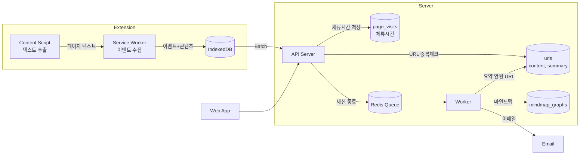
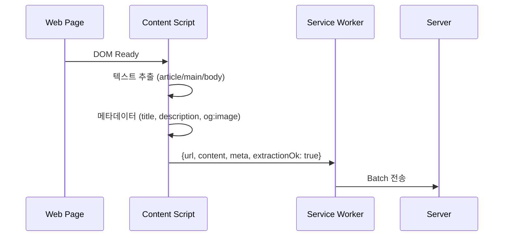
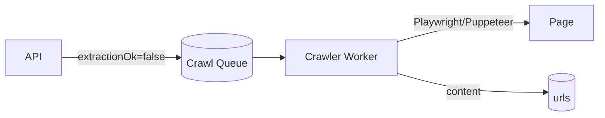
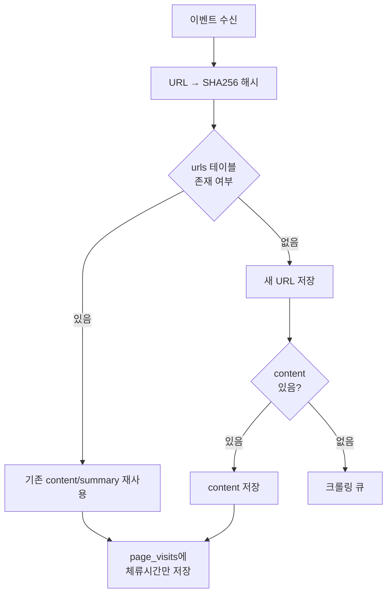
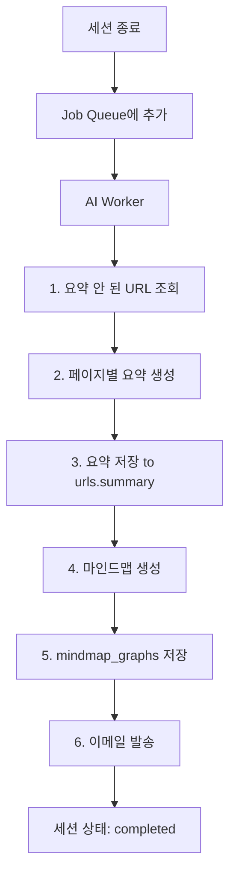
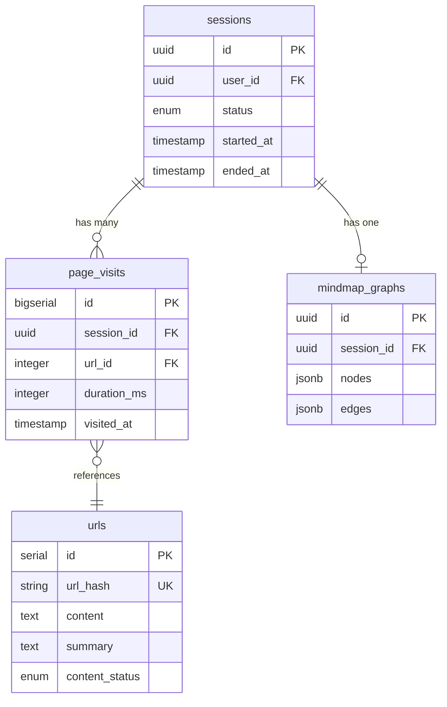

# 시스템 아키텍처

## 설계 원칙

1. **정확도는 "전환 이벤트(timestamp)"로 확보** - 초마다 체류시간을 보내지 않고, 전환 순간을 모두 기록
2. **전송은 Batch로** - Extension은 로컬 큐에 쌓고 일정 주기/개수 기준으로 서버에 업로드
3. **콘텐츠는 Extension에서 추출** - 로그인 페이지도 접근 가능, 서버 부하 감소
4. **URL 단위로 중복 제거** - 같은 URL은 콘텐츠/요약을 1번만 처리
5. **AI 처리는 세션 종료 시 일괄** - 비용 효율적, Worker에서 비동기 처리

---

## 전체 시스템 플로우



---

## 콘텐츠 수집 전략 (하이브리드)

### 기본: Extension에서 추출



**추출 대상:**
- `<article>`, `<main>`, `[role="main"]` 우선
- 없으면 `<body>` 전체에서 노이즈 제거
- 최대 **10,000자** 제한 (약 5-10KB)

### 폴백: 서버 크롤링

추출 실패 시 (`extractionOk: false`) 서버에서 크롤링:



**크롤링 대상:**
- SPA에서 JS 렌더링 필요한 경우
- Extension 추출 실패한 URL

---

## URL 중복 처리



**핵심:**
- `url_hash`로 O(1) 중복 체크
- 콘텐츠는 URL당 1번만 저장
- 요약도 URL당 1번만 생성 (AI 비용 절감)

---

## AI 처리 파이프라인

세션 종료(Stop) 시 실행:



### AI 호출 최적화

```typescript
// 세션의 모든 URL 조회
const urls = await getSessionUrls(sessionId);

// 요약 안 된 URL만 필터링
const unsummarized = urls.filter(u => !u.summary);

// 배치로 요약 생성 (병렬 처리)
const summaries = await Promise.all(
  unsummarized.map(url => summarizePage(url.content))
);

// 요약 저장
await updateUrlSummaries(unsummarized, summaries);

// 전체 요약으로 마인드맵 생성
const allSummaries = urls.map(u => u.summary || summaries[...]);
const mindmap = await generateMindmap(allSummaries, highlights);
```

---

## 구성 요소별 역할

### 1. Chrome Extension

| 역할 | 설명 |
|-----|------|
| 이벤트 수집 | 탭 활성화/전환, URL 변경, 창 포커스 감지 |
| **콘텐츠 추출** | Content Script에서 페이지 텍스트 추출 |
| 로컬 저장 | IndexedDB에 이벤트+콘텐츠 저장 |
| Batch 전송 | 5초마다 또는 200개 이벤트 시 서버 전송 |

```
extension/
├── manifest.json
├── popup/                    # Start/Stop UI
├── background/
│   └── service-worker.ts     # 이벤트 수집, 배치 전송
├── content/
│   ├── content.ts            # 하이라이팅 감지
│   └── extractor.ts          # 페이지 텍스트 추출 ← NEW
└── lib/
    ├── event-queue.ts
    └── api-client.ts
```

### 2. Backend API

| 역할 | 설명 |
|-----|------|
| 이벤트 수신 | Batch로 이벤트+콘텐츠 수신 |
| **URL 중복 처리** | url_hash로 중복 체크, 콘텐츠 재사용 |
| 체류시간 저장 | page_visits에 세션별 방문 기록 |
| Job Enqueue | 세션 종료 시 AI 작업 큐에 추가 |

```
server/
├── src/
│   ├── routes/
│   │   ├── auth.ts
│   │   ├── sessions.ts
│   │   └── events.ts
│   ├── services/
│   │   ├── url-service.ts      # URL 중복 처리 ← NEW
│   │   ├── content-service.ts  # 콘텐츠 저장 ← NEW
│   │   ├── segment-builder.ts
│   │   └── job-queue.ts
│   └── workers/
│       ├── ai-processor.ts
│       └── crawler.ts          # 폴백 크롤러 ← NEW
└── prisma/
    └── schema.prisma
```

### 3. Worker (AI Processing)

| 역할 | 설명 |
|-----|------|
| **페이지 요약** | 요약 안 된 URL들 일괄 처리 |
| 마인드맵 생성 | 페이지 요약 기반 마인드맵 생성 |
| 이메일 발송 | 세션 리포트 |

### 4. Web App

| 역할 | 설명 |
|-----|------|
| 대시보드 | 세션 목록 |
| 타임라인 | page_visits + urls 조인해서 표시 |
| 마인드맵 | mindmap_graphs 시각화 |
| **페이지 요약 표시** | urls.summary 표시 |

---

## 데이터베이스 설계

### 선택: PostgreSQL + Redis

| DB | 용도 |
|-----|------|
| **PostgreSQL** | 메인 데이터 (urls, page_visits, sessions, mindmap_graphs) |
| **Redis** | Job Queue (BullMQ), Rate Limiting, 세션 캐시 |

### 핵심 테이블 관계



### URL 중복 체크 성능

```sql
-- url_hash 인덱스로 O(1) 조회
CREATE UNIQUE INDEX idx_urls_hash ON urls(url_hash);

-- 조회
SELECT id, content, summary
FROM urls
WHERE url_hash = 'sha256...';
```

---

## 기술 스택

| 영역 | 기술 |
|-----|------|
| **Extension** | TypeScript, Manifest V3, IndexedDB |
| **Web App** | Next.js 14, React, TailwindCSS, React Flow |
| **Backend** | Node.js, Fastify, Prisma ORM |
| **Database** | PostgreSQL (Supabase/Neon) |
| **Queue** | Redis (BullMQ) |
| **AI** | OpenAI API (GPT-4 Turbo) |
| **Crawler** | Playwright (폴백용) |
| **Email** | Resend / SendGrid |
| **Infra** | Vercel (Web), Railway (Backend + Worker) |

---

## 성능/비용 최적화

| 항목 | 전략 |
|-----|------|
| **콘텐츠 추출** | Extension에서 추출 → 서버 크롤링 비용 제거 |
| **URL 중복** | url_hash로 중복 체크 → 콘텐츠 1번만 저장 |
| **AI 호출** | URL당 1번만 요약 → 같은 URL 재방문 시 재사용 |
| **Batch 전송** | 5초/200개 단위 → DB INSERT 최소화 |
| **비동기 처리** | AI는 Worker에서 → API 응답 지연 없음 |
