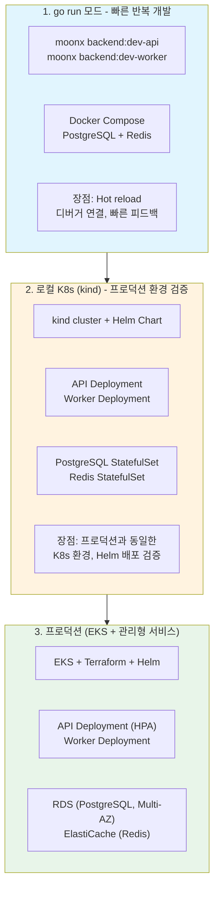
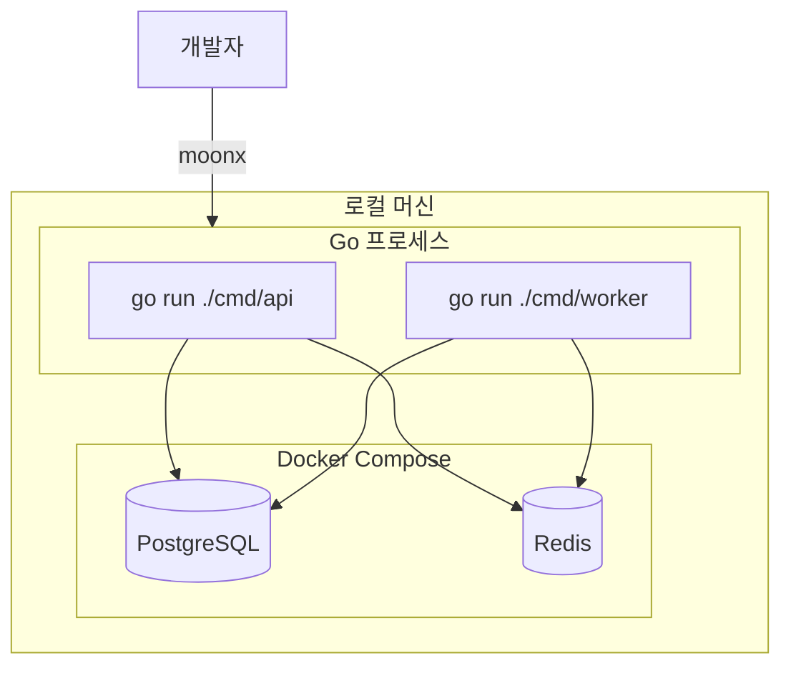
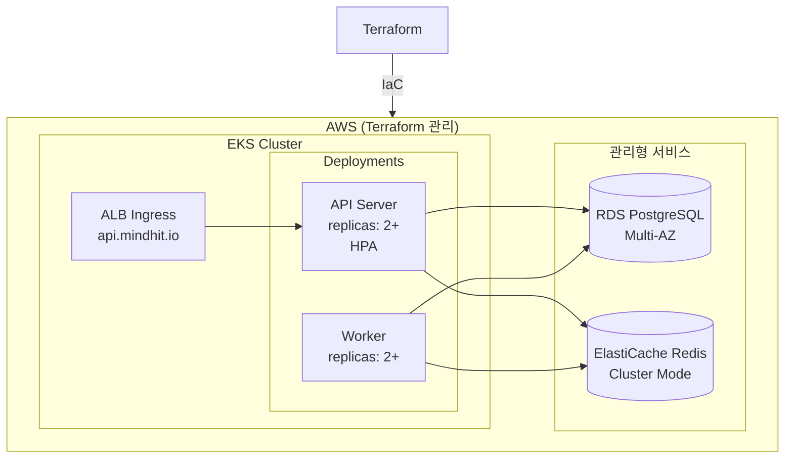
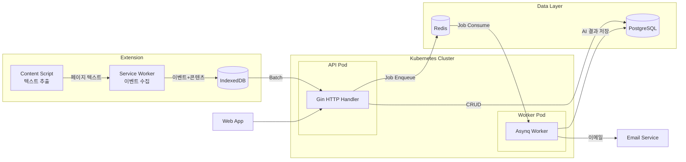
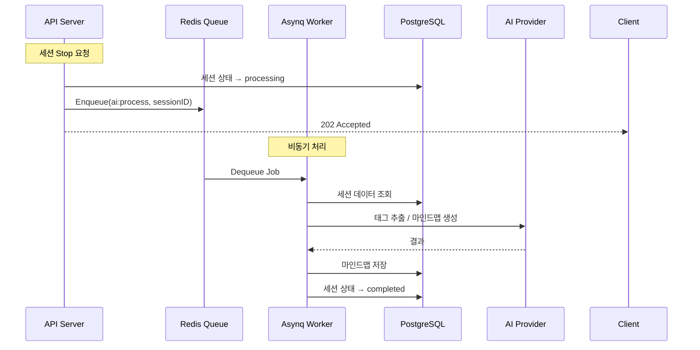
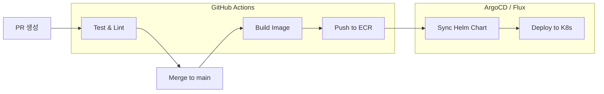

# 시스템 아키텍처

## 설계 원칙

1. **정확도는 "전환 이벤트(timestamp)"로 확보** - 초마다 체류시간을 보내지 않고, 전환 순간을 모두 기록
2. **전송은 Batch로** - Extension은 로컬 큐에 쌓고 일정 주기/개수 기준으로 서버에 업로드
3. **콘텐츠는 Extension에서 추출** - 로그인 페이지도 접근 가능, 서버 부하 감소
4. **URL 단위로 중복 제거** - 같은 URL은 콘텐츠/요약을 1번만 처리
5. **AI 처리는 세션 종료 시 일괄** - 비용 효율적, Worker에서 비동기 처리
6. **API와 Worker 분리** - 독립적 스케일링, 장애 격리
7. **로컬 = 프로덕션 동일 환경** - K8s 기반, 환경 차이로 인한 버그 방지
8. **Infrastructure as Code** - Terraform으로 인프라 자동화

---

## 인프라 아키텍처

### 3단계 개발 환경

| 단계 | 용도 | 실행 방식 | Database | Redis |
| --- | --- | --- | --- | --- |
| **1. go run** | 빠른 개발/디버깅 | `moonx backend:dev-api` | Docker Compose | Docker Compose |
| **2. 로컬 K8s** | 프로덕션 환경 검증 | `moonx infra:kind-deploy` | K8s StatefulSet | K8s StatefulSet |
| **3. 프로덕션** | 실서비스 | GitHub Actions + Helm | RDS (관리형) | ElastiCache (관리형) |

### 개발 워크플로우



### 왜 kind인가?

| 항목 | kind | minikube | k3d |
| --- | --- | --- | --- |
| 기반 | 표준 K8s (Docker) | VM 또는 Docker | k3s (경량) |
| EKS 호환성 | 높음 | 보통 | 낮음 |
| 시작 속도 | 빠름 | 느림 | 빠름 |
| 리소스 사용 | 적음 | 많음 | 적음 |
| 안정성 | 높음 | 높음 | 보통 |

**kind 선택 이유**: EKS와 동일한 표준 Kubernetes이므로 프로덕션 환경 검증에 가장 적합

### 1단계: go run 모드 (Docker Compose)



### 프로덕션 환경 (EKS + Terraform)



---

## 전체 시스템 플로우



---

## Job Queue 아키텍처 (Asynq)

### 왜 Asynq인가?

| 항목 | Asynq | River | gocron |
| --- | --- | --- | --- |
| 백엔드 | Redis | PostgreSQL | 메모리 |
| 라이선스 | MIT (완전 무료) | MPL-2.0 (일부 Pro) | MIT |
| Dead Letter Queue | ✅ | ❌ (Pro) | ❌ |
| 재시도 | ✅ | ✅ | 직접 구현 |
| 모니터링 UI | ✅ (Asynqmon) | ✅ (Pro) | ❌ |
| 성숙도 | 높음 | 보통 | 높음 |

### Job 처리 흐름



### Task 정의

```go
// internal/worker/tasks.go

const (
    TaskAIProcessing  = "ai:processing"     // 세션 종료 시 AI 처리
    TaskTagExtraction = "ai:tag"            // 새 URL 태그 추출
    TaskEmailReport   = "email:report"      // 세션 리포트 발송
    TaskCleanup       = "maintenance:cleanup" // 오래된 데이터 정리
)

type AIProcessingPayload struct {
    SessionID uuid.UUID `json:"session_id"`
}

type TagExtractionPayload struct {
    URLID uuid.UUID `json:"url_id"`
}
```

---

## Infrastructure as Code (Terraform)

### 디렉토리 구조

```
infra/
├── modules/                    # 재사용 가능한 모듈
│   ├── eks/                    # EKS 클러스터
│   ├── rds/                    # RDS PostgreSQL
│   ├── elasticache/            # ElastiCache Redis
│   └── networking/             # VPC, Subnets
├── environments/
│   ├── dev/                    # 개발 환경
│   │   ├── main.tf
│   │   ├── variables.tf
│   │   └── terraform.tfvars
│   ├── staging/                # 스테이징 환경
│   └── prod/                   # 프로덕션 환경
├── helm/                       # Helm Charts
│   └── mindhit/
│       ├── Chart.yaml
│       ├── values.yaml
│       ├── values-local.yaml   # 로컬용 오버라이드
│       ├── values-dev.yaml
│       ├── values-prod.yaml
│       └── templates/
│           ├── api-deployment.yaml
│           ├── worker-deployment.yaml
│           ├── configmap.yaml
│           ├── secrets.yaml
│           ├── ingress.yaml
│           ├── hpa.yaml
│           └── _helpers.tpl
└── scripts/
    ├── local-setup.sh          # 로컬 K8s 환경 설정
    └── deploy.sh               # 배포 스크립트
```

### Terraform 모듈 예시 (EKS)

```hcl
# infra/modules/eks/main.tf

module "eks" {
  source  = "terraform-aws-modules/eks/aws"
  version = "~> 20.0"

  cluster_name    = var.cluster_name
  cluster_version = "1.29"

  vpc_id     = var.vpc_id
  subnet_ids = var.private_subnet_ids

  eks_managed_node_groups = {
    main = {
      instance_types = ["t3.medium"]
      min_size       = var.min_nodes
      max_size       = var.max_nodes
      desired_size   = var.desired_nodes
    }
  }

  tags = var.tags
}
```

### Terraform 모듈 예시 (RDS)

```hcl
# infra/modules/rds/main.tf

module "rds" {
  source  = "terraform-aws-modules/rds/aws"
  version = "~> 6.0"

  identifier = "${var.project}-postgres"

  engine               = "postgres"
  engine_version       = "16.1"
  family               = "postgres16"
  major_engine_version = "16"
  instance_class       = var.instance_class

  allocated_storage     = var.allocated_storage
  max_allocated_storage = var.max_allocated_storage

  db_name  = var.db_name
  username = var.db_username
  port     = 5432

  multi_az               = var.multi_az
  db_subnet_group_name   = var.db_subnet_group_name
  vpc_security_group_ids = [var.security_group_id]

  backup_retention_period = var.backup_retention_days
  skip_final_snapshot     = var.environment != "prod"

  tags = var.tags
}
```

### 환경별 구성

```hcl
# infra/environments/prod/main.tf

terraform {
  backend "s3" {
    bucket = "mindhit-terraform-state"
    key    = "prod/terraform.tfstate"
    region = "ap-northeast-2"
  }
}

module "networking" {
  source = "../../modules/networking"
  # ...
}

module "eks" {
  source       = "../../modules/eks"
  cluster_name = "mindhit-prod"
  min_nodes    = 2
  max_nodes    = 10
  desired_nodes = 3
  # ...
}

module "rds" {
  source         = "../../modules/rds"
  instance_class = "db.r6g.large"
  multi_az       = true
  # ...
}

module "elasticache" {
  source     = "../../modules/elasticache"
  node_type  = "cache.r6g.large"
  num_nodes  = 2
  # ...
}
```

---

## Helm Chart 구조

### values.yaml (기본값)

```yaml
# infra/helm/mindhit/values.yaml

global:
  environment: development

api:
  replicaCount: 1
  image:
    repository: mindhit/api
    tag: latest
  resources:
    requests:
      memory: "256Mi"
      cpu: "250m"
    limits:
      memory: "512Mi"
      cpu: "500m"
  autoscaling:
    enabled: false

worker:
  replicaCount: 1
  image:
    repository: mindhit/worker
    tag: latest
  resources:
    requests:
      memory: "512Mi"
      cpu: "500m"
    limits:
      memory: "1Gi"
      cpu: "1000m"

# 로컬 환경: StatefulSet 사용
postgresql:
  enabled: true  # 로컬에서만 true
  auth:
    database: mindhit
    username: postgres
    password: password

redis:
  enabled: true  # 로컬에서만 true

# 외부 DB 연결 (프로덕션)
externalDatabase:
  enabled: false
  host: ""
  port: 5432
  database: mindhit
  existingSecret: ""

externalRedis:
  enabled: false
  host: ""
  port: 6379
  existingSecret: ""

ingress:
  enabled: true
  className: nginx
  hosts:
    - host: api.mindhit.local
      paths:
        - path: /
          pathType: Prefix
```

### values-local.yaml (로컬 오버라이드)

```yaml
# infra/helm/mindhit/values-local.yaml

global:
  environment: local

api:
  replicaCount: 1

worker:
  replicaCount: 1

postgresql:
  enabled: true

redis:
  enabled: true

ingress:
  hosts:
    - host: api.mindhit.local
```

### values-prod.yaml (프로덕션 오버라이드)

```yaml
# infra/helm/mindhit/values-prod.yaml

global:
  environment: production

api:
  replicaCount: 2
  autoscaling:
    enabled: true
    minReplicas: 2
    maxReplicas: 10
    targetCPUUtilizationPercentage: 70
  resources:
    requests:
      memory: "512Mi"
      cpu: "500m"
    limits:
      memory: "1Gi"
      cpu: "1000m"

worker:
  replicaCount: 2
  resources:
    requests:
      memory: "1Gi"
      cpu: "1000m"
    limits:
      memory: "2Gi"
      cpu: "2000m"

# 로컬 DB 비활성화
postgresql:
  enabled: false

redis:
  enabled: false

# 외부 관리형 서비스 사용
externalDatabase:
  enabled: true
  host: mindhit-prod.xxxxx.ap-northeast-2.rds.amazonaws.com
  port: 5432
  database: mindhit
  existingSecret: mindhit-db-credentials

externalRedis:
  enabled: true
  host: mindhit-prod.xxxxx.cache.amazonaws.com
  port: 6379
  existingSecret: mindhit-redis-credentials

ingress:
  className: alb
  annotations:
    alb.ingress.kubernetes.io/scheme: internet-facing
    alb.ingress.kubernetes.io/target-type: ip
  hosts:
    - host: api.mindhit.io
```

---

## 로컬 개발 워크플로우

### 1단계: go run 모드 (빠른 개발)

```bash
# Docker Compose로 DB/Redis 실행
moonx infra:dev-up

# API 서버 실행 (터미널 1)
moonx backend:dev-api

# Worker 실행 (터미널 2)
moonx backend:dev-worker

# 종료
moonx infra:dev-down
```

### 2단계: 로컬 K8s (kind) - 프로덕션 환경 검증

```bash
# kind 클러스터 생성 및 설정
moonx infra:kind-up

# Docker 이미지 빌드 및 kind에 로드
moonx infra:kind-build

# Helm으로 배포
moonx infra:kind-deploy

# 로그 확인
kubectl logs -f deployment/mindhit-api
kubectl logs -f deployment/mindhit-worker

# 클러스터 삭제
moonx infra:kind-down
```

### 개발 흐름 권장 사항

1. **일상적인 개발**: `go run` 모드 사용 (Hot reload, 디버거 연결 용이)
2. **배포 전 검증**: kind 환경에서 테스트 (Dockerfile, K8s 매니페스트 검증)
3. **PR 머지 후**: GitHub Actions에서 자동 프로덕션 배포

---

## 프로덕션 배포 워크플로우

### 1. Terraform으로 인프라 프로비저닝

```bash
cd infra/environments/prod

# 계획 확인
terraform plan

# 적용
terraform apply

# 출력값 확인 (RDS 엔드포인트, EKS 클러스터 등)
terraform output
```

### 2. EKS 접속 설정

```bash
# kubeconfig 업데이트
aws eks update-kubeconfig --name mindhit-prod --region ap-northeast-2

# 클러스터 확인
kubectl get nodes
```

### 3. Secrets 생성

```bash
# DB 자격 증명
kubectl create secret generic mindhit-db-credentials \
  --from-literal=username=admin \
  --from-literal=password=<RDS_PASSWORD>

# Redis 자격 증명 (필요시)
kubectl create secret generic mindhit-redis-credentials \
  --from-literal=password=<REDIS_PASSWORD>
```

### 4. Helm 배포

```bash
# 프로덕션 배포
helm upgrade --install mindhit ./infra/helm/mindhit \
  -f ./infra/helm/mindhit/values-prod.yaml \
  --set api.image.tag=${GIT_SHA}
```

---

## CI/CD 파이프라인



### GitHub Actions 예시

```yaml
# .github/workflows/deploy.yml

name: Deploy

on:
  push:
    branches: [main]

jobs:
  build-and-deploy:
    runs-on: ubuntu-latest
    steps:
      - uses: actions/checkout@v4

      - name: Configure AWS credentials
        uses: aws-actions/configure-aws-credentials@v4
        with:
          aws-access-key-id: ${{ secrets.AWS_ACCESS_KEY_ID }}
          aws-secret-access-key: ${{ secrets.AWS_SECRET_ACCESS_KEY }}
          aws-region: ap-northeast-2

      - name: Login to ECR
        uses: aws-actions/amazon-ecr-login@v2

      - name: Build and push API image
        run: |
          docker build -f ./apps/backend/Dockerfile.api \
            -t ${{ secrets.ECR_REGISTRY }}/mindhit-api:${{ github.sha }} \
            ./apps/backend
          docker push ${{ secrets.ECR_REGISTRY }}/mindhit-api:${{ github.sha }}

      - name: Build and push Worker image
        run: |
          docker build -f ./apps/backend/Dockerfile.worker \
            -t ${{ secrets.ECR_REGISTRY }}/mindhit-worker:${{ github.sha }} \
            ./apps/backend
          docker push ${{ secrets.ECR_REGISTRY }}/mindhit-worker:${{ github.sha }}

      - name: Update kubeconfig
        run: |
          aws eks update-kubeconfig --name mindhit-prod --region ap-northeast-2

      - name: Deploy with Helm
        run: |
          helm upgrade --install mindhit ./infra/helm/mindhit \
            -f ./infra/helm/mindhit/values-prod.yaml \
            --set api.image.tag=${{ github.sha }} \
            --set worker.image.tag=${{ github.sha }}
```

---

## 구성 요소별 역할

### 1. Chrome Extension

| 역할 | 설명 |
| --- | --- |
| 이벤트 수집 | 탭 활성화/전환, URL 변경, 창 포커스 감지 |
| **콘텐츠 추출** | Content Script에서 페이지 텍스트 추출 |
| 로컬 저장 | IndexedDB에 이벤트+콘텐츠 저장 |
| Batch 전송 | 5초마다 또는 200개 이벤트 시 서버 전송 |

### 2. API Server (Go + Gin + Ent)

| 역할 | 설명 |
| --- | --- |
| 이벤트 수신 | Batch로 이벤트+콘텐츠 수신 |
| **URL 중복 처리** | url_hash로 중복 체크, 콘텐츠 재사용 |
| 체류시간 저장 | page_visits에 세션별 방문 기록 |
| **Job Enqueue** | 세션 종료 시 Redis에 Asynq Job 추가 |

### 3. Worker (Asynq Consumer)

| 역할 | 설명 |
| --- | --- |
| **Job Consume** | Redis에서 Job을 가져와 처리 |
| **태그 추출** | 새 URL의 태그/요약 생성 |
| **마인드맵 생성** | 세션 종료 시 관계도 생성 |
| 이메일 발송 | 세션 리포트 |
| 정리 작업 | 오래된 세션 정리 |

### 4. Web App

| 역할 | 설명 |
| --- | --- |
| 대시보드 | 세션 목록 |
| 타임라인 | page_visits + urls 조인해서 표시 |
| 마인드맵 | mindmap_graphs 시각화 |

---

## 프로젝트 구조

```text
mindhit/
├── apps/
│   ├── backend/                # Go 백엔드 (API + Worker)
│   │   ├── cmd/
│   │   │   ├── api/main.go     # API 서버 엔트리포인트
│   │   │   └── worker/main.go  # Worker 엔트리포인트
│   │   ├── internal/
│   │   │   ├── api/            # API 전용 코드
│   │   │   │   ├── controller/
│   │   │   │   ├── middleware/
│   │   │   │   └── router/
│   │   │   └── worker/         # Worker 전용 코드
│   │   │       └── handler/
│   │   │           ├── ai_processing.go
│   │   │           ├── tag_extraction.go
│   │   │           └── email_report.go
│   │   ├── pkg/                # 공유 코드 (API + Worker 공통)
│   │   │   ├── ent/            # Ent ORM 스키마 & 생성 코드
│   │   │   │   ├── schema/
│   │   │   │   └── migrate/
│   │   │   ├── service/        # 비즈니스 로직
│   │   │   │   ├── auth.go
│   │   │   │   ├── session.go
│   │   │   │   ├── url.go
│   │   │   │   ├── ai.go
│   │   │   │   └── mindmap.go
│   │   │   └── infra/          # 인프라 레이어
│   │   │       ├── config/
│   │   │       ├── database/
│   │   │       ├── redis/
│   │   │       ├── queue/      # Asynq 클라이언트
│   │   │       └── ai/         # AI Provider
│   │   ├── Dockerfile.api
│   │   ├── Dockerfile.worker
│   │   ├── go.mod
│   │   └── moon.yml
│   ├── web/                    # Next.js 웹앱
│   │   ├── app/
│   │   ├── components/
│   │   ├── Dockerfile
│   │   └── moon.yml
│   └── extension/              # Chrome Extension
│       ├── src/
│       ├── manifest.json
│       └── moon.yml
├── packages/                   # TypeScript 공유 패키지
│   ├── shared/                 # 공통 유틸 (web + extension)
│   │   ├── src/
│   │   └── package.json
│   └── protocol/               # API 타입 정의
│       ├── src/
│       └── package.json
├── infra/
│   ├── modules/                # Terraform 모듈
│   │   ├── eks/
│   │   ├── rds/
│   │   ├── elasticache/
│   │   └── networking/
│   ├── environments/           # 환경별 Terraform
│   │   ├── dev/
│   │   ├── staging/
│   │   └── prod/
│   ├── helm/                   # Helm Charts
│   │   └── mindhit/
│   │       ├── Chart.yaml
│   │       ├── values.yaml
│   │       ├── values-local.yaml
│   │       ├── values-prod.yaml
│   │       └── templates/
│   └── scripts/
│       ├── local-setup.sh
│       └── deploy.sh
├── .github/
│   └── workflows/
│       ├── ci.yml
│       └── deploy.yml
├── .moon/
│   ├── workspace.yml
│   ├── toolchain.yml
│   └── tasks.yml
├── skaffold.yaml               # 로컬 K8s 개발 자동화
└── README.md
```

### Go 프로젝트 구조 (Standard Layout)

```text
apps/backend/
├── cmd/                        # 엔트리포인트 (main 패키지)
│   ├── api/main.go
│   └── worker/main.go
├── internal/                   # 비공개 코드 (외부 import 불가)
│   ├── api/                    # API 서버 전용
│   │   ├── controller/
│   │   ├── middleware/
│   │   └── router/
│   └── worker/                 # Worker 전용
│       └── handler/
├── pkg/                        # 공개 코드 (내부 공유)
│   ├── ent/                    # ORM
│   ├── service/                # 비즈니스 로직
│   └── infra/                  # 인프라
├── Dockerfile.api
├── Dockerfile.worker
└── go.mod                      # 단일 Go 모듈
```

### 코드 구조 설명

| 디렉토리 | 용도 | 접근 범위 |
| --- | --- | --- |
| `cmd/api/` | API 서버 시작점 | - |
| `cmd/worker/` | Worker 시작점 | - |
| `internal/api/` | API 전용 (controller, middleware) | API만 |
| `internal/worker/` | Worker 전용 (job handler) | Worker만 |
| `pkg/ent/` | Ent ORM 스키마 & 생성 코드 | 공유 |
| `pkg/service/` | 비즈니스 로직 | 공유 |
| `pkg/infra/` | DB, Redis, Queue, AI 클라이언트 | 공유 |

---

## 기술 스택

| 영역 | 기술 |
| --- | --- |
| **Extension** | TypeScript, Manifest V3, IndexedDB |
| **Web App** | Next.js 16.1, React, TailwindCSS, React Three Fiber |
| **API Server** | Go 1.22+, Gin, Ent ORM, Atlas |
| **Worker** | Go 1.22+, Asynq |
| **Database** | PostgreSQL 16 (로컬: StatefulSet, 프로덕션: RDS) |
| **Queue** | Redis 7 + Asynq (로컬: StatefulSet, 프로덕션: ElastiCache) |
| **AI** | OpenAI / Gemini / Claude |
| **Container** | Docker |
| **Orchestration** | Kubernetes (kind 로컬 / EKS 프로덕션) |
| **IaC** | Terraform |
| **Package** | Helm |
| **CI/CD** | GitHub Actions |

---

## 환경 비교

| 항목 | go run 모드 | 로컬 K8s (kind) | 프로덕션 (EKS) |
| --- | --- | --- | --- |
| 실행 방식 | `moonx backend:dev-*` | `moonx infra:kind-deploy` | GitHub Actions |
| K8s 클러스터 | 없음 | kind | EKS |
| PostgreSQL | Docker Compose | StatefulSet (Helm) | RDS (Multi-AZ) |
| Redis | Docker Compose | StatefulSet (Helm) | ElastiCache |
| Ingress | 없음 (localhost) | nginx-ingress | AWS ALB |
| SSL | 없음 | 없음 | ACM |
| 도메인 | localhost:8080 | api.mindhit.local | api.mindhit.io |
| Auto Scaling | 없음 | 없음 | HPA + Cluster Autoscaler |
| 디버깅 | ✅ 용이 | 제한적 | 불가 |
| 프로덕션 동일성 | 낮음 | 높음 | - |
| IaC | 없음 | Helm | Terraform + Helm |

---

## 성능/비용 최적화

| 항목 | 전략 |
| --- | --- |
| **콘텐츠 추출** | Extension에서 추출 → 서버 크롤링 비용 제거 |
| **URL 중복** | url_hash로 중복 체크 → 콘텐츠 1번만 저장 |
| **AI 호출** | URL당 1번만 요약 → 같은 URL 재방문 시 재사용 |
| **Batch 전송** | 5초/200개 단위 → DB INSERT 최소화 |
| **비동기 처리** | AI는 Worker에서 → API 응답 지연 없음 |
| **Worker 분리** | API와 독립 스케일링 → 리소스 효율화 |
| **관리형 DB** | RDS/ElastiCache → 운영 부담 감소 |
| **IaC** | Terraform → 인프라 재현성, 버전 관리 |
