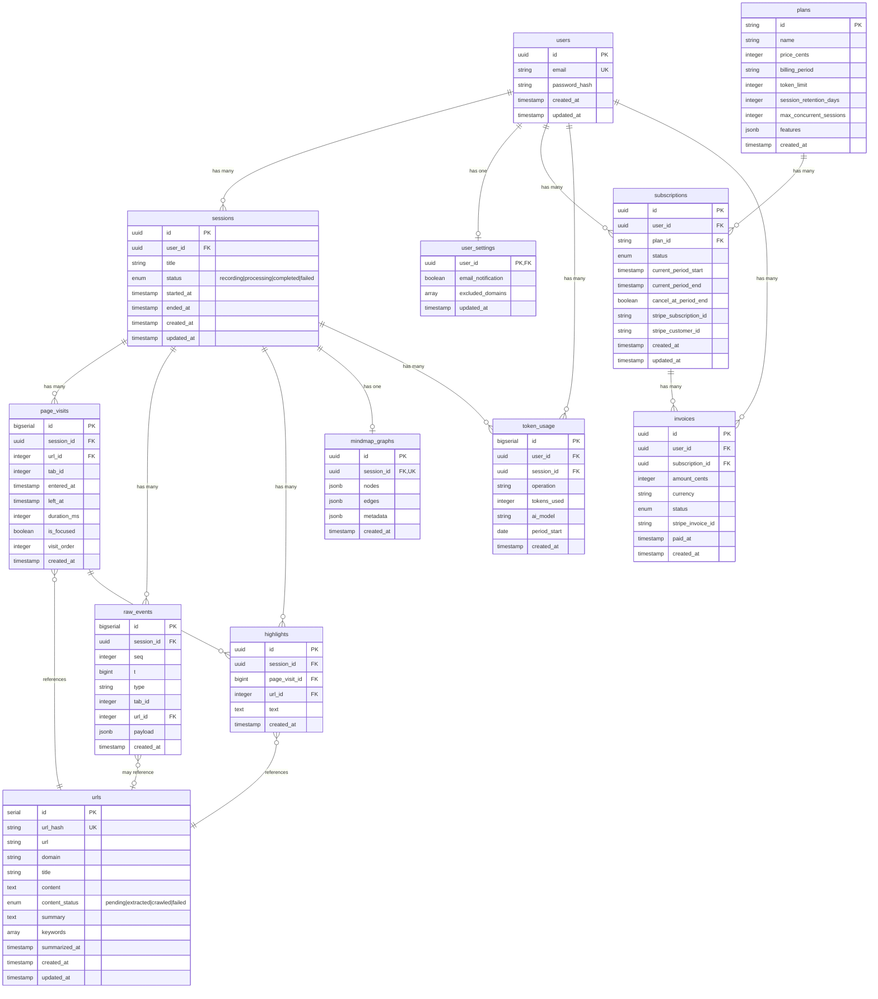

# 데이터 구조

## 개요

데이터는 네 가지 레이어로 분리:

| 레이어 | 테이블 | 목적 |
|-------|--------|------|
| **Content** | urls | URL별 콘텐츠 + 요약 (중복 제거) |
| **Visit** | page_visits | 세션별 방문 기록 (체류시간) |
| **Raw** | raw_events | 원본 이벤트 (재처리, 디버깅) |
| **Generated** | mindmap_graphs | AI 생성 결과 |

---

## 1. Database Schema (PostgreSQL)

### users

```sql
CREATE TABLE users (
  id UUID PRIMARY KEY DEFAULT gen_random_uuid(),
  email VARCHAR(255) UNIQUE NOT NULL,
  password_hash VARCHAR(255) NOT NULL,
  created_at TIMESTAMPTZ DEFAULT NOW(),
  updated_at TIMESTAMPTZ DEFAULT NOW()
);

CREATE TABLE user_settings (
  user_id UUID PRIMARY KEY REFERENCES users(id) ON DELETE CASCADE,
  email_notification BOOLEAN DEFAULT true,
  excluded_domains TEXT[] DEFAULT '{}',
  updated_at TIMESTAMPTZ DEFAULT NOW()
);
```

### sessions

```sql
CREATE TABLE sessions (
  id UUID PRIMARY KEY DEFAULT gen_random_uuid(),
  user_id UUID NOT NULL REFERENCES users(id) ON DELETE CASCADE,
  title VARCHAR(255),
  status VARCHAR(20) DEFAULT 'recording',
  started_at TIMESTAMPTZ NOT NULL,
  ended_at TIMESTAMPTZ,
  created_at TIMESTAMPTZ DEFAULT NOW(),
  updated_at TIMESTAMPTZ DEFAULT NOW()
);

-- status: 'recording' | 'processing' | 'completed' | 'failed'

CREATE INDEX idx_sessions_user_id ON sessions(user_id);
CREATE INDEX idx_sessions_started_at ON sessions(started_at DESC);
```

### urls (콘텐츠 + 요약 저장)

```sql
CREATE TABLE urls (
  id SERIAL PRIMARY KEY,
  url_hash CHAR(64) UNIQUE NOT NULL,  -- SHA256 of normalized URL
  url TEXT NOT NULL,
  domain VARCHAR(255) NOT NULL,
  title VARCHAR(500),
  favicon TEXT,

  -- 콘텐츠 관련 (NEW)
  content TEXT,                        -- 페이지 본문 텍스트
  content_status VARCHAR(20) DEFAULT 'pending',
  -- 'pending' | 'extracted' | 'crawled' | 'failed'

  -- AI 요약 관련 (NEW)
  summary TEXT,                        -- AI가 생성한 페이지 요약
  keywords TEXT[],                     -- 추출된 키워드
  summarized_at TIMESTAMPTZ,           -- 요약 생성 시간

  created_at TIMESTAMPTZ DEFAULT NOW(),
  updated_at TIMESTAMPTZ DEFAULT NOW()
);

CREATE INDEX idx_urls_domain ON urls(domain);
CREATE INDEX idx_urls_content_status ON urls(content_status);
CREATE INDEX idx_urls_summary_null ON urls(id) WHERE summary IS NULL;
```

### page_visits (체류시간 기록)

```sql
CREATE TABLE page_visits (
  id BIGSERIAL PRIMARY KEY,
  session_id UUID NOT NULL REFERENCES sessions(id) ON DELETE CASCADE,
  url_id INTEGER NOT NULL REFERENCES urls(id),
  tab_id INTEGER,

  entered_at TIMESTAMPTZ NOT NULL,    -- 방문 시작 시간
  left_at TIMESTAMPTZ,                -- 페이지 이탈 시간
  duration_ms INTEGER,                -- 체류 시간 (ms)
  is_focused BOOLEAN DEFAULT true,    -- 창 포커스 여부

  visit_order INTEGER,                -- 세션 내 방문 순서
  created_at TIMESTAMPTZ DEFAULT NOW()
);

CREATE INDEX idx_page_visits_session ON page_visits(session_id);
CREATE INDEX idx_page_visits_session_order ON page_visits(session_id, visit_order);
```

### raw_events (Append-only, 디버깅용)

```sql
CREATE TABLE raw_events (
  id BIGSERIAL PRIMARY KEY,
  session_id UUID NOT NULL REFERENCES sessions(id) ON DELETE CASCADE,
  seq INTEGER NOT NULL,               -- 세션 내 시퀀스 (멱등성 키)
  t BIGINT NOT NULL,                  -- ms timestamp (Date.now())
  type VARCHAR(30) NOT NULL,          -- 이벤트 타입
  tab_id INTEGER,
  url_id INTEGER REFERENCES urls(id),
  payload JSONB,                      -- 추가 데이터
  created_at TIMESTAMPTZ DEFAULT NOW(),

  UNIQUE(session_id, seq)             -- 멱등성 보장
);

-- Partition by date for better performance (optional)
CREATE INDEX idx_raw_events_session_seq ON raw_events(session_id, seq);
```

### highlights

```sql
CREATE TABLE highlights (
  id UUID PRIMARY KEY DEFAULT gen_random_uuid(),
  session_id UUID NOT NULL REFERENCES sessions(id) ON DELETE CASCADE,
  page_visit_id BIGINT REFERENCES page_visits(id) ON DELETE SET NULL,
  url_id INTEGER NOT NULL REFERENCES urls(id),
  text TEXT NOT NULL,
  created_at TIMESTAMPTZ DEFAULT NOW()
);

CREATE INDEX idx_highlights_session ON highlights(session_id);
```

### mindmap_graphs

```sql
CREATE TABLE mindmap_graphs (
  id UUID PRIMARY KEY DEFAULT gen_random_uuid(),
  session_id UUID UNIQUE NOT NULL REFERENCES sessions(id) ON DELETE CASCADE,
  nodes JSONB NOT NULL,
  edges JSONB NOT NULL,
  metadata JSONB,                     -- 생성 정보 (모델, 버전 등)
  created_at TIMESTAMPTZ DEFAULT NOW()
);
```

### plans (결제 플랜)

```sql
CREATE TABLE plans (
  id VARCHAR(20) PRIMARY KEY,           -- 'free', 'pro', 'enterprise'
  name VARCHAR(50) NOT NULL,
  price_cents INTEGER NOT NULL,          -- 0, 1200, NULL(문의)
  billing_period VARCHAR(20) DEFAULT 'monthly',
  token_limit INTEGER,                   -- NULL = 무제한
  session_retention_days INTEGER,        -- NULL = 무제한
  max_concurrent_sessions INTEGER,       -- NULL = 무제한
  features JSONB NOT NULL,               -- 기능 플래그
  created_at TIMESTAMPTZ DEFAULT NOW()
);
```

### subscriptions (구독)

```sql
CREATE TABLE subscriptions (
  id UUID PRIMARY KEY DEFAULT gen_random_uuid(),
  user_id UUID NOT NULL REFERENCES users(id) ON DELETE CASCADE,
  plan_id VARCHAR(20) NOT NULL REFERENCES plans(id),
  status VARCHAR(20) NOT NULL DEFAULT 'active',
  -- 'active' | 'canceled' | 'past_due' | 'trialing'
  current_period_start TIMESTAMPTZ NOT NULL,
  current_period_end TIMESTAMPTZ NOT NULL,
  cancel_at_period_end BOOLEAN DEFAULT false,
  stripe_subscription_id VARCHAR(255),   -- Stripe 연동
  stripe_customer_id VARCHAR(255),
  created_at TIMESTAMPTZ DEFAULT NOW(),
  updated_at TIMESTAMPTZ DEFAULT NOW()
);

CREATE UNIQUE INDEX idx_subscriptions_user_active
  ON subscriptions(user_id) WHERE status = 'active';
```

**빌링 주기 필드 설명:**

| 필드 | 설명 | 예시 |
|-----|------|------|
| `current_period_start` | 현재 빌링 주기 시작일 | 2024-12-15 00:00:00 UTC |
| `current_period_end` | 현재 빌링 주기 종료일 | 2025-01-14 23:59:59 UTC |

**플랜별 빌링 주기:**

| 플랜 | 빌링 주기 계산 방식 |
|-----|-------------------|
| Free | 가입일(`users.created_at`) 기준 30일 주기 |
| Pro | 구독 시작일 기준 (예: 15일 시작 → 매월 15일~다음달 14일) |
| Enterprise | 계약일 기준 |

### token_usage (토큰 사용량)

```sql
CREATE TABLE token_usage (
  id BIGSERIAL PRIMARY KEY,
  user_id UUID NOT NULL REFERENCES users(id) ON DELETE CASCADE,
  session_id UUID REFERENCES sessions(id) ON DELETE SET NULL,
  operation VARCHAR(50) NOT NULL,        -- 'summarize', 'mindmap', 'keywords'
  tokens_used INTEGER NOT NULL,
  ai_model VARCHAR(50),                  -- 'gpt-4-turbo', 'gemini-1.5-pro'
  period_start DATE NOT NULL,            -- 빌링 기간 시작일
  created_at TIMESTAMPTZ DEFAULT NOW()
);

CREATE INDEX idx_token_usage_user_period
  ON token_usage(user_id, period_start);
```

**토큰 측정 및 빌링 주기 로직:**

| 항목 | 설명 |
|-----|------|
| `tokens_used` | AI API 응답에서 추출한 **정확한** 토큰 수 (예상치 아님) |
| `period_start` | 토큰이 속하는 빌링 주기 시작일 |

**토큰 측정 원리:**

AI API 호출 시 응답에 실제 사용된 토큰 수가 포함됩니다:

```text
OpenAI:   response.usage.total_tokens
Gemini:   response.usageMetadata.totalTokenCount
Claude:   response.usage.input_tokens + output_tokens
```

**period_start 계산 로직:**

```sql
-- Free 플랜 사용자: 가입일 기준 30일 주기
-- 예: 12월 10일 가입 → 현재 빌링 주기 시작일 계산
WITH user_signup AS (
  SELECT created_at FROM users WHERE id = $1
)
SELECT
  created_at + (FLOOR(EXTRACT(DAY FROM NOW() - created_at) / 30) * INTERVAL '30 days')
  AS period_start
FROM user_signup;
-- 결과: 가입일 기준 현재 30일 주기의 시작일

-- Pro/Enterprise 플랜 사용자: 구독의 current_period_start 사용
SELECT current_period_start FROM subscriptions
WHERE user_id = $1 AND status = 'active';
-- 결과: 2024-12-15 (구독 시작일 기준)
```

**현재 빌링 주기 사용량 조회:**

```sql
-- 특정 사용자의 현재 빌링 주기 토큰 사용량
SELECT SUM(tokens_used) AS total_tokens
FROM token_usage
WHERE user_id = $1
  AND period_start >= (
    -- Pro/Enterprise: 구독 period_start
    -- Free: 가입일 기준 30일 주기 시작일
    COALESCE(
      (SELECT current_period_start FROM subscriptions
       WHERE user_id = $1 AND status = 'active'),
      -- Free 플랜: 가입일 + (경과일수 / 30) * 30일
      (SELECT created_at + (FLOOR(EXTRACT(DAY FROM NOW() - created_at) / 30) * INTERVAL '30 days')
       FROM users WHERE id = $1)
    )
  );
```

### invoices (결제 내역)

```sql
CREATE TABLE invoices (
  id UUID PRIMARY KEY DEFAULT gen_random_uuid(),
  user_id UUID NOT NULL REFERENCES users(id) ON DELETE CASCADE,
  subscription_id UUID REFERENCES subscriptions(id),
  amount_cents INTEGER NOT NULL,
  currency VARCHAR(3) DEFAULT 'USD',
  status VARCHAR(20) NOT NULL DEFAULT 'pending',
  -- 'pending' | 'paid' | 'failed' | 'refunded'
  stripe_invoice_id VARCHAR(255),
  paid_at TIMESTAMPTZ,
  created_at TIMESTAMPTZ DEFAULT NOW()
);
```

---

## 2. 테이블 관계도



---

## 3. Event Types

Extension에서 수집하는 이벤트 타입:

| Type | 설명 | Payload |
|------|------|---------|
| `TAB_ACTIVATED` | 탭 활성화 (전환) | `{ tabId }` |
| `NAV_COMMITTED` | URL 확정 | `{ tabId, url, title, content?, extractionOk }` |
| `WINDOW_FOCUS_CHANGED` | 창 포커스 변경 | `{ focused: boolean }` |
| `IDLE_STATE_CHANGED` | 유휴 상태 변경 | `{ state: 'active' \| 'idle' \| 'locked' }` |
| `HIGHLIGHT` | 텍스트 하이라이팅 | `{ text, url }` |

### Event Schema (Extension -> Server)

```typescript
interface TrackingEvent {
  sessionId: string;
  seq: number;               // 세션 내 증가 시퀀스
  t: number;                 // Date.now() (ms)
  type: EventType;
  tabId?: number;
  url?: string;
  payload?: {
    // NAV_COMMITTED
    title?: string;
    content?: string;        // 페이지 텍스트 (NEW)
    extractionOk?: boolean;  // 추출 성공 여부 (NEW)
    meta?: PageMeta;         // 메타데이터 (NEW)

    // WINDOW_FOCUS_CHANGED
    focused?: boolean;

    // HIGHLIGHT
    text?: string;
  };
}

interface PageMeta {
  description?: string;
  ogImage?: string;
  ogTitle?: string;
}

type EventType =
  | 'TAB_ACTIVATED'
  | 'NAV_COMMITTED'
  | 'WINDOW_FOCUS_CHANGED'
  | 'IDLE_STATE_CHANGED'
  | 'HIGHLIGHT';
```

---

## 4. API Response Types

### Session List

```typescript
interface SessionListResponse {
  sessions: SessionSummary[];
  pagination: {
    total: number;
    page: number;
    limit: number;
    has_next: boolean;
  };
}

interface SessionSummary {
  id: string;
  title: string | null;
  status: SessionStatus;
  started_at: string;           // ISO 8601
  ended_at: string | null;
  total_duration_ms: number;
  page_count: number;
  top_keywords: string[];
}
```

### Session Detail (Timeline)

```typescript
interface SessionDetailResponse {
  session: {
    id: string;
    title: string | null;
    status: SessionStatus;
    started_at: string;
    ended_at: string | null;
  };
  page_visits: PageVisitItem[];
  highlights: HighlightItem[];
}

interface PageVisitItem {
  id: string;
  url: string;
  domain: string;
  title: string | null;
  favicon: string | null;
  summary: string | null;      // 페이지 요약 (NEW)
  keywords: string[];          // 페이지 키워드 (NEW)
  entered_at: string;
  left_at: string | null;
  duration_ms: number;
  is_focused: boolean;
}

interface HighlightItem {
  id: string;
  text: string;
  url: string;
  created_at: string;
}
```

### Mindmap

```typescript
interface MindmapResponse {
  mindmap: {
    id: string;
    session_id: string;
    nodes: MindmapNode[];
    edges: MindmapEdge[];
    created_at: string;
  };
}

interface MindmapNode {
  id: string;
  label: string;
  type: 'root' | 'topic' | 'subtopic' | 'keyword';
  importance: number;          // 0-1
  related_page_visit_ids: string[];
  position: { x: number; y: number };
  metadata: {
    total_duration_ms: number;
    highlight_count: number;
    page_count: number;
  };
}

interface MindmapEdge {
  id: string;
  source: string;
  target: string;
  type: 'parent' | 'related';
}
```

---

## 5. Extension Local Storage

### IndexedDB: Event Queue

```typescript
interface QueuedEvent {
  id: number;                  // auto-increment
  sessionId: string;
  seq: number;
  t: number;
  type: EventType;
  tabId?: number;
  url?: string;
  payload?: Record<string, unknown>;
  acked: boolean;              // 서버 확인 여부
}
```

### Chrome Storage (Sync)

```typescript
interface ExtensionStorage {
  authToken: string | null;
  userEmail: string | null;
  currentSessionId: string | null;
  isRecording: boolean;
  lastSeq: number;             // 마지막 발급 시퀀스
}
```

---

## 6. URL 중복 처리 로직

### URL 정규화

```typescript
function normalizeUrl(url: string): string {
  const parsed = new URL(url);

  // 1. 프로토콜 통일 (https)
  // 2. www 제거
  // 3. 쿼리 파라미터 정렬
  // 4. 트레일링 슬래시 제거
  // 5. 프래그먼트 제거

  const domain = parsed.hostname.replace(/^www\./, '');
  const path = parsed.pathname.replace(/\/$/, '') || '/';
  const params = [...parsed.searchParams].sort().map(([k, v]) => `${k}=${v}`).join('&');

  return `${domain}${path}${params ? '?' + params : ''}`;
}

function hashUrl(normalizedUrl: string): string {
  return crypto.createHash('sha256').update(normalizedUrl).digest('hex');
}
```

### 서버 처리 흐름

```typescript
async function processUrlContent(url: string, content?: string, extractionOk?: boolean) {
  const normalized = normalizeUrl(url);
  const hash = hashUrl(normalized);

  // 1. 기존 URL 조회
  const existing = await db.urls.findUnique({ where: { url_hash: hash } });

  if (existing) {
    // 2a. 이미 있으면 ID만 반환 (콘텐츠/요약 재사용)
    return existing.id;
  }

  // 2b. 없으면 새로 생성
  const newUrl = await db.urls.create({
    data: {
      url_hash: hash,
      url: url,
      domain: new URL(url).hostname,
      content: extractionOk ? content : null,
      content_status: extractionOk ? 'extracted' : 'pending',
    }
  });

  // 3. 추출 실패 시 크롤링 큐에 추가
  if (!extractionOk) {
    await crawlQueue.add({ urlId: newUrl.id, url });
  }

  return newUrl.id;
}
```

---

## 7. AI 요약 처리

### 요약 안 된 URL 조회

```sql
-- 특정 세션에서 요약 안 된 URL들
SELECT DISTINCT u.*
FROM urls u
JOIN page_visits pv ON pv.url_id = u.id
WHERE pv.session_id = $1
  AND u.summary IS NULL
  AND u.content IS NOT NULL;
```

### 요약 저장

```typescript
async function summarizeAndSave(urlId: number, content: string) {
  const summary = await openai.chat.completions.create({
    model: 'gpt-4-turbo',
    messages: [{
      role: 'user',
      content: `다음 웹페이지 내용을 3-5문장으로 요약해주세요:\n\n${content}`
    }]
  });

  const keywords = await extractKeywords(content);

  await db.urls.update({
    where: { id: urlId },
    data: {
      summary: summary.choices[0].message.content,
      keywords,
      summarized_at: new Date(),
    }
  });
}
```
