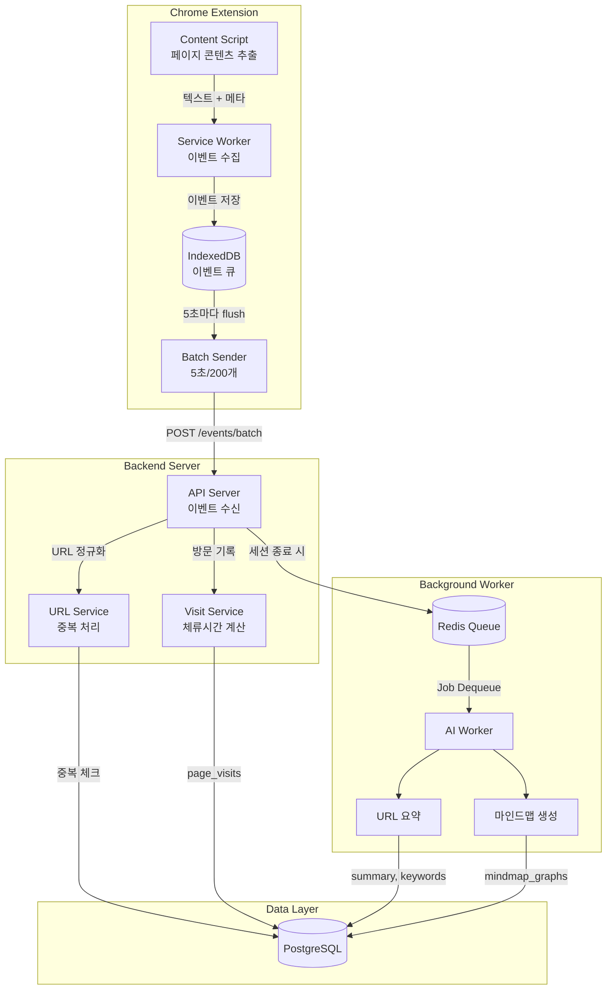
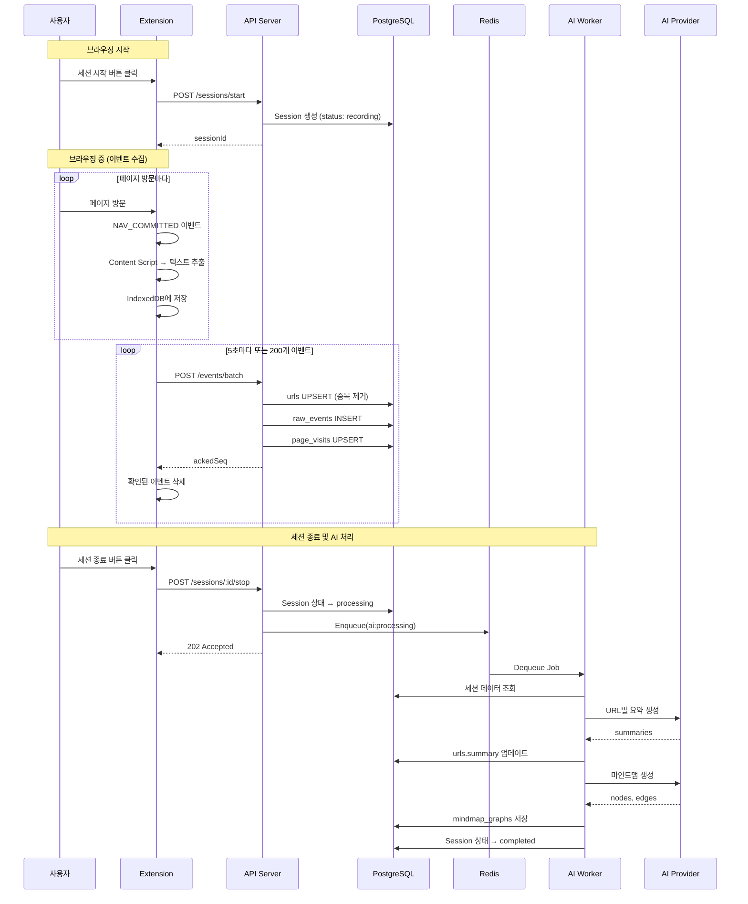

# 트래킹 파이프라인

## 목표

- 사용자가 탭을 매우 빠르게 전환하더라도 (초 단위 이하 포함) 정확한 타임라인 유지
- 서버/DB에 이벤트를 "1건씩 실시간 INSERT"하지 않고 성능/비용 감당
- 페이지 콘텐츠를 Extension에서 추출하여 서버 크롤링 비용 절감
- 웹앱은 세션 타임라인 + 마인드맵을 빠르게 조회/렌더링

---

## 전체 파이프라인 흐름



---

## 데이터 흐름 상세



---

## 1. Extension 이벤트 수집

### 1.1 수집 대상 이벤트

| Chrome API | 이벤트 | 용도 |
|------------|-------|------|
| `chrome.tabs.onActivated` | TAB_ACTIVATED | 탭 전환 감지 |
| `chrome.webNavigation.onCommitted` | NAV_COMMITTED | URL 확정 (리다이렉트 포함) |
| `chrome.windows.onFocusChanged` | WINDOW_FOCUS_CHANGED | 창 포커스 변화 |
| `chrome.idle.onStateChanged` | IDLE_STATE_CHANGED | 유휴 상태 (선택) |
| Content Script | HIGHLIGHT | 텍스트 하이라이팅 |
| Content Script | CONTENT_EXTRACTED | 페이지 콘텐츠 추출 (NEW) |

### 1.2 이벤트 구조

```typescript
interface TrackingEvent {
  sessionId: string;
  seq: number;             // 세션 내 monotonic 증가
  t: number;               // Date.now() (ms timestamp)
  type: EventType;
  tabId?: number;
  url?: string;
  payload?: {
    // NAV_COMMITTED
    title?: string;
    content?: string;        // 페이지 텍스트 (NEW)
    extractionOk?: boolean;  // 추출 성공 여부 (NEW)
    meta?: PageMeta;         // 메타데이터 (NEW)

    // WINDOW_FOCUS_CHANGED
    focused?: boolean;

    // HIGHLIGHT
    text?: string;
  };
}
```

**seq 발급 규칙:**

- 세션 시작 시 seq = 0
- 이벤트 발생마다 ++seq
- chrome.storage.local에 lastSeq 저장 (크래시 복구용)

---

## 2. 콘텐츠 추출 (Content Script)

### 2.1 추출 전략

```typescript
// content/extractor.ts

interface ExtractedContent {
  content: string;
  meta: PageMeta;
  extractionOk: boolean;
}

interface PageMeta {
  title: string;
  description?: string;
  ogImage?: string;
  ogTitle?: string;
}

function extractPageContent(): ExtractedContent {
  try {
    // 1. 메타데이터 추출
    const meta = extractMeta();

    // 2. 본문 텍스트 추출 (우선순위)
    const content = extractMainContent();

    return {
      content: content.slice(0, 10000), // 최대 10,000자
      meta,
      extractionOk: content.length > 100,
    };
  } catch (error) {
    return {
      content: '',
      meta: { title: document.title },
      extractionOk: false,
    };
  }
}

function extractMainContent(): string {
  // 우선순위별 시도
  const selectors = [
    'article',
    'main',
    '[role="main"]',
    '.post-content',
    '.article-content',
    '.entry-content',
    '#content',
  ];

  for (const selector of selectors) {
    const el = document.querySelector(selector);
    if (el && el.textContent && el.textContent.length > 200) {
      return cleanText(el.textContent);
    }
  }

  // 폴백: body에서 노이즈 제거
  return cleanText(document.body.textContent || '');
}

function cleanText(text: string): string {
  return text
    .replace(/\s+/g, ' ')           // 연속 공백 제거
    .replace(/\n{3,}/g, '\n\n')     // 연속 줄바꿈 제거
    .trim();
}

function extractMeta(): PageMeta {
  return {
    title: document.title,
    description: document.querySelector('meta[name="description"]')?.getAttribute('content') || undefined,
    ogImage: document.querySelector('meta[property="og:image"]')?.getAttribute('content') || undefined,
    ogTitle: document.querySelector('meta[property="og:title"]')?.getAttribute('content') || undefined,
  };
}
```

### 2.2 추출 타이밍

```typescript
// content/content.ts

// 페이지 로드 완료 후 추출
if (document.readyState === 'complete') {
  sendContentToBackground();
} else {
  window.addEventListener('load', sendContentToBackground);
}

// 또는 일정 시간 후 추출 (SPA 대응)
setTimeout(sendContentToBackground, 2000);

async function sendContentToBackground() {
  const extracted = extractPageContent();

  chrome.runtime.sendMessage({
    type: 'CONTENT_EXTRACTED',
    payload: {
      url: window.location.href,
      ...extracted,
    },
  });
}
```

### 2.3 Service Worker에서 콘텐츠 처리

```typescript
// background/service-worker.ts

// 콘텐츠 추출 결과 수신
chrome.runtime.onMessage.addListener((message, sender) => {
  if (message.type === 'CONTENT_EXTRACTED' && currentSessionId) {
    const { url, content, meta, extractionOk } = message.payload;

    // NAV_COMMITTED 이벤트에 콘텐츠 포함
    queueEvent({
      sessionId: currentSessionId,
      seq: ++seq,
      t: Date.now(),
      type: 'NAV_COMMITTED',
      tabId: sender.tab?.id,
      url,
      payload: {
        title: meta.title,
        content,
        extractionOk,
        meta,
      },
    });
  }
});
```

---

## 3. Batch 전송 전략

### 3.1 Flush 트리거

| 조건 | 값 | 설명 |
|-----|---|------|
| 주기 | 5초 | setInterval로 주기적 flush |
| 개수 | 200개 | 큐에 200개 쌓이면 즉시 flush |
| Stop | 즉시 | 세션 종료 시 잔여 이벤트 모두 flush |

### 3.2 IndexedDB 큐 관리

```typescript
// lib/event-queue.ts

const DB_NAME = 'mindhit-events';
const STORE_NAME = 'queue';

interface QueuedEvent extends TrackingEvent {
  id?: number;  // auto-increment
}

class EventQueue {
  private db: IDBDatabase | null = null;

  async init(): Promise<void> {
    return new Promise((resolve, reject) => {
      const request = indexedDB.open(DB_NAME, 1);
      request.onupgradeneeded = (e) => {
        const db = (e.target as IDBOpenDBRequest).result;
        if (!db.objectStoreNames.contains(STORE_NAME)) {
          db.createObjectStore(STORE_NAME, { keyPath: 'id', autoIncrement: true });
        }
      };
      request.onsuccess = (e) => {
        this.db = (e.target as IDBOpenDBRequest).result;
        resolve();
      };
      request.onerror = () => reject(request.error);
    });
  }

  async push(event: TrackingEvent): Promise<void> {
    // IndexedDB에 추가
  }

  async flush(): Promise<TrackingEvent[]> {
    // 모든 이벤트 가져오기
  }

  async ack(ids: number[]): Promise<void> {
    // 전송 완료된 이벤트 삭제
  }
}
```

### 3.3 Batch Sender

```typescript
// lib/batch-sender.ts

const FLUSH_INTERVAL_MS = 5000;
const FLUSH_MAX_EVENTS = 200;

class BatchSender {
  private queue: EventQueue;
  private intervalId: number | null = null;

  start() {
    this.intervalId = setInterval(() => this.flush(), FLUSH_INTERVAL_MS);
  }

  stop() {
    if (this.intervalId) {
      clearInterval(this.intervalId);
    }
  }

  async flush(): Promise<void> {
    const events = await this.queue.flush();
    if (events.length === 0) return;

    try {
      const response = await fetch('/api/events/batch', {
        method: 'POST',
        headers: { 'Content-Type': 'application/json' },
        body: JSON.stringify({ events }),
      });

      if (response.ok) {
        const { ackedSeq } = await response.json();
        await this.queue.ack(events.filter(e => e.seq <= ackedSeq).map(e => e.id!));
      }
    } catch (error) {
      console.error('Batch flush failed:', error);
    }
  }
}
```

---

## 4. Server 이벤트 처리

> Go + Gin + Ent 기반 이벤트 수신 및 처리

### 4.1 이벤트 수신 및 URL 처리

```go
// internal/api/controller/event_controller.go
package controller

import (
    "github.com/gin-gonic/gin"
    "github.com/google/uuid"
    "github.com/mindhit/api/internal/service"
)

type EventController struct {
    eventService *service.EventService
}

type BatchRequest struct {
    Events []TrackingEvent `json:"events"`
}

func (c *EventController) IngestBatch(ctx *gin.Context) {
    sessionID, _ := uuid.Parse(ctx.Param("sessionId"))

    var req BatchRequest
    if err := ctx.ShouldBindJSON(&req); err != nil {
        ctx.JSON(400, gin.H{"error": err.Error()})
        return
    }

    ackedSeq, err := c.eventService.IngestBatch(ctx, sessionID, req.Events)
    if err != nil {
        ctx.JSON(500, gin.H{"error": err.Error()})
        return
    }

    ctx.JSON(200, gin.H{"ackedSeq": ackedSeq})
}
```

```go
// internal/service/event_service.go
package service

import (
    "context"

    "github.com/google/uuid"
    "github.com/mindhit/api/ent"
)

type EventService struct {
    db         *ent.Client
    urlService *URLService
}

func (s *EventService) IngestBatch(ctx context.Context, sessionID uuid.UUID, events []TrackingEvent) (int, error) {
    // 1. NAV_COMMITTED 이벤트에서 URL 및 콘텐츠 처리
    for i, event := range events {
        if event.Type == "NAV_COMMITTED" {
            urlID, err := s.urlService.ProcessWithContent(ctx, event.URL, event.Payload)
            if err != nil {
                return 0, err
            }
            events[i].URLID = urlID
        }
    }

    // 2. raw_events bulk insert (멱등성: ON CONFLICT DO NOTHING)
    if err := s.bulkInsertRawEvents(ctx, sessionID, events); err != nil {
        return 0, err
    }

    // 3. page_visits 생성/업데이트
    if err := s.updatePageVisits(ctx, sessionID, events); err != nil {
        return 0, err
    }

    // 최대 seq 반환
    maxSeq := 0
    for _, e := range events {
        if e.Seq > maxSeq {
            maxSeq = e.Seq
        }
    }
    return maxSeq, nil
}
```

### 4.2 URL 및 콘텐츠 처리

```go
// internal/service/url_service.go (ProcessWithContent 메서드)

func (s *URLService) ProcessWithContent(ctx context.Context, rawURL string, payload *EventPayload) (int, error) {
    normalized := normalizeURL(rawURL)
    hash := hashURL(normalized)

    // 1. 기존 URL 조회
    existing, err := s.db.URL.Query().
        Where(url.URLHash(hash)).
        Only(ctx)

    if err == nil {
        // 이미 있으면 ID만 반환 (콘텐츠/요약 재사용)
        // 콘텐츠가 없고 새로 추출 성공했으면 업데이트
        if existing.Content == "" && payload != nil && payload.ExtractionOk && payload.Content != "" {
            s.db.URL.UpdateOneID(existing.ID).
                SetContent(payload.Content).
                SetContentStatus("extracted").
                SetNillableTitle(payload.Meta.Title).
                Exec(ctx)
        }
        return existing.ID, nil
    }

    // 2. 새 URL 생성
    contentStatus := "pending"
    content := ""
    if payload != nil && payload.ExtractionOk {
        contentStatus = "extracted"
        content = payload.Content
    }

    parsedURL, _ := neturl.Parse(rawURL)
    newURL, err := s.db.URL.Create().
        SetURLHash(hash).
        SetURL(rawURL).
        SetDomain(parsedURL.Hostname()).
        SetNillableTitle(getTitle(payload)).
        SetContent(content).
        SetContentStatus(contentStatus).
        Save(ctx)

    if err != nil {
        return 0, err
    }

    // 3. 추출 실패 시 크롤링 큐에 추가
    if contentStatus == "pending" {
        s.queueClient.Enqueue(tasks.TaskCrawlURL, &tasks.CrawlPayload{
            URLID: newURL.ID,
            URL:   rawURL,
        })
    }

    return newURL.ID, nil
}
```

### 4.3 Page Visits 처리

```go
// internal/service/event_service.go (updatePageVisits 메서드)

func (s *EventService) updatePageVisits(ctx context.Context, sessionID uuid.UUID, events []TrackingEvent) error {
    // NAV_COMMITTED 이벤트만 필터링
    var navEvents []TrackingEvent
    for _, e := range events {
        if e.Type == "NAV_COMMITTED" {
            navEvents = append(navEvents, e)
        }
    }

    // seq 순으로 정렬
    sort.Slice(navEvents, func(i, j int) bool {
        return navEvents[i].Seq < navEvents[j].Seq
    })

    for i, current := range navEvents {
        var durationMs *int
        var leftAt *time.Time

        if i+1 < len(navEvents) {
            next := navEvents[i+1]
            d := int(next.Timestamp - current.Timestamp)
            durationMs = &d
            t := time.UnixMilli(next.Timestamp)
            leftAt = &t
        }

        enteredAt := time.UnixMilli(current.Timestamp)

        // Upsert: 존재하면 업데이트, 없으면 생성
        err := s.db.PageVisit.Create().
            SetSessionID(sessionID).
            SetURLID(current.URLID).
            SetTabID(current.TabID).
            SetEnteredAt(enteredAt).
            SetNillableLeftAt(leftAt).
            SetNillableDurationMs(durationMs).
            SetVisitOrder(current.Seq).
            OnConflictColumns(pagevisit.FieldSessionID, pagevisit.FieldURLID, pagevisit.FieldEnteredAt).
            UpdateNewValues().
            Exec(ctx)

        if err != nil {
            return err
        }
    }

    return nil
}
```

---

## 5. AI 파이프라인

> Go + Asynq + Ent 기반 비동기 처리

### 5.1 Job Queue (Asynq)

```go
// internal/worker/tasks/types.go
package tasks

const (
    TaskAIProcessing  = "ai:processing"
    TaskTagExtraction = "ai:tag"
    TaskEmailReport   = "email:report"
)

type AIProcessingPayload struct {
    SessionID uuid.UUID `json:"session_id"`
}

type TagExtractionPayload struct {
    URLID uuid.UUID `json:"url_id"`
}
```

```go
// internal/worker/handler/ai_processing.go
package handler

import (
    "context"
    "encoding/json"

    "github.com/hibiken/asynq"
    "github.com/mindhit/backend/internal/worker/tasks"
    "github.com/mindhit/api/internal/service"
)

type AIProcessingHandler struct {
    urlService     *service.URLService
    mindmapService *service.MindmapService
    sessionService *service.SessionService
    emailService   *service.EmailService
}

func (h *AIProcessingHandler) ProcessTask(ctx context.Context, t *asynq.Task) error {
    var payload tasks.AIProcessingPayload
    if err := json.Unmarshal(t.Payload(), &payload); err != nil {
        return err
    }

    // 1. 요약 안 된 URL 처리
    if err := h.urlService.SummarizeUnsummarized(ctx, payload.SessionID); err != nil {
        return err
    }

    // 2. 마인드맵 생성
    if err := h.mindmapService.Generate(ctx, payload.SessionID); err != nil {
        return err
    }

    // 3. 이메일 발송
    if err := h.emailService.SendSessionReport(ctx, payload.SessionID); err != nil {
        // 이메일 실패는 로그만 남기고 계속
        log.Printf("email failed: %v", err)
    }

    // 4. 세션 상태 업데이트
    return h.sessionService.UpdateStatus(ctx, payload.SessionID, "completed")
}
```

```go
// cmd/worker/main.go
package main

import (
    "github.com/hibiken/asynq"
    "github.com/mindhit/backend/internal/worker/handler"
    "github.com/mindhit/backend/internal/worker/tasks"
)

func main() {
    srv := asynq.NewServer(
        asynq.RedisClientOpt{Addr: cfg.RedisAddr},
        asynq.Config{
            Concurrency: 10,
            Queues: map[string]int{
                "critical": 6,
                "default":  3,
                "low":      1,
            },
        },
    )

    mux := asynq.NewServeMux()
    mux.HandleFunc(tasks.TaskAIProcessing, aiHandler.ProcessTask)
    mux.HandleFunc(tasks.TaskTagExtraction, tagHandler.ProcessTask)
    mux.HandleFunc(tasks.TaskEmailReport, emailHandler.ProcessTask)

    if err := srv.Run(mux); err != nil {
        log.Fatal(err)
    }
}
```

### 5.2 URL 요약 생성

```go
// internal/service/url_service.go
package service

import (
    "context"

    "github.com/google/uuid"
    "github.com/mindhit/api/ent"
    "github.com/mindhit/api/internal/infrastructure/ai"
    "golang.org/x/sync/errgroup"
    "golang.org/x/sync/semaphore"
)

type URLService struct {
    db       *ent.Client
    aiClient ai.Provider
}

func (s *URLService) SummarizeUnsummarized(ctx context.Context, sessionID uuid.UUID) error {
    // 세션에서 요약 안 된 URL 조회
    urls, err := s.db.URL.Query().
        Where(
            url.HasPageVisitsWith(pagevisit.SessionID(sessionID)),
            url.SummaryIsNil(),
            url.ContentNotNil(),
        ).
        All(ctx)
    if err != nil {
        return err
    }

    // 병렬로 요약 생성 (동시 5개 제한)
    sem := semaphore.NewWeighted(5)
    g, ctx := errgroup.WithContext(ctx)

    for _, u := range urls {
        u := u
        g.Go(func() error {
            if err := sem.Acquire(ctx, 1); err != nil {
                return err
            }
            defer sem.Release(1)

            summary, err := s.aiClient.Summarize(ctx, u.Content)
            if err != nil {
                return err
            }

            keywords, err := s.aiClient.ExtractKeywords(ctx, u.Content)
            if err != nil {
                return err
            }

            return s.db.URL.UpdateOneID(u.ID).
                SetSummary(summary).
                SetKeywords(keywords).
                SetSummarizedAt(time.Now()).
                Exec(ctx)
        })
    }

    return g.Wait()
}
```

### 5.3 마인드맵 생성

```go
// internal/service/mindmap_service.go
package service

import (
    "context"
    "encoding/json"

    "github.com/google/uuid"
    "github.com/mindhit/api/ent"
    "github.com/mindhit/api/internal/infrastructure/ai"
)

type MindmapService struct {
    db       *ent.Client
    aiClient ai.Provider
}

func (s *MindmapService) Generate(ctx context.Context, sessionID uuid.UUID) error {
    // 1. 세션의 모든 URL 요약 + 하이라이트 조회
    pageVisits, err := s.db.PageVisit.Query().
        Where(pagevisit.SessionID(sessionID)).
        WithURL().
        Order(ent.Asc(pagevisit.FieldVisitOrder)).
        All(ctx)
    if err != nil {
        return err
    }

    highlights, err := s.db.Highlight.Query().
        Where(highlight.SessionID(sessionID)).
        All(ctx)
    if err != nil {
        return err
    }

    // 2. 마인드맵 생성
    prompt := buildMindmapPrompt(pageVisits, highlights)
    result, err := s.aiClient.GenerateMindmap(ctx, prompt)
    if err != nil {
        return err
    }

    // 3. 레이아웃 계산
    positionedNodes := calculateLayout(result.Nodes, result.Edges)

    // 4. 저장
    return s.db.MindmapGraph.Create().
        SetSessionID(sessionID).
        SetNodes(positionedNodes).
        SetEdges(result.Edges).
        Exec(ctx)
}

func buildMindmapPrompt(pageVisits []*ent.PageVisit, highlights []*ent.Highlight) string {
    pages := make([]map[string]interface{}, len(pageVisits))
    for i, pv := range pageVisits {
        pages[i] = map[string]interface{}{
            "title":      pv.Edges.URL.Title,
            "summary":    pv.Edges.URL.Summary,
            "keywords":   pv.Edges.URL.Keywords,
            "durationMs": pv.DurationMs,
        }
    }

    highlightTexts := make([]string, len(highlights))
    for i, h := range highlights {
        highlightTexts[i] = "- " + h.Text
    }

    return fmt.Sprintf(`
사용자가 브라우징한 내용을 마인드맵으로 구조화해주세요.

## 방문한 페이지들:
%s

## 하이라이트한 텍스트:
%s

## 출력 형식 (JSON):
{
  "nodes": [
    { "id": "root", "label": "메인 주제", "type": "root" },
    { "id": "topic-1", "label": "토픽1", "type": "topic", "relatedPageIds": ["..."] }
  ],
  "edges": [
    { "id": "e1", "source": "root", "target": "topic-1", "type": "parent" }
  ]
}

- type: root(1개), topic(주요 주제), subtopic(하위), keyword(키워드)
- relatedPageIds: 관련된 페이지 visit ID들
- 체류시간이 긴 페이지일수록 중요
`, toJSON(pages), strings.Join(highlightTexts, "\n"))
}
```

---

## 6. 폴백 크롤러

Extension에서 추출 실패한 URL 처리:

```typescript
// workers/crawler.ts
import { chromium } from 'playwright';

const crawlQueue = new Queue('crawl', { connection: redis });

const crawlWorker = new Worker('crawl', async (job) => {
  const { urlId, url } = job.data;

  const browser = await chromium.launch();
  const page = await browser.newPage();

  try {
    await page.goto(url, { waitUntil: 'networkidle' });

    const content = await page.evaluate(() => {
      const article = document.querySelector('article, main, [role="main"]');
      return (article || document.body).textContent?.trim() || '';
    });

    await prisma.urls.update({
      where: { id: urlId },
      data: {
        content: content.slice(0, 10000),
        content_status: 'crawled',
      },
    });
  } catch (error) {
    await prisma.urls.update({
      where: { id: urlId },
      data: { content_status: 'failed' },
    });
  } finally {
    await browser.close();
  }
}, { connection: redis });
```

---

## 7. 엣지 케이스 처리

| 상황 | Extension | Server |
|-----|-----------|--------|
| **네트워크 끊김** | 로컬 IndexedDB에 유지, 복구 시 재전송 | - |
| **브라우저 크래시** | storage.local의 lastSeq로 복구 | 열린 page_visit 강제 종료 |
| **중복 이벤트** | - | sessionId + seq UNIQUE로 무시 |
| **콘텐츠 추출 실패** | extractionOk=false 전송 | 크롤링 큐에 추가 |
| **URL 중복** | - | url_hash로 기존 콘텐츠/요약 재사용 |
| **탭 닫힘** | onRemoved 리스너 추가 | page_visit.left_at 설정 |
| **리다이렉트** | NAV_COMMITTED 여러 번 발생 | 최종 URL만 page_visit |
| **Idle 오래** | IDLE_STATE_CHANGED 발송 | page_visit 분리 |

---

## 8. 성능 체크리스트

- [ ] raw_events: bulk insert만 사용
- [ ] raw_events: date partition 적용 (월/주 단위)
- [ ] raw_events: 최소 인덱스 (session_id, seq)만
- [ ] urls: url_hash로 중복 방지
- [ ] urls: 콘텐츠/요약 재사용으로 AI 호출 최소화
- [ ] page_visits: 웹앱 조회의 기본 단위
- [ ] AI 처리: 비동기 Worker로 분리
- [ ] 크롤링: 폴백으로만 사용, 필요시에만 실행
- [ ] 멱등성: sessionId + seq unique constraint
