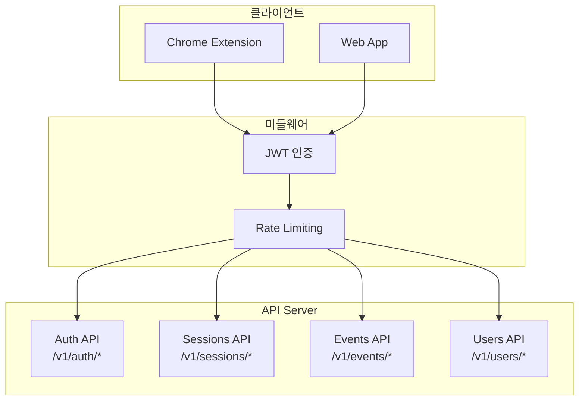
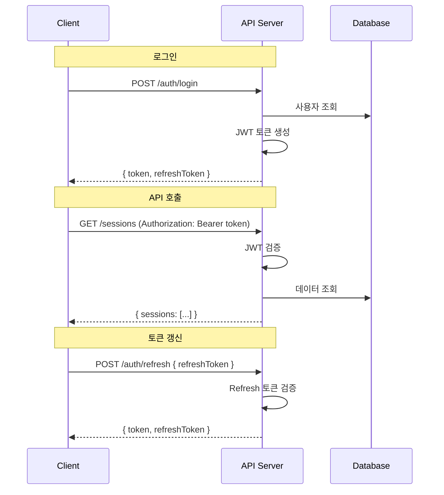

# API 명세

Base URL:

- **로컬 (go run)**: `http://localhost:8080/v1`
- **로컬 (K8s)**: `http://api.mindhit.local/v1`
- **프로덕션**: `https://api.mindhit.io/v1`

---

## API 구조 개요



---

## 인증 흐름



---

## 인증

모든 API 요청은 Authorization 헤더에 JWT 토큰 필요 (인증 관련 제외)

```
Authorization: Bearer <token>
```

---

## 1. Auth API

### POST /auth/signup

회원가입

**Request:**
```json
{
  "email": "user@example.com",
  "password": "securePassword123"
}
```

**Response:** `201 Created`
```json
{
  "user": {
    "id": "uuid",
    "email": "user@example.com",
    "created_at": "2024-12-20T10:00:00Z"
  },
  "token": "jwt-token"
}
```

**Errors:**
- `400` - 유효하지 않은 이메일/비밀번호
- `409` - 이미 존재하는 이메일

---

### POST /auth/login

로그인

**Request:**
```json
{
  "email": "user@example.com",
  "password": "securePassword123"
}
```

**Response:** `200 OK`
```json
{
  "user": {
    "id": "uuid",
    "email": "user@example.com"
  },
  "token": "jwt-token"
}
```

**Errors:**
- `401` - 잘못된 이메일 또는 비밀번호

---

### POST /auth/refresh

토큰 갱신

**Request:**
```json
{
  "refresh_token": "refresh-token"
}
```

**Response:** `200 OK`
```json
{
  "token": "new-jwt-token",
  "refresh_token": "new-refresh-token"
}
```

---

## 2. Sessions API

### POST /sessions/start

세션 시작 (Extension에서 호출)

**Request:** 빈 body

**Response:** `201 Created`
```json
{
  "session_id": "uuid",
  "started_at": "2024-12-20T14:30:00Z"
}
```

---

### POST /sessions/:sessionId/stop

세션 종료

**Request:** 빈 body

**Response:** `202 Accepted`
```json
{
  "session_id": "uuid",
  "status": "processing",
  "message": "AI processing started"
}
```

---

### GET /sessions

세션 목록 조회

**Query Parameters:**
| 파라미터 | 타입 | 기본값 | 설명 |
|---------|------|--------|------|
| page | number | 1 | 페이지 번호 |
| limit | number | 20 | 페이지당 개수 (max: 100) |
| status | string | - | 필터: recording, processing, completed, failed |

**Response:** `200 OK`
```json
{
  "sessions": [
    {
      "id": "uuid",
      "title": "AI 트렌드 리서치",
      "status": "completed",
      "started_at": "2024-12-20T14:30:00Z",
      "ended_at": "2024-12-20T16:02:00Z",
      "total_duration_ms": 5520000,
      "page_count": 12,
      "top_keywords": ["AI", "LLM", "Enterprise"]
    }
  ],
  "pagination": {
    "total": 42,
    "page": 1,
    "limit": 20,
    "has_next": true
  }
}
```

---

### GET /sessions/:sessionId

세션 상세 조회 (타임라인 포함)

**Response:** `200 OK`
```json
{
  "session": {
    "id": "uuid",
    "title": "AI 트렌드 리서치",
    "status": "completed",
    "started_at": "2024-12-20T14:30:00Z",
    "ended_at": "2024-12-20T16:02:00Z"
  },
  "page_visits": [
    {
      "id": "uuid",
      "url": "https://techcrunch.com/2024/ai-predictions",
      "domain": "techcrunch.com",
      "title": "2024 AI Predictions",
      "favicon": "https://techcrunch.com/favicon.ico",
      "entered_at": "2024-12-20T14:31:00Z",
      "left_at": "2024-12-20T14:36:12Z",
      "duration_ms": 312000,
      "visit_order": 1
    }
  ],
  "highlights": [
    {
      "id": "uuid",
      "text": "LLM이 2024년 가장 큰 영향을 미칠 것으로...",
      "url": "https://techcrunch.com/2024/ai-predictions",
      "created_at": "2024-12-20T14:33:00Z"
    }
  ]
}
```

**Errors:**
- `404` - 세션 없음
- `403` - 권한 없음

---

### PATCH /sessions/:sessionId

세션 수정 (제목 변경)

**Request:**
```json
{
  "title": "새로운 제목"
}
```

**Response:** `200 OK`
```json
{
  "id": "uuid",
  "title": "새로운 제목",
  "updated_at": "2024-12-20T17:00:00Z"
}
```

---

### DELETE /sessions/:sessionId

세션 삭제

**Response:** `204 No Content`

---

### GET /sessions/:sessionId/mindmap

마인드맵 조회

**Response:** `200 OK`
```json
{
  "mindmap": {
    "id": "uuid",
    "session_id": "uuid",
    "nodes": [
      {
        "id": "root",
        "label": "AI 트렌드",
        "type": "root",
        "importance": 1,
        "related_page_visit_ids": [],
        "position": { "x": 0, "y": 0 },
        "metadata": {
          "total_duration_ms": 5520000,
          "highlight_count": 0
        }
      },
      {
        "id": "topic-1",
        "label": "LLM",
        "type": "topic",
        "importance": 0.8,
        "related_page_visit_ids": ["1", "3", "5"],
        "position": { "x": -200, "y": 100 },
        "metadata": {
          "total_duration_ms": 1800000,
          "highlight_count": 2
        }
      }
    ],
    "edges": [
      {
        "id": "e1",
        "source": "root",
        "target": "topic-1",
        "type": "parent"
      }
    ],
    "created_at": "2024-12-20T16:05:00Z"
  }
}
```

**Errors:**
- `404` - 마인드맵 없음 (아직 생성 중이거나 실패)

---

## 3. Events API (Extension 전용)

### POST /events/batch

이벤트 배치 전송

**Request:**
```json
{
  "events": [
    {
      "session_id": "uuid",
      "seq": 1,
      "t": 1703077800000,
      "type": "TAB_ACTIVATED",
      "tab_id": 123
    },
    {
      "session_id": "uuid",
      "seq": 2,
      "t": 1703077801000,
      "type": "NAV_COMMITTED",
      "tab_id": 123,
      "url": "https://example.com"
    }
  ]
}
```

**Response:** `200 OK`
```json
{
  "acked_seq": 2,
  "count": 2
}
```

`acked_seq`: 서버가 확인한 마지막 시퀀스 번호. Extension은 이 번호 이하의 이벤트를 로컬에서 삭제.

**Errors:**
- `400` - 유효하지 않은 이벤트 형식
- `404` - 세션 없음

---

## 4. Users API

### GET /users/me

내 정보 조회

**Response:** `200 OK`
```json
{
  "id": "uuid",
  "email": "user@example.com",
  "created_at": "2024-01-01T00:00:00Z",
  "settings": {
    "email_notification": true,
    "excluded_domains": ["localhost", "127.0.0.1"]
  }
}
```

---

### PATCH /users/me/settings

설정 변경

**Request:**
```json
{
  "email_notification": false,
  "excluded_domains": ["localhost", "mail.google.com"]
}
```

**Response:** `200 OK`
```json
{
  "email_notification": false,
  "excluded_domains": ["localhost", "mail.google.com"],
  "updated_at": "2024-12-20T17:00:00Z"
}
```

---

### DELETE /users/me

계정 삭제 (모든 데이터 포함)

**Response:** `204 No Content`

---

## 5. 공통 에러 형식

```json
{
  "error": {
    "code": "VALIDATION_ERROR",
    "message": "Invalid email format",
    "details": {
      "field": "email",
      "reason": "must be a valid email address"
    }
  }
}
```

### 에러 코드

| HTTP | Code | 설명 |
|------|------|------|
| 400 | VALIDATION_ERROR | 요청 데이터 유효성 오류 |
| 401 | UNAUTHORIZED | 인증 필요 |
| 403 | FORBIDDEN | 권한 없음 |
| 404 | NOT_FOUND | 리소스 없음 |
| 409 | CONFLICT | 충돌 (중복 등) |
| 422 | UNPROCESSABLE_ENTITY | 비즈니스 규칙 위반 |
| 429 | RATE_LIMITED | 요청 제한 초과 |
| 500 | INTERNAL_ERROR | 서버 오류 |

> **상세 가이드**: 에러 처리 패턴 및 응답 헬퍼는 [09-error-handling.md](./09-error-handling.md)를 참조하세요.

---

## 6. Rate Limiting

| Endpoint | 제한 |
|----------|------|
| POST /auth/* | 10 req/min per IP |
| POST /events/batch | 100 req/min per user |
| GET /sessions/* | 60 req/min per user |
| 기타 | 120 req/min per user |

초과 시 `429 Too Many Requests` 응답:
```json
{
  "error": {
    "code": "RATE_LIMITED",
    "message": "Too many requests",
    "retry_after": 30
  }
}
```
