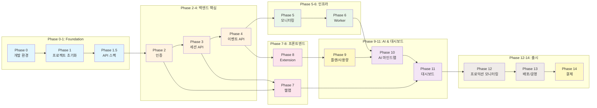

# 개발 마일스톤

> **Note**: 이 문서는 더 이상 사용되지 않습니다.
> 상세 개발 체크리스트는 [phases/](./phases/) 폴더를 참조하세요.

---

## 전체 로드맵

---

## Phase별 문서

상세 구현 가이드는 각 Phase 문서를 참조하세요:

| Phase | 문서 | 설명 |
|-------|------|------|
| 0 | [개발 환경](./phases/phase-0-dev-environment.md) | 3단계 개발 환경 (go run, kind, EKS) |
| 1 | [프로젝트 초기화](./phases/phase-1-project-init.md) | 모노레포, Go 백엔드 기본 설정 |
| 1.5 | [API 스펙 공통화](./phases/phase-1.5-api-spec.md) | OpenAPI, 공통 응답 포맷 |
| 2 | [인증 시스템](./phases/phase-2-auth.md) | JWT, Google OAuth, 비밀번호 재설정 |
| 3 | [세션 관리 API](./phases/phase-3-sessions.md) | 세션 CRUD API |
| 4 | [이벤트 수집 API](./phases/phase-4-events.md) | 이벤트 배치 수집 |
| 5 | [모니터링 및 인프라](./phases/phase-5-infra.md) | Prometheus, Grafana |
| 6 | [Worker 및 Job Queue](./phases/phase-6-worker.md) | Asynq + Redis 비동기 작업 |
| 7 | [Next.js 웹앱](./phases/phase-7-webapp.md) | 웹 프론트엔드 |
| 8 | [Chrome Extension](./phases/phase-8-extension.md) | 브라우저 확장 프로그램 |
| 9 | [플랜 및 사용량](./phases/phase-9-plan-usage.md) | 구독 플랜, 토큰 사용량 |
| 10 | [AI 마인드맵](./phases/phase-10-ai.md) | 다중 AI Provider, Worker 연동 |
| 11 | [웹앱 대시보드](./phases/phase-11-dashboard.md) | 마인드맵 시각화 |
| 12 | [프로덕션 모니터링](./phases/phase-12-monitoring.md) | 알림, 로깅 |
| 13 | [배포 및 운영](./phases/phase-13-deployment.md) | Terraform, EKS, CI/CD |
| 14 | [Stripe 결제](./phases/phase-14-billing.md) | 결제 연동 |

---

## 진행 상황 관리

전체 진행 상황은 [phases/README.md](./phases/README.md)에서 관리합니다.
