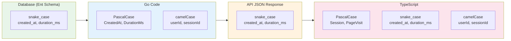

# 네이밍 규칙 (Naming Conventions)

## 개요

MindHit 프로젝트의 일관된 코드 스타일을 위한 네이밍 규칙입니다. 모든 개발자는 이 규칙을 따라야 합니다.

---

## 계층별 네이밍 규칙



---

## 상세 규칙

### 1. Database (Ent Schema) - `snake_case`

데이터베이스 컬럼명과 Ent 스키마 필드명은 **snake_case**를 사용합니다.

```go
// ✅ 올바른 예시
field.Time("created_at").Default(time.Now)
field.Time("updated_at").Default(time.Now)
field.Int("duration_ms").Optional().Nillable()
field.Float("max_scroll_depth").Default(0)
field.Time("entered_at").Default(time.Now)
field.Time("left_at").Optional().Nillable()
field.String("session_status").Default("recording")
field.String("url_hash").Unique()

// ❌ 잘못된 예시
field.Time("createdAt")  // camelCase 사용 금지
field.Int("DurationMs")  // PascalCase 사용 금지
```

### 2. Go Code

#### 구조체 필드 - `PascalCase`

Ent에서 생성된 Go 구조체 필드는 Go 관례에 따라 **PascalCase**를 사용합니다.

```go
// Ent가 자동 생성하는 구조체
type PageVisit struct {
    ID             uuid.UUID  `json:"id"`
    EnteredAt      time.Time  `json:"entered_at"`
    LeftAt         *time.Time `json:"left_at,omitempty"`
    DurationMs     *int       `json:"duration_ms,omitempty"`
    MaxScrollDepth float64    `json:"max_scroll_depth"`
}
```

#### 변수명 - `camelCase`

로컬 변수, 함수 파라미터는 **camelCase**를 사용합니다.

```go
// ✅ 올바른 예시
func (c *SessionController) GetSession(ctx *gin.Context) {
    userID := ctx.GetString("user_id")
    sessionID := ctx.Param("session_id")

    session, err := c.repo.FindByID(ctx, sessionID)
    if err != nil {
        return
    }

    totalDurationMs := calculateTotalDuration(session.PageVisits)
}

// ❌ 잘못된 예시
func (c *SessionController) GetSession(ctx *gin.Context) {
    user_id := ctx.GetString("user_id")  // snake_case 금지
    SessionID := ctx.Param("session_id")  // PascalCase 금지 (exported 아닌 경우)
}
```

#### 함수/메서드명 - `PascalCase` (exported) / `camelCase` (unexported)

```go
// ✅ Exported (public)
func GetUserByID(id uuid.UUID) (*User, error)
func (s *SessionService) CreateSession(ctx context.Context, req CreateSessionRequest)

// ✅ Unexported (private)
func calculateTotalDuration(visits []PageVisit) int
func (s *SessionService) validateRequest(req CreateSessionRequest) error
```

### 3. API JSON Response - `snake_case`

API 응답의 모든 JSON 키는 **snake_case**를 사용합니다. 이는 Go 생태계의 일반적인 관행을 따르며, 데이터베이스 필드명과 일관성을 유지합니다.

```json
{
  "id": "uuid",
  "title": "AI 트렌드 리서치",
  "status": "completed",
  "started_at": "2024-12-20T14:30:00Z",
  "ended_at": "2024-12-20T16:02:00Z",
  "created_at": "2024-12-20T14:30:00Z",
  "updated_at": "2024-12-20T16:02:00Z",
  "page_visits": [
    {
      "id": "uuid",
      "entered_at": "2024-12-20T14:31:00Z",
      "left_at": "2024-12-20T14:36:12Z",
      "duration_ms": 312000,
      "max_scroll_depth": 0.85
    }
  ]
}
```

#### Go에서 JSON 태그 사용

```go
// ✅ 올바른 예시 - snake_case JSON 태그
ctx.JSON(http.StatusOK, gin.H{
    "user": gin.H{
        "id":         user.ID.String(),
        "email":      user.Email,
        "created_at": user.CreatedAt,
        "updated_at": user.UpdatedAt,
    },
    "access_token":  tokenPair.AccessToken,
    "refresh_token": tokenPair.RefreshToken,
    "token_type":    "Bearer",
    "expires_in":    tokenPair.ExpiresIn,
})

// ❌ 잘못된 예시 - camelCase JSON 키
ctx.JSON(http.StatusOK, gin.H{
    "createdAt": user.CreatedAt,  // 금지
    "accessToken": tokenPair.AccessToken,  // 금지
})
```

### 4. TypeScript - `snake_case` (API 타입) / `camelCase` (로컬 변수)

#### 타입/인터페이스 필드 - `snake_case`

API 응답과 일치하도록 TypeScript 인터페이스 필드도 **snake_case**를 사용합니다.

```typescript
// ✅ 올바른 예시
export interface Session {
  id: string;
  title: string | null;
  status: SessionStatus;
  started_at: string;
  ended_at: string | null;
  created_at: string;
  updated_at: string;
}

export interface PageVisit {
  id: string;
  entered_at: string;
  left_at: string | null;
  duration_ms: number | null;
  max_scroll_depth: number;
}

export type SessionStatus = 'idle' | 'recording' | 'paused' | 'processing' | 'completed' | 'failed';
```

#### 로컬 변수/함수명 - `camelCase`

TypeScript 로컬 변수와 함수는 JavaScript 관례에 따라 **camelCase**를 사용합니다.

```typescript
// ✅ 올바른 예시
const totalDurationMs = session.page_visits.reduce(
  (acc, pv) => acc + (pv.duration_ms || 0),
  0
);

function formatDuration(ms: number): string {
  const totalSeconds = Math.floor(ms / 1000);
  const hours = Math.floor(totalSeconds / 3600);
  const minutes = Math.floor((totalSeconds % 3600) / 60);
  return `${hours}시간 ${minutes}분`;
}

// ❌ 잘못된 예시 (로컬 변수에 snake_case 금지)
const total_duration_ms = session.page_visits.reduce();
function format_duration(ms: number) {}
```

#### React 컴포넌트 - `PascalCase`

```typescript
// ✅ 올바른 예시
export function SessionCard({ session }: SessionCardProps) {
  return <div>{session.title}</div>;
}

export function SessionTimeline({ session }: SessionTimelineProps) {
  const sortedVisits = [...session.page_visits].sort(
    (a, b) => new Date(a.entered_at).getTime() - new Date(b.entered_at).getTime()
  );
  return <ul>{sortedVisits.map(visit => <li key={visit.id} />)}</ul>;
}
```

---

## 특수 케이스

### UUID 필드

```go
// Go: ID는 대문자
type Session struct {
    ID        uuid.UUID
    UserID    uuid.UUID
    SessionID uuid.UUID
}
```

```typescript
// TypeScript/JSON: id는 소문자, 복합어는 snake_case
interface Session {
  id: string;
  user_id: string;
  session_id: string;
}
```

### URL 관련 필드

```go
// Go
field.String("url").NotEmpty()
field.String("url_hash").Unique()
```

```typescript
// TypeScript
interface PageVisit {
  url: string;
  url_hash: string;
}
```

### 약어 처리

| 약어 | Go 구조체 | Go 변수 | JSON/TypeScript |
|-----|----------|---------|-----------------|
| ID | `ID`, `UserID` | `userID` | `id`, `user_id` |
| URL | `URL`, `URLHash` | `urlHash` | `url`, `url_hash` |
| API | `API`, `APIKey` | `apiKey` | `api`, `api_key` |
| HTTP | `HTTP`, `HTTPClient` | `httpClient` | `http`, `http_client` |
| JSON | `JSON`, `JSONData` | `jsonData` | `json`, `json_data` |

---

## 파일/디렉토리 네이밍

### Go

```
apps/backend/
├── cmd/
│   ├── api/              # 소문자, 하이픈 없음
│   └── worker/
├── internal/
│   ├── controller/       # 소문자, 단수형
│   ├── service/          # 소문자, 단수형
│   ├── infrastructure/
│   │   ├── config/
│   │   ├── logger/
│   │   └── queue/
│   ├── worker/
│   │   └── handler/
│   ├── testutil/         # 테스트 유틸리티
│   └── generated/
└── ent/
    └── schema/
```

### TypeScript

```
apps/web/
├── src/
│   ├── app/              # Next.js App Router
│   │   └── (dashboard)/
│   │       └── sessions/
│   │           └── [id]/
│   ├── components/       # 소문자 디렉토리
│   │   ├── ui/
│   │   └── mindmap/
│   └── lib/
│       └── api/
│           └── sessions.ts  # 소문자, 복수형 (리소스)
```

### 컴포넌트 파일명

```typescript
// ✅ 올바른 예시 - PascalCase
SessionCard.tsx
SessionTimeline.tsx
MindmapViewer.tsx

// ❌ 잘못된 예시
session-card.tsx      // kebab-case 금지
sessionCard.tsx       // camelCase 금지
```

---

## 요약 테이블

| 계층 | 규칙 | 예시 |
|-----|------|------|
| **DB (Ent Schema)** | snake_case | `created_at`, `duration_ms`, `url_hash` |
| **Go 구조체 필드** | PascalCase | `CreatedAt`, `DurationMs`, `URLHash` |
| **Go 변수** | camelCase | `userID`, `sessionID`, `totalDuration` |
| **Go 함수 (exported)** | PascalCase | `GetSession`, `CreateUser` |
| **Go 함수 (unexported)** | camelCase | `validateRequest`, `buildQuery` |
| **API JSON 키** | snake_case | `created_at`, `duration_ms`, `page_visits` |
| **TypeScript 타입 필드** | snake_case | `created_at`, `duration_ms`, `page_visits` |
| **TypeScript 타입명** | PascalCase | `Session`, `PageVisit`, `SessionStatus` |
| **TypeScript 변수** | camelCase | `userID`, `totalDurationMs` |
| **TypeScript 함수** | camelCase | `formatDuration`, `fetchSessions` |
| **React 컴포넌트** | PascalCase | `SessionCard`, `MindmapViewer` |
| **파일명 (Go)** | snake_case | `session_controller.go` |
| **파일명 (TS 컴포넌트)** | PascalCase | `SessionCard.tsx` |
| **파일명 (TS 유틸)** | camelCase | `formatDate.ts` |
| **디렉토리** | lowercase | `controller/`, `components/` |

---

## TypeSpec과의 관계

TypeSpec에서 API 스펙을 정의할 때도 **snake_case**를 사용합니다:

```typespec
model PageVisit {
  id: string;
  url: string;
  title?: string;
  entered_at: utcDateTime;
  left_at?: utcDateTime;
  duration_ms?: int32;
  max_scroll_depth: float32;
}
```

TypeSpec → OpenAPI → Go/TypeScript 코드 생성 시 네이밍이 일관되게 유지됩니다.

---

## 왜 snake_case인가?

### API JSON에 snake_case를 선택한 이유

| 이유 | 설명 |
|-----|------|
| **Go 생태계 표준** | Go 커뮤니티에서 JSON API는 snake_case가 일반적 |
| **DB 일관성** | PostgreSQL 컬럼명과 동일하여 ORM 매핑이 자연스러움 |
| **가독성** | `max_scroll_depth`가 `maxScrollDepth`보다 읽기 쉬움 |
| **Ruby/Python 호환** | 다른 백엔드 언어와 API 스타일 일관성 |

### camelCase가 더 적합한 경우

- 순수 JavaScript/TypeScript 프로젝트
- Google API 스타일 가이드를 따르는 경우
- React Native 등 JS 생태계가 주력인 경우

---

## 참고

- [Go Code Review Comments](https://github.com/golang/go/wiki/CodeReviewComments)
- [TypeScript Naming Conventions](https://www.typescriptlang.org/docs/handbook/declaration-files/do-s-and-don-ts.html)
- [Ent Schema Fields](https://entgo.io/docs/schema-fields)
