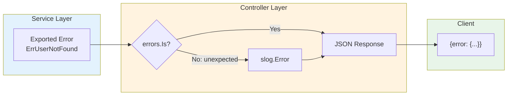
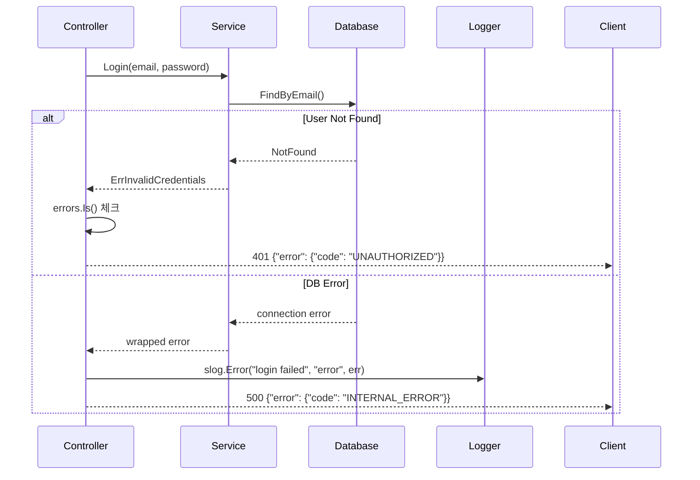
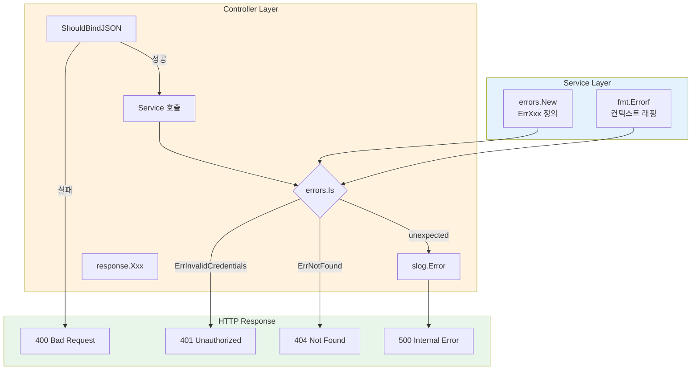

# 에러 핸들링 가이드

## 목표

- 일관된 에러 처리 패턴으로 코드 품질 향상
- 구조화된 로깅으로 디버깅 및 모니터링 효율화
- 민감 정보 노출 방지로 보안 강화
- 레이어별 책임 분리로 유지보수성 향상

---

## 에러 처리 흐름





---

## 레이어별 책임

| 레이어 | 책임 | 하지 않는 것 |
|--------|------|-------------|
| **Service** | 에러 정의, 비즈니스 로직 | HTTP 응답 생성 |
| **Controller** | 에러 → HTTP 응답 변환, 로깅 | 비즈니스 로직 |
| **Middleware** | 공통 에러 처리 (인증, Rate Limit) | 도메인 에러 처리 |

---

## 1. 에러 타입 정의

### 1.1 파일 구조

```
pkg/service/
├── auth_service.go
├── auth_errors.go      # 인증 관련 에러
├── session_service.go
├── session_errors.go   # 세션 관련 에러
└── errors.go           # 공통 에러
```

### 1.2 공통 에러

```go
// pkg/service/errors.go
package service

import "errors"

var (
    ErrNotFound     = errors.New("resource not found")
    ErrUnauthorized = errors.New("unauthorized")
    ErrForbidden    = errors.New("forbidden")
)
```

### 1.3 도메인 에러

```go
// pkg/service/auth_errors.go
package service

import "errors"

var (
    ErrUserNotFound        = errors.New("user not found")
    ErrInvalidCredentials  = errors.New("invalid credentials")
    ErrEmailExists         = errors.New("email already exists")
    ErrUserInactive        = errors.New("user account is inactive")
    ErrTokenExpired        = errors.New("token expired")
    ErrTokenInvalid        = errors.New("invalid token")
    ErrRefreshTokenInvalid = errors.New("invalid refresh token")
)
```

```go
// pkg/service/session_errors.go
package service

import "errors"

var (
    ErrSessionNotFound   = errors.New("session not found")
    ErrSessionNotOwned   = errors.New("session not owned by user")
    ErrSessionInProgress = errors.New("session already in progress")
    ErrSessionEnded      = errors.New("session already ended")
)
```

### 1.4 Wrapped 에러

```go
// 컨텍스트 추가 시
if err := s.db.Save(ctx, user); err != nil {
    return fmt.Errorf("save user %s: %w", user.ID, err)
}

// 에러 체인 확인
if errors.Is(err, ErrUserNotFound) {
    // 처리
}
```

---

## 2. API 에러 응답

### 2.1 표준 응답 포맷

```json
{
  "error": {
    "code": "VALIDATION_ERROR",
    "message": "Invalid email format",
    "details": {
      "field": "email",
      "reason": "must be a valid email address"
    }
  }
}
```

### 2.2 에러 코드

| HTTP | Code | 사용 시점 |
|------|------|----------|
| 400 | `VALIDATION_ERROR` | 요청 데이터 유효성 실패 |
| 401 | `UNAUTHORIZED` | 인증 필요 또는 토큰 만료 |
| 403 | `FORBIDDEN` | 권한 없음 |
| 404 | `NOT_FOUND` | 리소스 없음 |
| 409 | `CONFLICT` | 중복 (이메일 등) |
| 422 | `UNPROCESSABLE_ENTITY` | 비즈니스 규칙 위반 |
| 429 | `RATE_LIMITED` | 요청 제한 초과 |
| 500 | `INTERNAL_ERROR` | 서버 오류 |

### 2.3 응답 헬퍼

```go
// pkg/api/response/error.go
package response

import (
    "net/http"
    "github.com/gin-gonic/gin"
)

type ErrorCode string

const (
    CodeValidationError ErrorCode = "VALIDATION_ERROR"
    CodeUnauthorized    ErrorCode = "UNAUTHORIZED"
    CodeForbidden       ErrorCode = "FORBIDDEN"
    CodeNotFound        ErrorCode = "NOT_FOUND"
    CodeConflict        ErrorCode = "CONFLICT"
    CodeRateLimited     ErrorCode = "RATE_LIMITED"
    CodeInternalError   ErrorCode = "INTERNAL_ERROR"
)

type ErrorResponse struct {
    Error ErrorBody `json:"error"`
}

type ErrorBody struct {
    Code    ErrorCode   `json:"code"`
    Message string      `json:"message"`
    Details interface{} `json:"details,omitempty"`
}

func BadRequest(c *gin.Context, message string, details interface{}) {
    c.JSON(http.StatusBadRequest, ErrorResponse{
        Error: ErrorBody{Code: CodeValidationError, Message: message, Details: details},
    })
}

func Unauthorized(c *gin.Context, message string) {
    c.JSON(http.StatusUnauthorized, ErrorResponse{
        Error: ErrorBody{Code: CodeUnauthorized, Message: message},
    })
}

func Forbidden(c *gin.Context, message string) {
    c.JSON(http.StatusForbidden, ErrorResponse{
        Error: ErrorBody{Code: CodeForbidden, Message: message},
    })
}

func NotFound(c *gin.Context, message string) {
    c.JSON(http.StatusNotFound, ErrorResponse{
        Error: ErrorBody{Code: CodeNotFound, Message: message},
    })
}

func Conflict(c *gin.Context, message string) {
    c.JSON(http.StatusConflict, ErrorResponse{
        Error: ErrorBody{Code: CodeConflict, Message: message},
    })
}

func InternalError(c *gin.Context) {
    c.JSON(http.StatusInternalServerError, ErrorResponse{
        Error: ErrorBody{Code: CodeInternalError, Message: "internal server error"},
    })
}
```

### 2.4 컨트롤러 사용 예시

```go
// internal/api/controller/auth_controller.go
func (ctrl *AuthController) Login(c *gin.Context) {
    var req LoginRequest
    if err := c.ShouldBindJSON(&req); err != nil {
        response.BadRequest(c, "invalid request body", gin.H{"validation": err.Error()})
        return
    }

    user, err := ctrl.authService.Login(c.Request.Context(), req.Email, req.Password)
    if err != nil {
        switch {
        case errors.Is(err, service.ErrInvalidCredentials):
            response.Unauthorized(c, "invalid email or password")
        case errors.Is(err, service.ErrUserInactive):
            response.Forbidden(c, "account is inactive")
        default:
            slog.Error("login failed", "error", err, "email", req.Email)
            response.InternalError(c)
        }
        return
    }

    // 성공 응답...
}
```

---

## 3. 로깅

### 3.1 왜 slog인가?

| 항목 | slog | zerolog | zap |
|------|------|---------|-----|
| 표준 라이브러리 | ✅ (Go 1.21+) | ❌ | ❌ |
| 외부 의존성 | 없음 | 있음 | 있음 |
| 구조화 로깅 | ✅ | ✅ | ✅ |
| 성능 | 좋음 | 매우 좋음 | 매우 좋음 |
| 학습 곡선 | 낮음 | 보통 | 높음 |

**slog 선택 이유**: 외부 의존성 없이 구조화된 로깅 제공, Go 표준으로 장기 지원 보장

### 3.2 로그 레벨

| 레벨 | 사용 시점 | 예시 |
|------|----------|------|
| `DEBUG` | 개발 디버깅 | 변수 값, 함수 진입/종료 |
| `INFO` | 정상 동작 | 요청 완료, 세션 시작 |
| `WARN` | 잠재적 문제 | 재시도, 성능 저하, 잘못된 입력 |
| `ERROR` | 처리 실패 | DB 오류, 외부 API 실패 |

### 3.3 로거 초기화

```go
// pkg/infra/logger/logger.go
package logger

import (
    "log/slog"
    "os"
)

func Init(env string) {
    var handler slog.Handler

    opts := &slog.HandlerOptions{
        AddSource: true,
    }

    switch env {
    case "production":
        opts.Level = slog.LevelInfo
        handler = slog.NewJSONHandler(os.Stdout, opts)
    default:
        opts.Level = slog.LevelDebug
        handler = slog.NewTextHandler(os.Stdout, opts)
    }

    slog.SetDefault(slog.New(handler))
}
```

### 3.4 로그 포맷

#### 터미널/k9s 친화적 포맷

터미널이나 k9s에서 로그를 볼 때는 한 줄로 간결하게, 에러 발생 시에만 상세 정보를 출력합니다.

**정상 요청 (한 줄):**

```
INFO  [POST] /v1/auth/login 200 45ms
INFO  [GET] /v1/sessions 200 12ms
INFO  [POST] /v1/events/batch 200 8ms
```

**에러 발생 시 (상세 출력):**

```
ERROR [POST] /v1/auth/login 500 123ms
      → error: database connection failed
      → user_id: 550e8400-e29b-41d4-a716-446655440000
      → request_id: 650e8400-e29b-41d4-a716-446655440001
      → stack:
          auth_service.go:45 Login()
          auth_controller.go:67 Login()
```

**4xx 에러 (간략 + 원인):**

```
WARN  [POST] /v1/auth/login 401 15ms → invalid credentials
WARN  [GET] /v1/sessions/xxx 404 3ms → session not found
```

#### 프로덕션 환경 (JSON)

프로덕션에서는 로그 수집 시스템(Loki, CloudWatch 등)을 위해 JSON 포맷 사용:

```json
{
  "time": "2024-12-20T10:00:00.000Z",
  "level": "INFO",
  "method": "POST",
  "path": "/v1/auth/login",
  "status": 200,
  "latency_ms": 45,
  "user_id": "550e8400-e29b-41d4-a716-446655440000",
  "request_id": "650e8400-e29b-41d4-a716-446655440001"
}
```

에러 발생 시:

```json
{
  "time": "2024-12-20T10:00:00.000Z",
  "level": "ERROR",
  "method": "POST",
  "path": "/v1/auth/login",
  "status": 500,
  "latency_ms": 123,
  "error": "database connection failed",
  "stack": ["auth_service.go:45 Login()", "auth_controller.go:67 Login()"],
  "user_id": "550e8400-e29b-41d4-a716-446655440000",
  "request_id": "650e8400-e29b-41d4-a716-446655440001"
}
```

### 3.5 구조화된 로깅 패턴

```go
// ✅ 올바른 예시
slog.Info("session started",
    "session_id", sessionID,
    "user_id", userID,
)

slog.Error("failed to process events",
    "error", err,
    "session_id", sessionID,
    "event_count", len(events),
)

// 컨텍스트 포함 로거
logger := slog.With(
    "request_id", requestID,
    "user_id", userID,
)
logger.Info("processing request")
```

---

## 4. Request ID 추적

### 4.1 미들웨어

```go
// pkg/infra/middleware/request_id.go
package middleware

import (
    "log/slog"

    "github.com/gin-gonic/gin"
    "github.com/google/uuid"
)

const (
    RequestIDHeader = "X-Request-ID"
    RequestIDKey    = "request_id"
)

func RequestID() gin.HandlerFunc {
    return func(c *gin.Context) {
        requestID := c.GetHeader(RequestIDHeader)
        if requestID == "" {
            requestID = uuid.New().String()
        }

        c.Set(RequestIDKey, requestID)
        c.Header(RequestIDHeader, requestID)
        c.Next()
    }
}

func GetRequestID(c *gin.Context) string {
    if id, exists := c.Get(RequestIDKey); exists {
        return id.(string)
    }
    return ""
}

func LoggerFromContext(c *gin.Context) *slog.Logger {
    requestID := GetRequestID(c)
    userID, _ := c.Get("user_id")
    return slog.With("request_id", requestID, "user_id", userID)
}
```

### 4.2 사용 예시

```go
func (ctrl *SessionController) StartSession(c *gin.Context) {
    logger := middleware.LoggerFromContext(c)

    session, err := ctrl.sessionService.Start(c.Request.Context())
    if err != nil {
        logger.Error("failed to start session", "error", err)
        response.InternalError(c)
        return
    }

    logger.Info("session started", "session_id", session.ID)
}
```

---

## 5. HTTP 로깅 미들웨어

### 5.1 Compact 로거 (터미널/k9s용)

```go
// pkg/infra/middleware/logging.go
package middleware

import (
    "fmt"
    "log/slog"
    "runtime"
    "strings"
    "time"

    "github.com/gin-gonic/gin"
)

// CompactLogging은 터미널/k9s 친화적인 한 줄 로그를 출력합니다.
// 에러 발생 시에만 상세 정보(스택 트레이스 등)를 출력합니다.
func CompactLogging() gin.HandlerFunc {
    return func(c *gin.Context) {
        start := time.Now()
        path := c.Request.URL.Path
        method := c.Request.Method

        c.Next()

        latency := time.Since(start)
        status := c.Writer.Status()

        // 기본 한 줄 포맷: LEVEL [METHOD] /path STATUS latency
        baseLog := fmt.Sprintf("[%s] %s %d %dms", method, path, status, latency.Milliseconds())

        switch {
        case status >= 500:
            // 5xx: 상세 에러 정보 출력
            logDetailedError(c, baseLog)
        case status >= 400:
            // 4xx: 한 줄 + 간략 원인
            reason := getErrorReason(c)
            if reason != "" {
                slog.Warn(baseLog + " → " + reason)
            } else {
                slog.Warn(baseLog)
            }
        default:
            // 2xx, 3xx: 한 줄만
            slog.Info(baseLog)
        }
    }
}

// logDetailedError는 5xx 에러에 대해 상세 정보를 출력합니다.
func logDetailedError(c *gin.Context, baseLog string) {
    var details []string

    // 에러 메시지
    if err, exists := c.Get("error"); exists {
        details = append(details, fmt.Sprintf("error: %v", err))
    }

    // 사용자 ID
    if userID, exists := c.Get("user_id"); exists {
        details = append(details, fmt.Sprintf("user_id: %v", userID))
    }

    // Request ID
    if reqID := GetRequestID(c); reqID != "" {
        details = append(details, fmt.Sprintf("request_id: %s", reqID))
    }

    // 스택 트레이스 (간략화)
    stack := getSimplifiedStack(3, 5) // skip 3 frames, get 5 frames
    if len(stack) > 0 {
        details = append(details, "stack:")
        for _, frame := range stack {
            details = append(details, "    "+frame)
        }
    }

    // 출력
    slog.Error(baseLog)
    for _, detail := range details {
        fmt.Printf("      → %s\n", detail)
    }
}

// getErrorReason은 컨텍스트에서 에러 원인을 가져옵니다.
func getErrorReason(c *gin.Context) string {
    if reason, exists := c.Get("error_reason"); exists {
        return fmt.Sprintf("%v", reason)
    }
    return ""
}

// getSimplifiedStack은 간략화된 스택 트레이스를 반환합니다.
func getSimplifiedStack(skip, count int) []string {
    var frames []string
    pcs := make([]uintptr, count)
    n := runtime.Callers(skip, pcs)

    for i := 0; i < n && i < count; i++ {
        fn := runtime.FuncForPC(pcs[i])
        if fn == nil {
            continue
        }
        file, line := fn.FileLine(pcs[i])
        // 파일명만 추출
        parts := strings.Split(file, "/")
        shortFile := parts[len(parts)-1]
        // 함수명 간략화
        funcName := fn.Name()
        funcParts := strings.Split(funcName, ".")
        shortFunc := funcParts[len(funcParts)-1]

        frames = append(frames, fmt.Sprintf("%s:%d %s()", shortFile, line, shortFunc))
    }
    return frames
}
```

### 5.2 JSON 로거 (프로덕션용)

```go
// JSONLogging은 프로덕션 환경을 위한 JSON 로거입니다.
func JSONLogging() gin.HandlerFunc {
    return func(c *gin.Context) {
        start := time.Now()
        path := c.Request.URL.Path

        c.Next()

        latency := time.Since(start)
        status := c.Writer.Status()

        attrs := []any{
            "method", c.Request.Method,
            "path", path,
            "status", status,
            "latency_ms", latency.Milliseconds(),
            "ip", c.ClientIP(),
            "request_id", GetRequestID(c),
        }

        if userID, exists := c.Get("user_id"); exists {
            attrs = append(attrs, "user_id", userID)
        }

        if err, exists := c.Get("error"); exists {
            attrs = append(attrs, "error", err)
        }

        switch {
        case status >= 500:
            slog.Error("request", attrs...)
        case status >= 400:
            slog.Warn("request", attrs...)
        default:
            slog.Info("request", attrs...)
        }
    }
}
```

### 5.3 환경별 로거 선택

```go
// NewLoggingMiddleware는 환경에 따라 적절한 로깅 미들웨어를 반환합니다.
func NewLoggingMiddleware(env string) gin.HandlerFunc {
    switch env {
    case "production":
        return JSONLogging()
    default:
        return CompactLogging()
    }
}
```

### 5.4 에러 원인 설정

컨트롤러에서 4xx 에러 발생 시 원인을 컨텍스트에 설정하면 로그에 표시됩니다:

```go
func (c *AuthController) Login(ctx *gin.Context) {
    // ...
    if errors.Is(err, service.ErrInvalidCredentials) {
        ctx.Set("error_reason", "invalid credentials")  // 로그에 표시될 원인
        response.Unauthorized(ctx, "invalid email or password")
        return
    }
}
```

### 5.5 미들웨어 등록 순서

```go
// internal/api/router/router.go
func Setup(r *gin.Engine, env string) {
    r.Use(middleware.RequestID())              // 1. Request ID 생성
    r.Use(middleware.NewLoggingMiddleware(env)) // 2. 요청 로깅 (환경별)
    r.Use(gin.Recovery())                       // 3. 패닉 복구
    r.Use(middleware.CORS())                    // 4. CORS
    r.Use(middleware.RateLimit())               // 5. Rate Limiting
}
```

---

## 6. 보안 고려사항

### 6.1 민감 정보 노출 방지

```go
// ❌ 잘못된 예시: 내부 에러 노출
response.BadRequest(c, err.Error(), nil)

// ✅ 올바른 예시: 일반적 메시지 + 로깅
slog.Error("database error", "error", err, "user_id", userID)
response.InternalError(c)
```

### 6.2 열거 공격 방지

```go
// ❌ 잘못된 예시: 사용자 존재 여부 노출
if errors.Is(err, service.ErrUserNotFound) {
    response.NotFound(c, "user not found")
} else if errors.Is(err, service.ErrInvalidCredentials) {
    response.Unauthorized(c, "wrong password")
}

// ✅ 올바른 예시: 동일한 응답
if errors.Is(err, service.ErrUserNotFound) ||
   errors.Is(err, service.ErrInvalidCredentials) {
    response.Unauthorized(c, "invalid email or password")
}
```

### 6.3 로깅 시 제외할 정보

| 제외 항목 | 이유 |
|----------|------|
| 비밀번호 | 평문 노출 위험 |
| JWT 토큰 전체 | 탈취 시 세션 하이재킹 가능 |
| API 키 | 서비스 악용 가능 |
| 개인정보 | 법적 문제 (GDPR, 개인정보보호법) |

```go
// ❌ 금지
slog.Info("login attempt", "password", req.Password)
slog.Info("token issued", "token", token)

// ✅ 허용
slog.Info("login attempt", "email", req.Email)
slog.Info("token issued", "user_id", userID, "token_suffix", token[len(token)-6:])
```

---

## 7. Worker 에러 처리

### 7.1 Asynq Job 에러 패턴

```go
// internal/worker/handler/mindmap_handler.go
func (h *MindmapHandler) ProcessMindmap(ctx context.Context, t *asynq.Task) error {
    var payload MindmapPayload
    if err := json.Unmarshal(t.Payload(), &payload); err != nil {
        // 페이로드 오류: 재시도 불가
        return fmt.Errorf("unmarshal payload: %w", asynq.SkipRetry)
    }

    logger := slog.With(
        "task_id", t.ResultWriter().TaskID(),
        "session_id", payload.SessionID,
    )

    result, err := h.aiService.GenerateMindmap(ctx, payload.SessionID)
    if err != nil {
        if errors.Is(err, service.ErrSessionNotFound) {
            logger.Warn("session not found, skipping", "error", err)
            return fmt.Errorf("session not found: %w", asynq.SkipRetry)
        }

        // 일시적 오류: 재시도
        logger.Error("mindmap generation failed", "error", err)
        return err
    }

    logger.Info("mindmap generated successfully")
    return nil
}
```

### 7.2 재시도 전략

```go
// cmd/worker/main.go
srv := asynq.NewServer(
    redisOpt,
    asynq.Config{
        Concurrency: 10,
        Queues: map[string]int{
            "critical": 6,
            "default":  3,
            "low":      1,
        },
        RetryDelayFunc: func(n int, e error, t *asynq.Task) time.Duration {
            // 지수 백오프: 1분, 2분, 4분, 8분...
            return time.Duration(math.Pow(2, float64(n))) * time.Minute
        },
        ErrorHandler: asynq.ErrorHandlerFunc(func(ctx context.Context, t *asynq.Task, err error) {
            slog.Error("task failed",
                "task_type", t.Type(),
                "task_id", t.ResultWriter().TaskID(),
                "error", err,
            )
        }),
    },
)
```

---

## 8. 에러 처리 흐름 요약



---

## 체크리스트

### 서비스 레이어

- [ ] 도메인별 에러 파일 생성 (`*_errors.go`)
- [ ] Exported 에러 변수 정의 (`ErrXxx`)
- [ ] 컨텍스트 추가 시 `fmt.Errorf("%w")` 사용

### 컨트롤러 레이어

- [ ] 표준 에러 응답 헬퍼 사용 (`response.Xxx`)
- [ ] `errors.Is()` 로 에러 타입 분기
- [ ] 예상치 못한 에러는 로깅 + 500 응답

### 로깅

- [ ] `slog` 로거 초기화 (환경별 핸들러)
- [ ] Request ID 미들웨어 적용
- [ ] 구조화된 로깅 사용

### 보안

- [ ] 에러 메시지에 내부 정보 미포함
- [ ] 열거 공격 방지
- [ ] 민감 정보 로깅 제외

---

## 9. Phase별 적용 가이드

이 문서의 에러 처리 표준은 각 Phase에서 다음과 같이 적용됩니다:

### Phase 1.5: API 스펙 공통화

- TypeSpec에서 공통 에러 응답 타입 정의
- `packages/protocol/src/common/errors.tsp`에 `ErrorResponse`, `ValidationError` 등 정의

### Phase 2: 인증 시스템

```go
// pkg/service/auth_errors.go 생성
var (
    ErrUserNotFound       = errors.New("user not found")
    ErrInvalidCredentials = errors.New("invalid credentials")
    ErrEmailExists        = errors.New("email already exists")
)

// internal/api/controller/auth_controller.go에서 response 헬퍼 사용
import "github.com/mindhit/api/pkg/api/response"

func (c *AuthController) Login(ctx *gin.Context) {
    // ...
    if errors.Is(err, service.ErrInvalidCredentials) {
        response.Unauthorized(ctx, "invalid email or password")
        return
    }
    slog.Error("login failed", "error", err, "email", req.Email)
    response.InternalError(ctx)
}
```

### Phase 3: 세션 관리 API

```go
// pkg/service/session_errors.go 생성
var (
    ErrSessionNotFound     = errors.New("session not found")
    ErrSessionNotOwned     = errors.New("session not owned by user")
    ErrInvalidSessionState = errors.New("invalid session state transition")
)

// 컨트롤러에서 에러 처리
func (c *SessionController) handleError(ctx *gin.Context, err error) {
    switch {
    case errors.Is(err, service.ErrSessionNotFound):
        response.NotFound(ctx, "session not found")
    case errors.Is(err, service.ErrSessionNotOwned):
        response.Forbidden(ctx, "access denied")
    case errors.Is(err, service.ErrInvalidSessionState):
        response.BadRequest(ctx, "invalid session state for this operation", nil)
    default:
        slog.Error("session operation failed", "error", err)
        response.InternalError(ctx)
    }
}
```

### Phase 4: 이벤트 수집 API

```go
// 컨트롤러에서 에러 처리
func (c *EventController) BatchEvents(ctx *gin.Context) {
    // ...
    if len(req.Events) == 0 {
        response.BadRequest(ctx, "no events provided", nil)
        return
    }
    if len(req.Events) > 200 {
        response.BadRequest(ctx, "too many events in batch (max 200)", nil)
        return
    }
    // ...
}
```

### Phase 5: 모니터링 및 인프라

- `pkg/infra/logger/logger.go` - slog 초기화 (이 문서의 3.3 참조)
- `pkg/infra/middleware/request_id.go` - Request ID 미들웨어 (이 문서의 4.1 참조)
- `pkg/infra/middleware/logging.go` - HTTP 로깅 미들웨어 (이 문서의 5 참조)

### Phase 6: Worker 및 Job Queue

- Asynq 에러 처리 패턴 (이 문서의 7 참조)
- `asynq.SkipRetry`로 재시도 불가 에러 표시
- 구조화된 로깅으로 작업 추적

### 적용 체크리스트

각 Phase 완료 시 다음을 확인하세요:

- [ ] 도메인별 에러 파일 생성 (`*_errors.go`)
- [ ] 컨트롤러에서 `response.Xxx()` 헬퍼 사용
- [ ] 예상치 못한 에러에 `slog.Error()` 로깅
- [ ] Request ID가 로그에 포함되는지 확인
- [ ] 민감 정보가 에러 응답에 노출되지 않는지 확인

---

## 10. Frontend 에러 처리 (Next.js)

### 10.1 Axios Interceptor 패턴

```typescript
// src/lib/api/client.ts
import axios, { AxiosError, InternalAxiosRequestConfig } from 'axios';
import { useAuthStore } from '@/stores/auth-store';

const API_BASE_URL = process.env.NEXT_PUBLIC_API_URL || 'http://localhost:8080';

export const apiClient = axios.create({
  baseURL: `${API_BASE_URL}/v1`,
  headers: {
    'Content-Type': 'application/json',
  },
});

// Request interceptor - 토큰 추가
apiClient.interceptors.request.use(
  (config: InternalAxiosRequestConfig) => {
    const token = useAuthStore.getState().token;
    if (token) {
      config.headers.Authorization = `Bearer ${token}`;
    }
    return config;
  },
  (error) => Promise.reject(error)
);

// Response interceptor - 에러 처리
apiClient.interceptors.response.use(
  (response) => response,
  (error: AxiosError<ApiError>) => {
    const status = error.response?.status;
    const errorData = error.response?.data;

    switch (status) {
      case 401:
        // 토큰 만료 시 로그아웃
        useAuthStore.getState().logout();
        if (typeof window !== 'undefined') {
          window.location.href = '/login';
        }
        break;

      case 403:
        // 권한 없음 - 별도 처리 없이 에러 전파
        break;

      case 429:
        // Rate limit - 재시도 로직 추가 가능
        console.warn('Rate limited, retry after:', errorData?.error?.retry_after);
        break;

      case 500:
        // 서버 오류 - 로깅
        console.error('Server error:', errorData?.error?.message);
        break;
    }

    return Promise.reject(error);
  }
);

export interface ApiError {
  error: {
    code: string;
    message: string;
    details?: Record<string, unknown>;
    retry_after?: number;
  };
}
```

### 10.2 Toast 메시지 처리

```typescript
// src/lib/hooks/use-api-error.ts
import { AxiosError } from 'axios';
import { useToast } from '@/components/ui/use-toast';
import { ApiError } from '@/lib/api/client';

const ERROR_MESSAGES: Record<string, string> = {
  VALIDATION_ERROR: '입력값을 확인해주세요.',
  UNAUTHORIZED: '로그인이 필요합니다.',
  FORBIDDEN: '접근 권한이 없습니다.',
  NOT_FOUND: '요청한 리소스를 찾을 수 없습니다.',
  CONFLICT: '이미 존재하는 데이터입니다.',
  RATE_LIMITED: '요청이 너무 많습니다. 잠시 후 다시 시도해주세요.',
  INTERNAL_ERROR: '서버 오류가 발생했습니다. 잠시 후 다시 시도해주세요.',
};

export function useApiError() {
  const { toast } = useToast();

  const handleError = (error: unknown) => {
    if (error instanceof AxiosError) {
      const apiError = error.response?.data as ApiError | undefined;
      const code = apiError?.error?.code || 'INTERNAL_ERROR';
      const message = ERROR_MESSAGES[code] || apiError?.error?.message || '오류가 발생했습니다.';

      toast({
        title: '오류',
        description: message,
        variant: 'destructive',
      });
    } else {
      toast({
        title: '오류',
        description: '알 수 없는 오류가 발생했습니다.',
        variant: 'destructive',
      });
    }
  };

  return { handleError };
}
```

### 10.3 Error Boundary 컴포넌트

```tsx
// src/components/error-boundary.tsx
'use client';

import { Component, ReactNode } from 'react';
import { Button } from '@/components/ui/button';

interface Props {
  children: ReactNode;
  fallback?: ReactNode;
}

interface State {
  hasError: boolean;
  error: Error | null;
}

export class ErrorBoundary extends Component<Props, State> {
  constructor(props: Props) {
    super(props);
    this.state = { hasError: false, error: null };
  }

  static getDerivedStateFromError(error: Error): State {
    return { hasError: true, error };
  }

  componentDidCatch(error: Error, errorInfo: React.ErrorInfo) {
    console.error('Error caught by boundary:', error, errorInfo);
    // 프로덕션에서는 에러 추적 서비스로 전송
    // Sentry.captureException(error);
  }

  render() {
    if (this.state.hasError) {
      if (this.props.fallback) {
        return this.props.fallback;
      }

      return (
        <div className="flex flex-col items-center justify-center min-h-[400px] p-8">
          <h2 className="text-xl font-semibold text-gray-900 mb-2">
            문제가 발생했습니다
          </h2>
          <p className="text-gray-500 mb-4">
            페이지를 새로고침하거나 잠시 후 다시 시도해주세요.
          </p>
          <Button onClick={() => window.location.reload()}>
            페이지 새로고침
          </Button>
        </div>
      );
    }

    return this.props.children;
  }
}
```

### 10.4 React Query 에러 처리

```typescript
// src/app/providers.tsx
'use client';

import { QueryClient, QueryClientProvider } from '@tanstack/react-query';
import { useState } from 'react';
import { useToast } from '@/components/ui/use-toast';

export function Providers({ children }: { children: React.ReactNode }) {
  const { toast } = useToast();

  const [queryClient] = useState(
    () =>
      new QueryClient({
        defaultOptions: {
          queries: {
            staleTime: 60 * 1000,
            retry: (failureCount, error) => {
              // 4xx 에러는 재시도하지 않음
              if (error instanceof Error && 'status' in error) {
                const status = (error as any).status;
                if (status >= 400 && status < 500) {
                  return false;
                }
              }
              return failureCount < 3;
            },
          },
          mutations: {
            onError: (error) => {
              // 전역 mutation 에러 처리
              console.error('Mutation error:', error);
            },
          },
        },
      })
  );

  return (
    <QueryClientProvider client={queryClient}>
      {children}
    </QueryClientProvider>
  );
}
```

---

## 11. Extension 에러 처리 (Chrome Extension)

### 11.1 chrome.runtime.lastError 처리

```typescript
// src/lib/chrome-error.ts
export function handleChromeError(context: string): Error | null {
  const lastError = chrome.runtime.lastError;
  if (lastError) {
    console.error(`Chrome error in ${context}:`, lastError.message);
    return new Error(lastError.message);
  }
  return null;
}

// 사용 예시
chrome.tabs.sendMessage(tabId, message, (response) => {
  const error = handleChromeError('sendMessage');
  if (error) {
    // 에러 처리
    return;
  }
  // 정상 처리
});
```

### 11.2 Background-Content Script 통신 에러

```typescript
// src/background/index.ts
async function sendToContentScript(tabId: number, message: unknown): Promise<unknown> {
  return new Promise((resolve, reject) => {
    chrome.tabs.sendMessage(tabId, message, (response) => {
      if (chrome.runtime.lastError) {
        // Content script가 로드되지 않은 경우 (chrome:// 페이지 등)
        const error = chrome.runtime.lastError.message;
        if (error?.includes('Receiving end does not exist')) {
          console.debug('Content script not available for tab:', tabId);
          resolve(null); // 무시
        } else {
          reject(new Error(error));
        }
        return;
      }
      resolve(response);
    });
  });
}

// Content script에 메시지 전송 (에러 무시)
async function notifyContentScripts(action: string) {
  const tabs = await chrome.tabs.query({});
  for (const tab of tabs) {
    if (tab.id && tab.url && !tab.url.startsWith('chrome://')) {
      sendToContentScript(tab.id, { type: action }).catch(() => {
        // 개별 탭 에러는 무시
      });
    }
  }
}
```

### 11.3 오프라인 상태 처리

```typescript
// src/lib/offline-handler.ts
interface OfflineState {
  isOnline: boolean;
  pendingRequests: Array<() => Promise<void>>;
}

const state: OfflineState = {
  isOnline: navigator.onLine,
  pendingRequests: [],
};

// 네트워크 상태 감지
window.addEventListener('online', async () => {
  state.isOnline = true;
  console.log('Network restored, processing pending requests');

  // 대기 중인 요청 처리
  while (state.pendingRequests.length > 0) {
    const request = state.pendingRequests.shift();
    if (request) {
      try {
        await request();
      } catch (error) {
        console.error('Failed to process pending request:', error);
      }
    }
  }
});

window.addEventListener('offline', () => {
  state.isOnline = false;
  console.log('Network offline, requests will be queued');
});

export function queueRequest(request: () => Promise<void>) {
  if (state.isOnline) {
    return request();
  }
  state.pendingRequests.push(request);
  return Promise.resolve();
}
```

### 11.4 Storage 에러 처리

```typescript
// src/lib/storage.ts
const QUOTA_BYTES = chrome.storage.local.QUOTA_BYTES; // 약 10MB

export async function safeStorageSet<T>(key: string, value: T): Promise<boolean> {
  try {
    // 용량 확인
    const bytesInUse = await new Promise<number>((resolve) => {
      chrome.storage.local.getBytesInUse(null, resolve);
    });

    const valueSize = new Blob([JSON.stringify(value)]).size;

    if (bytesInUse + valueSize > QUOTA_BYTES * 0.9) {
      console.warn('Storage quota near limit, cleaning up old data');
      await cleanupOldData();
    }

    await chrome.storage.local.set({ [key]: value });
    return true;
  } catch (error) {
    console.error('Storage set failed:', error);
    return false;
  }
}

async function cleanupOldData() {
  const storage = await chrome.storage.local.get(null);
  const pendingKeys = Object.keys(storage)
    .filter((k) => k.startsWith('mindhit-pending-events-'))
    .sort(); // 오래된 것부터

  // 오래된 50% 삭제
  const toDelete = pendingKeys.slice(0, Math.floor(pendingKeys.length / 2));
  if (toDelete.length > 0) {
    await chrome.storage.local.remove(toDelete);
    console.log('Cleaned up old storage entries:', toDelete.length);
  }
}
```

---

## 12. AI 에러 처리

### 12.1 AI 관련 에러 타입

```go
// pkg/infra/ai/errors.go
package ai

import "errors"

var (
    // Provider 관련 에러
    ErrProviderNotConfigured = errors.New("ai provider not configured")
    ErrNoResponse            = errors.New("no response from ai provider")
    ErrRateLimited           = errors.New("rate limited by ai provider")
    ErrInvalidAPIKey         = errors.New("invalid api key")
    ErrContextCanceled       = errors.New("context canceled")

    // 응답 관련 에러
    ErrInvalidJSONResponse = errors.New("invalid json response from ai")
    ErrEmptyContent        = errors.New("empty content in ai response")

    // 토큰 관련 에러
    ErrTokenLimitExceeded = errors.New("token limit exceeded for user plan")
    ErrInputTooLong       = errors.New("input content too long for model")
)
```

### 12.2 Service Layer AI 에러

```go
// pkg/service/ai_errors.go
package service

import "errors"

var (
    // 태그 추출 에러
    ErrTagExtractionFailed = errors.New("tag extraction failed")
    ErrNoContentToAnalyze  = errors.New("no content to analyze")

    // 마인드맵 생성 에러
    ErrMindmapGenerationFailed = errors.New("mindmap generation failed")
    ErrInsufficientData        = errors.New("insufficient data for mindmap")

    // 사용량 제한 에러
    ErrDailyLimitExceeded   = errors.New("daily ai usage limit exceeded")
    ErrMonthlyLimitExceeded = errors.New("monthly ai usage limit exceeded")
)
```

### 12.3 Worker에서 AI 에러 처리

```go
// internal/worker/handler/ai_error_handler.go
package handler

import (
    "context"
    "errors"
    "fmt"
    "log/slog"

    "github.com/hibiken/asynq"

    "github.com/mindhit/api/pkg/infra/ai"
    "github.com/mindhit/api/pkg/service"
)

// handleAIError는 AI 관련 에러를 처리하고 적절한 재시도 동작을 결정합니다.
func handleAIError(err error, taskType string, logger *slog.Logger) error {
    switch {
    // 재시도 불가 에러 (SkipRetry)
    case errors.Is(err, ai.ErrInvalidAPIKey):
        logger.Error("invalid api key", "error", err)
        return fmt.Errorf("invalid api key: %w", asynq.SkipRetry)

    case errors.Is(err, service.ErrTokenLimitExceeded):
        logger.Warn("token limit exceeded", "error", err)
        return fmt.Errorf("token limit: %w", asynq.SkipRetry)

    case errors.Is(err, service.ErrNoContentToAnalyze):
        logger.Debug("no content to analyze, skipping", "error", err)
        return fmt.Errorf("no content: %w", asynq.SkipRetry)

    case errors.Is(err, ai.ErrInvalidJSONResponse):
        // JSON 파싱 실패는 재시도 가능 (AI가 다른 응답을 줄 수 있음)
        logger.Warn("invalid json response, will retry", "error", err)
        return err

    // Rate limit은 백오프 후 재시도
    case errors.Is(err, ai.ErrRateLimited):
        logger.Warn("rate limited by ai provider, will retry", "error", err)
        return err

    // Context 취소는 재시도 불가
    case errors.Is(err, context.Canceled), errors.Is(err, context.DeadlineExceeded):
        logger.Warn("context canceled", "error", err)
        return fmt.Errorf("context canceled: %w", asynq.SkipRetry)

    // 기타 에러는 재시도
    default:
        logger.Error("ai operation failed", "error", err, "task", taskType)
        return err
    }
}
```

### 12.4 Controller에서 AI 에러 응답

```go
// internal/api/controller/session_controller.go
func (c *SessionController) handleAIError(ctx *gin.Context, err error) {
    switch {
    case errors.Is(err, service.ErrTokenLimitExceeded):
        ctx.Set("error_reason", "token limit exceeded")
        response.JSON(ctx, http.StatusPaymentRequired, gin.H{
            "error": gin.H{
                "code":    "TOKEN_LIMIT_EXCEEDED",
                "message": "AI 사용량 한도를 초과했습니다. 플랜을 업그레이드하세요.",
            },
        })

    case errors.Is(err, service.ErrDailyLimitExceeded):
        ctx.Set("error_reason", "daily limit exceeded")
        response.JSON(ctx, http.StatusTooManyRequests, gin.H{
            "error": gin.H{
                "code":    "DAILY_LIMIT_EXCEEDED",
                "message": "일일 AI 사용량 한도를 초과했습니다. 내일 다시 시도하세요.",
            },
        })

    case errors.Is(err, ai.ErrRateLimited):
        ctx.Set("error_reason", "ai rate limited")
        response.JSON(ctx, http.StatusServiceUnavailable, gin.H{
            "error": gin.H{
                "code":       "AI_RATE_LIMITED",
                "message":    "AI 서비스가 일시적으로 제한되었습니다. 잠시 후 다시 시도하세요.",
                "retry_after": 60,
            },
        })

    default:
        slog.Error("ai error", "error", err)
        response.InternalError(ctx)
    }
}
```

---

## 참고

- [04-api-spec.md](./04-api-spec.md) - API 에러 응답 포맷
- [08-naming-conventions.md](./08-naming-conventions.md) - 네이밍 규칙
- [phases/phase-2-auth.md](./phases/phase-2-auth.md) - 인증 에러 처리
- [phases/phase-5-infra.md](./phases/phase-5-infra.md) - 모니터링 설정
- [phases/phase-7-webapp.md](./phases/phase-7-webapp.md) - Frontend 에러 처리 적용
- [phases/phase-8-extension.md](./phases/phase-8-extension.md) - Extension 에러 처리 적용
- [phases/phase-10-ai.md](./phases/phase-10-ai.md) - AI 에러 처리 적용
