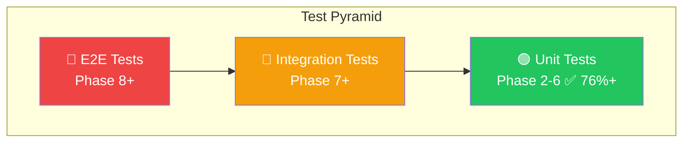
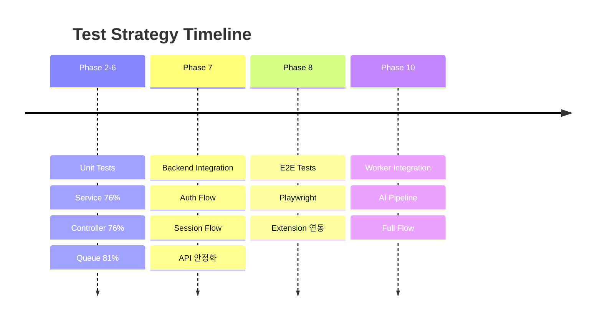

# Test Coverage Report

이 문서는 프로젝트의 테스트 커버리지를 추적합니다.

> **Last Updated**: 2026-01-02 (Phase 11 Dashboard 테스트 추가)

---

## Extension Coverage Summary (Phase 8 + 8.1)

### Test Files

| 파일 | 테스트 수 | 설명 |
| ---- | --------- | ---- |
| `auth-store.test.ts` | 3 | Auth Zustand store |
| `session-store.test.ts` | 10 | Session Zustand store |
| `settings-store.test.ts` | 6 | Settings Zustand store (Phase 8.1) |
| `events.test.ts` | 6 | Event queue logic |
| `api.test.ts` | 18 | API 클라이언트 (MSW 통합, Phase 8.1 +6) |
| `use-network-status.test.ts` | 7 | Network status hook (Phase 8.1) |
| **Total** | **50** | - |

### Test Coverage Details

#### Extension Stores

| Store | 테스트 항목 |
| ----- | ----------- |
| `useAuthStore` | 초기 상태, setAuth, logout |
| `useSessionStore` | 초기 상태, startSession, pauseSession, resumeSession, stopSession, incrementPageCount, incrementHighlightCount, updateElapsedTime, reset, setSessionTitle (Phase 8.1) |
| `useSettingsStore` | 초기 상태, updateSettings (단일/복수), developer 설정, resetSettings |

#### Extension API Client (Integration Tests with MSW)

| Endpoint | 테스트 항목 |
| -------- | ----------- |
| `login` | 성공, 잘못된 자격 증명 |
| `startSession` | 성공, 인증 없음 |
| `pauseSession` | 성공, 세션 없음 |
| `resumeSession` | 성공, 세션 없음 |
| `stopSession` | 성공, 세션 없음 |
| `sendEvents` | 성공, 인증 없음 |
| `getSessions` | 성공, limit 파라미터, 인증 없음 (Phase 8.1) |
| `updateSession` | 성공, 세션 없음, 인증 없음 (Phase 8.1) |

#### Event Queue Logic

| 테스트 항목 |
| ----------- |
| 이벤트 배치 처리 (10개 단위) |
| 빈 이벤트 리스트 처리 |
| page_visit 이벤트 생성 |
| page_leave 이벤트 생성 |
| highlight 이벤트 생성 |
| scroll 이벤트 생성 |

#### Phase 8.1 Components (TODO)

| 컴포넌트 | 테스트 항목 | 상태 |
| -------- | ----------- | ---- |
| `SessionList` | 세션 목록 렌더링, 로딩 상태, 에러 상태, 세션 클릭 | ❌ 미작성 |
| `SessionTitleInput` | 편집 모드 전환, 저장, 취소, 키보드 이벤트 | ❌ 미작성 |
| `DashboardLink` | 클릭 시 새 탭 열기 | ❌ 미작성 |
| `NetworkBanner` | 오프라인/온라인 상태 표시 | ❌ 미작성 |
| `Settings` | 설정 저장/불러오기, 초기화 | ❌ 미작성 |

#### Phase 8.1 Hooks

| Hook | 테스트 항목 |
| ---- | ----------- |
| `useNetworkStatus` | 초기 상태, offline 전환, online 복귀, wasOffline 3초 후 리셋, 이미 online일 때 wasOffline 미설정, 이벤트 리스너 정리 |

### Extension Test Infrastructure

| 파일 | 설명 |
| ---- | ---- |
| `vitest.config.ts` | Vitest 설정 (happy-dom, 경로 alias) |
| `src/test/setup.ts` | 테스트 셋업 (MSW, Chrome API mock) |
| `src/test/mocks/handlers.ts` | MSW API 핸들러 (auth, sessions, events) |
| `src/test/mocks/server.ts` | MSW 서버 설정 |

### Test Commands

```bash
# 테스트 실행
moonx extension:test

# Watch 모드
pnpm test:watch
```

---

## Frontend Coverage Summary (Phase 7 + 11)

### Test Files

| 파일 | 테스트 수 | 설명 | Phase |
| ---- | --------- | ---- | ----- |
| `auth-store.test.ts` | 7 | Auth Zustand store | Phase 7 |
| `use-sessions.test.ts` | 11 | Session hooks (React Query) | Phase 7 |
| `auth.test.ts` | 6 | Auth API 클라이언트 | Phase 7 |
| `sessions.test.ts` | 6 | Sessions API 클라이언트 | Phase 7 |
| `login-form.test.tsx` | 5 | 로그인 폼 컴포넌트 | Phase 7 |
| `signup-form.test.tsx` | 5 | 회원가입 폼 컴포넌트 | Phase 7 |
| `session-card.test.tsx` | 11 | 세션 카드 컴포넌트 | Phase 7 |
| `session-list.test.tsx` | 6 | 세션 목록 컴포넌트 | Phase 7 |
| `use-subscription.test.ts` | 5 | Subscription hooks (React Query) | Phase 11 |
| `use-usage.test.ts` | 7 | Usage hooks (React Query) | Phase 11 |
| `use-mindmap.test.ts` | 11 | Mindmap hooks (React Query) | Phase 11 |
| `use-mindmap-interaction.test.ts` | 22 | Mindmap interaction hook | Phase 11 |
| `SubscriptionCard.test.tsx` | 9 | 구독 카드 컴포넌트 | Phase 11 |
| `UsageCard.test.tsx` | 12 | 사용량 카드 컴포넌트 | Phase 11 |
| `HeaderUsageBadge.test.tsx` | 6 | 헤더 사용량 배지 컴포넌트 | Phase 11 |
| **Total** | **136** | - | - |

### Test Coverage Details

#### Stores

| Store | 테스트 항목 |
| ----- | ----------- |
| `useAuthStore` | 초기 상태, setAuth, setTokens, logout |

#### Hooks

| Hook | 테스트 항목 | Phase |
| ---- | ----------- | ----- |
| `sessionKeys` | 쿼리 키 생성 (all, lists, list, detail, events, stats) | Phase 7 |
| `useSessions` | 세션 목록 fetch, 페이지네이션 | Phase 7 |
| `useSession` | 단일 세션 fetch, empty id 처리 | Phase 7 |
| `usePlans` | 구독 플랜 목록 fetch | Phase 11 |
| `useSubscription` | 사용자 구독 정보 fetch, 에러 처리 | Phase 11 |
| `useUsage` | 사용량 데이터 fetch, 에러 처리, 캐싱 | Phase 11 |
| `useUsageHistory` | 사용량 히스토리 fetch (TODO - 아직 핸들러 없음) | Phase 11 |
| `mindmapKeys` | 쿼리 키 생성 | Phase 11 |
| `useMindmap` | Mindmap 데이터 fetch, 404 처리, no-mindmap 처리, 빈 sessionId 처리 | Phase 11 |
| `useGenerateMindmap` | Mindmap 생성, force 옵션, 캐시 업데이트, 에러 처리 | Phase 11 |
| `useMindmapInteraction` | 노드 선택/해제, 호버, 배경 클릭, idle 감지, 커스텀 딜레이 | Phase 11 |

#### API Clients

| Client | 테스트 항목 |
| ------ | ----------- |
| `authApi` | login 성공/실패, signup 성공/실패, me, logout |
| `sessionsApi` | list, get 성공/실패, delete 성공/실패 |

#### Auth Components

| 컴포넌트 | 테스트 항목 |
| -------- | ----------- |
| `LoginForm` | 렌더링, 빈 필드 검증, 짧은 비밀번호 검증, 성공 제출, 에러 클리어 |
| `SignupForm` | 렌더링, 짧은 비밀번호 검증, 비밀번호 불일치 검증, 성공 제출, 에러 클리어 |

#### Session Components

| 컴포넌트 | 테스트 항목 |
| -------- | ----------- |
| `SessionCard` | 렌더링, 상태별 배지(active/paused/completed), 날짜 포맷, 설명 표시/숨김, 링크 생성, 이벤트 수 표시 |
| `SessionList` | 로딩 상태, 세션 카드 렌더링, 빈 상태, 페이지네이션, 이전 버튼 클릭, 첫 페이지 비활성화 |

#### Account Components (Phase 11)

| 컴포넌트 | 테스트 항목 |
| -------- | ----------- |
| `SubscriptionCard` | 로딩 스켈레톤, 플랜명/상태 표시, 결제일 표시, 무료/유료 플랜 구분, Pro/Team 플랜 렌더링, 취소된 구독 처리 |
| `UsageCard` | 로딩 스켈레톤, 토큰 사용량 표시, 사용량 퍼센티지, 일반 상태 파란 아이콘, 80% 경고 배지/노란 아이콘, 100%+ 한도 초과 배지/빨간 배지, 무제한 사용 시 프로그레스 바 숨김, 숫자 포맷 (K/M) |
| `HeaderUsageBadge` | 로딩 시 hidden, 80% 미만 hidden, 80%+ 경고 표시, 100%+ 한도 초과 표시, 무제한 시 hidden |

#### Mindmap Interaction (Phase 11)

| 기능 | 테스트 항목 |
| ---- | ----------- |
| 초기 상태 | 선택/호버 노드 없음, isIdle true |
| 노드 클릭 | 노드 선택, 동일 노드 재클릭 해제, 다른 노드 클릭 시 전환, onNodeSelect 콜백 |
| 노드 호버 | 호버 상태 설정/해제 |
| 배경 클릭 | 선택 해제, onNodeSelect null 호출 |
| Idle 감지 | 기본 5초 후 idle, 커스텀 딜레이, 선택/호버 중 idle 아님, 새 인터랙션으로 타이머 리셋 |

### Test Infrastructure

| 파일 | 설명 |
| ---- | ---- |
| `vitest.config.ts` | Vitest 설정 (jsdom, 경로 alias) |
| `src/test/setup.ts` | 테스트 셋업 (MSW, Next.js mocks) |
| `src/test/mocks/handlers.ts` | MSW API 핸들러 (auth, sessions) |
| `src/test/mocks/server.ts` | MSW 서버 설정 |
| `src/test/utils.tsx` | 커스텀 render (QueryClientProvider) + 헬퍼 re-export |
| `src/test/helpers/auth.ts` | 인증 상태 preset 헬퍼 |
| `src/test/helpers/router.ts` | Next.js 라우터 mock 헬퍼 |

### Test Commands

```bash
# 테스트 실행
pnpm test

# Watch 모드
pnpm test:watch

# 커버리지 리포트
pnpm test:coverage
```

---

## Backend Coverage Summary

### Overall Coverage

| 범위 | 커버리지 |
| ---- | -------- |
| Internal 패키지 전체 | 30.6% |

> Note: Ent 생성 코드를 제외한 `internal/` 패키지만 측정

### Package-level Coverage

| 패키지 | 커버리지 | Phase |
| ------ | -------- | ----- |
| `internal/infrastructure/queue` | 81.4% | Phase 6 |
| `internal/service` | 58.4% | Phase 2-4, 10.1 |
| `internal/worker/handler` | 48.1% | Phase 6, 10.2 |
| `internal/controller` | 76.6% | Phase 2-4 |
| `internal/infrastructure/ai` | 5.3% | Phase 10 |
| `internal/infrastructure/config` | 0.0% | - |
| `internal/infrastructure/logger` | 0.0% | - |
| `internal/infrastructure/middleware` | 0.0% | - |
| `internal/controller/response` | 0.0% | - |

---

## Coverage by Phase

### Phase 2: Authentication

| 파일 | 함수 | 커버리지 |
| ---- | ---- | -------- |
| `service/auth_service.go` | `NewAuthService` | 100.0% |
| | `Signup` | 77.8% |
| | `Login` | 87.5% |
| | `GetUserByID` | 83.3% |
| | `GetUserByEmail` | 83.3% |
| | `generateSecureToken` | 75.0% |
| | `RequestPasswordReset` | 73.3% |
| | `ResetPassword` | 66.7% |
| `service/jwt_service.go` | `NewJWTService` | 100.0% |
| | `GenerateTokenPair` | 71.4% |
| | `GenerateAccessToken` | 75.0% |
| | `generateToken` | 100.0% |
| | `ValidateToken` | 77.8% |
| | `ValidateRefreshToken` | 83.3% |
| | `ValidateAccessToken` | 80.0% |
| `controller/auth_controller.go` | `NewAuthController` | 100.0% |
| | `RoutesSignup` | 69.2% |
| | `RoutesLogin` | 69.2% |
| | `RoutesRefresh` | 83.3% |
| | `RoutesMe` | 70.6% |
| | `RoutesLogout` | 91.7% |
| | `RoutesForgotPassword` | 87.5% |
| | `RoutesResetPassword` | 58.3% |

### Phase 2.1: Google OAuth

| 파일 | 함수 | 커버리지 |
| ---- | ---- | -------- |
| `service/oauth_service.go` | `NewOAuthService` | 100.0% |
| | `ValidateGoogleIDToken` | 100.0% |
| | `FindOrCreateGoogleUser` | 100.0% |
| `controller/oauth_controller.go` | `NewOAuthController` | 100.0% |
| | `RoutesGoogleAuth` | 100.0% |

#### OAuth Service Tests (`oauth_service_test.go`)

| 테스트 | 설명 |
| ------ | ---- |
| `TestOAuthService_FindOrCreateGoogleUser_NewUser` | 새 Google 사용자 생성 |
| `TestOAuthService_FindOrCreateGoogleUser_ExistingGoogleUser` | 기존 Google 사용자 재로그인 |
| `TestOAuthService_FindOrCreateGoogleUser_LinkToExistingEmailUser` | 이메일 사용자에 Google 연결 |
| `TestOAuthService_FindOrCreateGoogleUser_UpdatesAvatarOnRelogin` | 재로그인 시 아바타 업데이트 |
| `TestOAuthService_FindOrCreateGoogleUser_DifferentGoogleIDSameEmail_CreatesNewIfNoExisting` | 동일 이메일 다른 Google ID 처리 |
| `TestOAuthService_ValidateGoogleIDToken_InvalidToken` | 잘못된 토큰 검증 |
| `TestOAuthService_ValidateGoogleIDToken_EmptyToken` | 빈 토큰 검증 |

#### OAuth Controller Tests (`oauth_controller_test.go`)

| 테스트 | 설명 |
| ------ | ---- |
| `TestOAuthController_RoutesGoogleAuth_InvalidToken` | 잘못된/빈 토큰 401 응답 |
| `TestOAuthController_FindOrCreateGoogleUser_Integration` | 새 사용자 구독 생성, 중복 방지 |
| `TestOAuthController_GoogleUserProperties` | auth_provider, avatar_url 검증 |
| `TestOAuthController_LinkEmailAccount` | 이메일 계정에 Google 연결, 기존 비밀번호 유지 |

### Phase 3: Sessions

| 파일 | 함수 | 커버리지 |
| ---- | ---- | -------- |
| `service/session_service.go` | `NewSessionService` | 100.0% |
| | `activeSessions` | 100.0% |
| | `Start` | 100.0% |
| | `Pause` | 100.0% |
| | `Resume` | 83.3% |
| | `Stop` | 45.0% |
| | `Get` | 100.0% |
| | `GetWithDetails` | 88.9% |
| | `ListByUser` | 100.0% |
| | `Update` | 100.0% |
| | `Delete` | 100.0% |
| | `getOwnedSession` | 87.5% |
| `controller/session_controller.go` | `NewSessionController` | 100.0% |
| | `extractUserID` | 88.9% |
| | `RoutesStart` | 75.0% |
| | `RoutesList` | 88.2% |
| | `RoutesGet` | 100.0% |
| | `RoutesUpdate` | 90.0% |
| | `RoutesPause` | 90.0% |
| | `RoutesResume` | 90.0% |
| | `RoutesStop` | 90.0% |
| | `RoutesDelete` | 90.0% |
| | `mapSession` | 100.0% |

### Phase 4: Events

| 파일 | 함수 | 커버리지 |
| ---- | ---- | -------- |
| `service/event_service.go` | `NewEventService` | 100.0% |
| | `ProcessBatchEvents` | 84.6% |
| | `processEvent` | 70.0% |
| | `processPageVisit` | 66.7% |
| | `processHighlight` | 81.8% |
| | `ProcessBatchEventsFromJSON` | 0.0% |
| | `GetEventsBySession` | 71.4% |
| | `GetEventStats` | 69.2% |
| | `toJSON` | 75.0% |
| `service/url_service.go` | `NewURLService` | 100.0% |
| | `GetOrCreate` | 93.3% |
| | `GetByHash` | 100.0% |
| | `UpdateSummary` | 100.0% |
| | `GetURLsWithoutSummary` | 100.0% |
| | `normalizeURL` | 90.9% |
| | `hashURL` | 100.0% |
| `controller/event_controller.go` | `NewEventController` | 100.0% |
| | `extractUserID` | 100.0% |
| | `RoutesBatchEvents` | 84.6% |
| | `RoutesListEvents` | 90.5% |
| | `RoutesGetEventStats` | 78.9% |
| | `ptrToString` | 100.0% |
| | `getStringFromPayload` | 100.0% |

### Phase 6: Worker & Queue

| 파일 | 함수 | 커버리지 |
| ---- | ---- | -------- |
| `queue/client.go` | `NewClient` | 100.0% |
| | `Enqueue` | 100.0% |
| | `Close` | 100.0% |
| `queue/server.go` | `NewServer` | 85.7% |
| | `HandleFunc` | 100.0% |
| | `Run` | 100.0% |
| | `Shutdown` | 100.0% |
| `queue/scheduler.go` | `NewScheduler` | 100.0% |
| | `RegisterPeriodicTasks` | 75.0% |
| | `Run` | 0.0% |
| | `Shutdown` | 100.0% |
| `queue/tasks.go` | `NewSessionProcessTask` | 75.0% |
| | `NewSessionCleanupTask` | 75.0% |
| | `NewURLSummarizeTask` | 75.0% |
| | `NewMindmapGenerateTask` | 75.0% |
| `handler/session.go` | `HandleSessionProcess` | 88.9% |
| `handler/cleanup.go` | `HandleSessionCleanup` | 85.7% |

### Phase 9: Plan & Usage (NEW)

> **Note**: Phase 9 서비스는 API 엔드포인트까지 구현되었으나, 단위 테스트는 아직 미작성 상태입니다.
> Phase 문서에 따라 향후 테스트 작성이 필요합니다.

| 파일 | 함수 | 커버리지 | 비고 |
| ---- | ---- | -------- | ---- |
| `service/subscription_service.go` | `NewSubscriptionService` | 0.0% | 테스트 미작성 |
| | `GetSubscription` | 0.0% | 테스트 미작성 |
| | `GetAvailablePlans` | 0.0% | 테스트 미작성 |
| | `CreateFreeSubscription` | 0.0% | 테스트 미작성 |
| | `GetUserPlan` | 0.0% | 테스트 미작성 |
| | `HasFeature` | 0.0% | 테스트 미작성 |
| | `GetSubscriptionInfo` | 0.0% | 테스트 미작성 |
| | `planToInfo` | 0.0% | 테스트 미작성 |
| `service/usage_service.go` | `NewUsageService` | 0.0% | 테스트 미작성 |
| | `RecordUsage` | 0.0% | 테스트 미작성 |
| | `CheckLimit` | 0.0% | 테스트 미작성 |
| | `GetCurrentUsage` | 0.0% | 테스트 미작성 |
| | `GetUsageHistory` | 0.0% | 테스트 미작성 |
| | `getCurrentPeriodStart` | 0.0% | 테스트 미작성 |
| | `calculatePeriodStartForDate` | 0.0% | 테스트 미작성 |
| | `calculateFreePlanPeriodStart` | 0.0% | 테스트 미작성 |
| `controller/subscription_controller.go` | `NewSubscriptionController` | 0.0% | 테스트 미작성 |
| | `SubscriptionRoutesGetSubscription` | 0.0% | 테스트 미작성 |
| | `SubscriptionRoutesListPlans` | 0.0% | 테스트 미작성 |
| `controller/usage_controller.go` | `NewUsageController` | 0.0% | 테스트 미작성 |
| | `UsageRoutesGetUsage` | 0.0% | 테스트 미작성 |
| | `UsageRoutesGetUsageHistory` | 0.0% | 테스트 미작성 |

**향후 테스트 계획:**

- `service/subscription_service_test.go`: 구독 서비스 단위 테스트
- `service/usage_service_test.go`: 사용량 서비스 단위 테스트
- `controller/subscription_controller_test.go`: 구독 API 통합 테스트
- `controller/usage_controller_test.go`: 사용량 API 통합 테스트

### Phase 10: AI Provider Infrastructure

| 파일 | 함수 | 커버리지 | 비고 |
| ---- | ---- | -------- | ---- |
| `infrastructure/ai/provider.go` | `validateJSONResponse` | 100.0% | JSON 검증 테스트 |
| | `buildMessages` | 100.0% | 메시지 빌드 테스트 |
| | `BaseProvider.Type` | 100.0% | Provider 타입 반환 |
| | `BaseProvider.Model` | 100.0% | 모델명 반환 |
| | `BaseProvider.Close` | 100.0% | 리소스 정리 |
| | `DefaultChatOptions` | 100.0% | 기본 옵션 |
| `infrastructure/ai/openai.go` | `NewOpenAIProvider` | 0.0% | API 키 필요 |
| | `Chat` | 0.0% | 실제 API 호출 |
| `infrastructure/ai/gemini.go` | `NewGeminiProvider` | 0.0% | API 키 필요 |
| | `Chat` | 0.0% | 실제 API 호출 |
| `infrastructure/ai/claude.go` | `NewClaudeProvider` | 0.0% | API 키 필요 |
| | `Chat` | 0.0% | 실제 API 호출 |

#### AI Provider Tests (`provider_test.go`)

| 테스트 | 설명 |
| ------ | ---- |
| `TestValidateJSONResponse_ValidJSON` | valid JSON object, array, nested JSON, invalid JSON 처리 |
| `TestBuildMessages` | system/user prompt 조합, 기존 messages 포함, empty request 처리 |
| `TestBaseProvider_Type` | Provider 타입 반환 검증 |
| `TestBaseProvider_Model` | 모델명 반환 검증 |
| `TestBaseProvider_Close` | Close 에러 없음 검증 |
| `TestDefaultChatOptions` | 기본 옵션값 검증 (Temperature, MaxTokens, TopP) |
| `TestProviderType_Constants` | ProviderOpenAI, ProviderGemini, ProviderClaude 상수 검증 |
| `TestDefaultModels` | DefaultOpenAIModel, DefaultGeminiModel, DefaultClaudeModel 상수 검증 |
| `TestTaskType_Constants` | TaskTagExtraction, TaskMindmap, TaskGeneral 상수 검증 |
| `TestRole_Constants` | RoleSystem, RoleUser, RoleAssistant 상수 검증 |

### Phase 10.1: AI Settings & Logging

| 파일 | 함수 | 커버리지 | 비고 |
| ---- | ---- | -------- | ---- |
| `service/aiconfig_service.go` | `NewAIConfigService` | 100.0% | 서비스 생성 |
| | `GetConfigForTask` | 100.0% | 태스크별 설정 조회 (캐싱 포함) |
| | `GetAll` | 100.0% | 전체 설정 조회 |
| | `Upsert` | 100.0% | 설정 생성/수정 |
| | `Delete` | 100.0% | 설정 삭제 |
| | `InvalidateCache` | 100.0% | 캐시 무효화 |
| | `SeedDefaultConfigs` | 100.0% | 기본 설정 시드 |
| `service/ailog_service.go` | `NewAILogService` | 100.0% | 서비스 생성 |
| | `Log` | 100.0% | AI 요청 로깅 |
| | `GetBySession` | 100.0% | 세션별 로그 조회 |
| | `GetUsageStats` | 100.0% | 사용량 통계 조회 |
| | `estimateCost` | 100.0% | 비용 추정 |

#### AIConfigService Tests (`aiconfig_service_test.go`)

| 테스트 | 설명 |
| ------ | ---- |
| `TestAIConfigService_GetConfigForTask` | 특정 태스크 설정 조회 |
| `TestAIConfigService_GetConfigForTask_FallbackToDefault` | 설정 없을 때 default 폴백 |
| `TestAIConfigService_GetConfigForTask_Caching` | 캐시 히트 검증 |
| `TestAIConfigService_InvalidateCache` | 캐시 무효화 검증 |
| `TestAIConfigService_Upsert_Create` | 새 설정 생성 (fallback providers, thinking budget 포함) |
| `TestAIConfigService_Upsert_Update` | 기존 설정 업데이트 |
| `TestAIConfigService_Delete` | 설정 삭제 |
| `TestAIConfigService_GetAll` | 전체 설정 조회 |
| `TestAIConfigService_SeedDefaultConfigs` | 기본 설정 시드 (중복 방지 포함) |

#### AILogService Tests (`ailog_service_test.go`)

| 테스트 | 설명 |
| ------ | ---- |
| `TestAILogService_Log_Success` | 성공 응답 로깅 (토큰, 비용 계산) |
| `TestAILogService_Log_Error` | 에러 응답 로깅 |
| `TestAILogService_Log_WithThinkingTokens` | Thinking 토큰 포함 로깅 |
| `TestAILogService_GetBySession` | 세션별 로그 조회 |
| `TestAILogService_GetUsageStats` | Provider별 사용량 통계 조회 |
| `TestAILogService_EstimateCost` | 비용 추정 (OpenAI, Gemini, Claude) |

### Phase 10.2: Mindmap Generation

| 파일 | 함수 | 커버리지 | 비고 |
| ---- | ---- | -------- | ---- |
| `worker/handler/mindmap.go` | `HandleMindmapGenerate` | 60.0% | AI Manager 없이 테스트 가능 부분 |
| | `buildMindmapFromRelationship` | 100.0% | Mindmap 빌드 로직 |
| | `getTopicColor` | 100.0% | 토픽 색상 |
| `worker/handler/tag_extraction.go` | `HandleURLTagExtraction` | 40.0% | AI Manager 없이 테스트 가능 부분 |
| | `truncateContent` | 100.0% | 콘텐츠 자르기 |
| `service/mindmap_types.go` | `ConvertNodesToMaps` | 100.0% | 노드 맵 변환 |
| | `ConvertEdgesToMaps` | 100.0% | 엣지 맵 변환 |
| | `ConvertLayoutToMap` | 100.0% | 레이아웃 맵 변환 |

#### Mindmap Handler Tests (`mindmap_test.go`)

| 테스트 | 설명 |
| ------ | ---- |
| `TestHandleMindmapGenerate_NoAIManager` | AI Manager 없을 때 스킵 |
| `TestHandleMindmapGenerate_InvalidPayload` | 잘못된 JSON payload |
| `TestHandleMindmapGenerate_InvalidSessionID` | 잘못된 UUID 형식 |
| `TestHandleMindmapGenerate_SessionNotFound` | 세션 미존재 (스킵 - AI mock 필요) |
| `TestHandleMindmapGenerate_WithSession` | 실제 세션으로 테스트 (AI 없이) |
| `TestBuildMindmapFromRelationship` | Mindmap 빌드: core node, topics, edges, layout |
| `TestBuildMindmapFromRelationship_EmptyTopics` | 빈 토픽일 때 core node만 생성 |
| `TestGetTopicColor` | 색상 순환 (8개 색상) |
| `TestMindmapNodePositioning` | 노드 포지셔닝 (core 중심, topic 반경 200) |
| `TestConversionFunctions` | 노드/엣지/레이아웃 맵 변환 |

#### Tag Extraction Handler Tests (`tag_extraction_test.go`)

| 테스트 | 설명 |
| ------ | ---- |
| `TestHandleURLTagExtraction_NoAIManager` | AI Manager 없을 때 스킵 |
| `TestHandleURLTagExtraction_InvalidPayload` | 잘못된 JSON payload |
| `TestHandleURLTagExtraction_InvalidUUID` | 잘못된 UUID 형식 |
| `TestHandleURLTagExtraction_URLNotFound` | URL 미존재 (스킵 - AI mock 필요) |
| `TestTruncateContent` | 콘텐츠 truncate (짧은/동일/긴/빈 콘텐츠) |

#### Mindmap Types Tests (`mindmap_types_test.go`)

| 테스트 | 설명 |
| ------ | ---- |
| `TestConvertNodesToMaps` | 노드 슬라이스 → map 변환 |
| `TestConvertEdgesToMaps` | 엣지 슬라이스 → map 변환 |
| `TestConvertLayoutToMap` | 레이아웃 구조체 → map 변환 |

### AI Integration Tests (Build Tag: `integration`)

실제 AI API를 호출하는 통합 테스트입니다. 비용 통제를 위해 별도 빌드 태그로 분리되어 있습니다.

**실행 방법:**

```bash
# AI 통합 테스트 실행 (API 키 필요)
cd apps/backend
go test ./internal/infrastructure/ai/... -tags=integration -v

# 일반 테스트만 실행 (API 호출 없음)
go test ./internal/infrastructure/ai/...
```

**환경 변수:**

테스트는 프로젝트 루트의 `.env` 파일에서 자동으로 API 키를 로드합니다.

| 환경 변수 | 필수 | 설명 |
| --------- | ---- | ---- |
| `GEMINI_API_KEY` | 권장 | Google Gemini API 키 |
| `OPENAI_API_KEY` | 선택 | OpenAI API 키 |
| `ANTHROPIC_API_KEY` | 선택 | Anthropic Claude API 키 |

#### Gemini Integration Tests (`provider_integration_test.go`)

| 테스트 | 설명 |
| ------ | ---- |
| `TestGeminiProvider_Integration_Chat` | 기본 채팅, 시스템 프롬프트, JSON 모드 |
| `TestGeminiProvider_Integration_TagExtraction` | 태그 추출 시뮬레이션 |
| `TestGeminiProvider_Integration_MindmapGeneration` | 마인드맵 생성 시뮬레이션 |
| `TestGeminiProvider_Integration_IsHealthy` | 헬스 체크 |
| `TestGeminiProvider_Integration_Stream` | 스트리밍 응답 |

#### OpenAI/Claude Integration Tests (선택적)

| 테스트 | 설명 |
| ------ | ---- |
| `TestOpenAIProvider_Integration_Chat` | OpenAI 기본 채팅 (gpt-4o-mini) |
| `TestClaudeProvider_Integration_Chat` | Claude 기본 채팅 (claude-3-haiku) |

---

## 미테스트 영역 (0% Coverage)

### Infrastructure

| 파일 | 비고 |
| ---- | ---- |
| `config/config.go` | 환경 변수 로드, 테스트 불필요 |
| `logger/logger.go` | 로거 초기화, 테스트 불필요 |
| `middleware/*.go` | 통합 테스트에서 간접 검증 |
| `controller/response/*.go` | 에러 응답 헬퍼, 간접 검증 |
| `controller/handler.go` | 라우터 바인딩, 통합 테스트에서 검증 |

### 향후 테스트 필요

| 파일 | 함수 | 우선순위 |
| ---- | ---- | -------- |
| `session_service.go` | `Stop` (queue 통합) | Medium |
| `event_service.go` | `ProcessBatchEventsFromJSON` | Low |
| `jwt_service.go` | `IsTestToken` | Low |

---

## Backend Test Files

| 위치 | 설명 | Phase |
| ---- | ---- | ----- |
| `internal/controller/auth_controller_test.go` | Auth API 테스트 | Phase 2 |
| `internal/controller/oauth_controller_test.go` | Google OAuth API 테스트 | Phase 2.1 |
| `internal/controller/session_controller_test.go` | Session API 테스트 | Phase 3 |
| `internal/controller/event_controller_test.go` | Event API 테스트 | Phase 4 |
| `internal/controller/subscription_controller_test.go` | Subscription API 테스트 | Phase 9 (TODO) |
| `internal/controller/usage_controller_test.go` | Usage API 테스트 | Phase 9 (TODO) |
| `internal/service/auth_service_test.go` | Auth 서비스 테스트 | Phase 2 |
| `internal/service/oauth_service_test.go` | Google OAuth 서비스 테스트 | Phase 2.1 |
| `internal/service/session_service_test.go` | Session 서비스 테스트 | Phase 3 |
| `internal/service/event_service_test.go` | Event 서비스 테스트 | Phase 4 |
| `internal/service/url_service_test.go` | URL 서비스 테스트 | Phase 4 |
| `internal/service/jwt_service_test.go` | JWT 서비스 테스트 | Phase 2 |
| `internal/service/subscription_service_test.go` | Subscription 서비스 테스트 | Phase 9 (TODO) |
| `internal/service/usage_service_test.go` | Usage 서비스 테스트 | Phase 9 (TODO) |
| `internal/service/aiconfig_service_test.go` | AI Config 서비스 테스트 | Phase 10.1 |
| `internal/service/ailog_service_test.go` | AI Log 서비스 테스트 | Phase 10.1 |
| `internal/service/mindmap_types_test.go` | Mindmap 타입 변환 테스트 | Phase 10.2 |
| `internal/infrastructure/ai/provider_test.go` | AI Provider 테스트 | Phase 10 |
| `internal/infrastructure/ai/provider_integration_test.go` | AI 통합 테스트 (build tag: integration) | Phase 10 |
| `internal/infrastructure/queue/*_test.go` | Queue 테스트 | Phase 6 |
| `internal/worker/handler/handler_test.go` | Worker 핸들러 테스트 | Phase 6 |
| `internal/worker/handler/mindmap_test.go` | Mindmap 핸들러 테스트 | Phase 10.2 |
| `internal/worker/handler/tag_extraction_test.go` | Tag Extraction 핸들러 테스트 | Phase 10.2 |

---

## How to Measure Coverage

### Full Coverage (including generated code)

```bash
cd apps/backend
go test ./... -coverprofile=coverage.out
go tool cover -func=coverage.out | grep total
```

### Internal Packages Only (recommended)

```bash
cd apps/backend
go test ./internal/... -coverprofile=coverage.out
go tool cover -func=coverage.out | grep total
```

### HTML Report

```bash
cd apps/backend
go test ./internal/... -coverprofile=coverage.out
go tool cover -html=coverage.out -o coverage.html
open coverage.html
```

### Specific Package

```bash
# Queue 패키지만
go test ./internal/infrastructure/queue/... -cover

# Handler 패키지만
go test ./internal/worker/handler/... -cover

# Service 패키지만
go test ./internal/service/... -cover
```

### Function-level Coverage

```bash
go test ./internal/... -coverprofile=coverage.out
go tool cover -func=coverage.out | grep "service/"
```

---

## Coverage Goals

| 영역 | 목표 | 현재 | 상태 |
| ---- | ---- | ---- | ---- |
| Core Services | 60%+ | 76.0% | ✅ |
| Controllers | 50%+ | 76.6% | ✅ |
| New Code (Phase 6+) | 80%+ | 80%+ | ✅ |
| Event Controller | 50%+ | 84.6% | ✅ |
| URL Service | 80%+ | 100.0% | ✅ |

### Guidelines

1. **새로 추가되는 코드**는 80% 이상 커버리지 목표
2. **Critical path** (인증, 결제)는 90% 이상 권장
3. **Generated code** (Ent)는 커버리지 측정에서 제외
4. **Integration tests**는 외부 의존성(Redis, DB)이 필요하므로 CI에서 별도 실행
5. **Config/Logger**는 환경 의존적이므로 테스트 제외 가능

---

## CI Integration

```yaml
# .github/workflows/test.yml (예시)
- name: Run tests with coverage
  run: |
    cd apps/backend
    go test ./internal/... -coverprofile=coverage.out -covermode=atomic

- name: Upload coverage
  uses: codecov/codecov-action@v3
  with:
    files: ./apps/backend/coverage.out
```

---

## Integration & E2E Test Strategy

### 테스트 피라미드





### 도입 시점

| 테스트 유형 | 도입 시점 | 트리거 조건 |
| ------------ | ---------- | ------------ |
| **Unit Tests** | Phase 2-6 | ✅ 완료 |
| **Backend Integration** | Phase 7 이후 | Web App 완성, API 안정화 |
| **E2E (Playwright)** | Phase 8 이후 | Extension 완성, 전체 플로우 구현 |
| **Worker Integration** | Phase 10 이후 | AI 연동 완료, 파이프라인 검증 필요 |

### 왜 지금이 아닌가?

1. **API 스펙 변경 가능성**: Phase 7-8에서 프론트엔드 요구사항에 따라 API 변경 가능
2. **유지보수 비용**: Integration test는 변경에 취약 - 안정화 전 작성 시 지속적 수정 필요
3. **현재 Unit Test 충분**: 76%+ 커버리지로 핵심 비즈니스 로직 검증 완료
4. **외부 의존성**: Redis, PostgreSQL 연동 테스트는 CI 환경 구성 필요

### Integration Test 계획 (Phase 7+)

```text
tests/integration/
├── auth_flow_test.go      # 회원가입 → 로그인 → 토큰 갱신 → 로그아웃
├── session_flow_test.go   # 세션 시작 → 이벤트 수집 → 종료 → Worker 처리
└── worker_flow_test.go    # Queue Enqueue → Worker 처리 → DB 업데이트
```

**필요 인프라:**

- Docker Compose (PostgreSQL + Redis)
- Test fixtures (seed data)
- CI workflow 수정

### E2E Test 계획 (Phase 8+)

```text
tests/e2e/
├── auth.spec.ts           # 로그인/회원가입 UI 플로우
├── dashboard.spec.ts      # 대시보드 세션 목록/상세
├── extension.spec.ts      # Extension ↔ Web 연동
└── mindmap.spec.ts        # 마인드맵 생성/조회
```

**도구:**

- Playwright (크로스 브라우저)
- Chrome Extension testing
- Visual regression (optional)

### 현재 미테스트 영역 분석

| 함수 | 커버리지 | 테스트 방법 | 우선순위 |
| ------ | ---------- | ------------ | ---------- |
| `Session.Stop` (queue) | 45% | Integration Test (Redis) | Phase 7 |
| `ProcessBatchEventsFromJSON` | 0% | Unit Test 가능 | Low |
| `scheduler.Run` | 0% | Skip (blocking operation) | N/A |
| `middleware/*.go` | 0% | Integration Test | Phase 7 |

### Integration Test 환경 (예정)

```yaml
# docker-compose.test.yml
services:
  postgres:
    image: postgres:16-alpine
    environment:
      POSTGRES_DB: mindhit_test
      POSTGRES_USER: test
      POSTGRES_PASSWORD: test

  redis:
    image: redis:7-alpine
```

```bash
# 실행 명령 (Phase 7 이후)
docker-compose -f docker-compose.test.yml up -d
go test ./tests/integration/... -tags=integration
```

---

## History

| 날짜 | Phase | 변경사항 |
| ---- | ----- | -------- |
| 2026-01-02 | Phase 11 | Frontend Dashboard 테스트 추가: use-subscription (5개), use-usage (7개), use-mindmap (11개), use-mindmap-interaction (22개), SubscriptionCard (9개), UsageCard (12개), HeaderUsageBadge (6개) → 총 136개 테스트 |
| 2025-12-31 | Phase 8.1 | Extension 테스트 확장: settings-store (6개), api getSessions/updateSession (6개), useNetworkStatus (7개) 추가 → 총 50개 테스트 |
| 2025-12-31 | Phase 10 | AI 통합 테스트 추가: provider_integration_test.go (7개, build tag: integration), godotenv로 .env 자동 로드 |
| 2025-12-31 | Phase 10-10.2 | AI 테스트 추가: provider_test.go (10개), aiconfig_service_test.go (9개), ailog_service_test.go (6개), mindmap_test.go (10개), tag_extraction_test.go (5개), mindmap_types_test.go (3개) |
| 2025-12-28 | Phase 2.1 | Google OAuth 테스트 추가 (oauth_service_test.go 7개, oauth_controller_test.go 8개) |
| 2025-12-28 | Phase 9 | Plan & Usage 서비스/컨트롤러 추가 (테스트 미작성, 향후 작성 예정) |
| 2025-12-28 | - | url_service.go 버그 수정: GetURLsWithoutSummary에 빈 content 제외 조건 추가 |
| 2025-12-28 | Phase 8 | Extension 테스트 추가: API 통합 테스트 (MSW), stores, events (31개 테스트) |
| 2025-12-27 | Phase 7 | Frontend 테스트 확장: stores, hooks, API 테스트 추가 (57개 테스트) |
| 2025-12-26 | - | 테스트 커버리지 개선: Service 76.0%, Controller 76.6% |
| 2025-12-26 | Phase 6 | Queue 81.4%, Handler 80.0% 달성 |
| 2025-12-26 | Phase 2-4 | 상세 함수별 커버리지 문서화 |
