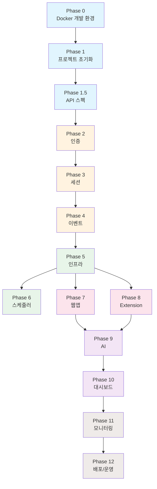

# MindHit 개발 Phase 가이드

## 개요

이 디렉토리는 MindHit 프로젝트의 개발 단계를 Phase별로 구분하여 관리합니다.
각 Phase는 독립적인 문서로 구성되어 있으며, 체크리스트를 통해 진행 상황을 추적할 수 있습니다.

## Phase 구조

```
phases/
├── README.md                    # 이 파일 (개요)
├── phase-0-dev-environment.md   # Docker 개발 환경
├── phase-1-project-init.md      # 프로젝트 초기화
├── phase-1.5-api-spec.md        # API 스펙 공통화
├── phase-2-auth.md              # 인증 시스템
├── phase-3-sessions.md          # 세션 관리 API
├── phase-4-events.md            # 이벤트 수집 API
├── phase-5-infra.md             # 모니터링 및 인프라
├── phase-6-scheduler.md         # 스케줄러 및 백그라운드
├── phase-7-webapp.md            # Next.js 웹앱
├── phase-8-extension.md         # Chrome Extension
├── phase-9-ai.md                # AI 마인드맵 생성
├── phase-10-dashboard.md        # 웹앱 대시보드
├── phase-11-monitoring.md       # 모니터링 시스템
└── phase-12-deployment.md       # 배포 및 운영
```

---

## 전체 진행 상황

| Phase | 이름 | 상태 | 예상 Step 수 |
|-------|------|------|-------------|
| 0 | [Moon + Docker 개발 환경](./phase-0-dev-environment.md) | ⬜ 대기 | 4 steps |
| 1 | [프로젝트 초기화](./phase-1-project-init.md) | ⬜ 대기 | 9 steps |
| 1.5 | [API 스펙 공통화](./phase-1.5-api-spec.md) | ⬜ 대기 | 5 steps |
| 2 | [인증 시스템](./phase-2-auth.md) | ⬜ 대기 | 5 steps |
| 3 | [세션 관리 API](./phase-3-sessions.md) | ⬜ 대기 | 3 steps |
| 4 | [이벤트 수집 API](./phase-4-events.md) | ⬜ 대기 | 3 steps |
| 5 | [모니터링 및 인프라](./phase-5-infra.md) | ⬜ 대기 | 3 steps |
| 6 | [스케줄러](./phase-6-scheduler.md) | ⬜ 대기 | 2 steps |
| 7 | [Next.js 웹앱](./phase-7-webapp.md) | ⬜ 대기 | 4 steps |
| 8 | [Chrome Extension](./phase-8-extension.md) | ⬜ 대기 | 5 steps |
| 9 | [AI 마인드맵](./phase-9-ai.md) | ⬜ 대기 | 4 steps |
| 10 | [웹앱 대시보드](./phase-10-dashboard.md) | ⬜ 대기 | 4 steps |
| 11 | [모니터링 시스템](./phase-11-monitoring.md) | ⬜ 대기 | 4 steps |
| 12 | [배포 및 운영](./phase-12-deployment.md) | ⬜ 대기 | 4 steps |

**상태 범례:**
- ⬜ 대기
- 🟡 진행 중
- ✅ 완료

---

## 의존성 그래프



---

## 사용 방법

### 1. Phase 문서 열기
각 Phase 문서에는 다음이 포함되어 있습니다:
- **목표**: 이 Phase에서 달성해야 할 것
- **선행 조건**: 시작하기 전에 완료되어야 할 Phase
- **Step별 상세 가이드**: 각 Step의 작업 내용과 체크리스트
- **결과물**: 완료 시 확인해야 할 산출물
- **검증 방법**: Phase 완료를 확인하는 테스트/명령어

### 2. 체크리스트 사용
각 Step에는 세부 체크리스트가 있습니다:
```markdown
- [ ] 작업 항목 1
- [ ] 작업 항목 2
  - [ ] 세부 작업 2.1
  - [ ] 세부 작업 2.2
```

작업 완료 시 `[x]`로 변경하세요:
```markdown
- [x] 작업 항목 1
- [ ] 작업 항목 2
```

### 3. 관련 문서 참조
각 Phase는 상세 기술 문서를 참조합니다:
- [01-architecture.md](../01-architecture.md) - 시스템 아키텍처
- [02-database.md](../02-database.md) - 데이터베이스 설계
- [07-api-spec-workflow.md](../07-api-spec-workflow.md) - API 스펙 워크플로우

---

## 권장 작업 순서

### 개발 환경 설정
0. Phase 0 (Docker 개발 환경)

### MVP (최소 기능 제품)
1. Phase 1 → Phase 1.5 → Phase 2 → Phase 3
2. Phase 8 (Extension 기본)
3. Phase 4
4. **MVP 완료**: 브라우징 기록 수집 가능

### Core Features
5. Phase 5 → Phase 6
6. Phase 9 (AI)
7. Phase 7 (웹앱 기본)
8. **Core 완료**: 마인드맵 생성 가능

### Polish
9. Phase 10 (대시보드)
10. 각 Phase의 선택적 개선 사항

### 프로덕션 준비
11. Phase 11 (모니터링)
12. Phase 12 (배포/운영)

---

## 팁

### Claude Code와 함께 작업하기
```
"Phase 1의 Step 1.1을 시작해줘"
"Phase 2 체크리스트 상태를 업데이트해줘"
"Phase 3의 결과물을 검증해줘"
```

### Git 브랜치 전략
```bash
# Phase별 브랜치
git checkout -b feature/phase-1-init
git checkout -b feature/phase-2-auth

# Step별 커밋
git commit -m "Phase 1.1: 모노레포 구조 설정"
git commit -m "Phase 1.2: Go 백엔드 초기화"
```
