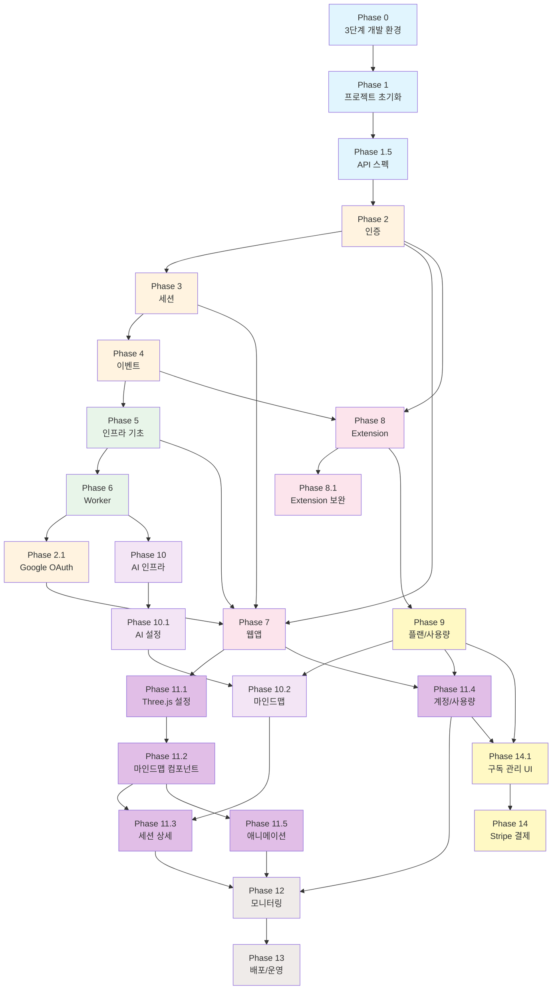

# MindHit 개발 Phase 가이드

## 개요

이 디렉토리는 MindHit 프로젝트의 개발 단계를 Phase별로 구분하여 관리합니다.
각 Phase는 독립적인 문서로 구성되어 있으며, 체크리스트를 통해 진행 상황을 추적할 수 있습니다.

## Phase 구조

```
phases/
├── README.md                    # 이 파일 (개요)
├── phase-0-dev-environment.md   # Docker 개발 환경
├── phase-1-project-init.md      # 프로젝트 초기화
├── phase-1.5-api-spec.md        # API 스펙 공통화
├── phase-2-auth.md              # 인증 시스템
├── phase-2.1-oauth.md           # Google OAuth
├── phase-3-sessions.md          # 세션 관리 API
├── phase-4-events.md            # 이벤트 수집 API
├── phase-5-infra.md             # 모니터링 및 인프라 (기초)
├── phase-6-worker.md            # Worker 및 Job Queue
├── phase-7-webapp.md            # Next.js 웹앱
├── phase-8-extension.md         # Chrome Extension
├── phase-8.1-extension-enhancement.md  # Extension 기능 보완
├── phase-9-plan-usage.md        # 플랜 및 사용량 시스템
├── phase-10-ai.md               # AI Provider 인프라
├── phase-10.1-ai-config.md      # AI 설정 및 로깅
├── phase-10.2-mindmap.md        # 마인드맵 생성
├── phase-11-dashboard.md        # 웹앱 대시보드 (레거시, 참고용)
├── phase-11.1-threejs-setup.md  # React Three Fiber 설정
├── phase-11.2-mindmap-components.md  # 3D 마인드맵 컴포넌트
├── phase-11.3-session-detail.md # 세션 상세 페이지 개선
├── phase-11.4-account-usage.md  # 계정 및 사용량 페이지
├── phase-11.5-animation.md      # 애니메이션 및 인터랙션
├── phase-12-monitoring.md       # 프로덕션 모니터링
├── phase-13-deployment.md       # 배포 및 운영
├── phase-14.1-subscription-ui.md # 구독 관리 UI (Stripe 없이)
└── phase-14-billing.md          # Stripe 결제 연동
```

---

## 전체 진행 상황

| Phase | 이름 | 상태 | 예상 Step 수 |
|-------|------|------|-------------|
| 0 | [3단계 개발 환경 (go run + kind + EKS)](./phase-0-dev-environment.md) | ✅ 완료 | 6 steps |
| 1 | [프로젝트 초기화](./phase-1-project-init.md) | ✅ 완료 | 9 steps |
| 1.5 | [API 스펙 공통화](./phase-1.5-api-spec.md) | ✅ 완료 | 5 steps |
| 2 | [인증 시스템](./phase-2-auth.md) | ✅ 완료 | 6 steps |
| 2.1 | [Google OAuth](./phase-2.1-oauth.md) | ✅ 완료 | 1 step |
| 3 | [세션 관리 API](./phase-3-sessions.md) | ✅ 완료 | 3 steps |
| 4 | [이벤트 수집 API](./phase-4-events.md) | ✅ 완료 | 3 steps |
| 5 | [모니터링 및 인프라 (기초)](./phase-5-infra.md) | ✅ 완료 | 3 steps |
| 6 | [Worker 및 Job Queue](./phase-6-worker.md) | ✅ 완료 | 3 steps |
| 7 | [Next.js 웹앱](./phase-7-webapp.md) | ✅ 완료 | 4 steps |
| 8 | [Chrome Extension](./phase-8-extension.md) | ✅ 완료 | 5 steps |
| 8.1 | [Extension 기능 보완](./phase-8.1-extension-enhancement.md) | ✅ 완료 | 3 steps |
| 9 | [플랜 및 사용량 시스템](./phase-9-plan-usage.md) | ✅ 완료 | 5 steps |
| 10 | [AI Provider 인프라](./phase-10-ai.md) | ✅ 완료 | 2 steps |
| 10.1 | [AI 설정 및 로깅](./phase-10.1-ai-config.md) | ✅ 완료 | 2 steps |
| 10.2 | [마인드맵 생성](./phase-10.2-mindmap.md) | ✅ 완료 | 3 steps |
| 11.1 | [React Three Fiber 설정](./phase-11.1-threejs-setup.md) | ✅ 완료 | 1 step |
| 11.2 | [3D 마인드맵 컴포넌트](./phase-11.2-mindmap-components.md) | ✅ 완료 | 2 steps |
| 11.3 | [세션 상세 페이지 개선](./phase-11.3-session-detail.md) | ✅ 완료 | 2 steps |
| 11.4 | [계정 및 사용량 페이지](./phase-11.4-account-usage.md) | ✅ 완료 | 2 steps |
| 11.5 | [애니메이션 및 인터랙션](./phase-11.5-animation.md) | ✅ 완료 | 2 steps |
| 12 | [프로덕션 모니터링](./phase-12-monitoring.md) | ✅ 완료 | 4 steps |
| 13 | [배포 및 운영](./phase-13-deployment.md) | ⬜ 대기 | 4 steps |
| 14.1 | [구독 관리 UI (Stripe 없이)](./phase-14.1-subscription-ui.md) | ✅ 완료 | 4 steps |
| 14 | [Stripe 결제 연동](./phase-14-billing.md) | ⬜ 대기 | 3 steps |

**상태 범례:**

- ⬜ 대기
- 🟡 진행 중
- ✅ 완료

---

## 의존성 그래프


```mermaid
flowchart TD
    P0[Phase 0<br/>3단계 개발 환경] --> P1[Phase 1<br/>프로젝트 초기화]
    P1 --> P1_5[Phase 1.5<br/>API 스펙]
    P1_5 --> P2[Phase 2<br/>인증]
    P2 --> P3[Phase 3<br/>세션]
    P3 --> P4[Phase 4<br/>이벤트]
    P4 --> P5[Phase 5<br/>인프라 기초]
    P5 --> P6[Phase 6<br/>Worker]

    %% Phase 2.1: Google OAuth (Phase 6 이후, Phase 7 전)
    P6 --> P2_1[Phase 2.1<br/>Google OAuth]

    %% Phase 7: 인증 + 세션 + 인프라 + OAuth 필요
    P2 --> P7[Phase 7<br/>웹앱]
    P3 --> P7
    P5 --> P7
    P2_1 --> P7

    %% Phase 8: 인증 + 이벤트 API 필요
    P2 --> P8[Phase 8<br/>Extension]
    P4 --> P8

    %% Phase 8.1: Extension 보완 (Phase 8 이후)
    P8 --> P8_1[Phase 8.1<br/>Extension 보완]

    %% Phase 9: 플랜/사용량 (AI 전에 필요)
    P8 --> P9[Phase 9<br/>플랜/사용량]

    %% Phase 10: AI Provider 인프라 (Worker 의존)
    P6 --> P10[Phase 10<br/>AI 인프라]

    %% Phase 10.1: AI 설정 및 로깅 (AI 인프라 의존)
    P10 --> P10_1[Phase 10.1<br/>AI 설정]

    %% Phase 10.2: 마인드맵 생성 (AI 설정 + 사용량 시스템 의존)
    P10_1 --> P10_2[Phase 10.2<br/>마인드맵]
    P9 --> P10_2

    %% Phase 11 시리즈: 대시보드 (병렬 진행 가능)
    P7 --> P11_1[Phase 11.1<br/>Three.js 설정]
    P11_1 --> P11_2[Phase 11.2<br/>마인드맵 컴포넌트]
    P11_2 --> P11_3[Phase 11.3<br/>세션 상세]
    P10_2 --> P11_3
    P7 --> P11_4[Phase 11.4<br/>계정/사용량]
    P9 --> P11_4
    P11_2 --> P11_5[Phase 11.5<br/>애니메이션]

    %% Phase 12-14: 운영 및 결제
    P11_3 --> P12[Phase 12<br/>모니터링]
    P11_4 --> P12
    P11_5 --> P12
    P12 --> P13[Phase 13<br/>배포/운영]
    P9 --> P14_1[Phase 14.1<br/>구독 관리 UI]
    P11_4 --> P14_1
    P14_1 --> P14[Phase 14<br/>Stripe 결제]

    style P0 fill:#e1f5fe
    style P1 fill:#e1f5fe
    style P1_5 fill:#e1f5fe
    style P2 fill:#fff3e0
    style P2_1 fill:#fff3e0
    style P3 fill:#fff3e0
    style P4 fill:#fff3e0
    style P5 fill:#e8f5e9
    style P6 fill:#e8f5e9
    style P7 fill:#fce4ec
    style P8 fill:#fce4ec
    style P8_1 fill:#fce4ec
    style P9 fill:#fff9c4
    style P10 fill:#f3e5f5
    style P10_1 fill:#f3e5f5
    style P10_2 fill:#f3e5f5
    style P11_1 fill:#e1bee7
    style P11_2 fill:#e1bee7
    style P11_3 fill:#e1bee7
    style P11_4 fill:#e1bee7
    style P11_5 fill:#e1bee7
    style P12 fill:#efebe9
    style P13 fill:#efebe9
    style P14_1 fill:#fff9c4
    style P14 fill:#fff9c4
```

---

## 사용 방법

### 1. Phase 문서 열기

각 Phase 문서에는 다음이 포함되어 있습니다:

- **목표**: 이 Phase에서 달성해야 할 것
- **선행 조건**: 시작하기 전에 완료되어야 할 Phase
- **Step별 상세 가이드**: 각 Step의 작업 내용과 체크리스트
- **결과물**: 완료 시 확인해야 할 산출물
- **검증 방법**: Phase 완료를 확인하는 테스트/명령어

### 2. 체크리스트 사용

각 Step에는 세부 체크리스트가 있습니다:

```markdown
- [ ] 작업 항목 1
- [ ] 작업 항목 2
  - [ ] 세부 작업 2.1
  - [ ] 세부 작업 2.2
```

작업 완료 시 `[x]`로 변경하세요:

```markdown
- [x] 작업 항목 1
- [ ] 작업 항목 2
```

### 3. 관련 문서 참조

각 Phase는 상세 기술 문서를 참조합니다:

- [01-architecture.md](../01-architecture.md) - 시스템 아키텍처
- [02-data-structure.md](../02-data-structure.md) - 데이터베이스 설계
- [07-api-spec-workflow.md](../07-api-spec-workflow.md) - API 스펙 워크플로우

---

## 권장 작업 순서

### 개발 환경 설정

1. Phase 0 (3단계 개발 환경)

### MVP (최소 기능 제품)

2. Phase 1 → Phase 1.5 → Phase 2 → Phase 3 → Phase 4
3. Phase 5 (인프라 기초)
4. Phase 8 (Extension 기본) - Phase 2, 4 의존
5. **MVP 완료**: 브라우징 기록 수집 가능

### Core Features

6. Phase 6 (Worker)
7. Phase 2.1 (Google OAuth) - Phase 6 이후, Phase 7 전에 구현
8. Phase 7 (웹앱 기본) - Phase 2, 3, 5, 2.1 의존
9. Phase 9 (플랜/사용량) - Phase 8 이후
10. Phase 10 (AI 인프라) - Phase 6 의존
11. Phase 10.1 (AI 설정) - Phase 10 의존
12. Phase 10.2 (마인드맵) - Phase 10.1, 9 의존
13. **Core 완료**: 마인드맵 생성 가능

### Dashboard & Polish

14. Phase 8.1 (Extension 기능 보완) - Phase 8 이후, 11과 병렬 가능
15. Phase 11.1 (Three.js 설정) - Phase 7 의존
16. Phase 11.2 (마인드맵 컴포넌트) - Phase 11.1 의존
17. Phase 11.4 (계정/사용량 페이지) - Phase 7, 9 의존 (11.1과 병렬 가능)
18. Phase 11.3 (세션 상세) - Phase 11.2, 10.2 의존
19. Phase 11.5 (애니메이션) - Phase 11.2 의존
20. **Dashboard 완료**: 3D 마인드맵 + 계정 페이지

### 프로덕션 준비

21. Phase 12 (프로덕션 모니터링) - Phase 11.3, 11.4, 11.5 의존
22. Phase 13 (배포/운영)

### 수익화

23. Phase 14.1 (구독 관리 UI) - Phase 9, 11.4 의존
24. Phase 14 (Stripe 결제) - Phase 14.1 의존

---

## 팁

### Claude Code와 함께 작업하기

```
"Phase 1의 Step 1.1을 시작해줘"
"Phase 2 체크리스트 상태를 업데이트해줘"
"Phase 3의 결과물을 검증해줘"
```

### Git 브랜치 전략

```bash
# Phase별 브랜치
git checkout -b feature/phase-1-init
git checkout -b feature/phase-2-auth

# Step별 커밋
git commit -m "Phase 1.1: 모노레포 구조 설정"
git commit -m "Phase 1.2: Go 백엔드 초기화"
```

---

## 테스트 전략

### 원칙

1. **각 Phase에 테스트 내장**: 별도 테스트 Phase 없이 각 Phase 완료 조건에 테스트 통과 포함
2. **점진적 테스트 축적**: Phase가 진행될수록 테스트 케이스가 누적
3. **CI 필수 통과**: PR 머지 전 모든 테스트 통과 필수

### 테스트 계층

| 계층 | 도입 시점 | 대상 | 실행 빈도 |
| ---- | --------- | ---- | --------- |
| 단위 테스트 | Phase 1 | 개별 함수/서비스 | 매 커밋 |
| 통합 테스트 | Phase 2 | API 엔드포인트 | 매 커밋 |
| E2E 테스트 | Phase 10 | 전체 사용자 플로우 | PR 머지 시 |

### 테스트 명령어

```bash
# Backend 테스트
moonx backend:test

# Frontend 테스트
moonx web:test

# Extension 테스트
moonx extension:test

# 전체 테스트
moonx :test
```

---

## 마이그레이션 전략

### 원칙

1. **Backward-compatible 변경**: 가능하면 롤백 가능한 마이그레이션
2. **Phase별 분리**: 각 Phase의 스키마 변경을 별도 마이그레이션으로
3. **CI 검증**: PR 시 마이그레이션 dry-run

### 파일 네이밍

```
{YYYYMMDD}_{sequence}_{phase}_{description}.sql
```

예시:

- `20241221_001_phase1_initial_schema.sql`
- `20241222_001_phase2_add_oauth_fields.sql`

### 마이그레이션 명령어

```bash
# 마이그레이션 생성
moonx backend:migrate-diff

# 마이그레이션 적용
moonx backend:migrate

# 마이그레이션 상태
moonx backend:migrate-status
```

### 안전한 스키마 변경

| 변경 유형 | 안전한 방법 | 피해야 할 방법 |
| --------- | ----------- | -------------- |
| 컬럼 추가 | `ADD COLUMN ... DEFAULT` | `NOT NULL` 기본값 없이 |
| 컬럼 삭제 | 2단계: 코드 제거 → 컬럼 삭제 | 즉시 삭제 |
| 인덱스 추가 | `CONCURRENTLY` | 일반 `CREATE INDEX` |

> 상세 가이드는 [Phase 1 - Step 1.9](./phase-1-project-init.md#step-19-첫-번째-migration-생성-및-적용)를 참조하세요.
