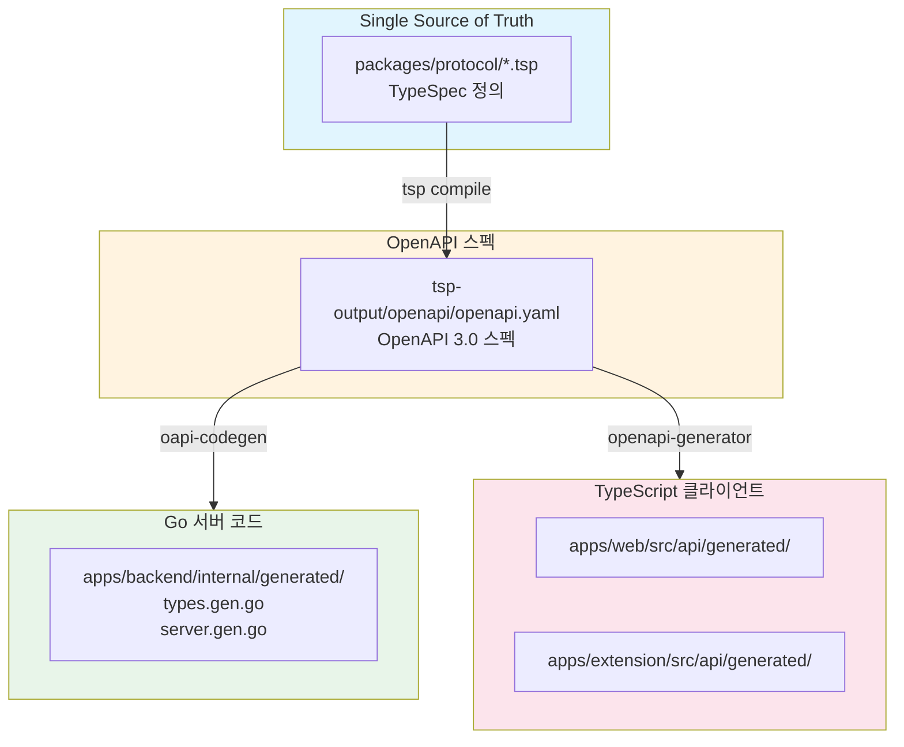

# Phase 1.5: API 스펙 공통화

## 개요

| 항목 | 내용 |
|-----|------|
| **목표** | TypeSpec 기반 API 스펙 정의 → Go/TypeScript 코드 자동 생성 |
| **선행 조건** | Phase 1 완료 |
| **예상 소요** | 5 Steps |
| **결과물** | OpenAPI 스펙 + 생성된 Go/TS 코드 |

> 📖 상세 워크플로우: [07-api-spec-workflow.md](../07-api-spec-workflow.md)

---

## 진행 상황

| Step | 이름 | 상태 |
|------|------|------|
| 1.5.1 | TypeSpec 패키지 설정 | ⬜ |
| 1.5.2 | 공통 타입 및 Auth API 스펙 작성 | ⬜ |
| 1.5.3 | oapi-codegen 설정 (Go) | ⬜ |
| 1.5.4 | openapi-generator 설정 (TypeScript) | ⬜ |
| 1.5.5 | 루트 generate 스크립트 설정 | ⬜ |

---

## 워크플로우 개요



---

## Step 1.5.1: TypeSpec 패키지 설정

### 목표

TypeSpec 기반 API 스펙 정의 환경 구성

### 체크리스트

- [ ] **디렉토리 생성**

  ```bash
  mkdir -p packages/protocol/src/{common,auth,sessions,events,mindmap}
  ```

- [ ] **package.json 작성**
  - [ ] `packages/protocol/package.json`

    ```json
    {
      "name": "@mindhit/protocol",
      "version": "0.1.0",
      "private": true,
      "scripts": {
        "build": "tsp compile .",
        "watch": "tsp compile . --watch",
        "format": "tsp format **/*.tsp"
      },
      "dependencies": {
        "@typespec/compiler": "^0.61.0",
        "@typespec/http": "^0.61.0",
        "@typespec/openapi": "^0.61.0",
        "@typespec/openapi3": "^0.61.0",
        "@typespec/rest": "^0.61.0"
      }
    }
    ```

- [ ] **tspconfig.yaml 작성**
  - [ ] `packages/protocol/tspconfig.yaml`

    ```yaml
    emit:
      - "@typespec/openapi3"

    options:
      "@typespec/openapi3":
        output-file: openapi.yaml
        emitter-output-dir: "{project-root}/tsp-output/openapi"
    ```

- [ ] **main.tsp 작성**
  - [ ] `packages/protocol/src/main.tsp`

    ```typespec
    import "@typespec/http";
    import "@typespec/rest";
    import "@typespec/openapi";

    import "./common/errors.tsp";
    import "./auth/auth.tsp";

    using TypeSpec.Http;
    using TypeSpec.Rest;

    @service({
      title: "MindHit API",
      version: "1.0.0",
    })
    @server("http://localhost:8080", "Development server")
    namespace MindHit;
    ```

- [ ] **의존성 설치**

  ```bash
  cd packages/protocol
  pnpm install
  ```

### 검증

```bash
cd packages/protocol
pnpm run build
# tsp-output/openapi/openapi.yaml 생성 확인
```

### 결과물

```
packages/protocol/
├── src/
│   ├── main.tsp
│   ├── common/
│   ├── auth/
│   ├── sessions/
│   ├── events/
│   └── mindmap/
├── tsp-output/
│   └── openapi/
│       └── openapi.yaml
├── tspconfig.yaml
└── package.json
```

---

## Step 1.5.2: 공통 타입 및 Auth API 스펙 작성

### 목표

공통 에러 타입 및 인증 API TypeSpec 정의

### 체크리스트

- [ ] **공통 에러 타입**
  - [ ] `packages/protocol/src/common/errors.tsp`

    ```typespec
    namespace MindHit.Common;

    @doc("기본 에러 응답")
    model ErrorResponse {
      error: {
        message: string;
        code?: string;
      };
    }

    @doc("유효성 검증 에러")
    model ValidationError {
      error: {
        message: string;
        details?: ValidationDetail[];
      };
    }

    model ValidationDetail {
      field: string;
      message: string;
    }
    ```

- [ ] **페이지네이션 타입**
  - [ ] `packages/protocol/src/common/pagination.tsp`

    ```typespec
    namespace MindHit.Common;

    model PaginationParams {
      @query
      @doc("페이지 번호 (1부터 시작)")
      page?: int32 = 1;

      @query
      @doc("페이지당 항목 수")
      limit?: int32 = 20;
    }

    model PaginationMeta {
      page: int32;
      limit: int32;
      total: int32;
      totalPages: int32;
    }
    ```

- [ ] **Auth API 스펙**
  - [ ] `packages/protocol/src/auth/auth.tsp`

    ```typespec
    import "../common/errors.tsp";

    using TypeSpec.Http;
    using TypeSpec.Rest;

    namespace MindHit.Auth;

    // ============ Models ============

    @doc("사용자 정보")
    model User {
      id: string;
      email: string;
      @encodedName("application/json", "created_at")
      createdAt: utcDateTime;
      @encodedName("application/json", "updated_at")
      updatedAt: utcDateTime;
    }

    @doc("회원가입 요청")
    model SignupRequest {
      @minLength(1)
      @doc("이메일 주소")
      email: string;

      @minLength(8)
      @doc("비밀번호 (최소 8자)")
      password: string;
    }

    @doc("로그인 요청")
    model LoginRequest {
      email: string;
      password: string;
    }

    @doc("인증 응답")
    model AuthResponse {
      user: User;
      token: string;
    }

    // ============ Routes ============

    @route("/v1/auth")
    namespace Routes {
      @post
      @route("/signup")
      @doc("회원가입")
      op signup(
        @body body: SignupRequest
      ): {
        @statusCode statusCode: 201;
        @body body: AuthResponse;
      } | {
        @statusCode statusCode: 400;
        @body body: Common.ValidationError;
      } | {
        @statusCode statusCode: 409;
        @body body: Common.ErrorResponse;
      };

      @post
      @route("/login")
      @doc("로그인")
      op login(
        @body body: LoginRequest
      ): {
        @statusCode statusCode: 200;
        @body body: AuthResponse;
      } | {
        @statusCode statusCode: 401;
        @body body: Common.ErrorResponse;
      };

      @post
      @route("/refresh")
      @doc("토큰 갱신")
      op refresh(
        @header authorization: string
      ): {
        @statusCode statusCode: 200;
        @body body: { token: string };
      } | {
        @statusCode statusCode: 401;
        @body body: Common.ErrorResponse;
      };
    }
    ```

- [ ] **OpenAPI 생성 확인**

  ```bash
  cd packages/protocol
  pnpm run build
  cat tsp-output/openapi/openapi.yaml
  ```

### 검증

```bash
# OpenAPI 스펙에 /v1/auth/signup, /v1/auth/login 포함 확인
grep -A 5 "/v1/auth" packages/protocol/tsp-output/openapi/openapi.yaml
```

### 결과물

- `packages/protocol/src/common/errors.tsp`
- `packages/protocol/src/common/pagination.tsp`
- `packages/protocol/src/auth/auth.tsp`
- `packages/protocol/tsp-output/openapi/openapi.yaml`

---

## Step 1.5.3: oapi-codegen 설정 (Go)

### 목표

OpenAPI 스펙에서 Go 서버 코드 자동 생성

### 체크리스트

- [ ] **oapi-codegen 설치**

  ```bash
  go install github.com/deepmap/oapi-codegen/v2/cmd/oapi-codegen@latest
  ```

- [ ] **설정 파일 작성**
  - [ ] `apps/backend/oapi-codegen.yaml`

    ```yaml
    package: generated
    output: internal/generated/api.gen.go
    generate:
      models: true
      gin-server: true
      strict-server: true
      embedded-spec: true
    ```

- [ ] **generated 디렉토리 생성**

  ```bash
  mkdir -p apps/backend/internal/generated
  ```

- [ ] **Makefile에 타겟 추가**
  - [ ] `apps/backend/Makefile`

    ```makefile
    .PHONY: generate-api build test lint run

    OPENAPI_SPEC := ../../packages/protocol/tsp-output/openapi/openapi.yaml

    generate-api:
     oapi-codegen -config oapi-codegen.yaml $(OPENAPI_SPEC)

    build:
     go build -o ./bin/server ./cmd/server

    test:
     go test -v -race -coverprofile=coverage.out ./...

    lint:
     golangci-lint run

    run:
     go run ./cmd/server
    ```

- [ ] **코드 생성 실행**

  ```bash
  cd apps/backend
  make generate-api
  ```

- [ ] **생성된 코드 확인**
  - [ ] `internal/generated/api.gen.go` 파일 존재
  - [ ] `SignupRequest`, `LoginRequest`, `AuthResponse` 타입 확인
  - [ ] `StrictServerInterface` 인터페이스 확인

### 검증

```bash
cd apps/backend
make generate-api
ls internal/generated/
# api.gen.go

# 타입 확인
grep "type SignupRequest" internal/generated/api.gen.go
```

### 결과물

```
apps/backend/
├── Makefile
├── oapi-codegen.yaml
└── internal/
    └── generated/
        └── api.gen.go
```

---

## Step 1.5.4: openapi-generator 설정 (TypeScript)

### 목표

OpenAPI 스펙에서 TypeScript 클라이언트 자동 생성

### 체크리스트

- [ ] **apps/web 초기화** (아직 없다면)

  ```bash
  mkdir -p apps/web
  cd apps/web
  pnpm init
  ```

- [ ] **openapi-generator-cli 설치**

  ```bash
  cd apps/web
  pnpm add -D @openapitools/openapi-generator-cli
  ```

- [ ] **package.json 스크립트 추가**
  - [ ] `apps/web/package.json`

    ```json
    {
      "name": "@mindhit/web",
      "version": "0.1.0",
      "private": true,
      "scripts": {
        "generate:api": "openapi-generator-cli generate -i ../../packages/protocol/tsp-output/openapi/openapi.yaml -g typescript-axios -o src/api/generated --additional-properties=supportsES6=true,withSeparateModelsAndApi=true,apiPackage=api,modelPackage=models"
      },
      "devDependencies": {
        "@openapitools/openapi-generator-cli": "^2.13.0"
      },
      "dependencies": {
        "axios": "^1.6.0"
      }
    }
    ```

- [ ] **generated 디렉토리 생성**

  ```bash
  mkdir -p apps/web/src/api/generated
  ```

- [ ] **코드 생성 실행**

  ```bash
  cd apps/web
  pnpm run generate:api
  ```

- [ ] **API 클라이언트 래퍼 작성**
  - [ ] `apps/web/src/lib/api.ts`

    ```typescript
    import { Configuration, AuthApi } from '../api/generated';

    const config = new Configuration({
      basePath: process.env.NEXT_PUBLIC_API_URL || 'http://localhost:8080',
      accessToken: () => {
        if (typeof window !== 'undefined') {
          return localStorage.getItem('token') || '';
        }
        return '';
      },
    });

    export const authApi = new AuthApi(config);
    ```

- [ ] **Extension용 설정** (선택)
  - [ ] `apps/extension/package.json`에 동일한 generate:api 스크립트 추가
  - [ ] 또는 web의 generated 코드를 symlink

### 검증

```bash
cd apps/web
pnpm run generate:api
ls src/api/generated/
# api/ models/ 디렉토리 확인
```

### 결과물

```
apps/web/
├── package.json
└── src/
    ├── api/
    │   └── generated/
    │       ├── api/
    │       │   └── auth-api.ts
    │       └── models/
    │           ├── signup-request.ts
    │           ├── login-request.ts
    │           └── auth-response.ts
    └── lib/
        └── api.ts
```

---

## Step 1.5.5: 루트 generate 스크립트 설정

### 목표

한 번의 명령어로 전체 코드 생성

### 체크리스트

- [ ] **루트 package.json 업데이트**
  - [ ] `package.json`

    ```json
    {
      "name": "mindhit",
      "private": true,
      "scripts": {
        "dev": "moonx :dev",
        "build": "moonx :build",
        "test": "moonx :test",
        "lint": "moonx :lint",
        "generate": "pnpm run generate:protocol && pnpm run generate:api:go && pnpm run generate:api:ts",
        "generate:protocol": "pnpm --filter @mindhit/protocol build",
        "generate:api:go": "cd apps/backend && make generate-api",
        "generate:api:ts": "pnpm --filter @mindhit/web generate:api"
      }
    }
    ```

- [ ] **moon.yml에 generate 태스크 추가** (선택)
  - [ ] `.moon/tasks.yml` 또는 각 프로젝트 moon.yml

    ```yaml
    tasks:
      generate:
        command: 'echo "Generating..."'
        deps:
          - 'protocol:build'
        platform: system
    ```

- [ ] **CI용 변경 감지 스크립트**
  - [ ] `scripts/check-generated.sh`

    ```bash
    #!/bin/bash
    set -e

    echo "Generating all code..."
    pnpm run generate

    echo "Checking for uncommitted changes..."
    if [[ -n $(git status --porcelain) ]]; then
      echo "❌ Generated files are out of sync!"
      git diff
      exit 1
    fi

    echo "✅ All generated files are up to date"
    ```

- [ ] **실행 권한 부여**

  ```bash
  chmod +x scripts/check-generated.sh
  ```

- [ ] **.gitignore 업데이트**

  ```
  # Generated files (commit these)
  # apps/backend/internal/generated/
  # apps/web/src/api/generated/

  # Or ignore if regenerating in CI
  # Uncomment below to ignore:
  # apps/backend/internal/generated/
  # apps/web/src/api/generated/
  ```

### 검증

```bash
# 루트에서 전체 생성
pnpm run generate

# 각 프로젝트에서 생성된 파일 확인
ls apps/backend/internal/generated/
ls apps/web/src/api/generated/
```

### 결과물

- `pnpm run generate` 명령어로 전체 코드 생성
- CI에서 변경 감지 가능

---

## Phase 1.5 완료 확인

### 전체 검증 체크리스트

- [ ] **TypeSpec 컴파일**

  ```bash
  cd packages/protocol && pnpm run build
  cat tsp-output/openapi/openapi.yaml | head -50
  ```

- [ ] **Go 코드 생성**

  ```bash
  cd apps/backend && make generate-api
  grep "StrictServerInterface" internal/generated/api.gen.go
  ```

- [ ] **TypeScript 클라이언트 생성**

  ```bash
  cd apps/web && pnpm run generate:api
  ls src/api/generated/
  ```

- [ ] **전체 생성 스크립트**

  ```bash
  pnpm run generate
  ```

### 테스트 요구사항

| 테스트 유형 | 대상 | 검증 방법 |
| ----------- | ---- | --------- |
| 스펙 검증 | TypeSpec 컴파일 | `pnpm run build` 성공 |
| 코드 생성 | Go 서버 코드 | `go build` 성공 |
| 코드 생성 | TS 클라이언트 | TypeScript 컴파일 성공 |
| 스키마 검증 | OpenAPI 유효성 | `spectral lint openapi.yaml` |

```bash
# Phase 1.5 검증
cd packages/protocol && pnpm run build
cd apps/backend && go build ./...
cd apps/web && pnpm run typecheck
```

> **Note**: Phase 1.5는 코드 생성이 핵심이므로 생성된 코드의 컴파일 성공이 완료 기준입니다.

### 산출물 요약

| 항목 | 위치 |
| ---- | ---- |
| TypeSpec 소스 | `packages/protocol/src/` |
| OpenAPI 스펙 | `packages/protocol/tsp-output/openapi/openapi.yaml` |
| Go 생성 코드 | `apps/backend/internal/generated/api.gen.go` |
| TS 클라이언트 | `apps/web/src/api/generated/` |

### API 변경 시 워크플로우

```
1. TypeSpec 수정
   └── packages/protocol/src/**/*.tsp

2. 전체 생성
   └── pnpm run generate

3. 타입 확인
   └── Go: 컴파일 에러 확인
   └── TS: TypeScript 에러 확인

4. 코드 수정
   └── 인터페이스 구현 업데이트

5. 커밋
   └── TypeSpec + 생성 코드 함께 커밋
```

---

## 다음 Phase

Phase 1.5 완료 후 [Phase 2: 인증 시스템](./phase-2-auth.md)으로 진행하세요.
