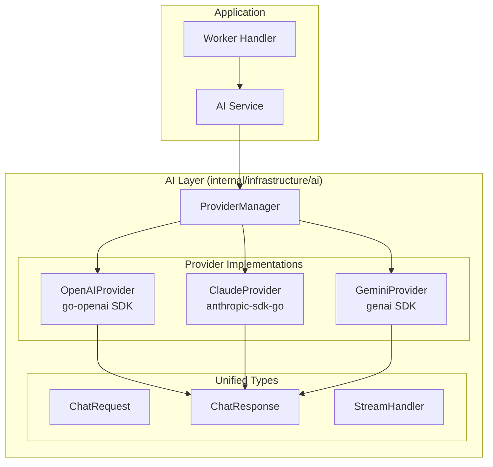

# Phase 10: AI Provider 인프라

## 개요

| 항목 | 내용 |
|-----|------|
| **목표** | 다중 AI 프로바이더(OpenAI, Google Gemini, Anthropic Claude) 통합 인프라 구축 |
| **선행 조건** | Phase 6 완료 (Worker 및 Job Queue) |
| **예상 소요** | 2 Steps |
| **결과물** | 통합 AI 인터페이스, Provider 구현체 |

> **Note**: AI 설정 관리(ai_configs)와 로깅(ai_logs)은 [Phase 10.1](./phase-10.1-ai-config.md)에서, 마인드맵 생성은 [Phase 10.2](./phase-10.2-mindmap.md)에서 구현합니다.

---

## 통합 AI 아키텍처 설계 원칙

### 핵심 요구사항

1. **공통 인터페이스**: 모든 프로바이더가 동일한 Request/Response 구조 사용
2. **확장 용이성**: 새 프로바이더 추가 시 `Provider` 인터페이스만 구현
3. **응답 통합 관리**: thinking/content 분리, 토큰 사용량, 지연시간 등 일관된 구조

### 아키텍처 다이어그램



### 통합 타입 구조

```go
// ChatRequest - 모든 프로바이더에서 동일하게 사용
type ChatRequest struct {
    SystemPrompt string            // 시스템 프롬프트
    UserPrompt   string            // 사용자 프롬프트
    Messages     []Message         // 멀티턴 대화 (선택)
    Options      ChatOptions       // 온도, 토큰 제한 등
    Metadata     map[string]string // 추적용 메타데이터 (session_id, task 등)
}

// ChatResponse - 모든 프로바이더가 이 형식으로 반환
type ChatResponse struct {
    // 응답 분리 (thinking vs content)
    Thinking string // 추론 과정 (Claude extended thinking, OpenAI reasoning)
    Content  string // 최종 응답

    // 정확한 토큰 측정 (프로바이더 API 응답에서 추출)
    InputTokens    int // 입력 토큰
    OutputTokens   int // 출력 토큰
    ThinkingTokens int // thinking 토큰 (해당되는 경우)
    TotalTokens    int // 총 토큰 (과금 기준)

    // 메타데이터
    Provider  string        // "openai", "claude", "gemini"
    Model     string        // "gpt-4o", "claude-sonnet-4", "gemini-2.0-flash"
    LatencyMs int64         // 응답 지연시간 (ms)
    RequestID string        // 프로바이더 요청 ID (디버깅용)
}
```

### 프로바이더별 Thinking 지원

| 프로바이더 | Thinking 지원 | 활성화 방법 | 응답 분리 |
|-----------|--------------|------------|----------|
| **OpenAI** (o1, GPT-5) | ✅ | `reasoning_effort: "medium"` | `reasoning_summary` 이벤트 |
| **Claude** | ✅ | `thinking.budget_tokens: 10000` | `thinking` content block |
| **Gemini** | ✅ | `thinking_config.thinking_budget` | `thinking` 필드 |

> **중요**: Claude의 OpenAI SDK 호환 모드에서는 thinking이 반환되지 않음 → **네이티브 SDK 필수**

---

## 진행 상황

| Step | 이름 | 상태 |
|------|------|------|
| 10.1 | 통합 타입 및 AI Provider 인터페이스 정의 | ✅ |
| 10.2 | 개별 Provider 구현 (OpenAI, Gemini, Claude) | ✅ |

> **다음 단계**:
> - [Phase 10.1: AI 설정 및 로깅](./phase-10.1-ai-config.md) - ai_configs, ai_logs, Admin API
> - [Phase 10.2: 마인드맵 생성](./phase-10.2-mindmap.md) - 태그 추출 및 마인드맵 Worker Handler

---

## Step 10.1: 통합 타입 및 AI Provider 인터페이스 정의

> **에러 처리 가이드**: AI 에러 처리 패턴은
> [09-error-handling.md#12](../09-error-handling.md#12-ai-에러-처리)를 참조하세요.
>
> - AI Provider 에러 타입 (`ErrRateLimited`, `ErrTokenLimitExceeded` 등)
> - Worker에서 `asynq.SkipRetry` 활용
> - Controller에서 AI 에러 응답 처리

### 체크리스트

- [x] **통합 타입 정의**
  - [x] `internal/infrastructure/ai/types.go`

    ```go
    package ai

    import "time"

    // ProviderType identifies the AI provider
    type ProviderType string

    const (
        ProviderOpenAI ProviderType = "openai"
        ProviderGemini ProviderType = "gemini"
        ProviderClaude ProviderType = "claude"
    )

    // TaskType identifies the AI task for provider selection
    type TaskType string

    const (
        TaskTagExtraction TaskType = "tag_extraction"
        TaskMindmap       TaskType = "mindmap"
        TaskGeneral       TaskType = "general"
    )

    // Role defines message roles
    type Role string

    const (
        RoleSystem    Role = "system"
        RoleUser      Role = "user"
        RoleAssistant Role = "assistant"
    )

    // Message represents a chat message
    type Message struct {
        Role    Role   `json:"role"`
        Content string `json:"content"`
    }

    // ChatOptions contains optional parameters for chat completion
    type ChatOptions struct {
        Temperature    float64  `json:"temperature,omitempty"`
        MaxTokens      int      `json:"max_tokens,omitempty"`
        TopP           float64  `json:"top_p,omitempty"`
        StopSequences  []string `json:"stop_sequences,omitempty"`
        JSONMode       bool     `json:"json_mode,omitempty"`       // Force JSON output
        EnableThinking bool     `json:"enable_thinking,omitempty"` // Enable extended thinking
        ThinkingBudget int      `json:"thinking_budget,omitempty"` // Max thinking tokens
    }

    // DefaultChatOptions returns sensible defaults
    func DefaultChatOptions() ChatOptions {
        return ChatOptions{
            Temperature: 0.7,
            MaxTokens:   4096,
            TopP:        1.0,
        }
    }

    // ChatRequest - 통합 요청 구조체
    type ChatRequest struct {
        SystemPrompt string            `json:"system_prompt"`        // 시스템 프롬프트
        UserPrompt   string            `json:"user_prompt"`          // 사용자 프롬프트
        Messages     []Message         `json:"messages,omitempty"`   // 멀티턴 대화 (선택)
        Options      ChatOptions       `json:"options"`              // 옵션
        Metadata     map[string]string `json:"metadata,omitempty"`   // 추적용 메타데이터
    }

    // ChatResponse - 통합 응답 구조체 (모든 프로바이더가 이 형식으로 반환)
    type ChatResponse struct {
        // 응답 분리 (thinking vs content)
        Thinking string `json:"thinking,omitempty"` // 추론 과정 (Claude/OpenAI/Gemini thinking)
        Content  string `json:"content"`            // 최종 응답

        // 정확한 토큰 측정 (프로바이더 API 응답에서 추출)
        InputTokens    int `json:"input_tokens"`              // 입력 토큰
        OutputTokens   int `json:"output_tokens"`             // 출력 토큰
        ThinkingTokens int `json:"thinking_tokens,omitempty"` // thinking 토큰
        TotalTokens    int `json:"total_tokens"`              // 총 토큰 (과금 기준)

        // 메타데이터
        Provider  ProviderType  `json:"provider"`            // "openai", "claude", "gemini"
        Model     string        `json:"model"`               // 실제 사용된 모델
        LatencyMs int64         `json:"latency_ms"`          // 응답 지연시간 (ms)
        RequestID string        `json:"request_id,omitempty"`// 프로바이더 요청 ID
        CreatedAt time.Time     `json:"created_at"`          // 응답 생성 시간
    }

    // StreamDelta - 스트리밍 응답 청크
    type StreamDelta struct {
        Type    string `json:"type"`    // "thinking" or "content"
        Content string `json:"content"` // 청크 내용
    }

    // StreamHandler - 스트리밍 콜백 핸들러
    type StreamHandler struct {
        OnThinking func(delta string)          // thinking 청크 수신 시
        OnContent  func(delta string)          // content 청크 수신 시
        OnError    func(err error)             // 에러 발생 시
        OnDone     func(response *ChatResponse)// 완료 시 최종 응답
    }

    // ProviderConfig holds configuration for a single provider
    type ProviderConfig struct {
        Type           ProviderType `json:"type"`
        APIKey         string       `json:"api_key"`
        Model          string       `json:"model"`
        Enabled        bool         `json:"enabled"`
        Priority       int          `json:"priority"`        // Lower = higher priority
        ThinkingBudget int          `json:"thinking_budget"` // Default thinking budget
    }
    ```

- [x] **AIProvider 인터페이스 정의**
  - [x] `internal/infrastructure/ai/provider.go`

    ```go
    package ai

    import (
        "context"
        "errors"
    )

    var (
        ErrProviderNotConfigured = errors.New("ai provider not configured")
        ErrNoResponse            = errors.New("no response from ai provider")
        ErrRateLimited           = errors.New("rate limited by ai provider")
        ErrTokenLimitExceeded    = errors.New("token limit exceeded")
        ErrInvalidAPIKey         = errors.New("invalid api key")
        ErrContextCanceled       = errors.New("context canceled")
        ErrInvalidJSON           = errors.New("invalid json response")
    )

    // AIProvider defines the interface that all AI providers must implement
    type AIProvider interface {
        // Chat sends a request and returns a unified response
        Chat(ctx context.Context, req ChatRequest) (*ChatResponse, error)

        // ChatStream sends a request and streams the response
        ChatStream(ctx context.Context, req ChatRequest, handler StreamHandler) error

        // Type returns the provider type
        Type() ProviderType

        // Model returns the current model being used
        Model() string

        // IsHealthy checks if the provider is available
        IsHealthy(ctx context.Context) bool

        // Close releases any resources
        Close() error
    }

    // BaseProvider contains common functionality for all providers
    type BaseProvider struct {
        providerType   ProviderType
        model          string
        thinkingBudget int
    }

    func (b *BaseProvider) Type() ProviderType {
        return b.providerType
    }

    func (b *BaseProvider) Model() string {
        return b.model
    }

    func (b *BaseProvider) Close() error {
        return nil // Default no-op, override if needed
    }

    // buildMessages converts ChatRequest to []Message for providers
    func buildMessages(req ChatRequest) []Message {
        var messages []Message

        // Add system prompt if present
        if req.SystemPrompt != "" {
            messages = append(messages, Message{
                Role:    RoleSystem,
                Content: req.SystemPrompt,
            })
        }

        // Add existing messages
        messages = append(messages, req.Messages...)

        // Add user prompt if present
        if req.UserPrompt != "" {
            messages = append(messages, Message{
                Role:    RoleUser,
                Content: req.UserPrompt,
            })
        }

        return messages
    }
    ```

### 검증

```bash
cd apps/backend
go build ./...
# 컴파일 성공
```

---

## Step 10.2: 개별 Provider 구현

### 설계 원칙

각 Provider는 네이티브 SDK를 사용하여 해당 프로바이더의 모든 기능(thinking, streaming 등)을 지원합니다.
모든 Provider는 동일한 `AIProvider` 인터페이스를 구현하고, 통합된 `ChatRequest`/`ChatResponse`를 사용합니다.

### 체크리스트

- [x] **의존성 추가**

  ```bash
  cd apps/backend
  # OpenAI (go-openai)
  go get github.com/sashabaranov/go-openai

  # Google Gemini (genai)
  go get github.com/google/generative-ai-go

  # Anthropic Claude (anthropic-sdk-go)
  go get github.com/anthropics/anthropic-sdk-go
  ```

- [x] **OpenAI Provider 구현**
  - [x] `internal/infrastructure/ai/provider_openai.go`

    ```go
    package ai

    import (
        "context"
        "encoding/json"
        "fmt"
        "time"

        "github.com/sashabaranov/go-openai"
    )

    type OpenAIProvider struct {
        BaseProvider
        client *openai.Client
    }

    func NewOpenAIProvider(cfg ProviderConfig) *OpenAIProvider {
        model := cfg.Model
        if model == "" {
            model = "gpt-4o"
        }
        return &OpenAIProvider{
            BaseProvider: BaseProvider{
                providerType:   ProviderOpenAI,
                model:          model,
                thinkingBudget: cfg.ThinkingBudget,
            },
            client: openai.NewClient(cfg.APIKey),
        }
    }

    func (p *OpenAIProvider) Chat(ctx context.Context, req ChatRequest) (*ChatResponse, error) {
        startTime := time.Now()
        messages := buildMessages(req)

        chatMessages := make([]openai.ChatCompletionMessage, len(messages))
        for i, msg := range messages {
            chatMessages[i] = openai.ChatCompletionMessage{
                Role:    string(msg.Role),
                Content: msg.Content,
            }
        }

        apiReq := openai.ChatCompletionRequest{
            Model:       p.model,
            Messages:    chatMessages,
            Temperature: float32(req.Options.Temperature),
            MaxTokens:   req.Options.MaxTokens,
            TopP:        float32(req.Options.TopP),
            Stop:        req.Options.StopSequences,
        }

        // JSON mode
        if req.Options.JSONMode {
            apiReq.ResponseFormat = &openai.ChatCompletionResponseFormat{
                Type: openai.ChatCompletionResponseFormatTypeJSONObject,
            }
        }

        resp, err := p.client.CreateChatCompletion(ctx, apiReq)
        if err != nil {
            return nil, fmt.Errorf("openai chat: %w", err)
        }

        if len(resp.Choices) == 0 {
            return nil, ErrNoResponse
        }

        content := resp.Choices[0].Message.Content

        // Validate JSON if JSON mode enabled
        if req.Options.JSONMode {
            var js json.RawMessage
            if err := json.Unmarshal([]byte(content), &js); err != nil {
                return nil, fmt.Errorf("%w: %v", ErrInvalidJSON, err)
            }
        }

        return &ChatResponse{
            Content:      content,
            Thinking:     "", // OpenAI doesn't expose thinking for non-o1 models
            Provider:     ProviderOpenAI,
            Model:        resp.Model,
            InputTokens:  resp.Usage.PromptTokens,
            OutputTokens: resp.Usage.CompletionTokens,
            TotalTokens:  resp.Usage.TotalTokens,
            LatencyMs:    time.Since(startTime).Milliseconds(),
            RequestID:    resp.ID,
            CreatedAt:    time.Now(),
        }, nil
    }

    func (p *OpenAIProvider) ChatStream(ctx context.Context, req ChatRequest, handler StreamHandler) error {
        startTime := time.Now()
        messages := buildMessages(req)

        chatMessages := make([]openai.ChatCompletionMessage, len(messages))
        for i, msg := range messages {
            chatMessages[i] = openai.ChatCompletionMessage{
                Role:    string(msg.Role),
                Content: msg.Content,
            }
        }

        stream, err := p.client.CreateChatCompletionStream(ctx, openai.ChatCompletionRequest{
            Model:       p.model,
            Messages:    chatMessages,
            Temperature: float32(req.Options.Temperature),
            MaxTokens:   req.Options.MaxTokens,
            Stream:      true,
        })
        if err != nil {
            handler.OnError(err)
            return err
        }
        defer stream.Close()

        var fullContent string
        for {
            chunk, err := stream.Recv()
            if err != nil {
                break
            }
            if len(chunk.Choices) > 0 {
                delta := chunk.Choices[0].Delta.Content
                fullContent += delta
                if handler.OnContent != nil {
                    handler.OnContent(delta)
                }
            }
        }

        if handler.OnDone != nil {
            handler.OnDone(&ChatResponse{
                Content:   fullContent,
                Provider:  ProviderOpenAI,
                Model:     p.model,
                LatencyMs: time.Since(startTime).Milliseconds(),
                CreatedAt: time.Now(),
            })
        }
        return nil
    }

    func (p *OpenAIProvider) IsHealthy(ctx context.Context) bool {
        _, err := p.Chat(ctx, ChatRequest{
            UserPrompt: "ping",
            Options:    ChatOptions{MaxTokens: 5},
        })
        return err == nil
    }
    ```

- [x] **Google Gemini Provider 구현**
  - [x] `internal/infrastructure/ai/provider_gemini.go`

    ```go
    package ai

    import (
        "context"
        "encoding/json"
        "fmt"
        "strings"
        "time"

        "github.com/google/generative-ai-go/genai"
        "google.golang.org/api/option"
    )

    type GeminiProvider struct {
        BaseProvider
        client *genai.Client
    }

    func NewGeminiProvider(ctx context.Context, cfg ProviderConfig) (*GeminiProvider, error) {
        model := cfg.Model
        if model == "" {
            model = "gemini-2.0-flash"
        }

        client, err := genai.NewClient(ctx, option.WithAPIKey(cfg.APIKey))
        if err != nil {
            return nil, fmt.Errorf("create gemini client: %w", err)
        }

        return &GeminiProvider{
            BaseProvider: BaseProvider{
                providerType:   ProviderGemini,
                model:          model,
                thinkingBudget: cfg.ThinkingBudget,
            },
            client: client,
        }, nil
    }

    func (p *GeminiProvider) Chat(ctx context.Context, req ChatRequest) (*ChatResponse, error) {
        startTime := time.Now()
        model := p.client.GenerativeModel(p.model)

        model.SetTemperature(float32(req.Options.Temperature))
        model.SetMaxOutputTokens(int32(req.Options.MaxTokens))
        model.SetTopP(float32(req.Options.TopP))

        if len(req.Options.StopSequences) > 0 {
            model.StopSequences = req.Options.StopSequences
        }

        // JSON mode
        if req.Options.JSONMode {
            model.ResponseMIMEType = "application/json"
        }

        // System prompt
        if req.SystemPrompt != "" {
            model.SystemInstruction = &genai.Content{
                Parts: []genai.Part{genai.Text(req.SystemPrompt)},
            }
        }

        // Build parts from messages + user prompt
        var parts []genai.Part
        for _, msg := range req.Messages {
            if msg.Role != RoleSystem {
                parts = append(parts, genai.Text(msg.Content))
            }
        }
        if req.UserPrompt != "" {
            parts = append(parts, genai.Text(req.UserPrompt))
        }

        resp, err := model.GenerateContent(ctx, parts...)
        if err != nil {
            return nil, fmt.Errorf("gemini generate: %w", err)
        }

        if len(resp.Candidates) == 0 || len(resp.Candidates[0].Content.Parts) == 0 {
            return nil, ErrNoResponse
        }

        var content strings.Builder
        for _, part := range resp.Candidates[0].Content.Parts {
            if text, ok := part.(genai.Text); ok {
                content.WriteString(string(text))
            }
        }

        // Validate JSON if requested
        if req.Options.JSONMode {
            var js json.RawMessage
            if err := json.Unmarshal([]byte(content.String()), &js); err != nil {
                return nil, fmt.Errorf("%w: %v", ErrInvalidJSON, err)
            }
        }

        return &ChatResponse{
            Content:      content.String(),
            Provider:     ProviderGemini,
            Model:        p.model,
            InputTokens:  int(resp.UsageMetadata.PromptTokenCount),
            OutputTokens: int(resp.UsageMetadata.CandidatesTokenCount),
            TotalTokens:  int(resp.UsageMetadata.TotalTokenCount),
            LatencyMs:    time.Since(startTime).Milliseconds(),
            CreatedAt:    time.Now(),
        }, nil
    }

    func (p *GeminiProvider) ChatStream(ctx context.Context, req ChatRequest, handler StreamHandler) error {
        startTime := time.Now()
        model := p.client.GenerativeModel(p.model)

        model.SetTemperature(float32(req.Options.Temperature))
        model.SetMaxOutputTokens(int32(req.Options.MaxTokens))

        if req.SystemPrompt != "" {
            model.SystemInstruction = &genai.Content{
                Parts: []genai.Part{genai.Text(req.SystemPrompt)},
            }
        }

        var parts []genai.Part
        if req.UserPrompt != "" {
            parts = append(parts, genai.Text(req.UserPrompt))
        }

        iter := model.GenerateContentStream(ctx, parts...)
        var fullContent strings.Builder

        for {
            resp, err := iter.Next()
            if err != nil {
                break
            }
            for _, cand := range resp.Candidates {
                for _, part := range cand.Content.Parts {
                    if text, ok := part.(genai.Text); ok {
                        delta := string(text)
                        fullContent.WriteString(delta)
                        if handler.OnContent != nil {
                            handler.OnContent(delta)
                        }
                    }
                }
            }
        }

        if handler.OnDone != nil {
            handler.OnDone(&ChatResponse{
                Content:   fullContent.String(),
                Provider:  ProviderGemini,
                Model:     p.model,
                LatencyMs: time.Since(startTime).Milliseconds(),
                CreatedAt: time.Now(),
            })
        }
        return nil
    }

    func (p *GeminiProvider) IsHealthy(ctx context.Context) bool {
        _, err := p.Chat(ctx, ChatRequest{
            UserPrompt: "ping",
            Options:    ChatOptions{MaxTokens: 5},
        })
        return err == nil
    }

    func (p *GeminiProvider) Close() error {
        return p.client.Close()
    }
    ```

- [x] **Anthropic Claude Provider 구현** (Extended Thinking 지원)
  - [x] `internal/infrastructure/ai/provider_claude.go`

    ```go
    package ai

    import (
        "context"
        "encoding/json"
        "fmt"
        "time"

        "github.com/anthropics/anthropic-sdk-go"
        "github.com/anthropics/anthropic-sdk-go/option"
    )

    type ClaudeProvider struct {
        BaseProvider
        client *anthropic.Client
    }

    func NewClaudeProvider(cfg ProviderConfig) *ClaudeProvider {
        model := cfg.Model
        if model == "" {
            model = "claude-sonnet-4-20250514"
        }

        client := anthropic.NewClient(
            option.WithAPIKey(cfg.APIKey),
        )

        return &ClaudeProvider{
            BaseProvider: BaseProvider{
                providerType:   ProviderClaude,
                model:          model,
                thinkingBudget: cfg.ThinkingBudget,
            },
            client: client,
        }
    }

    func (p *ClaudeProvider) Chat(ctx context.Context, req ChatRequest) (*ChatResponse, error) {
        startTime := time.Now()
        messages := buildMessages(req)

        var anthropicMessages []anthropic.MessageParam
        for _, msg := range messages {
            switch msg.Role {
            case RoleUser:
                anthropicMessages = append(anthropicMessages, anthropic.NewUserMessage(
                    anthropic.NewTextBlock(msg.Content),
                ))
            case RoleAssistant:
                anthropicMessages = append(anthropicMessages, anthropic.NewAssistantMessage(
                    anthropic.NewTextBlock(msg.Content),
                ))
            }
        }

        params := anthropic.MessageNewParams{
            Model:     anthropic.F(p.model),
            MaxTokens: anthropic.F(int64(req.Options.MaxTokens)),
            Messages:  anthropic.F(anthropicMessages),
        }

        // System prompt
        if req.SystemPrompt != "" {
            params.System = anthropic.F([]anthropic.TextBlockParam{
                anthropic.NewTextBlock(req.SystemPrompt),
            })
        }

        // Extended Thinking 활성화
        if req.Options.EnableThinking {
            budget := req.Options.ThinkingBudget
            if budget == 0 {
                budget = p.thinkingBudget
            }
            if budget == 0 {
                budget = 10000 // default
            }
            params.Thinking = anthropic.F(anthropic.ThinkingConfigParamUnion(
                anthropic.ThinkingConfigEnabledParam{
                    Type:         anthropic.F(anthropic.ThinkingConfigEnabledTypeEnabled),
                    BudgetTokens: anthropic.F(int64(budget)),
                },
            ))
        }

        if req.Options.Temperature > 0 {
            params.Temperature = anthropic.F(req.Options.Temperature)
        }

        if req.Options.TopP > 0 && req.Options.TopP < 1 {
            params.TopP = anthropic.F(req.Options.TopP)
        }

        resp, err := p.client.Messages.New(ctx, params)
        if err != nil {
            return nil, fmt.Errorf("claude message: %w", err)
        }

        if len(resp.Content) == 0 {
            return nil, ErrNoResponse
        }

        // thinking과 content 분리
        var thinking, content string
        var thinkingTokens int
        for _, block := range resp.Content {
            switch block.Type {
            case anthropic.ContentBlockTypeThinking:
                thinking = block.Thinking
            case anthropic.ContentBlockTypeText:
                content += block.Text
            }
        }

        // Thinking tokens from usage
        if resp.Usage.CacheCreationInputTokens > 0 {
            thinkingTokens = int(resp.Usage.CacheCreationInputTokens)
        }

        // Validate JSON if requested
        if req.Options.JSONMode {
            var js json.RawMessage
            if err := json.Unmarshal([]byte(content), &js); err != nil {
                return nil, fmt.Errorf("%w: %v", ErrInvalidJSON, err)
            }
        }

        return &ChatResponse{
            Content:        content,
            Thinking:       thinking,
            Provider:       ProviderClaude,
            Model:          string(resp.Model),
            InputTokens:    int(resp.Usage.InputTokens),
            OutputTokens:   int(resp.Usage.OutputTokens),
            ThinkingTokens: thinkingTokens,
            TotalTokens:    int(resp.Usage.InputTokens + resp.Usage.OutputTokens),
            LatencyMs:      time.Since(startTime).Milliseconds(),
            RequestID:      resp.ID,
            CreatedAt:      time.Now(),
        }, nil
    }

    func (p *ClaudeProvider) ChatStream(ctx context.Context, req ChatRequest, handler StreamHandler) error {
        startTime := time.Now()
        messages := buildMessages(req)

        var anthropicMessages []anthropic.MessageParam
        for _, msg := range messages {
            switch msg.Role {
            case RoleUser:
                anthropicMessages = append(anthropicMessages, anthropic.NewUserMessage(
                    anthropic.NewTextBlock(msg.Content),
                ))
            case RoleAssistant:
                anthropicMessages = append(anthropicMessages, anthropic.NewAssistantMessage(
                    anthropic.NewTextBlock(msg.Content),
                ))
            }
        }

        params := anthropic.MessageNewParams{
            Model:     anthropic.F(p.model),
            MaxTokens: anthropic.F(int64(req.Options.MaxTokens)),
            Messages:  anthropic.F(anthropicMessages),
        }

        if req.SystemPrompt != "" {
            params.System = anthropic.F([]anthropic.TextBlockParam{
                anthropic.NewTextBlock(req.SystemPrompt),
            })
        }

        stream := p.client.Messages.NewStreaming(ctx, params)

        var fullThinking, fullContent string
        for stream.Next() {
            event := stream.Current()
            switch event.Type {
            case anthropic.MessageStreamEventTypeContentBlockDelta:
                delta := event.Delta
                if delta.Type == "thinking_delta" {
                    fullThinking += delta.Thinking
                    if handler.OnThinking != nil {
                        handler.OnThinking(delta.Thinking)
                    }
                } else if delta.Type == "text_delta" {
                    fullContent += delta.Text
                    if handler.OnContent != nil {
                        handler.OnContent(delta.Text)
                    }
                }
            }
        }

        if err := stream.Err(); err != nil {
            if handler.OnError != nil {
                handler.OnError(err)
            }
            return err
        }

        if handler.OnDone != nil {
            handler.OnDone(&ChatResponse{
                Content:   fullContent,
                Thinking:  fullThinking,
                Provider:  ProviderClaude,
                Model:     p.model,
                LatencyMs: time.Since(startTime).Milliseconds(),
                CreatedAt: time.Now(),
            })
        }
        return nil
    }

    func (p *ClaudeProvider) IsHealthy(ctx context.Context) bool {
        _, err := p.Chat(ctx, ChatRequest{
            UserPrompt: "ping",
            Options:    ChatOptions{MaxTokens: 5},
        })
        return err == nil
    }
    ```

### 검증

```bash
cd apps/backend
go build ./...
# 컴파일 성공
```

---

## 다음 단계

Phase 10 완료 후:

1. **[Phase 10.1: AI 설정 및 로깅](./phase-10.1-ai-config.md)**
   - ai_logs 테이블 및 AILogService
   - ai_configs 테이블 및 AIConfigService (동적 설정)
   - Provider Manager (하이브리드 설정)
   - Admin API

2. **[Phase 10.2: 마인드맵 생성](./phase-10.2-mindmap.md)**
   - 태그 추출 Worker Handler
   - 마인드맵 생성 Worker Handler
   - UsageService 연동
