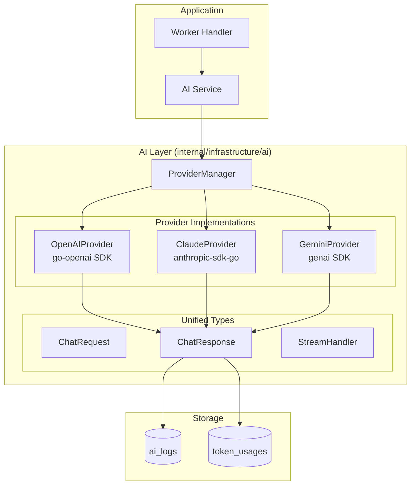
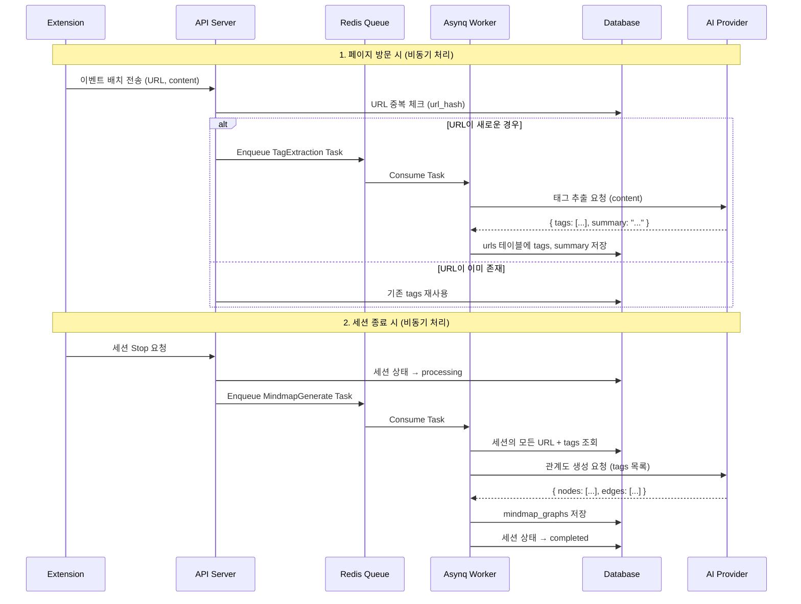
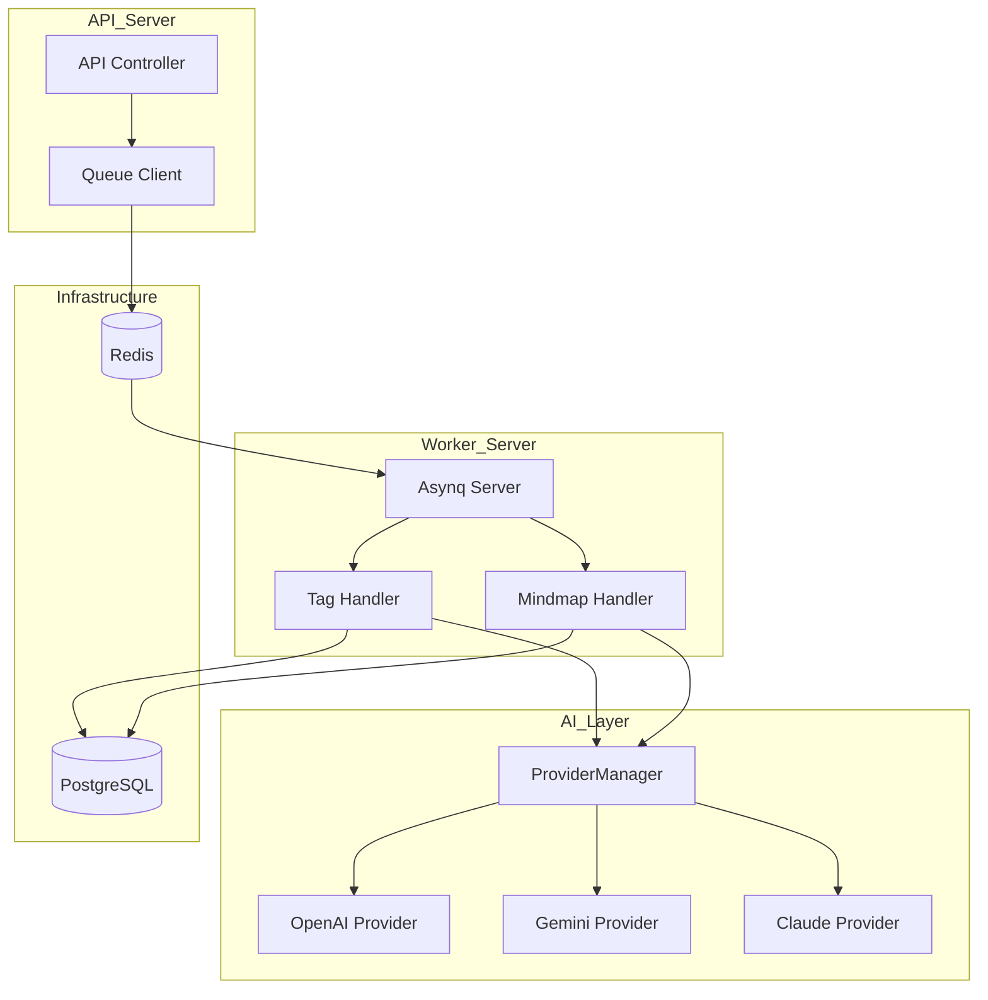

# Phase 10: AI Provider 인프라

## 개요

| 항목 | 내용 |
|-----|------|
| **목표** | 다중 AI 프로바이더(OpenAI, Google Gemini, Anthropic Claude) 통합 인프라 구축 |
| **선행 조건** | Phase 6 완료 (Worker 및 Job Queue) |
| **예상 소요** | 4 Steps |
| **결과물** | 통합 AI 인터페이스, Provider 구현체, ai_logs 테이블 |

> **Note**: 이 Phase는 AI Provider 인프라만 구축합니다. 실제 마인드맵 생성은 [Phase 10.1](./phase-10.1-mindmap.md)에서 구현합니다.

---

## 통합 AI 아키텍처 설계 원칙

### 핵심 요구사항

1. **공통 인터페이스**: 모든 프로바이더가 동일한 Request/Response 구조 사용
2. **확장 용이성**: 새 프로바이더 추가 시 `Provider` 인터페이스만 구현
3. **응답 통합 관리**: thinking/content 분리, 토큰 사용량, 지연시간 등 일관된 구조
4. **로그 저장**: 모든 AI 호출을 `ai_logs` 테이블에 기록 (디버깅, 비용 추적)

### 아키텍처 다이어그램



### 통합 타입 구조

```go
// ChatRequest - 모든 프로바이더에서 동일하게 사용
type ChatRequest struct {
    SystemPrompt string            // 시스템 프롬프트
    UserPrompt   string            // 사용자 프롬프트
    Messages     []Message         // 멀티턴 대화 (선택)
    Options      ChatOptions       // 온도, 토큰 제한 등
    Metadata     map[string]string // 추적용 메타데이터 (session_id, task 등)
}

// ChatResponse - 모든 프로바이더가 이 형식으로 반환
type ChatResponse struct {
    // 응답 분리 (thinking vs content)
    Thinking string // 추론 과정 (Claude extended thinking, OpenAI reasoning)
    Content  string // 최종 응답

    // 정확한 토큰 측정 (프로바이더 API 응답에서 추출)
    InputTokens    int // 입력 토큰
    OutputTokens   int // 출력 토큰
    ThinkingTokens int // thinking 토큰 (해당되는 경우)
    TotalTokens    int // 총 토큰 (과금 기준)

    // 메타데이터
    Provider  string        // "openai", "claude", "gemini"
    Model     string        // "gpt-4o", "claude-sonnet-4", "gemini-2.0-flash"
    LatencyMs int64         // 응답 지연시간 (ms)
    RequestID string        // 프로바이더 요청 ID (디버깅용)
}
```

### 프로바이더별 Thinking 지원

| 프로바이더 | Thinking 지원 | 활성화 방법 | 응답 분리 |
|-----------|--------------|------------|----------|
| **OpenAI** (o1, GPT-5) | ✅ | `reasoning_effort: "medium"` | `reasoning_summary` 이벤트 |
| **Claude** | ✅ | `thinking.budget_tokens: 10000` | `thinking` content block |
| **Gemini** | ✅ | `thinking_config.thinking_budget` | `thinking` 필드 |

> **중요**: Claude의 OpenAI SDK 호환 모드에서는 thinking이 반환되지 않음 → **네이티브 SDK 필수**

---

## 마인드맵 생성 알고리즘

### 핵심 원칙

1. **페이지 방문 시**: LLM으로 태그/키워드 추출 (페이지당 1회, 중복 URL은 재사용)
2. **세션 종료 시**: 추출된 태그들을 기반으로 LLM이 관계도 JSON 생성 (세션당 1회)

### 처리 흐름 (Asynq Worker 기반)



### 태그 추출 (페이지당)

| 항목 | 설명 |
|-----|------|
| **트리거** | 이벤트 배치 수신 시 새로운 URL 감지 → Asynq Task Enqueue |
| **입력** | 페이지 제목, 콘텐츠 (최대 10,000자) |
| **출력** | 3-5개 태그, 1-2문장 요약 |
| **저장** | `urls.tags`, `urls.summary` |
| **중복 처리** | url_hash로 중복 체크, 기존 URL은 재처리 안 함 |

**프롬프트 예시:**

```
웹 페이지를 분석하고 다음을 추출하세요:
1. 핵심 태그 3-5개 (한국어, 명사형)
2. 1-2문장 요약

JSON 형식으로 응답:
{
  "tags": ["태그1", "태그2", "태그3"],
  "summary": "페이지 요약"
}
```

### 관계도 생성 (세션당)

| 항목 | 설명 |
|-----|------|
| **트리거** | 세션 종료 (Stop) 시 → Asynq Task Enqueue |
| **입력** | 세션의 모든 URL + tags + 체류시간 + 하이라이트 |
| **출력** | 마인드맵 JSON (nodes, edges) |
| **저장** | `mindmap_graphs` 테이블 |

### 비용 최적화

| 전략 | 설명 |
|-----|------|
| **URL 중복 제거** | 같은 URL은 태그 1번만 추출 (url_hash 기반) |
| **비동기 처리** | Asynq Worker에서 처리하여 API 응답 속도 유지 |
| **경량 모델 사용** | 태그 추출은 GPT-3.5/Gemini Flash로 충분 |
| **관계도만 고급 모델** | 세션당 1회이므로 GPT-4/Claude 사용 가능 |

---

## 아키텍처 개요



### 설계 원칙

1. **인터페이스 기반 설계**: 모든 AI 프로바이더는 동일한 인터페이스 구현
2. **런타임 프로바이더 전환**: 환경변수 또는 설정으로 프로바이더 변경 가능
3. **Fallback 지원**: 기본 프로바이더 실패 시 대체 프로바이더 사용
4. **용도별 프로바이더 분리**: 태그 추출과 관계도 생성에 다른 모델 사용 가능
5. **비동기 처리**: Asynq Worker를 통한 백그라운드 AI 처리

---

## 진행 상황

| Step | 이름 | 상태 |
|------|------|------|
| 10.1 | 통합 타입 및 AI Provider 인터페이스 정의 | ⬜ |
| 10.2 | ai_logs 테이블 스키마 및 AILogService | ⬜ |
| 10.3 | 개별 Provider 구현 (OpenAI, Gemini, Claude) | ⬜ |
| 10.4 | Provider Manager 및 Config | ⬜ |

> **다음 단계**: [Phase 10.1: 마인드맵 생성](./phase-10.1-mindmap.md)에서 태그 추출 및 마인드맵 생성 Worker Handler를 구현합니다.

---

## Step 10.1: 통합 타입 및 AI Provider 인터페이스 정의

> **에러 처리 가이드**: AI 에러 처리 패턴은
> [09-error-handling.md#12](../09-error-handling.md#12-ai-에러-처리)를 참조하세요.
>
> - AI Provider 에러 타입 (`ErrRateLimited`, `ErrTokenLimitExceeded` 등)
> - Worker에서 `asynq.SkipRetry` 활용
> - Controller에서 AI 에러 응답 처리

### 체크리스트

- [ ] **통합 타입 정의**
  - [ ] `internal/infrastructure/ai/types.go`

    ```go
    package ai

    import "time"

    // ProviderType identifies the AI provider
    type ProviderType string

    const (
        ProviderOpenAI ProviderType = "openai"
        ProviderGemini ProviderType = "gemini"
        ProviderClaude ProviderType = "claude"
    )

    // TaskType identifies the AI task for provider selection
    type TaskType string

    const (
        TaskTagExtraction TaskType = "tag_extraction"
        TaskMindmap       TaskType = "mindmap"
        TaskGeneral       TaskType = "general"
    )

    // Role defines message roles
    type Role string

    const (
        RoleSystem    Role = "system"
        RoleUser      Role = "user"
        RoleAssistant Role = "assistant"
    )

    // Message represents a chat message
    type Message struct {
        Role    Role   `json:"role"`
        Content string `json:"content"`
    }

    // ChatOptions contains optional parameters for chat completion
    type ChatOptions struct {
        Temperature    float64  `json:"temperature,omitempty"`
        MaxTokens      int      `json:"max_tokens,omitempty"`
        TopP           float64  `json:"top_p,omitempty"`
        StopSequences  []string `json:"stop_sequences,omitempty"`
        JSONMode       bool     `json:"json_mode,omitempty"`       // Force JSON output
        EnableThinking bool     `json:"enable_thinking,omitempty"` // Enable extended thinking
        ThinkingBudget int      `json:"thinking_budget,omitempty"` // Max thinking tokens
    }

    // DefaultChatOptions returns sensible defaults
    func DefaultChatOptions() ChatOptions {
        return ChatOptions{
            Temperature: 0.7,
            MaxTokens:   4096,
            TopP:        1.0,
        }
    }

    // ChatRequest - 통합 요청 구조체
    type ChatRequest struct {
        SystemPrompt string            `json:"system_prompt"`        // 시스템 프롬프트
        UserPrompt   string            `json:"user_prompt"`          // 사용자 프롬프트
        Messages     []Message         `json:"messages,omitempty"`   // 멀티턴 대화 (선택)
        Options      ChatOptions       `json:"options"`              // 옵션
        Metadata     map[string]string `json:"metadata,omitempty"`   // 추적용 메타데이터
    }

    // ChatResponse - 통합 응답 구조체 (모든 프로바이더가 이 형식으로 반환)
    type ChatResponse struct {
        // 응답 분리 (thinking vs content)
        Thinking string `json:"thinking,omitempty"` // 추론 과정 (Claude/OpenAI/Gemini thinking)
        Content  string `json:"content"`            // 최종 응답

        // 정확한 토큰 측정 (프로바이더 API 응답에서 추출)
        InputTokens    int `json:"input_tokens"`              // 입력 토큰
        OutputTokens   int `json:"output_tokens"`             // 출력 토큰
        ThinkingTokens int `json:"thinking_tokens,omitempty"` // thinking 토큰
        TotalTokens    int `json:"total_tokens"`              // 총 토큰 (과금 기준)

        // 메타데이터
        Provider  ProviderType  `json:"provider"`            // "openai", "claude", "gemini"
        Model     string        `json:"model"`               // 실제 사용된 모델
        LatencyMs int64         `json:"latency_ms"`          // 응답 지연시간 (ms)
        RequestID string        `json:"request_id,omitempty"`// 프로바이더 요청 ID
        CreatedAt time.Time     `json:"created_at"`          // 응답 생성 시간
    }

    // StreamDelta - 스트리밍 응답 청크
    type StreamDelta struct {
        Type    string `json:"type"`    // "thinking" or "content"
        Content string `json:"content"` // 청크 내용
    }

    // StreamHandler - 스트리밍 콜백 핸들러
    type StreamHandler struct {
        OnThinking func(delta string)          // thinking 청크 수신 시
        OnContent  func(delta string)          // content 청크 수신 시
        OnError    func(err error)             // 에러 발생 시
        OnDone     func(response *ChatResponse)// 완료 시 최종 응답
    }

    // ProviderConfig holds configuration for a single provider
    type ProviderConfig struct {
        Type           ProviderType `json:"type"`
        APIKey         string       `json:"api_key"`
        Model          string       `json:"model"`
        Enabled        bool         `json:"enabled"`
        Priority       int          `json:"priority"`        // Lower = higher priority
        ThinkingBudget int          `json:"thinking_budget"` // Default thinking budget
    }
    ```

- [ ] **AIProvider 인터페이스 정의**
  - [ ] `internal/infrastructure/ai/provider.go`

    ```go
    package ai

    import (
        "context"
        "errors"
    )

    var (
        ErrProviderNotConfigured = errors.New("ai provider not configured")
        ErrNoResponse            = errors.New("no response from ai provider")
        ErrRateLimited           = errors.New("rate limited by ai provider")
        ErrTokenLimitExceeded    = errors.New("token limit exceeded")
        ErrInvalidAPIKey         = errors.New("invalid api key")
        ErrContextCanceled       = errors.New("context canceled")
        ErrInvalidJSON           = errors.New("invalid json response")
    )

    // AIProvider defines the interface that all AI providers must implement
    type AIProvider interface {
        // Chat sends a request and returns a unified response
        Chat(ctx context.Context, req ChatRequest) (*ChatResponse, error)

        // ChatStream sends a request and streams the response
        ChatStream(ctx context.Context, req ChatRequest, handler StreamHandler) error

        // Type returns the provider type
        Type() ProviderType

        // Model returns the current model being used
        Model() string

        // IsHealthy checks if the provider is available
        IsHealthy(ctx context.Context) bool

        // Close releases any resources
        Close() error
    }

    // BaseProvider contains common functionality for all providers
    type BaseProvider struct {
        providerType   ProviderType
        model          string
        thinkingBudget int
    }

    func (b *BaseProvider) Type() ProviderType {
        return b.providerType
    }

    func (b *BaseProvider) Model() string {
        return b.model
    }

    func (b *BaseProvider) Close() error {
        return nil // Default no-op, override if needed
    }

    // buildMessages converts ChatRequest to []Message for providers
    func buildMessages(req ChatRequest) []Message {
        var messages []Message

        // Add system prompt if present
        if req.SystemPrompt != "" {
            messages = append(messages, Message{
                Role:    RoleSystem,
                Content: req.SystemPrompt,
            })
        }

        // Add existing messages
        messages = append(messages, req.Messages...)

        // Add user prompt if present
        if req.UserPrompt != "" {
            messages = append(messages, Message{
                Role:    RoleUser,
                Content: req.UserPrompt,
            })
        }

        return messages
    }
    ```

### 검증

```bash
cd apps/backend
go build ./...
# 컴파일 성공
```

---

## Step 10.2: ai_logs 테이블 스키마 및 AILogService

### 목표

모든 AI 호출을 `ai_logs` 테이블에 기록하여 디버깅, 비용 추적, 분석에 활용합니다.

### 체크리스트

- [ ] **Ent 스키마 정의**
  - [ ] `ent/schema/ailog.go`

    ```go
    package schema

    import (
        "time"

        "entgo.io/ent"
        "entgo.io/ent/schema/field"
        "entgo.io/ent/schema/index"
    )

    // AILog holds the schema definition for the AILog entity.
    type AILog struct {
        ent.Schema
    }

    func (AILog) Fields() []ent.Field {
        return []ent.Field{
            field.UUID("id", uuid.UUID{}).
                Default(uuid.New),

            // 관계
            field.UUID("user_id", uuid.UUID{}).
                Optional().
                Nillable(),
            field.UUID("session_id", uuid.UUID{}).
                Optional().
                Nillable(),

            // 요청 정보
            field.String("task_type").
                NotEmpty().
                Comment("tag_extraction, mindmap, general"),
            field.String("provider").
                NotEmpty().
                Comment("openai, claude, gemini"),
            field.String("model").
                NotEmpty(),
            field.Text("system_prompt").
                Optional(),
            field.Text("user_prompt").
                Optional(),
            field.JSON("messages", []map[string]string{}).
                Optional().
                Comment("Full conversation history"),

            // 응답 정보
            field.Text("thinking").
                Optional().
                Comment("AI reasoning/thinking process"),
            field.Text("content").
                Optional().
                Comment("AI response content (empty on error)"),

            // 토큰 사용량 (정확한 값)
            field.Int("input_tokens").
                Default(0),
            field.Int("output_tokens").
                Default(0),
            field.Int("thinking_tokens").
                Default(0),
            field.Int("total_tokens").
                Default(0),

            // 성능 메트릭
            field.Int64("latency_ms").
                Default(0).
                Comment("Response latency in milliseconds"),
            field.String("request_id").
                Optional().
                Comment("Provider request ID for debugging"),

            // 상태
            field.Enum("status").
                Values("success", "error", "timeout").
                Default("success"),
            field.Text("error_message").
                Optional(),

            // 비용 추적 (cents 단위)
            field.Int("estimated_cost_cents").
                Default(0).
                Comment("Estimated cost in cents"),

            // 추가 메타데이터 (URL, event_id 등 추적용)
            field.JSON("metadata", map[string]interface{}{}).
                Optional().
                Comment("Additional tracking metadata"),

            field.Time("created_at").
                Default(time.Now).
                Immutable(),
        }
    }

    func (AILog) Indexes() []ent.Index {
        return []ent.Index{
            index.Fields("user_id", "created_at"),
            index.Fields("session_id"),
            index.Fields("task_type", "created_at"),
            index.Fields("provider", "model", "created_at"),
            index.Fields("status", "created_at"),
        }
    }

    func (AILog) Edges() []ent.Edge {
        return []ent.Edge{
            edge.From("user", User.Type).
                Ref("ai_logs").
                Field("user_id").
                Unique(),
            edge.From("session", Session.Type).
                Ref("ai_logs").
                Field("session_id").
                Unique(),
        }
    }
    ```

- [ ] **AILogService 구현**
  - [ ] `internal/service/ailog_service.go`

    ```go
    package service

    import (
        "context"

        "github.com/google/uuid"
        "github.com/mindhit/api/ent"
        "github.com/mindhit/api/internal/infrastructure/ai"
    )

    type AILogService struct {
        client *ent.Client
    }

    func NewAILogService(client *ent.Client) *AILogService {
        return &AILogService{client: client}
    }

    // LogRequest represents the data needed to create an AI log entry
    type AILogRequest struct {
        UserID       *uuid.UUID
        SessionID    *uuid.UUID
        TaskType     ai.TaskType
        Request      ai.ChatRequest
        Response     *ai.ChatResponse
        ErrorMessage string
    }

    // Log creates an AI log entry from request and response
    func (s *AILogService) Log(ctx context.Context, req AILogRequest) (*ent.AILog, error) {
        status := "success"
        if req.ErrorMessage != "" {
            status = "error"
        }

        builder := s.client.AILog.Create().
            SetTaskType(string(req.TaskType)).
            SetProvider(string(req.Response.Provider)).
            SetModel(req.Response.Model).
            SetContent(req.Response.Content).
            SetInputTokens(req.Response.InputTokens).
            SetOutputTokens(req.Response.OutputTokens).
            SetThinkingTokens(req.Response.ThinkingTokens).
            SetTotalTokens(req.Response.TotalTokens).
            SetLatencyMs(req.Response.LatencyMs).
            SetStatus(status)

        if req.UserID != nil {
            builder.SetUserID(*req.UserID)
        }
        if req.SessionID != nil {
            builder.SetSessionID(*req.SessionID)
        }
        if req.Request.SystemPrompt != "" {
            builder.SetSystemPrompt(req.Request.SystemPrompt)
        }
        if req.Request.UserPrompt != "" {
            builder.SetUserPrompt(req.Request.UserPrompt)
        }
        if req.Response.Thinking != "" {
            builder.SetThinking(req.Response.Thinking)
        }
        if req.Response.RequestID != "" {
            builder.SetRequestID(req.Response.RequestID)
        }
        if req.ErrorMessage != "" {
            builder.SetErrorMessage(req.ErrorMessage)
        }

        // Calculate estimated cost
        cost := s.estimateCost(req.Response)
        builder.SetEstimatedCostCents(cost)

        return builder.Save(ctx)
    }

    // estimateCost calculates cost in cents based on provider and tokens
    func (s *AILogService) estimateCost(resp *ai.ChatResponse) int {
        // Pricing per 1M tokens (approximate, in cents)
        // These should be configurable in production
        pricing := map[ai.ProviderType]struct{ input, output int }{
            ai.ProviderOpenAI: {input: 250, output: 1000},  // GPT-4o
            ai.ProviderClaude: {input: 300, output: 1500},  // Claude 3.5 Sonnet
            ai.ProviderGemini: {input: 35, output: 105},    // Gemini 1.5 Flash
        }

        p, ok := pricing[resp.Provider]
        if !ok {
            return 0
        }

        inputCost := (resp.InputTokens * p.input) / 1000000
        outputCost := (resp.OutputTokens * p.output) / 1000000

        return inputCost + outputCost
    }

    // GetBySession retrieves all AI logs for a session
    func (s *AILogService) GetBySession(ctx context.Context, sessionID uuid.UUID) ([]*ent.AILog, error) {
        return s.client.AILog.Query().
            Where(ailog.SessionIDEQ(sessionID)).
            Order(ent.Asc(ailog.FieldCreatedAt)).
            All(ctx)
    }

    // GetUsageStats returns token usage statistics for a user
    func (s *AILogService) GetUsageStats(ctx context.Context, userID uuid.UUID) (*UsageStats, error) {
        // Aggregate query for token usage
        var stats UsageStats
        err := s.client.AILog.Query().
            Where(ailog.UserIDEQ(userID)).
            Aggregate(
                ent.Sum(ailog.FieldTotalTokens),
                ent.Sum(ailog.FieldEstimatedCostCents),
                ent.Count(),
            ).
            Scan(ctx, &stats)
        return &stats, err
    }

    type UsageStats struct {
        TotalTokens int `json:"total_tokens"`
        TotalCost   int `json:"total_cost_cents"`
        RequestCount int `json:"request_count"`
    }
    ```

### 검증

```bash
cd apps/backend
moonx backend:generate   # Ent 코드 생성
moonx backend:migrate-diff  # 마이그레이션 생성
go build ./...
```

---

## Step 10.3: 개별 Provider 구현

### 설계 원칙

각 Provider는 네이티브 SDK를 사용하여 해당 프로바이더의 모든 기능(thinking, streaming 등)을 지원합니다.
모든 Provider는 동일한 `AIProvider` 인터페이스를 구현하고, 통합된 `ChatRequest`/`ChatResponse`를 사용합니다.

### 체크리스트

- [ ] **의존성 추가**

  ```bash
  cd apps/backend
  # OpenAI (go-openai)
  go get github.com/sashabaranov/go-openai

  # Google Gemini (genai)
  go get github.com/google/generative-ai-go

  # Anthropic Claude (anthropic-sdk-go)
  go get github.com/anthropics/anthropic-sdk-go
  ```

- [ ] **OpenAI Provider 구현**
  - [ ] `internal/infrastructure/ai/provider_openai.go`

    ```go
    package ai

    import (
        "context"
        "encoding/json"
        "fmt"
        "time"

        "github.com/sashabaranov/go-openai"
    )

    type OpenAIProvider struct {
        BaseProvider
        client *openai.Client
    }

    func NewOpenAIProvider(cfg ProviderConfig) *OpenAIProvider {
        model := cfg.Model
        if model == "" {
            model = "gpt-4o"
        }
        return &OpenAIProvider{
            BaseProvider: BaseProvider{
                providerType:   ProviderOpenAI,
                model:          model,
                thinkingBudget: cfg.ThinkingBudget,
            },
            client: openai.NewClient(cfg.APIKey),
        }
    }

    func (p *OpenAIProvider) Chat(ctx context.Context, req ChatRequest) (*ChatResponse, error) {
        startTime := time.Now()
        messages := buildMessages(req)

        chatMessages := make([]openai.ChatCompletionMessage, len(messages))
        for i, msg := range messages {
            chatMessages[i] = openai.ChatCompletionMessage{
                Role:    string(msg.Role),
                Content: msg.Content,
            }
        }

        apiReq := openai.ChatCompletionRequest{
            Model:       p.model,
            Messages:    chatMessages,
            Temperature: float32(req.Options.Temperature),
            MaxTokens:   req.Options.MaxTokens,
            TopP:        float32(req.Options.TopP),
            Stop:        req.Options.StopSequences,
        }

        // JSON mode
        if req.Options.JSONMode {
            apiReq.ResponseFormat = &openai.ChatCompletionResponseFormat{
                Type: openai.ChatCompletionResponseFormatTypeJSONObject,
            }
        }

        resp, err := p.client.CreateChatCompletion(ctx, apiReq)
        if err != nil {
            return nil, fmt.Errorf("openai chat: %w", err)
        }

        if len(resp.Choices) == 0 {
            return nil, ErrNoResponse
        }

        content := resp.Choices[0].Message.Content

        // Validate JSON if JSON mode enabled
        if req.Options.JSONMode {
            var js json.RawMessage
            if err := json.Unmarshal([]byte(content), &js); err != nil {
                return nil, fmt.Errorf("%w: %v", ErrInvalidJSON, err)
            }
        }

        return &ChatResponse{
            Content:      content,
            Thinking:     "", // OpenAI doesn't expose thinking for non-o1 models
            Provider:     ProviderOpenAI,
            Model:        resp.Model,
            InputTokens:  resp.Usage.PromptTokens,
            OutputTokens: resp.Usage.CompletionTokens,
            TotalTokens:  resp.Usage.TotalTokens,
            LatencyMs:    time.Since(startTime).Milliseconds(),
            RequestID:    resp.ID,
            CreatedAt:    time.Now(),
        }, nil
    }

    func (p *OpenAIProvider) ChatStream(ctx context.Context, req ChatRequest, handler StreamHandler) error {
        startTime := time.Now()
        messages := buildMessages(req)

        chatMessages := make([]openai.ChatCompletionMessage, len(messages))
        for i, msg := range messages {
            chatMessages[i] = openai.ChatCompletionMessage{
                Role:    string(msg.Role),
                Content: msg.Content,
            }
        }

        stream, err := p.client.CreateChatCompletionStream(ctx, openai.ChatCompletionRequest{
            Model:       p.model,
            Messages:    chatMessages,
            Temperature: float32(req.Options.Temperature),
            MaxTokens:   req.Options.MaxTokens,
            Stream:      true,
        })
        if err != nil {
            handler.OnError(err)
            return err
        }
        defer stream.Close()

        var fullContent string
        for {
            chunk, err := stream.Recv()
            if err != nil {
                break
            }
            if len(chunk.Choices) > 0 {
                delta := chunk.Choices[0].Delta.Content
                fullContent += delta
                if handler.OnContent != nil {
                    handler.OnContent(delta)
                }
            }
        }

        if handler.OnDone != nil {
            handler.OnDone(&ChatResponse{
                Content:   fullContent,
                Provider:  ProviderOpenAI,
                Model:     p.model,
                LatencyMs: time.Since(startTime).Milliseconds(),
                CreatedAt: time.Now(),
            })
        }
        return nil
    }

    func (p *OpenAIProvider) IsHealthy(ctx context.Context) bool {
        _, err := p.Chat(ctx, ChatRequest{
            UserPrompt: "ping",
            Options:    ChatOptions{MaxTokens: 5},
        })
        return err == nil
    }
    ```

- [ ] **Google Gemini Provider 구현** (Thinking 지원)
  - [ ] `internal/infrastructure/ai/provider_gemini.go`

    ```go
    package ai

    import (
        "context"
        "encoding/json"
        "fmt"
        "strings"
        "time"

        "github.com/google/generative-ai-go/genai"
        "google.golang.org/api/option"
    )

    type GeminiProvider struct {
        BaseProvider
        client *genai.Client
    }

    func NewGeminiProvider(ctx context.Context, cfg ProviderConfig) (*GeminiProvider, error) {
        model := cfg.Model
        if model == "" {
            model = "gemini-2.0-flash"
        }

        client, err := genai.NewClient(ctx, option.WithAPIKey(cfg.APIKey))
        if err != nil {
            return nil, fmt.Errorf("create gemini client: %w", err)
        }

        return &GeminiProvider{
            BaseProvider: BaseProvider{
                providerType:   ProviderGemini,
                model:          model,
                thinkingBudget: cfg.ThinkingBudget,
            },
            client: client,
        }, nil
    }

    func (p *GeminiProvider) Chat(ctx context.Context, req ChatRequest) (*ChatResponse, error) {
        startTime := time.Now()
        model := p.client.GenerativeModel(p.model)

        model.SetTemperature(float32(req.Options.Temperature))
        model.SetMaxOutputTokens(int32(req.Options.MaxTokens))
        model.SetTopP(float32(req.Options.TopP))

        if len(req.Options.StopSequences) > 0 {
            model.StopSequences = req.Options.StopSequences
        }

        // JSON mode
        if req.Options.JSONMode {
            model.ResponseMIMEType = "application/json"
        }

        // System prompt
        if req.SystemPrompt != "" {
            model.SystemInstruction = &genai.Content{
                Parts: []genai.Part{genai.Text(req.SystemPrompt)},
            }
        }

        // Build parts from messages + user prompt
        var parts []genai.Part
        for _, msg := range req.Messages {
            if msg.Role != RoleSystem {
                parts = append(parts, genai.Text(msg.Content))
            }
        }
        if req.UserPrompt != "" {
            parts = append(parts, genai.Text(req.UserPrompt))
        }

        resp, err := model.GenerateContent(ctx, parts...)
        if err != nil {
            return nil, fmt.Errorf("gemini generate: %w", err)
        }

        if len(resp.Candidates) == 0 || len(resp.Candidates[0].Content.Parts) == 0 {
            return nil, ErrNoResponse
        }

        var content strings.Builder
        for _, part := range resp.Candidates[0].Content.Parts {
            if text, ok := part.(genai.Text); ok {
                content.WriteString(string(text))
            }
        }

        // Validate JSON if requested
        if req.Options.JSONMode {
            var js json.RawMessage
            if err := json.Unmarshal([]byte(content.String()), &js); err != nil {
                return nil, fmt.Errorf("%w: %v", ErrInvalidJSON, err)
            }
        }

        return &ChatResponse{
            Content:      content.String(),
            Provider:     ProviderGemini,
            Model:        p.model,
            InputTokens:  int(resp.UsageMetadata.PromptTokenCount),
            OutputTokens: int(resp.UsageMetadata.CandidatesTokenCount),
            TotalTokens:  int(resp.UsageMetadata.TotalTokenCount),
            LatencyMs:    time.Since(startTime).Milliseconds(),
            CreatedAt:    time.Now(),
        }, nil
    }

    func (p *GeminiProvider) ChatStream(ctx context.Context, req ChatRequest, handler StreamHandler) error {
        startTime := time.Now()
        model := p.client.GenerativeModel(p.model)

        model.SetTemperature(float32(req.Options.Temperature))
        model.SetMaxOutputTokens(int32(req.Options.MaxTokens))

        if req.SystemPrompt != "" {
            model.SystemInstruction = &genai.Content{
                Parts: []genai.Part{genai.Text(req.SystemPrompt)},
            }
        }

        var parts []genai.Part
        if req.UserPrompt != "" {
            parts = append(parts, genai.Text(req.UserPrompt))
        }

        iter := model.GenerateContentStream(ctx, parts...)
        var fullContent strings.Builder

        for {
            resp, err := iter.Next()
            if err != nil {
                break
            }
            for _, cand := range resp.Candidates {
                for _, part := range cand.Content.Parts {
                    if text, ok := part.(genai.Text); ok {
                        delta := string(text)
                        fullContent.WriteString(delta)
                        if handler.OnContent != nil {
                            handler.OnContent(delta)
                        }
                    }
                }
            }
        }

        if handler.OnDone != nil {
            handler.OnDone(&ChatResponse{
                Content:   fullContent.String(),
                Provider:  ProviderGemini,
                Model:     p.model,
                LatencyMs: time.Since(startTime).Milliseconds(),
                CreatedAt: time.Now(),
            })
        }
        return nil
    }

    func (p *GeminiProvider) IsHealthy(ctx context.Context) bool {
        _, err := p.Chat(ctx, ChatRequest{
            UserPrompt: "ping",
            Options:    ChatOptions{MaxTokens: 5},
        })
        return err == nil
    }

    func (p *GeminiProvider) Close() error {
        return p.client.Close()
    }
    ```

- [ ] **Anthropic Claude Provider 구현** (Extended Thinking 지원)
  - [ ] `internal/infrastructure/ai/provider_claude.go`

    ```go
    package ai

    import (
        "context"
        "encoding/json"
        "fmt"
        "time"

        "github.com/anthropics/anthropic-sdk-go"
        "github.com/anthropics/anthropic-sdk-go/option"
    )

    type ClaudeProvider struct {
        BaseProvider
        client *anthropic.Client
    }

    func NewClaudeProvider(cfg ProviderConfig) *ClaudeProvider {
        model := cfg.Model
        if model == "" {
            model = "claude-sonnet-4-20250514"
        }

        client := anthropic.NewClient(
            option.WithAPIKey(cfg.APIKey),
        )

        return &ClaudeProvider{
            BaseProvider: BaseProvider{
                providerType:   ProviderClaude,
                model:          model,
                thinkingBudget: cfg.ThinkingBudget,
            },
            client: client,
        }
    }

    func (p *ClaudeProvider) Chat(ctx context.Context, req ChatRequest) (*ChatResponse, error) {
        startTime := time.Now()
        messages := buildMessages(req)

        var anthropicMessages []anthropic.MessageParam
        for _, msg := range messages {
            switch msg.Role {
            case RoleUser:
                anthropicMessages = append(anthropicMessages, anthropic.NewUserMessage(
                    anthropic.NewTextBlock(msg.Content),
                ))
            case RoleAssistant:
                anthropicMessages = append(anthropicMessages, anthropic.NewAssistantMessage(
                    anthropic.NewTextBlock(msg.Content),
                ))
            }
        }

        params := anthropic.MessageNewParams{
            Model:     anthropic.F(p.model),
            MaxTokens: anthropic.F(int64(req.Options.MaxTokens)),
            Messages:  anthropic.F(anthropicMessages),
        }

        // System prompt
        if req.SystemPrompt != "" {
            params.System = anthropic.F([]anthropic.TextBlockParam{
                anthropic.NewTextBlock(req.SystemPrompt),
            })
        }

        // Extended Thinking 활성화
        if req.Options.EnableThinking {
            budget := req.Options.ThinkingBudget
            if budget == 0 {
                budget = p.thinkingBudget
            }
            if budget == 0 {
                budget = 10000 // default
            }
            params.Thinking = anthropic.F(anthropic.ThinkingConfigParamUnion(
                anthropic.ThinkingConfigEnabledParam{
                    Type:         anthropic.F(anthropic.ThinkingConfigEnabledTypeEnabled),
                    BudgetTokens: anthropic.F(int64(budget)),
                },
            ))
        }

        if req.Options.Temperature > 0 {
            params.Temperature = anthropic.F(req.Options.Temperature)
        }

        if req.Options.TopP > 0 && req.Options.TopP < 1 {
            params.TopP = anthropic.F(req.Options.TopP)
        }

        resp, err := p.client.Messages.New(ctx, params)
        if err != nil {
            return nil, fmt.Errorf("claude message: %w", err)
        }

        if len(resp.Content) == 0 {
            return nil, ErrNoResponse
        }

        // thinking과 content 분리
        var thinking, content string
        var thinkingTokens int
        for _, block := range resp.Content {
            switch block.Type {
            case anthropic.ContentBlockTypeThinking:
                thinking = block.Thinking
            case anthropic.ContentBlockTypeText:
                content += block.Text
            }
        }

        // Thinking tokens from usage
        if resp.Usage.CacheCreationInputTokens > 0 {
            thinkingTokens = int(resp.Usage.CacheCreationInputTokens)
        }

        // Validate JSON if requested
        if req.Options.JSONMode {
            var js json.RawMessage
            if err := json.Unmarshal([]byte(content), &js); err != nil {
                return nil, fmt.Errorf("%w: %v", ErrInvalidJSON, err)
            }
        }

        return &ChatResponse{
            Content:        content,
            Thinking:       thinking,
            Provider:       ProviderClaude,
            Model:          string(resp.Model),
            InputTokens:    int(resp.Usage.InputTokens),
            OutputTokens:   int(resp.Usage.OutputTokens),
            ThinkingTokens: thinkingTokens,
            TotalTokens:    int(resp.Usage.InputTokens + resp.Usage.OutputTokens),
            LatencyMs:      time.Since(startTime).Milliseconds(),
            RequestID:      resp.ID,
            CreatedAt:      time.Now(),
        }, nil
    }

    func (p *ClaudeProvider) ChatStream(ctx context.Context, req ChatRequest, handler StreamHandler) error {
        startTime := time.Now()
        messages := buildMessages(req)

        var anthropicMessages []anthropic.MessageParam
        for _, msg := range messages {
            switch msg.Role {
            case RoleUser:
                anthropicMessages = append(anthropicMessages, anthropic.NewUserMessage(
                    anthropic.NewTextBlock(msg.Content),
                ))
            case RoleAssistant:
                anthropicMessages = append(anthropicMessages, anthropic.NewAssistantMessage(
                    anthropic.NewTextBlock(msg.Content),
                ))
            }
        }

        params := anthropic.MessageNewParams{
            Model:     anthropic.F(p.model),
            MaxTokens: anthropic.F(int64(req.Options.MaxTokens)),
            Messages:  anthropic.F(anthropicMessages),
        }

        if req.SystemPrompt != "" {
            params.System = anthropic.F([]anthropic.TextBlockParam{
                anthropic.NewTextBlock(req.SystemPrompt),
            })
        }

        stream := p.client.Messages.NewStreaming(ctx, params)

        var fullThinking, fullContent string
        for stream.Next() {
            event := stream.Current()
            switch event.Type {
            case anthropic.MessageStreamEventTypeContentBlockDelta:
                delta := event.Delta
                if delta.Type == "thinking_delta" {
                    fullThinking += delta.Thinking
                    if handler.OnThinking != nil {
                        handler.OnThinking(delta.Thinking)
                    }
                } else if delta.Type == "text_delta" {
                    fullContent += delta.Text
                    if handler.OnContent != nil {
                        handler.OnContent(delta.Text)
                    }
                }
            }
        }

        if err := stream.Err(); err != nil {
            if handler.OnError != nil {
                handler.OnError(err)
            }
            return err
        }

        if handler.OnDone != nil {
            handler.OnDone(&ChatResponse{
                Content:   fullContent,
                Thinking:  fullThinking,
                Provider:  ProviderClaude,
                Model:     p.model,
                LatencyMs: time.Since(startTime).Milliseconds(),
                CreatedAt: time.Now(),
            })
        }
        return nil
    }

    func (p *ClaudeProvider) IsHealthy(ctx context.Context) bool {
        _, err := p.Chat(ctx, ChatRequest{
            UserPrompt: "ping",
            Options:    ChatOptions{MaxTokens: 5},
        })
        return err == nil
    }
    ```

### 검증

```bash
cd apps/backend
go build ./...
# 컴파일 성공
```

---

## Step 10.4: Provider Manager 및 Config

### 목표

여러 Provider를 관리하고, Task 유형에 따라 적절한 Provider를 선택하며, AI 호출 결과를 자동으로 로깅합니다.

### 체크리스트

- [ ] **환경 변수 설정**

  ```env
  # AI Provider 설정
  AI_DEFAULT_PROVIDER=openai
  AI_FALLBACK_PROVIDERS=gemini,claude

  # 용도별 프로바이더 (선택적)
  AI_TAG_PROVIDER=gemini          # 태그 추출용 (저비용)
  AI_MINDMAP_PROVIDER=claude      # 마인드맵 생성용 (고품질)

  # OpenAI
  OPENAI_API_KEY=sk-...
  OPENAI_MODEL=gpt-4o

  # Google Gemini
  GEMINI_API_KEY=...
  GEMINI_MODEL=gemini-2.0-flash

  # Anthropic Claude
  CLAUDE_API_KEY=sk-ant-...
  CLAUDE_MODEL=claude-sonnet-4-20250514
  CLAUDE_THINKING_BUDGET=10000    # Extended thinking 토큰 예산
  ```

- [ ] **Config 업데이트**
  - [ ] `internal/infrastructure/config/config.go`에 AI 설정 추가

    ```go
    type Config struct {
        // ... 기존 필드
        AI AIConfig
    }

    type AIConfig struct {
        DefaultProvider   string   `json:"default_provider"`
        FallbackProviders []string `json:"fallback_providers"`
        TagProvider       string   `json:"tag_provider"`
        MindmapProvider   string   `json:"mindmap_provider"`

        OpenAI  ProviderSettings `json:"openai"`
        Gemini  ProviderSettings `json:"gemini"`
        Claude  ProviderSettings `json:"claude"`
    }

    type ProviderSettings struct {
        APIKey         string `json:"api_key"`
        Model          string `json:"model"`
        Enabled        bool   `json:"enabled"`
        ThinkingBudget int    `json:"thinking_budget,omitempty"`
    }
    ```

- [ ] **Provider Manager 구현** (AILogService 자동 연동)
  - [ ] `internal/infrastructure/ai/manager.go`

    ```go
    package ai

    import (
        "context"
        "fmt"
        "log/slog"
        "sync"
    )

    // ProviderManager manages multiple AI providers with fallback and logging
    type ProviderManager struct {
        providers       map[ProviderType]AIProvider
        defaultProvider ProviderType
        fallbackOrder   []ProviderType
        taskProviders   map[TaskType]ProviderType
        aiLogService    *service.AILogService // 자동 로깅
        mu              sync.RWMutex
    }

    // NewProviderManager creates a new provider manager from config
    func NewProviderManager(ctx context.Context, cfg AIConfig, aiLogService *service.AILogService) (*ProviderManager, error) {
        pm := &ProviderManager{
            providers:     make(map[ProviderType]AIProvider),
            taskProviders: make(map[TaskType]ProviderType),
            aiLogService:  aiLogService,
        }

        // Initialize enabled providers using unified ProviderConfig
        if cfg.OpenAI.Enabled {
            pm.providers[ProviderOpenAI] = NewOpenAIProvider(ProviderConfig{
                Type:   ProviderOpenAI,
                APIKey: cfg.OpenAI.APIKey,
                Model:  cfg.OpenAI.Model,
            })
            slog.Info("initialized ai provider", "provider", "openai", "model", cfg.OpenAI.Model)
        }

        if cfg.Gemini.Enabled {
            gemini, err := NewGeminiProvider(ctx, ProviderConfig{
                Type:   ProviderGemini,
                APIKey: cfg.Gemini.APIKey,
                Model:  cfg.Gemini.Model,
            })
            if err != nil {
                slog.Warn("failed to initialize gemini provider", "error", err)
            } else {
                pm.providers[ProviderGemini] = gemini
                slog.Info("initialized ai provider", "provider", "gemini", "model", cfg.Gemini.Model)
            }
        }

        if cfg.Claude.Enabled {
            pm.providers[ProviderClaude] = NewClaudeProvider(ProviderConfig{
                Type:           ProviderClaude,
                APIKey:         cfg.Claude.APIKey,
                Model:          cfg.Claude.Model,
                ThinkingBudget: cfg.Claude.ThinkingBudget,
            })
            slog.Info("initialized ai provider", "provider", "claude", "model", cfg.Claude.Model)
        }

        if len(pm.providers) == 0 {
            return nil, fmt.Errorf("no ai providers configured")
        }

        // Set default provider
        pm.defaultProvider = ProviderType(cfg.DefaultProvider)
        if _, ok := pm.providers[pm.defaultProvider]; !ok {
            for pt := range pm.providers {
                pm.defaultProvider = pt
                break
            }
        }

        // Set fallback order
        for _, name := range cfg.FallbackProviders {
            pt := ProviderType(name)
            if _, ok := pm.providers[pt]; ok {
                pm.fallbackOrder = append(pm.fallbackOrder, pt)
            }
        }

        // Set task-specific providers
        if cfg.TagProvider != "" {
            pt := ProviderType(cfg.TagProvider)
            if _, ok := pm.providers[pt]; ok {
                pm.taskProviders[TaskTagExtraction] = pt
            }
        }

        if cfg.MindmapProvider != "" {
            pt := ProviderType(cfg.MindmapProvider)
            if _, ok := pm.providers[pt]; ok {
                pm.taskProviders[TaskMindmap] = pt
            }
        }

        slog.Info("provider manager initialized",
            "default", pm.defaultProvider,
            "fallbacks", pm.fallbackOrder,
            "task_providers", pm.taskProviders,
        )

        return pm, nil
    }

    // Chat executes a chat request with automatic fallback and logging
    func (pm *ProviderManager) Chat(ctx context.Context, task TaskType, req ChatRequest) (*ChatResponse, error) {
        pm.mu.RLock()
        providers := pm.getProvidersInOrder(task)
        pm.mu.RUnlock()

        var lastErr error
        for _, provider := range providers {
            slog.Debug("attempting ai request",
                "provider", provider.Type(),
                "model", provider.Model(),
                "task", task,
            )

            resp, err := provider.Chat(ctx, req)

            if err == nil {
                // 성공 시 자동 로깅
                pm.logRequest(ctx, task, req, resp, "")

                slog.Info("ai request successful",
                    "provider", resp.Provider,
                    "model", resp.Model,
                    "input_tokens", resp.InputTokens,
                    "output_tokens", resp.OutputTokens,
                    "latency_ms", resp.LatencyMs,
                )
                return resp, nil
            }

            // 실패 시 에러 로깅
            pm.logRequest(ctx, task, req, nil, err.Error())

            lastErr = err
            slog.Warn("ai provider failed, trying fallback",
                "provider", provider.Type(),
                "error", err,
            )
        }

        return nil, fmt.Errorf("all ai providers failed, last error: %w", lastErr)
    }

    // logRequest logs the AI request to ai_logs table
    func (pm *ProviderManager) logRequest(ctx context.Context, task TaskType, req ChatRequest, resp *ChatResponse, errMsg string) {
        if pm.aiLogService == nil {
            return
        }

        logReq := service.AILogRequest{
            TaskType:     task,
            Request:      req,
            Response:     resp,
            ErrorMessage: errMsg,
        }

        // Extract user_id and session_id from metadata
        if userID, ok := req.Metadata["user_id"]; ok {
            if uid, err := uuid.Parse(userID); err == nil {
                logReq.UserID = &uid
            }
        }
        if sessionID, ok := req.Metadata["session_id"]; ok {
            if sid, err := uuid.Parse(sessionID); err == nil {
                logReq.SessionID = &sid
            }
        }

        if _, err := pm.aiLogService.Log(ctx, logReq); err != nil {
            slog.Error("failed to log ai request", "error", err)
        }
    }

    func (pm *ProviderManager) getProvidersInOrder(task TaskType) []AIProvider {
        var result []AIProvider
        seen := make(map[ProviderType]bool)

        if pt, ok := pm.taskProviders[task]; ok {
            if p, ok := pm.providers[pt]; ok {
                result = append(result, p)
                seen[pt] = true
            }
        }

        if !seen[pm.defaultProvider] {
            if p, ok := pm.providers[pm.defaultProvider]; ok {
                result = append(result, p)
                seen[pm.defaultProvider] = true
            }
        }

        for _, pt := range pm.fallbackOrder {
            if !seen[pt] {
                if p, ok := pm.providers[pt]; ok {
                    result = append(result, p)
                    seen[pt] = true
                }
            }
        }

        return result
    }

    // Close closes all providers
    func (pm *ProviderManager) Close() error {
        pm.mu.Lock()
        defer pm.mu.Unlock()

        for _, provider := range pm.providers {
            if err := provider.Close(); err != nil {
                slog.Warn("failed to close provider", "provider", provider.Type(), "error", err)
            }
        }
        return nil
    }
    ```

### 검증

```bash
cd apps/backend
go build ./...
# 컴파일 성공
```

---

## 다음 단계

Phase 10 완료 후, [Phase 10.1: 마인드맵 생성](./phase-10.1-mindmap.md)에서 다음을 구현합니다:

- **Step 10.1.1**: 태그 추출 Worker Handler
- **Step 10.1.2**: 마인드맵 생성 Worker Handler
- **Step 10.1.3**: UsageService 연동 (토큰 측정)
