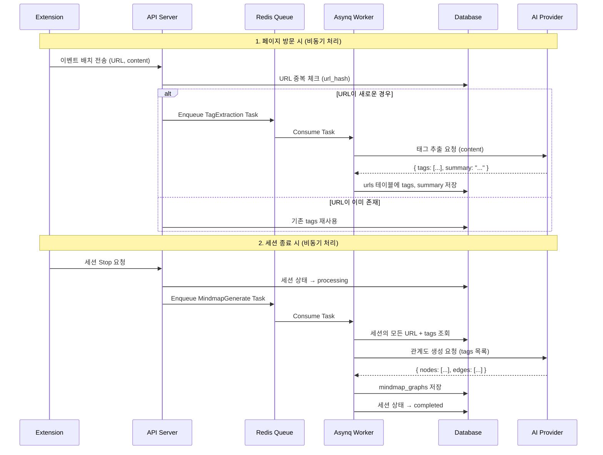

# Phase 10.2: 마인드맵 생성

## 개요

| 항목 | 내용 |
|-----|------|
| **목표** | AI Provider를 활용한 태그 추출 및 마인드맵 생성 Worker Handler 구현 |
| **선행 조건** | Phase 10.1 완료 (AI 설정 및 로깅) |
| **예상 소요** | 3 Steps |
| **결과물** | 페이지 방문 시 태그 추출, 세션 종료 시 관계도 JSON 생성 |

> **Note**: AI Provider 구현은 [Phase 10](./phase-10-ai.md),
> AI 설정 관리는 [Phase 10.1](./phase-10.1-ai-config.md)을 참조하세요.

---

## 마인드맵 생성 알고리즘

### 핵심 원칙

1. **페이지 방문 시**: LLM으로 태그/키워드 추출 (페이지당 1회, 중복 URL은 재사용)
2. **세션 종료 시**: 추출된 태그들을 기반으로 LLM이 관계도 JSON 생성 (세션당 1회)

### 처리 흐름 (Asynq Worker 기반)



### 태그 추출 (페이지당)

| 항목 | 설명 |
|-----|------|
| **트리거** | 이벤트 배치 수신 시 새로운 URL 감지 → Asynq Task Enqueue |
| **입력** | 페이지 제목, 콘텐츠 (최대 10,000자) |
| **출력** | 3-5개 태그, 1-2문장 요약 |
| **저장** | `urls.tags`, `urls.summary` |
| **중복 처리** | url_hash로 중복 체크, 기존 URL은 재처리 안 함 |

### 관계도 생성 (세션당)

| 항목 | 설명 |
|-----|------|
| **트리거** | 세션 종료 (Stop) 시 → Asynq Task Enqueue |
| **입력** | 세션의 모든 URL + tags + 체류시간 + 하이라이트 |
| **출력** | 마인드맵 JSON (nodes, edges) |
| **저장** | `mindmap_graphs` 테이블 |

### 비용 최적화

| 전략 | 설명 |
|-----|------|
| **URL 중복 제거** | 같은 URL은 태그 1번만 추출 (url_hash 기반) |
| **비동기 처리** | Asynq Worker에서 처리하여 API 응답 속도 유지 |
| **경량 모델 사용** | 태그 추출은 GPT-3.5/Gemini Flash로 충분 |
| **관계도만 고급 모델** | 세션당 1회이므로 GPT-4/Claude 사용 가능 |

---

## 진행 상황

| Step | 이름 | 상태 |
|------|------|------|
| 10.2.1 | 태그 추출 Worker Handler | ⬜ |
| 10.2.2 | 마인드맵 생성 Worker Handler | ⬜ |
| 10.2.3 | UsageService 연동 (토큰 측정) | ⬜ |

---

## Step 10.2.1: 태그 추출 Worker Handler

### 목표

이벤트 배치 수신 시 새로운 URL에 대해 Asynq Task를 생성하고, Worker에서 태그를 추출합니다.

### 체크리스트

- [ ] **태그 추출 Task 정의**
  - [ ] `internal/infrastructure/queue/tasks.go`

    ```go
    const TypeURLTagExtraction = "url:tag_extraction"

    type URLTagExtractionPayload struct {
        URLID string `json:"url_id"`
    }

    func NewURLTagExtractionTask(urlID string) (*asynq.Task, error) {
        payload, err := json.Marshal(URLTagExtractionPayload{URLID: urlID})
        if err != nil {
            return nil, err
        }
        return asynq.NewTask(TypeURLTagExtraction, payload), nil
    }
    ```

- [ ] **태그 추출 Handler 구현**
  - [ ] `internal/worker/handler/tag_extraction.go`

    ```go
    package handler

    import (
        "context"
        "encoding/json"
        "fmt"
        "log/slog"

        "github.com/google/uuid"
        "github.com/hibiken/asynq"

        "github.com/mindhit/api/ent"
        "github.com/mindhit/api/internal/infrastructure/ai"
        "github.com/mindhit/api/internal/infrastructure/queue"
    )

    const tagExtractionPrompt = `웹 페이지를 분석하고 다음을 추출하세요:

    1. 핵심 태그 3-5개 (한국어, 명사형)
    2. 1-2문장 요약 (한국어)

    페이지 제목: %s
    페이지 내용:
    %s

    JSON 형식으로 응답:
    {
      "tags": ["태그1", "태그2", "태그3"],
      "summary": "페이지 요약"
    }`

    // TagResult represents the AI response for tag extraction.
    type TagResult struct {
        Tags    []string `json:"tags"`
        Summary string   `json:"summary"`
    }

    // HandleURLTagExtraction processes tag extraction for a URL.
    func (h *handlers) HandleURLTagExtraction(ctx context.Context, t *asynq.Task) error {
        var payload queue.URLTagExtractionPayload
        if err := json.Unmarshal(t.Payload(), &payload); err != nil {
            return fmt.Errorf("unmarshal payload: %w", err)
        }

        urlID, err := uuid.Parse(payload.URLID)
        if err != nil {
            return fmt.Errorf("parse url id: %w", err)
        }

        slog.Info("extracting tags", "url_id", payload.URLID)

        // Get URL from database
        u, err := h.client.URL.Get(ctx, urlID)
        if err != nil {
            return fmt.Errorf("get url: %w", err)
        }

        // Skip if already has tags
        if len(u.Tags) > 0 {
            slog.Debug("url already has tags, skipping", "url", u.URL)
            return nil
        }

        // Skip if no content
        if u.Content == "" {
            slog.Warn("url has no content, skipping", "url", u.URL)
            return nil
        }

        // Generate tags using AI
        req := ai.ChatRequest{
            UserPrompt: fmt.Sprintf(tagExtractionPrompt, u.Title, truncateContent(u.Content, 8000)),
            Options: ai.ChatOptions{
                MaxTokens: 500,
                JSONMode:  true,
            },
            Metadata: map[string]string{
                "url_id": urlID.String(),
            },
        }

        response, err := h.aiManager.Chat(ctx, ai.TaskTagExtraction, req)
        if err != nil {
            return fmt.Errorf("ai tag extraction: %w", err)
        }

        var result TagResult
        if err := json.Unmarshal([]byte(response.Content), &result); err != nil {
            return fmt.Errorf("parse ai response: %w", err)
        }

        // Update URL with tags and summary
        _, err = h.client.URL.UpdateOneID(urlID).
            SetTags(result.Tags).
            SetSummary(result.Summary).
            Save(ctx)

        if err != nil {
            return fmt.Errorf("update url: %w", err)
        }

        slog.Info("extracted tags",
            "url", u.URL,
            "tags", result.Tags,
            "provider", response.Provider,
            "tokens", response.TotalTokens,
        )
        return nil
    }

    func truncateContent(content string, maxLen int) string {
        if len(content) <= maxLen {
            return content
        }
        return content[:maxLen] + "..."
    }
    ```

- [ ] **Handler 등록 업데이트**
  - [ ] `internal/worker/handler/handler.go`

    ```go
    package handler

    import (
        "github.com/mindhit/api/ent"
        "github.com/mindhit/api/internal/infrastructure/ai"
        "github.com/mindhit/api/internal/infrastructure/queue"
    )

    type handlers struct {
        client    *ent.Client
        aiManager *ai.ProviderManager
    }

    // RegisterHandlers registers all worker handlers.
    func RegisterHandlers(server *queue.Server, client *ent.Client, aiManager *ai.ProviderManager) {
        h := &handlers{
            client:    client,
            aiManager: aiManager,
        }

        server.HandleFunc(queue.TypeSessionProcess, h.HandleSessionProcess)
        server.HandleFunc(queue.TypeSessionCleanup, h.HandleSessionCleanup)
        server.HandleFunc(queue.TypeURLTagExtraction, h.HandleURLTagExtraction)
        server.HandleFunc(queue.TypeMindmapGenerate, h.HandleMindmapGenerate)
    }
    ```

- [ ] **API에서 새 URL 발견 시 Task Enqueue**
  - [ ] `internal/service/event_service.go`

    ```go
    type EventService struct {
        client      *ent.Client
        queueClient *queue.Client
    }

    func (s *EventService) ProcessBatchEvents(ctx context.Context, sessionID uuid.UUID, events []Event) error {
        for _, event := range events {
            if event.Type == "page_visit" {
                urlID, isNew, err := s.upsertURL(ctx, event)
                if err != nil {
                    slog.Error("failed to upsert url", "error", err)
                    continue
                }

                // Enqueue tag extraction for new URLs
                if isNew {
                    task, err := queue.NewURLTagExtractionTask(urlID.String())
                    if err != nil {
                        slog.Error("failed to create tag extraction task", "error", err)
                        continue
                    }

                    _, err = s.queueClient.Enqueue(task, asynq.MaxRetry(3))
                    if err != nil {
                        slog.Error("failed to enqueue tag extraction task", "error", err)
                    }
                }
            }
        }
        return nil
    }
    ```

### 검증

```bash
# Worker 실행
cd apps/backend
REDIS_ADDR=localhost:6379 go run ./cmd/worker

# API 실행 후 이벤트 전송
curl -X POST http://localhost:8080/api/v1/events/batch \
  -H "Authorization: Bearer $TOKEN" \
  -d '{"session_id": "...", "events": [{"type": "page_visit", ...}]}'

# Worker 로그 확인
# "extracting tags" url_id=...
# "extracted tags" url=https://... tags=["AI", "머신러닝"]
```

---

## Step 10.2.2: 마인드맵 생성 Worker Handler

### 목표

세션 종료 시 Asynq Task를 생성하고, Worker에서 관계도 JSON을 생성합니다.

### 체크리스트

- [ ] **마인드맵 타입 정의**
  - [ ] `internal/service/mindmap_types.go`

    ```go
    package service

    // MindmapNode represents a node in the mindmap graph.
    type MindmapNode struct {
        ID       string                 `json:"id"`
        Label    string                 `json:"label"`
        Type     string                 `json:"type"` // core, topic, subtopic, page
        Size     float64                `json:"size"`
        Color    string                 `json:"color"`
        Position *Position              `json:"position,omitempty"`
        Data     map[string]interface{} `json:"data"`
    }

    // Position represents 3D coordinates.
    type Position struct {
        X float64 `json:"x"`
        Y float64 `json:"y"`
        Z float64 `json:"z"`
    }

    // MindmapEdge represents a connection between nodes.
    type MindmapEdge struct {
        Source string  `json:"source"`
        Target string  `json:"target"`
        Weight float64 `json:"weight"`
        Label  string  `json:"label,omitempty"`
    }

    // MindmapLayout defines the layout configuration.
    type MindmapLayout struct {
        Type   string                 `json:"type"` // galaxy, tree, radial
        Params map[string]interface{} `json:"params"`
    }

    // MindmapData contains the complete mindmap structure.
    type MindmapData struct {
        Nodes  []MindmapNode `json:"nodes"`
        Edges  []MindmapEdge `json:"edges"`
        Layout MindmapLayout `json:"layout"`
    }
    ```

- [ ] **마인드맵 생성 Task 정의**
  - [ ] `internal/infrastructure/queue/tasks.go`

    ```go
    const TypeMindmapGenerate = "mindmap:generate"

    type MindmapGeneratePayload struct {
        SessionID string `json:"session_id"`
    }

    func NewMindmapGenerateTask(sessionID string) (*asynq.Task, error) {
        payload, err := json.Marshal(MindmapGeneratePayload{SessionID: sessionID})
        if err != nil {
            return nil, err
        }
        return asynq.NewTask(TypeMindmapGenerate, payload), nil
    }
    ```

- [ ] **마인드맵 생성 Handler 구현**
  - [ ] `internal/worker/handler/mindmap.go`

    ```go
    package handler

    import (
        "context"
        "encoding/json"
        "fmt"
        "log/slog"
        "math"
        "strings"

        "github.com/google/uuid"
        "github.com/hibiken/asynq"

        "github.com/mindhit/api/ent"
        "github.com/mindhit/api/ent/session"
        "github.com/mindhit/api/internal/infrastructure/ai"
        "github.com/mindhit/api/internal/infrastructure/queue"
        "github.com/mindhit/api/internal/service"
    )

    const relationshipGraphPrompt = `브라우징 세션의 페이지들과 추출된 태그를 분석하여 관계도를 생성하세요.

    ## 세션 데이터

    ### 방문한 페이지들 (URL + 태그 + 요약)

    %s

    ### 하이라이트 (사용자가 선택한 텍스트)

    %s

    ## 요청사항

    1. **핵심 주제 (core)**: 세션 전체를 관통하는 중심 테마 1개
    2. **주요 토픽 (topics)**: 공통 태그를 기반으로 3-5개 그룹화
    3. **페이지 연결**: 각 토픽에 해당하는 페이지들 매핑
    4. **토픽 간 연결 (connections)**: 태그가 겹치는 토픽들의 관계

    ## JSON 형식으로 응답

    {
      "core": {
        "label": "핵심 주제 (한국어)",
        "description": "세션 전체 요약 (1-2문장)"
      },
      "topics": [
        {
          "id": "topic-1",
          "label": "토픽명 (한국어)",
          "tags": ["관련", "태그들"],
          "description": "토픽 설명",
          "pages": [
            {
              "url_id": "uuid",
              "title": "페이지 제목",
              "relevance": 0.9
            }
          ]
        }
      ],
      "connections": [
        {
          "from": "topic-1",
          "to": "topic-2",
          "shared_tags": ["공통태그"],
          "reason": "연결 이유"
        }
      ]
    }`

    // RelationshipGraphResponse represents the AI response structure.
    type RelationshipGraphResponse struct {
        Core struct {
            Label       string `json:"label"`
            Description string `json:"description"`
        } `json:"core"`
        Topics []struct {
            ID          string   `json:"id"`
            Label       string   `json:"label"`
            Tags        []string `json:"tags"`
            Description string   `json:"description"`
            Pages       []struct {
                URLID     string  `json:"url_id"`
                Title     string  `json:"title"`
                Relevance float64 `json:"relevance"`
            } `json:"pages"`
        } `json:"topics"`
        Connections []struct {
            From       string   `json:"from"`
            To         string   `json:"to"`
            SharedTags []string `json:"shared_tags"`
            Reason     string   `json:"reason"`
        } `json:"connections"`
    }

    // HandleMindmapGenerate processes mindmap generation for a session.
    func (h *handlers) HandleMindmapGenerate(ctx context.Context, t *asynq.Task) error {
        var payload queue.MindmapGeneratePayload
        if err := json.Unmarshal(t.Payload(), &payload); err != nil {
            return fmt.Errorf("unmarshal payload: %w", err)
        }

        sessionID, err := uuid.Parse(payload.SessionID)
        if err != nil {
            return fmt.Errorf("parse session id: %w", err)
        }

        slog.Info("generating mindmap", "session_id", payload.SessionID)

        // Get session with all related data
        sess, err := h.client.Session.
            Query().
            Where(session.IDEQ(sessionID)).
            WithPageVisits(func(q *ent.PageVisitQuery) {
                q.WithURL()
            }).
            WithHighlights().
            WithUser().
            Only(ctx)

        if err != nil {
            return fmt.Errorf("get session: %w", err)
        }

        // Build page data with tags
        var pageData strings.Builder
        durationMsMap := make(map[string]int)

        for _, pv := range sess.Edges.PageVisits {
            if pv.Edges.URL == nil {
                continue
            }
            u := pv.Edges.URL

            durationMs := 0
            if pv.DurationMs != nil {
                durationMs = *pv.DurationMs
            }
            durationMsMap[u.ID.String()] = durationMs

            pageData.WriteString(fmt.Sprintf(`
    - ID: %s
      제목: %s
      URL: %s
      태그: [%s]
      요약: %s
      체류시간: %dms
    `,
                u.ID.String(),
                u.Title,
                u.URL,
                strings.Join(u.Tags, ", "),
                u.Summary,
                durationMs,
            ))
        }

        // Build highlights text
        var highlights strings.Builder
        if len(sess.Edges.Highlights) > 0 {
            for _, hl := range sess.Edges.Highlights {
                highlights.WriteString(fmt.Sprintf("- \"%s\"\n", hl.Text))
            }
        } else {
            highlights.WriteString("(하이라이트 없음)")
        }

        // Generate relationship graph using AI
        req := ai.ChatRequest{
            UserPrompt: fmt.Sprintf(relationshipGraphPrompt, pageData.String(), highlights.String()),
            Options: ai.ChatOptions{
                MaxTokens: 4096,
                JSONMode:  true,
            },
            Metadata: map[string]string{
                "session_id": sessionID.String(),
                "user_id":    sess.Edges.User.ID.String(),
            },
        }

        response, err := h.aiManager.Chat(ctx, ai.TaskMindmap, req)
        if err != nil {
            return fmt.Errorf("ai generate mindmap: %w", err)
        }

        var aiResp RelationshipGraphResponse
        if err := json.Unmarshal([]byte(response.Content), &aiResp); err != nil {
            return fmt.Errorf("parse ai response: %w", err)
        }

        // Convert AI response to mindmap data
        mindmapData := buildMindmapFromRelationship(aiResp, durationMsMap)

        // Convert to JSON for storage
        nodesJSON, _ := json.Marshal(mindmapData.Nodes)
        edgesJSON, _ := json.Marshal(mindmapData.Edges)
        layoutJSON, _ := json.Marshal(mindmapData.Layout)

        // Save mindmap to database
        _, err = h.client.MindmapGraph.
            Create().
            SetSessionID(sessionID).
            SetNodes(nodesJSON).
            SetEdges(edgesJSON).
            SetLayout(layoutJSON).
            Save(ctx)

        if err != nil {
            return fmt.Errorf("save mindmap: %w", err)
        }

        // Update session status to completed
        _, err = h.client.Session.
            UpdateOneID(sessionID).
            SetStatus(session.StatusCompleted).
            Save(ctx)

        if err != nil {
            return fmt.Errorf("update session status: %w", err)
        }

        slog.Info("mindmap generated",
            "session_id", payload.SessionID,
            "topics", len(aiResp.Topics),
            "connections", len(aiResp.Connections),
            "provider", response.Provider,
            "tokens", response.TotalTokens,
        )
        return nil
    }

    func buildMindmapFromRelationship(
        resp RelationshipGraphResponse,
        durationMsMap map[string]int,
    ) service.MindmapData {
        var nodes []service.MindmapNode
        var edges []service.MindmapEdge

        // Core node
        coreID := "core"
        nodes = append(nodes, service.MindmapNode{
            ID:       coreID,
            Label:    resp.Core.Label,
            Type:     "core",
            Size:     100,
            Color:    "#FFD700",
            Position: &service.Position{X: 0, Y: 0, Z: 0},
            Data: map[string]interface{}{
                "description": resp.Core.Description,
            },
        })

        // Topic nodes
        topicCount := len(resp.Topics)
        for i, topic := range resp.Topics {
            topicID := topic.ID
            if topicID == "" {
                topicID = fmt.Sprintf("topic-%d", i)
            }

            angle := (float64(i) / float64(topicCount)) * 2 * math.Pi
            radius := 200.0
            topicSize := 40.0 + float64(len(topic.Pages))*10
            if topicSize > 80 {
                topicSize = 80
            }

            nodes = append(nodes, service.MindmapNode{
                ID:    topicID,
                Label: topic.Label,
                Type:  "topic",
                Size:  topicSize,
                Color: getTopicColor(i),
                Position: &service.Position{
                    X: radius * math.Cos(angle),
                    Y: radius * math.Sin(angle),
                    Z: 0,
                },
                Data: map[string]interface{}{
                    "description": topic.Description,
                    "tags":        topic.Tags,
                },
            })

            edges = append(edges, service.MindmapEdge{
                Source: coreID,
                Target: topicID,
                Weight: 1.0,
            })

            // Page nodes
            for j, page := range topic.Pages {
                pageID := page.URLID
                subAngle := angle + (float64(j)-float64(len(topic.Pages))/2)*0.4
                subRadius := 60.0 + float64(j)*15

                size := 15.0
                if durationMs, ok := durationMsMap[page.URLID]; ok {
                    size = math.Min(40, 15+float64(durationMs)/20000)
                }
                size = size * (0.5 + page.Relevance*0.5)

                nodes = append(nodes, service.MindmapNode{
                    ID:    pageID,
                    Label: page.Title,
                    Type:  "page",
                    Size:  size,
                    Color: getTopicColor(i),
                    Position: &service.Position{
                        X: radius*math.Cos(angle) + subRadius*math.Cos(subAngle),
                        Y: radius*math.Sin(angle) + subRadius*math.Sin(subAngle),
                        Z: 0,
                    },
                    Data: map[string]interface{}{
                        "url_id":    page.URLID,
                        "relevance": page.Relevance,
                    },
                })

                edges = append(edges, service.MindmapEdge{
                    Source: topicID,
                    Target: pageID,
                    Weight: page.Relevance,
                })
            }
        }

        // Cross-topic connections
        for _, conn := range resp.Connections {
            edges = append(edges, service.MindmapEdge{
                Source: conn.From,
                Target: conn.To,
                Weight: float64(len(conn.SharedTags)) * 0.2,
                Label:  conn.Reason,
            })
        }

        return service.MindmapData{
            Nodes: nodes,
            Edges: edges,
            Layout: service.MindmapLayout{
                Type: "galaxy",
                Params: map[string]interface{}{
                    "center": []float64{0, 0, 0},
                    "scale":  1.0,
                },
            },
        }
    }

    func getTopicColor(index int) string {
        colors := []string{
            "#3B82F6", "#10B981", "#F59E0B", "#EF4444",
            "#8B5CF6", "#EC4899", "#14B8A6", "#F97316",
        }
        return colors[index%len(colors)]
    }
    ```

- [ ] **세션 Stop 시 Task Enqueue**
  - [ ] `internal/service/session_service.go`

    ```go
    func (s *SessionService) StopSession(ctx context.Context, sessionID string) (*ent.Session, error) {
        id, _ := uuid.Parse(sessionID)
        sess, err := s.client.Session.Query().
            Where(session.IDEQ(id)).
            Only(ctx)
        if err != nil {
            return nil, err
        }

        // Update status to processing
        sess, err = s.client.Session.UpdateOne(sess).
            SetStatus(session.StatusProcessing).
            Save(ctx)
        if err != nil {
            return nil, err
        }

        // Enqueue mindmap generation task
        task, err := queue.NewMindmapGenerateTask(sessionID)
        if err != nil {
            slog.Error("failed to create mindmap task", "error", err)
            return sess, nil
        }

        _, err = s.queueClient.Enqueue(task, asynq.MaxRetry(3))
        if err != nil {
            slog.Error("failed to enqueue mindmap task", "error", err)
            return sess, nil
        }

        slog.Info("mindmap generation enqueued", "session_id", sessionID)
        return sess, nil
    }
    ```

- [ ] **Worker main.go 업데이트**
  - [ ] `cmd/worker/main.go`

    ```go
    func main() {
        cfg := config.Load()

        slog.SetDefault(slog.New(slog.NewJSONHandler(os.Stdout, &slog.HandlerOptions{
            Level: slog.LevelInfo,
        })))

        // Connect to database
        client, err := ent.Open("postgres", cfg.DatabaseURL)
        if err != nil {
            slog.Error("failed to connect to database", "error", err)
            os.Exit(1)
        }
        defer client.Close()

        // Initialize services
        aiConfigService := service.NewAIConfigService(client)
        aiLogService := service.NewAILogService(client)

        // Initialize AI Provider Manager
        ctx := context.Background()
        aiManager, err := ai.NewProviderManager(ctx, cfg.AI, aiConfigService, aiLogService)
        if err != nil {
            slog.Error("failed to initialize ai manager", "error", err)
            os.Exit(1)
        }
        defer aiManager.Close()

        // Create worker server
        server := queue.NewServer(queue.ServerConfig{
            RedisAddr:   cfg.RedisAddr,
            Concurrency: cfg.WorkerConcurrency,
        })

        // Register handlers with AI manager
        handler.RegisterHandlers(server, client, aiManager)

        // Graceful shutdown
        go func() {
            sigCh := make(chan os.Signal, 1)
            signal.Notify(sigCh, syscall.SIGINT, syscall.SIGTERM)
            <-sigCh
            slog.Info("shutting down worker")
            server.Shutdown()
        }()

        if err := server.Run(); err != nil {
            slog.Error("worker server error", "error", err)
            os.Exit(1)
        }
    }
    ```

### 검증

```bash
# Worker 실행
cd apps/backend
REDIS_ADDR=localhost:6379 \
OPENAI_API_KEY=sk-... \
go run ./cmd/worker

# API에서 세션 종료
curl -X POST http://localhost:8080/api/v1/sessions/{id}/stop \
  -H "Authorization: Bearer $TOKEN"

# Worker 로그 확인
# "generating mindmap" session_id=...
# "mindmap generated" session_id=... topics=4 connections=2
```

---

## 프로바이더 비교

| 프로바이더 | 모델 | 장점 | 단점 | 권장 용도 |
|-----------|------|------|------|----------|
| **OpenAI** | gpt-4o | JSON mode 네이티브 지원, 안정적 | 비용 높음 | 마인드맵 생성 |
| **Gemini** | gemini-2.0-flash | 빠르고 저렴, 긴 컨텍스트 | JSON 불안정 가능 | 태그 추출 |
| **Claude** | claude-sonnet-4 | 뛰어난 분석력, 한국어 우수 | JSON mode 없음 | 복잡한 분석 |

### 권장 설정

```env
# 비용 최적화 설정
AI_DEFAULT_PROVIDER=gemini
AI_TAG_PROVIDER=gemini              # 저비용, 빠름
AI_MINDMAP_PROVIDER=openai          # JSON 안정성
GEMINI_MODEL=gemini-2.0-flash
```

---

## Step 10.2.3: UsageService 연동 (토큰 측정)

### 목표

AI 서비스에서 토큰 사용량을 **정확하게** 추적하고 제한을 체크합니다.

### 토큰 측정 원리

AI API는 응답에 **실제 사용된 토큰 수**를 포함하여 반환합니다.

**AI 제공업체별 응답 필드:**

| 제공업체 | 응답 필드 | 예시 값 |
|---------|----------|--------|
| OpenAI | `response.Usage.TotalTokens` | 3847 |
| Google Gemini | `response.UsageMetadata.TotalTokenCount` | 3847 |
| Anthropic Claude | `response.Usage.InputTokens + OutputTokens` | 3847 |

### 체크리스트

- [ ] AI 서비스에 UsageService 의존성 주입
- [ ] 요청 전 사용량 제한 체크
- [ ] API 호출 후 응답에서 토큰 사용량 추출
- [ ] token_usage 테이블에 정확한 값 기록
- [ ] 제한 초과 시 적절한 에러 반환

### 코드 예시

```go
// internal/worker/handler/mindmap.go
func (h *handlers) HandleMindmapGenerate(ctx context.Context, t *asynq.Task) error {
    // ... 기존 코드 ...

    // 1. 제한 체크
    status, err := h.usageService.CheckLimit(ctx, userID)
    if err != nil {
        return err
    }
    if !status.CanUseAI {
        return ErrTokenLimitExceeded
    }

    // 2. AI 호출
    response, err := h.aiManager.Chat(ctx, ai.TaskMindmap, req)
    if err != nil {
        return err
    }

    // 3. 토큰 사용량 기록
    tokensUsed := response.TotalTokens
    if err := h.usageService.RecordUsage(ctx, service.UsageRecord{
        UserID:    userID,
        SessionID: sessionID,
        Operation: "mindmap",
        Tokens:    tokensUsed,
        AIModel:   response.Model,
    }); err != nil {
        slog.Error("failed to record usage", "error", err)
    }

    // ... 나머지 처리 ...
}
```

---

## Phase 10.2 완료 확인

### 전체 검증 체크리스트

- [ ] 태그 추출 Worker Handler 구현
- [ ] 마인드맵 생성 Worker Handler 구현
- [ ] API에서 Task Enqueue 연동
- [ ] Worker에서 AI 처리 완료
- [ ] UsageService 연동 (토큰 측정)

### 테스트 요구사항

| 테스트 유형 | 대상 | 파일 |
| ----------- | ---- | ---- |
| 단위 테스트 | 마인드맵 그래프 생성 | `handler/mindmap_test.go` |
| 단위 테스트 | 태그 추출 Handler | `handler/tag_extraction_test.go` |
| 단위 테스트 | 토큰 사용량 기록 | `service/usage_service_test.go` |

```bash
# Phase 10.2 테스트 실행
moonx backend:test -- -run "TestMindmap|TestTag|TestUsage"
```

### 산출물 요약

| 항목 | 위치 |
| ---- | ---- |
| 태그 추출 Handler | `internal/worker/handler/tag_extraction.go` |
| 마인드맵 Handler | `internal/worker/handler/mindmap.go` |
| 마인드맵 타입 | `internal/service/mindmap_types.go` |
| 테스트 | `internal/worker/handler/*_test.go` |

---

## 다음 Phase

Phase 10.2 완료 후 [Phase 11: 웹앱 대시보드](./phase-11-dashboard.md)로 진행하세요.
