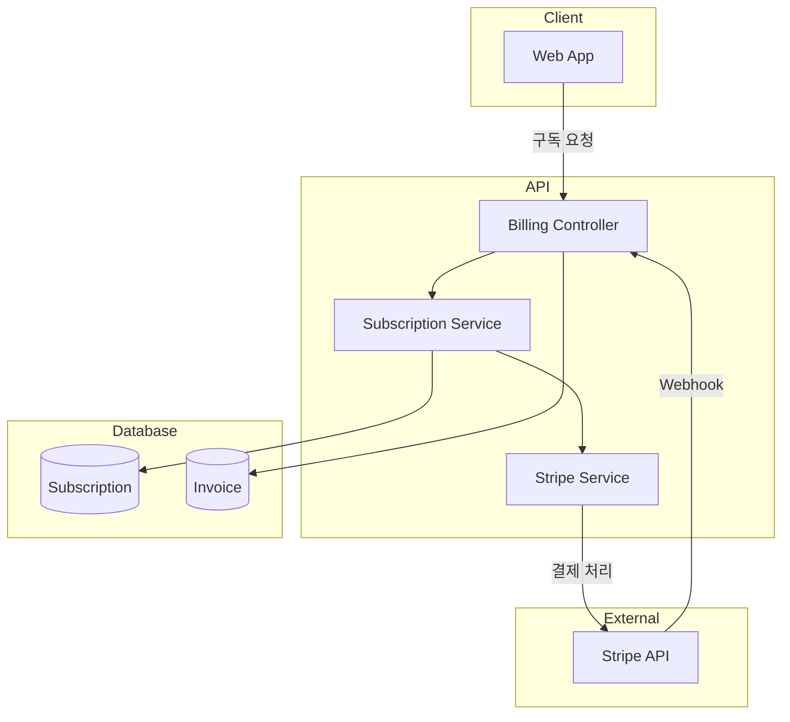
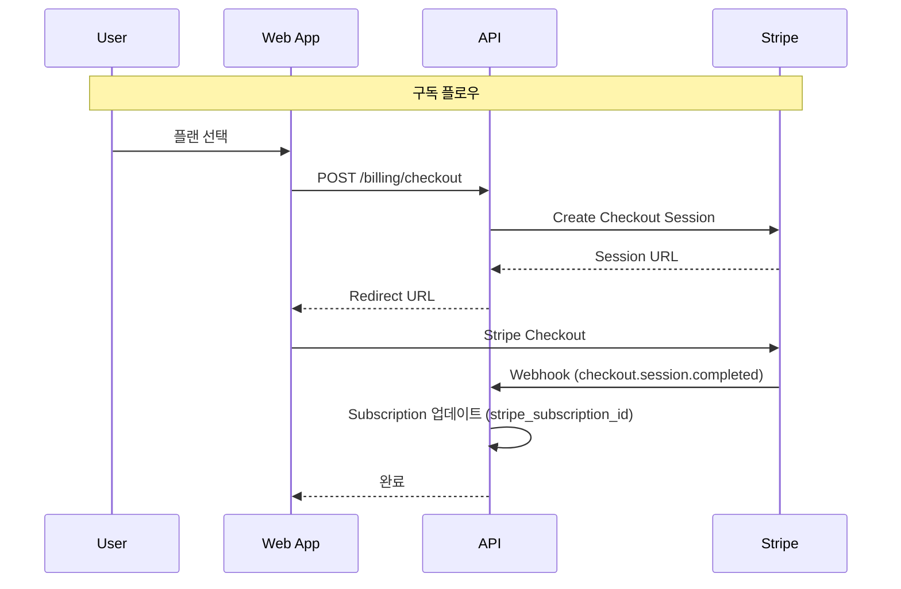

# Phase 14: Stripe 결제 연동

## 개요

| 항목 | 내용 |
|-----|------|
| **목표** | Stripe 결제 연동 및 구독 관리 UI 구현 |
| **선행 조건** | Phase 13 (배포 및 운영) 완료, Phase 9 (플랜/사용량 기초) 구현됨 |
| **예상 소요** | 3 Steps |
| **결과물** | Stripe Checkout, Customer Portal, Webhook 처리, 구독 관리 UI |

> **Note**: Phase 9에서 Plan, Subscription, TokenUsage 스키마와 기본 서비스가 구현되었습니다.
> 이 Phase에서는 Stripe 결제 연동과 웹앱 UI만 구현합니다.

---

## 아키텍처





---

## 진행 상황

| Step | 이름 | 상태 |
|------|------|------|
| 14.1 | Stripe 서비스 및 Webhook 구현 | ⬜ |
| 14.2 | 구독 관리 UI 구현 | ⬜ |
| 14.3 | 테스트 및 문서화 | ⬜ |

---

## Step 14.1: Stripe 서비스 및 Webhook 구현

### 목표

Stripe API 연동 서비스와 Webhook 처리를 구현합니다.

### 환경 변수

```env
STRIPE_SECRET_KEY=sk_test_...
STRIPE_WEBHOOK_SECRET=whsec_...
STRIPE_PRICE_PRO_MONTHLY=price_...
STRIPE_PRICE_PRO_YEARLY=price_...
```

### 체크리스트

- [ ] **의존성 추가**

  ```bash
  cd apps/backend
  go get github.com/stripe/stripe-go/v76
  ```

- [ ] `pkg/service/stripe_service.go` 생성
  - [ ] CreateCheckoutSession: Stripe Checkout 세션 생성
  - [ ] CreateCustomerPortalSession: Customer Portal 세션 생성
  - [ ] HandleWebhook: Stripe webhook 처리

- [ ] `internal/api/controller/billing_controller.go` 생성
  - [ ] POST `/v1/billing/checkout` - Checkout 세션 생성
  - [ ] POST `/v1/billing/portal` - Customer Portal URL
  - [ ] POST `/webhook/stripe` - Stripe webhook

- [ ] **Invoice 스키마 추가** (Phase 9에서 누락된 경우)

### 코드 예시

**pkg/service/stripe_service.go:**

```go
package service

import (
    "context"
    "fmt"

    "github.com/google/uuid"
    "github.com/stripe/stripe-go/v76"
    "github.com/stripe/stripe-go/v76/checkout/session"
    "github.com/stripe/stripe-go/v76/billingportal/session"
    "github.com/stripe/stripe-go/v76/webhook"
)

type StripeService struct {
    secretKey       string
    webhookSecret   string
    proPriceID      string
    successURL      string
    cancelURL       string
}

func NewStripeService(cfg StripeConfig) *StripeService {
    stripe.Key = cfg.SecretKey
    return &StripeService{
        secretKey:     cfg.SecretKey,
        webhookSecret: cfg.WebhookSecret,
        proPriceID:    cfg.ProPriceID,
        successURL:    cfg.SuccessURL,
        cancelURL:     cfg.CancelURL,
    }
}

// CreateCheckoutSession creates a Stripe Checkout session for subscription
func (s *StripeService) CreateCheckoutSession(ctx context.Context, userID uuid.UUID, customerEmail string) (string, error) {
    params := &stripe.CheckoutSessionParams{
        CustomerEmail: stripe.String(customerEmail),
        Mode:          stripe.String(string(stripe.CheckoutSessionModeSubscription)),
        LineItems: []*stripe.CheckoutSessionLineItemParams{
            {
                Price:    stripe.String(s.proPriceID),
                Quantity: stripe.Int64(1),
            },
        },
        SuccessURL: stripe.String(s.successURL + "?session_id={CHECKOUT_SESSION_ID}"),
        CancelURL:  stripe.String(s.cancelURL),
        Metadata: map[string]string{
            "user_id": userID.String(),
        },
    }

    sess, err := session.New(params)
    if err != nil {
        return "", fmt.Errorf("create checkout session: %w", err)
    }

    return sess.URL, nil
}

// CreatePortalSession creates a Stripe Customer Portal session
func (s *StripeService) CreatePortalSession(ctx context.Context, stripeCustomerID, returnURL string) (string, error) {
    params := &stripe.BillingPortalSessionParams{
        Customer:  stripe.String(stripeCustomerID),
        ReturnURL: stripe.String(returnURL),
    }

    sess, err := portalsession.New(params)
    if err != nil {
        return "", fmt.Errorf("create portal session: %w", err)
    }

    return sess.URL, nil
}

// VerifyWebhook verifies and parses a Stripe webhook event
func (s *StripeService) VerifyWebhook(payload []byte, signature string) (*stripe.Event, error) {
    event, err := webhook.ConstructEvent(payload, signature, s.webhookSecret)
    if err != nil {
        return nil, fmt.Errorf("verify webhook: %w", err)
    }
    return &event, nil
}
```

**internal/api/controller/billing_controller.go:**

```go
package controller

import (
    "io"
    "log/slog"
    "net/http"

    "github.com/gin-gonic/gin"
    "github.com/stripe/stripe-go/v76"
)

type BillingController struct {
    stripeService       *service.StripeService
    subscriptionService *service.SubscriptionService
}

// POST /v1/billing/checkout
func (c *BillingController) CreateCheckout(ctx *gin.Context) {
    userID := ctx.MustGet("user_id").(uuid.UUID)
    email := ctx.MustGet("email").(string)

    url, err := c.stripeService.CreateCheckoutSession(ctx, userID, email)
    if err != nil {
        ctx.JSON(http.StatusInternalServerError, gin.H{"error": err.Error()})
        return
    }

    ctx.JSON(http.StatusOK, gin.H{"url": url})
}

// POST /v1/billing/portal
func (c *BillingController) CreatePortal(ctx *gin.Context) {
    userID := ctx.MustGet("user_id").(uuid.UUID)

    sub, err := c.subscriptionService.GetSubscription(ctx, userID)
    if err != nil || sub.StripeCustomerID == nil {
        ctx.JSON(http.StatusBadRequest, gin.H{"error": "No active subscription"})
        return
    }

    url, err := c.stripeService.CreatePortalSession(ctx, *sub.StripeCustomerID, "https://mindhit.app/settings")
    if err != nil {
        ctx.JSON(http.StatusInternalServerError, gin.H{"error": err.Error()})
        return
    }

    ctx.JSON(http.StatusOK, gin.H{"url": url})
}

// POST /webhook/stripe
func (c *BillingController) HandleWebhook(ctx *gin.Context) {
    payload, err := io.ReadAll(ctx.Request.Body)
    if err != nil {
        ctx.JSON(http.StatusBadRequest, gin.H{"error": "Failed to read body"})
        return
    }

    signature := ctx.GetHeader("Stripe-Signature")
    event, err := c.stripeService.VerifyWebhook(payload, signature)
    if err != nil {
        slog.Error("webhook verification failed", "error", err)
        ctx.JSON(http.StatusBadRequest, gin.H{"error": "Invalid signature"})
        return
    }

    switch event.Type {
    case "checkout.session.completed":
        c.handleCheckoutCompleted(ctx, event)
    case "customer.subscription.updated":
        c.handleSubscriptionUpdated(ctx, event)
    case "customer.subscription.deleted":
        c.handleSubscriptionDeleted(ctx, event)
    case "invoice.payment_failed":
        c.handlePaymentFailed(ctx, event)
    }

    ctx.JSON(http.StatusOK, gin.H{"received": true})
}

func (c *BillingController) handleCheckoutCompleted(ctx *gin.Context, event *stripe.Event) {
    var checkoutSession stripe.CheckoutSession
    if err := json.Unmarshal(event.Data.Raw, &checkoutSession); err != nil {
        slog.Error("failed to parse checkout session", "error", err)
        return
    }

    userID, _ := uuid.Parse(checkoutSession.Metadata["user_id"])

    // Update subscription with Stripe IDs
    err := c.subscriptionService.ActivateSubscription(ctx, userID,
        checkoutSession.Customer.ID,
        checkoutSession.Subscription.ID,
    )
    if err != nil {
        slog.Error("failed to activate subscription", "error", err)
    }
}
```

### 검증

```bash
# Stripe CLI 설치 및 로그인
stripe login

# Webhook 포워딩
stripe listen --forward-to localhost:8080/webhook/stripe

# 테스트 이벤트 전송
stripe trigger checkout.session.completed
```

---

## Step 14.2: 구독 관리 UI 구현

### 목표

웹앱에서 구독 관리 페이지와 사용량 시각화를 구현합니다.

### 체크리스트

- [ ] `apps/web/app/(dashboard)/settings/subscription/page.tsx` 생성
  - [ ] 현재 플랜 표시
  - [ ] 플랜 비교 카드
  - [ ] 업그레이드 버튼 (Stripe Checkout 연결)
  - [ ] Customer Portal 링크

- [ ] `apps/web/components/usage-chart.tsx` 생성
  - [ ] 월별 사용량 차트 (recharts)

- [ ] 결제 성공/실패 페이지
  - [ ] `/settings/subscription/success`
  - [ ] `/settings/subscription/cancel`

### 코드 예시

**apps/web/app/(dashboard)/settings/subscription/page.tsx:**

```tsx
'use client';

import { useState } from 'react';
import { useRouter } from 'next/navigation';
import { Card, CardContent, CardDescription, CardHeader, CardTitle } from '@/components/ui/card';
import { Button } from '@/components/ui/button';
import { Badge } from '@/components/ui/badge';
import { UsageProgress } from '@/components/usage-progress';
import { useSubscription, useUsage, usePlans } from '@/lib/hooks/use-billing';
import { Check, Loader2 } from 'lucide-react';

export default function SubscriptionPage() {
  const router = useRouter();
  const { data: subscription, isLoading: subLoading } = useSubscription();
  const { data: usage, isLoading: usageLoading } = useUsage();
  const { data: plans } = usePlans();
  const [upgrading, setUpgrading] = useState(false);

  const handleUpgrade = async () => {
    setUpgrading(true);
    try {
      const res = await fetch('/api/billing/checkout', { method: 'POST' });
      const { url } = await res.json();
      window.location.href = url;
    } catch (error) {
      console.error('Failed to create checkout', error);
    } finally {
      setUpgrading(false);
    }
  };

  const handleManage = async () => {
    const res = await fetch('/api/billing/portal', { method: 'POST' });
    const { url } = await res.json();
    window.location.href = url;
  };

  if (subLoading || usageLoading) {
    return <div className="flex justify-center p-8"><Loader2 className="animate-spin" /></div>;
  }

  const currentPlan = subscription?.plan || { id: 'free', name: 'Free' };
  const isPro = currentPlan.id === 'pro';

  return (
    <div className="space-y-8">
      <div>
        <h1 className="text-2xl font-bold">구독 관리</h1>
        <p className="text-muted-foreground">플랜과 사용량을 관리하세요</p>
      </div>

      {/* Current Usage */}
      <Card>
        <CardHeader>
          <CardTitle>이번 달 사용량</CardTitle>
          <CardDescription>
            {usage?.periodStart && new Date(usage.periodStart).toLocaleDateString('ko-KR')} ~
            {usage?.periodEnd && new Date(usage.periodEnd).toLocaleDateString('ko-KR')}
          </CardDescription>
        </CardHeader>
        <CardContent>
          <UsageProgress
            used={usage?.tokensUsed || 0}
            limit={usage?.tokenLimit || 50000}
          />
        </CardContent>
      </Card>

      {/* Plan Comparison */}
      <div className="grid md:grid-cols-2 gap-6">
        {/* Free Plan */}
        <Card className={!isPro ? 'border-primary' : ''}>
          <CardHeader>
            <div className="flex justify-between items-center">
              <CardTitle>Free</CardTitle>
              {!isPro && <Badge>현재 플랜</Badge>}
            </div>
            <CardDescription>
              <span className="text-3xl font-bold">$0</span>
              <span className="text-muted-foreground">/월</span>
            </CardDescription>
          </CardHeader>
          <CardContent className="space-y-3">
            <Feature>월 50,000 토큰</Feature>
            <Feature>30일 세션 보관</Feature>
            <Feature>PNG 내보내기</Feature>
          </CardContent>
        </Card>

        {/* Pro Plan */}
        <Card className={isPro ? 'border-primary' : ''}>
          <CardHeader>
            <div className="flex justify-between items-center">
              <CardTitle>Pro</CardTitle>
              {isPro && <Badge>현재 플랜</Badge>}
            </div>
            <CardDescription>
              <span className="text-3xl font-bold">$12</span>
              <span className="text-muted-foreground">/월</span>
            </CardDescription>
          </CardHeader>
          <CardContent className="space-y-3">
            <Feature>월 500,000 토큰</Feature>
            <Feature>무제한 세션 보관</Feature>
            <Feature>모든 내보내기 형식</Feature>
            <Feature>우선 지원</Feature>

            {!isPro ? (
              <Button onClick={handleUpgrade} disabled={upgrading} className="w-full mt-4">
                {upgrading ? <Loader2 className="animate-spin mr-2" /> : null}
                Pro로 업그레이드
              </Button>
            ) : (
              <Button variant="outline" onClick={handleManage} className="w-full mt-4">
                구독 관리
              </Button>
            )}
          </CardContent>
        </Card>
      </div>
    </div>
  );
}

function Feature({ children }: { children: React.ReactNode }) {
  return (
    <div className="flex items-center gap-2">
      <Check className="h-4 w-4 text-green-500" />
      <span className="text-sm">{children}</span>
    </div>
  );
}
```

**apps/web/components/usage-progress.tsx:**

```tsx
import { Progress } from '@/components/ui/progress';

interface UsageProgressProps {
  used: number;
  limit: number | null;
}

export function UsageProgress({ used, limit }: UsageProgressProps) {
  const isUnlimited = limit === null;
  const percent = isUnlimited ? 0 : Math.min((used / limit) * 100, 100);
  const isWarning = percent > 80;
  const isOver = percent >= 100;

  return (
    <div className="space-y-2">
      <div className="flex justify-between text-sm">
        <span>{used.toLocaleString()} 토큰 사용</span>
        <span>{isUnlimited ? '무제한' : `${limit.toLocaleString()} 제한`}</span>
      </div>
      <Progress
        value={percent}
        className={`h-2 ${isOver ? 'bg-red-100' : isWarning ? 'bg-yellow-100' : ''}`}
      />
      {!isUnlimited && (
        <p className={`text-xs ${isOver ? 'text-red-500' : isWarning ? 'text-yellow-600' : 'text-muted-foreground'}`}>
          {percent.toFixed(1)}% 사용
          {isOver && ' - 제한 초과'}
        </p>
      )}
    </div>
  );
}
```

---

## Step 14.3: 테스트 및 문서화

### 목표

결제 시스템 테스트 및 문서화를 완료합니다.

### 체크리스트

- [ ] Stripe CLI로 webhook 테스트
- [ ] E2E 테스트 작성 (Playwright)
  - [ ] Free → Pro 업그레이드 플로우
  - [ ] Customer Portal 접근
  - [ ] 사용량 표시 확인
- [ ] API 스펙 문서 업데이트 (OpenAPI)
- [ ] 운영 문서 작성
  - [ ] Stripe 대시보드 설정 가이드
  - [ ] 환불 처리 절차
  - [ ] 구독 취소 절차

### Stripe 테스트

```bash
# Stripe CLI 설치 및 로그인
stripe login

# Webhook 포워딩
stripe listen --forward-to localhost:8080/webhook/stripe

# 다양한 이벤트 테스트
stripe trigger checkout.session.completed
stripe trigger customer.subscription.updated
stripe trigger invoice.payment_failed
```

### API 테스트

```bash
# Checkout 세션 생성
curl -X POST http://localhost:8080/v1/billing/checkout \
  -H "Authorization: Bearer $TOKEN"

# Customer Portal
curl -X POST http://localhost:8080/v1/billing/portal \
  -H "Authorization: Bearer $TOKEN"
```

---

## Phase 14 완료 확인

### 전체 검증 체크리스트

- [ ] Stripe Checkout 세션 생성
- [ ] Webhook 이벤트 처리
- [ ] Subscription 업데이트 (Stripe ID 연동)
- [ ] Customer Portal 연동
- [ ] 구독 관리 UI
- [ ] 결제 성공/실패 페이지
- [ ] E2E 테스트 통과

### 테스트 요구사항

| 테스트 유형 | 대상 | 도구 |
| ----------- | ---- | ---- |
| 단위 테스트 | Stripe Service | `service/stripe_service_test.go` |
| 통합 테스트 | Webhook 처리 | `controller/billing_controller_test.go` |
| E2E 테스트 | 구독 플로우 | Playwright |

```bash
# Phase 14 테스트 실행
moonx backend:test -- -run "TestStripe|TestBilling"
moonx web:e2e -- --grep "subscription"
```

### 산출물 요약

| 항목 | 위치 |
| ---- | ---- |
| Stripe Service | `pkg/service/stripe_service.go` |
| Billing Controller | `internal/api/controller/billing_controller.go` |
| 구독 관리 페이지 | `apps/web/app/(dashboard)/settings/subscription/page.tsx` |
| 사용량 컴포넌트 | `apps/web/components/usage-progress.tsx` |
| E2E 테스트 | `apps/web/e2e/subscription.spec.ts` |

### 환경 변수

```env
STRIPE_SECRET_KEY=sk_test_...
STRIPE_WEBHOOK_SECRET=whsec_...
STRIPE_PRICE_PRO_MONTHLY=price_...
STRIPE_PRICE_PRO_YEARLY=price_...
```

---

## 프로젝트 완료

Phase 14까지 완료하면 MindHit 프로젝트의 전체 개발이 완료됩니다.

### 전체 Phase 요약

| Phase | 내용 | 상태 |
|-------|------|------|
| 0 | 개발 환경 (go run + kind + EKS) | ⬜ |
| 1 | 프로젝트 초기화 | ⬜ |
| 1.5 | API 스펙 공통화 | ⬜ |
| 2 | 인증 시스템 | ⬜ |
| 3 | 세션 관리 API | ⬜ |
| 4 | 이벤트 수집 API | ⬜ |
| 5 | 모니터링 및 인프라 | ⬜ |
| 6 | Worker 및 Job Queue | ⬜ |
| 7 | Next.js 웹앱 | ⬜ |
| 8 | Chrome Extension | ⬜ |
| 9 | 플랜 및 사용량 시스템 | ⬜ |
| 10 | AI 마인드맵 | ⬜ |
| 11 | 웹앱 대시보드 | ⬜ |
| 12 | 프로덕션 모니터링 | ⬜ |
| 13 | 배포 및 운영 | ⬜ |
| 14 | Stripe 결제 연동 | ⬜ |

### 다음 단계 (선택적 개선)

- [ ] 연간 결제 옵션
- [ ] 팀/조직 플랜
- [ ] 결제 분석 대시보드
- [ ] A/B 테스트로 가격 최적화
- [ ] 환불 자동화
