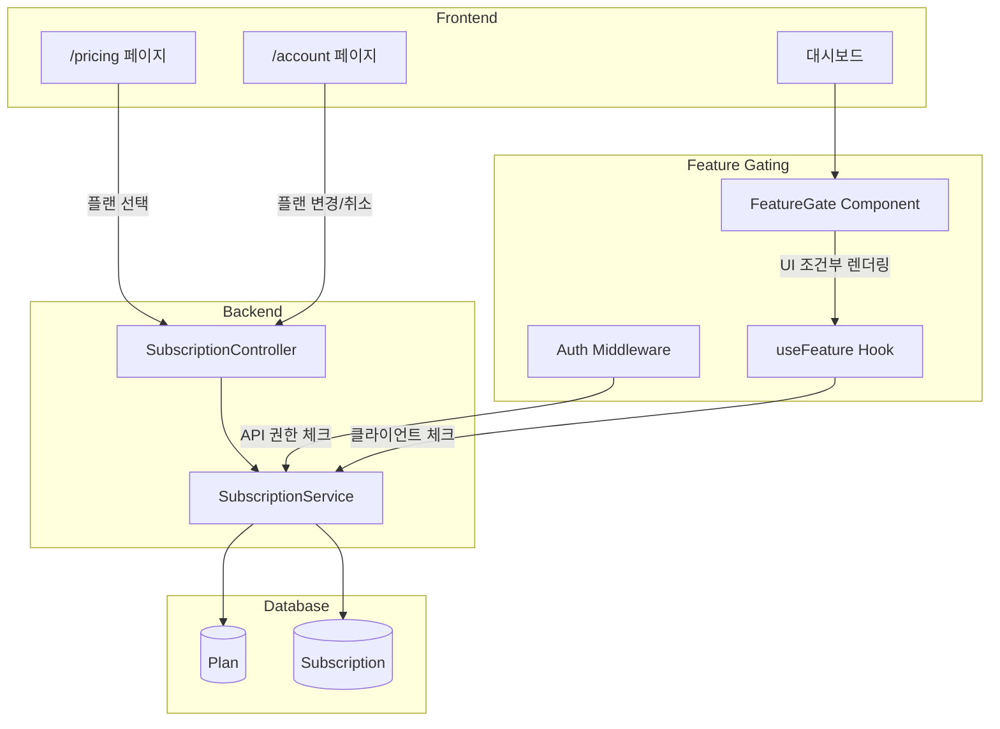

# Phase 14.1: 구독 관리 UI (Stripe 없이)

## 개요

| 항목 | 내용 |
|-----|------|
| **목표** | Stripe 연동 없이 구독 관리 UI 및 Feature Gating 구현 |
| **선행 조건** | Phase 9 (Plan & Usage System), Phase 11.4 (Account Page) 완료 |
| **예상 소요** | 4 Steps |
| **결과물** | 플랜 비교 페이지, 플랜 변경 API, Feature Gating, 구독 관리 UI |

> **Note**: 이 Phase는 Stripe 결제 연동 전 구독 관리 UI와 Feature Gating을 구현합니다.
> 실제 결제 처리는 Phase 14 (Stripe Billing Integration)에서 진행합니다.

---

## 기존 구현 현황 (Phase 9 + 11.4)

### Database 스키마 (✅ 완료)

| 테이블 | 상태 | 설명 |
|-------|------|------|
| `plans` | ✅ | 플랜 정의 (free, pro, enterprise) |
| `subscriptions` | ✅ | 사용자 구독 정보 |
| `token_usages` | ✅ | 토큰 사용량 추적 |

### Backend 서비스 (✅ 완료)

| 서비스 | 상태 | 파일 |
|-------|------|------|
| SubscriptionService | ✅ | `internal/service/subscription_service.go` |
| UsageService | ✅ | `internal/service/usage_service.go` |

### API 엔드포인트 (✅ 완료)

| 엔드포인트 | 상태 | 설명 |
|-----------|------|------|
| GET /v1/subscription | ✅ | 현재 구독 조회 |
| GET /v1/subscription/plans | ✅ | 플랜 목록 조회 |
| GET /v1/usage | ✅ | 현재 사용량 조회 |
| GET /v1/usage/history | ✅ | 사용량 히스토리 |

### Frontend 컴포넌트 (✅ 완료)

| 컴포넌트 | 상태 | 파일 |
|---------|------|------|
| SubscriptionCard | ✅ | `components/account/SubscriptionCard.tsx` |
| UsageCard | ✅ | `components/account/UsageCard.tsx` |
| UsageHistory | ✅ | `components/account/UsageHistory.tsx` |
| Account Page | ✅ | `app/(dashboard)/account/page.tsx` |

### Seed 데이터 (✅ 완료)

| Plan | 가격 | 토큰 한도 | 주요 기능 |
|------|------|---------|----------|
| Free | $0 | 50,000 | export_png |
| Pro | $12 | 500,000 | export_png/svg/md/json, priority_support |
| Enterprise | Custom | 무제한 | api_access, team_sharing, sso, custom_ai |

---

## 아키텍처



---

## 진행 상황

| Step | 이름 | 상태 |
|------|------|------|
| 14.1.1 | 플랜 비교/선택 페이지 | ⬜ |
| 14.1.2 | 플랜 변경/취소 API | ⬜ |
| 14.1.3 | Feature Gating 구현 | ⬜ |
| 14.1.4 | 구독 관리 UI | ⬜ |

---

## Step 14.1.1: 플랜 비교/선택 페이지

### 목표

공개 접근 가능한 `/pricing` 페이지를 구현하여 플랜 비교 및 선택 UI를 제공합니다.

### 체크리스트

- [ ] `/pricing` 페이지 생성 (`apps/web/src/app/pricing/page.tsx`)
- [ ] PlanCard 컴포넌트 구현
- [ ] 플랜 비교 테이블 구현
- [ ] 반응형 디자인 (모바일/데스크톱)
- [ ] 비로그인 사용자도 접근 가능하도록 설정
- [ ] 로그인 상태에 따른 차별화된 UI 구현

### 로그인 상태별 동작

| 상태 | 동작 |
|------|------|
| **비로그인** | 플랜 비교만 표시, 선택 시 로그인 페이지로 이동 |
| **로그인 (Free)** | 현재 플랜 표시, Pro/Enterprise 업그레이드 버튼 |
| **로그인 (Pro)** | 현재 플랜 표시, Free 다운그레이드 / Enterprise 업그레이드 안내 |
| **로그인 (Enterprise)** | 현재 플랜 표시, 문의 안내 |

### 버튼 상태

| 현재 플랜 | Free 버튼 | Pro 버튼 | Enterprise 버튼 |
|----------|----------|----------|-----------------|
| 비로그인 | 무료 시작 | 업그레이드 | 문의하기 |
| Free | 현재 플랜 | 업그레이드 | 문의하기 |
| Pro | 다운그레이드 | 현재 플랜 | 문의하기 |
| Enterprise | - | - | 현재 플랜 |

### UI 명세

#### 페이지 레이아웃

```
┌─────────────────────────────────────────────────────────────┐
│                        MindHit                               │
│                                                              │
│              당신의 브라우징을 마인드맵으로                      │
│                                                              │
│  ┌─────────────┐  ┌─────────────┐  ┌─────────────┐          │
│  │    Free     │  │    Pro      │  │ Enterprise  │          │
│  │   무료       │  │  $12/월     │  │   문의      │          │
│  │             │  │             │  │             │          │
│  │ 50K 토큰    │  │ 500K 토큰   │  │  무제한     │          │
│  │             │  │             │  │             │          │
│  │ ✓ PNG 내보내기│ │ ✓ PNG 내보내기│ │ ✓ 모든 기능  │          │
│  │             │  │ ✓ SVG 내보내기│ │ ✓ API 접근  │          │
│  │             │  │ ✓ MD 내보내기 │ │ ✓ 팀 공유   │          │
│  │             │  │ ✓ JSON 내보내기││ ✓ SSO       │          │
│  │             │  │ ✓ 우선 지원  │ │ ✓ 전용 AI   │          │
│  │             │  │             │  │             │          │
│  │ [현재 플랜]  │  │ [업그레이드] │  │ [문의하기]  │          │
│  └─────────────┘  └─────────────┘  └─────────────┘          │
│                                                              │
│  ┌───────────────────────────────────────────────────────┐  │
│  │                   기능 비교 테이블                       │  │
│  ├───────────────┬─────────┬─────────┬─────────────────┤  │
│  │ 기능          │ Free    │ Pro     │ Enterprise      │  │
│  ├───────────────┼─────────┼─────────┼─────────────────┤  │
│  │ 월간 토큰     │ 50,000  │ 500,000 │ 무제한          │  │
│  │ 세션 보관     │ 30일    │ 무제한   │ 무제한          │  │
│  │ 동시 세션     │ 1       │ 5       │ 무제한          │  │
│  │ PNG 내보내기  │ ✓       │ ✓       │ ✓               │  │
│  │ SVG 내보내기  │ ✗       │ ✓       │ ✓               │  │
│  │ MD 내보내기   │ ✗       │ ✓       │ ✓               │  │
│  │ JSON 내보내기 │ ✗       │ ✓       │ ✓               │  │
│  │ API 접근     │ ✗       │ ✗       │ ✓               │  │
│  │ 팀 공유      │ ✗       │ ✗       │ ✓               │  │
│  │ SSO         │ ✗       │ ✗       │ ✓               │  │
│  │ 우선 지원    │ ✗       │ ✓       │ ✓               │  │
│  └───────────────┴─────────┴─────────┴─────────────────┘  │
└─────────────────────────────────────────────────────────────┘
```

### 파일 구조

```
apps/web/src/
├── app/
│   └── pricing/
│       └── page.tsx              # 플랜 비교 페이지
└── components/
    └── pricing/
        ├── PlanCard.tsx          # 개별 플랜 카드
        ├── PlanComparisonTable.tsx  # 기능 비교 테이블
        └── index.ts
```

### 코드 예시

**apps/web/src/app/pricing/page.tsx:**

```tsx
import { PlanCard } from "@/components/pricing/PlanCard";
import { PlanComparisonTable } from "@/components/pricing/PlanComparisonTable";

const plans = [
  {
    id: "free",
    name: "Free",
    price: 0,
    description: "개인 사용자를 위한 기본 플랜",
    tokenLimit: 50000,
    sessionRetentionDays: 30,
    maxConcurrentSessions: 1,
    features: {
      export_png: true,
    },
    highlighted: false,
  },
  {
    id: "pro",
    name: "Pro",
    price: 12,
    description: "더 많은 기능이 필요한 사용자를 위한 플랜",
    tokenLimit: 500000,
    sessionRetentionDays: null, // unlimited
    maxConcurrentSessions: 5,
    features: {
      export_png: true,
      export_svg: true,
      export_md: true,
      export_json: true,
      priority_support: true,
    },
    highlighted: true, // 추천 플랜
  },
  {
    id: "enterprise",
    name: "Enterprise",
    price: null, // custom
    description: "팀과 기업을 위한 맞춤형 솔루션",
    tokenLimit: null, // unlimited
    sessionRetentionDays: null,
    maxConcurrentSessions: null,
    features: {
      export_png: true,
      export_svg: true,
      export_md: true,
      export_json: true,
      api_access: true,
      team_sharing: true,
      sso: true,
      custom_ai: true,
    },
    highlighted: false,
  },
];

export default function PricingPage() {
  return (
    <div className="min-h-screen bg-gradient-to-b from-gray-50 to-white">
      <div className="max-w-6xl mx-auto px-4 py-16">
        {/* Header */}
        <div className="text-center mb-12">
          <h1 className="text-4xl font-bold text-gray-900 mb-4">
            당신의 브라우징을 마인드맵으로
          </h1>
          <p className="text-xl text-gray-600">
            필요에 맞는 플랜을 선택하세요
          </p>
        </div>

        {/* Plan Cards */}
        <div className="grid grid-cols-1 md:grid-cols-3 gap-8 mb-16">
          {plans.map((plan) => (
            <PlanCard key={plan.id} plan={plan} />
          ))}
        </div>

        {/* Comparison Table */}
        <PlanComparisonTable plans={plans} />
      </div>
    </div>
  );
}
```

**apps/web/src/components/pricing/PlanCard.tsx:**

```tsx
"use client";

import { Check, X } from "lucide-react";
import { useRouter } from "next/navigation";
import { useAuthStore } from "@/stores/auth-store";
import { useSubscription } from "@/lib/hooks/use-subscription";
import { Button } from "@/components/ui/button";

interface PlanCardProps {
  plan: {
    id: string;
    name: string;
    price: number | null;
    description: string;
    tokenLimit: number | null;
    sessionRetentionDays: number | null;
    maxConcurrentSessions: number | null;
    features: Record<string, boolean>;
    highlighted: boolean;
  };
}

export function PlanCard({ plan }: PlanCardProps) {
  const router = useRouter();
  const { isAuthenticated } = useAuthStore();
  const { data: subscription } = useSubscription();

  const currentPlanId = subscription?.subscription?.plan?.id;
  const isCurrentPlan = currentPlanId === plan.id;

  const handleSelect = () => {
    if (!isAuthenticated) {
      router.push("/login?redirect=/pricing");
      return;
    }

    if (plan.id === "enterprise") {
      // Contact sales
      window.location.href = "mailto:sales@mindhit.dev?subject=Enterprise Plan Inquiry";
      return;
    }

    if (!isCurrentPlan) {
      router.push(`/account?changePlan=${plan.id}`);
    }
  };

  const formatPrice = () => {
    if (plan.price === null) return "문의";
    if (plan.price === 0) return "무료";
    return `$${plan.price}/월`;
  };

  return (
    <div
      className={`relative rounded-2xl border-2 p-6 ${
        plan.highlighted
          ? "border-blue-500 shadow-lg scale-105"
          : "border-gray-200"
      }`}
    >
      {plan.highlighted && (
        <div className="absolute -top-4 left-1/2 -translate-x-1/2">
          <span className="bg-blue-500 text-white text-sm font-medium px-4 py-1 rounded-full">
            추천
          </span>
        </div>
      )}

      <div className="text-center mb-6">
        <h3 className="text-xl font-bold text-gray-900">{plan.name}</h3>
        <p className="text-gray-500 mt-1 text-sm">{plan.description}</p>
        <div className="mt-4">
          <span className="text-4xl font-bold text-gray-900">
            {formatPrice()}
          </span>
        </div>
      </div>

      <div className="space-y-3 mb-6">
        <div className="flex items-center gap-2 text-sm">
          <Check className="w-4 h-4 text-green-500" />
          <span>
            {plan.tokenLimit ? `${plan.tokenLimit.toLocaleString()} 토큰/월` : "무제한 토큰"}
          </span>
        </div>
        <div className="flex items-center gap-2 text-sm">
          <Check className="w-4 h-4 text-green-500" />
          <span>
            {plan.sessionRetentionDays ? `${plan.sessionRetentionDays}일 세션 보관` : "무제한 보관"}
          </span>
        </div>
        <div className="flex items-center gap-2 text-sm">
          <Check className="w-4 h-4 text-green-500" />
          <span>
            {plan.maxConcurrentSessions ? `동시 ${plan.maxConcurrentSessions}개 세션` : "무제한 세션"}
          </span>
        </div>
      </div>

      <Button
        onClick={handleSelect}
        disabled={isCurrentPlan}
        className={`w-full ${
          plan.highlighted
            ? "bg-blue-600 hover:bg-blue-700"
            : "bg-gray-900 hover:bg-gray-800"
        }`}
      >
        {isCurrentPlan ? "현재 플랜" : plan.id === "enterprise" ? "문의하기" : "선택"}
      </Button>
    </div>
  );
}
```

---

## Step 14.1.2: 플랜 변경/취소 API

### 목표

플랜 변경 및 구독 취소 API를 구현합니다.

### 체크리스트

- [ ] TypeSpec에 API 정의 추가 (`packages/protocol/src/subscription/subscription.tsp`)
- [ ] Go 코드 생성 (`pnpm run generate:api:go`)
- [ ] TypeScript 코드 생성 (`pnpm run generate:api:ts`)
- [ ] SubscriptionService에 ChangePlan, CancelSubscription 메서드 추가
- [ ] SubscriptionController에 핸들러 추가
- [ ] 단위 테스트 작성

### API 정의

**TypeSpec 추가 (subscription.tsp):**

```tsp
@doc("플랜 변경 요청")
model ChangePlanRequest {
  @encodedName("application/json", "plan_id")
  planId: string;
}

@doc("플랜 변경 응답")
model ChangePlanResponse {
  subscription: SubscriptionInfo;
  message: string;
}

@doc("구독 취소 응답")
model CancelSubscriptionResponse {
  subscription: SubscriptionInfo;
  message: string;
}

// Routes 추가
@post
@route("/change")
@doc("플랜 변경")
op changePlan(
  @header authorization: string,
  @body body: ChangePlanRequest
): {
  @statusCode statusCode: 200;
  @body body: ChangePlanResponse;
} | {
  @statusCode statusCode: 400;
  @body body: Common.ErrorResponse;
} | {
  @statusCode statusCode: 401;
  @body body: Common.ErrorResponse;
};

@post
@route("/cancel")
@doc("구독 취소")
op cancelSubscription(
  @header authorization: string
): {
  @statusCode statusCode: 200;
  @body body: CancelSubscriptionResponse;
} | {
  @statusCode statusCode: 401;
  @body body: Common.ErrorResponse;
};
```

### 백엔드 구현

**SubscriptionService 메서드 추가:**

```go
// ChangePlan changes the user's subscription plan.
// Returns error if downgrading would exceed new plan's limits.
func (s *SubscriptionService) ChangePlan(ctx context.Context, userID uuid.UUID, newPlanID string) (*ent.Subscription, error) {
    // 1. 새 플랜 존재 여부 확인
    newPlan, err := s.client.Plan.Get(ctx, newPlanID)
    if err != nil {
        if ent.IsNotFound(err) {
            return nil, ErrPlanNotFound
        }
        return nil, err
    }

    // 2. 현재 구독 조회
    currentSub, err := s.GetSubscription(ctx, userID)

    // 3. 기존 구독이 있으면 업데이트, 없으면 생성
    now := time.Now().UTC()
    periodEnd := now.AddDate(0, 0, 30)

    if err == nil {
        // 기존 구독 업데이트
        return s.client.Subscription.
            UpdateOne(currentSub).
            SetPlanID(newPlanID).
            SetCurrentPeriodStart(now).
            SetCurrentPeriodEnd(periodEnd).
            SetCancelAtPeriodEnd(false).
            Save(ctx)
    }

    // 새 구독 생성
    return s.client.Subscription.
        Create().
        SetUserID(userID).
        SetPlanID(newPlanID).
        SetStatus(subscription.StatusActive).
        SetCurrentPeriodStart(now).
        SetCurrentPeriodEnd(periodEnd).
        Save(ctx)
}

// CancelSubscription marks subscription to cancel at period end.
func (s *SubscriptionService) CancelSubscription(ctx context.Context, userID uuid.UUID) (*ent.Subscription, error) {
    sub, err := s.GetSubscription(ctx, userID)
    if err != nil {
        return nil, err
    }

    return s.client.Subscription.
        UpdateOne(sub).
        SetCancelAtPeriodEnd(true).
        Save(ctx)
}

// ReactivateSubscription removes cancellation mark.
func (s *SubscriptionService) ReactivateSubscription(ctx context.Context, userID uuid.UUID) (*ent.Subscription, error) {
    sub, err := s.GetSubscription(ctx, userID)
    if err != nil {
        return nil, err
    }

    return s.client.Subscription.
        UpdateOne(sub).
        SetCancelAtPeriodEnd(false).
        Save(ctx)
}
```

### 비즈니스 규칙

| 규칙 | 설명 |
|------|------|
| 업그레이드 | 즉시 적용, 새 빌링 주기 시작 |
| 다운그레이드 | 즉시 적용 (현재 기간 종료 시 제한 적용은 Stripe 연동 후) |
| 취소 | 현재 기간 종료 시 Free로 자동 전환 |
| 재활성화 | 취소 예정 상태에서 취소 철회 |

---

## Step 14.1.3: Feature Gating 구현

### 목표

플랜별 기능 접근 제한을 프론트엔드와 백엔드에서 구현합니다.

### 체크리스트

- [ ] Backend: Feature check middleware 구현
- [ ] Frontend: useFeature hook 구현
- [ ] Frontend: FeatureGate component 구현
- [ ] Feature가 없을 때 업그레이드 유도 UI
- [ ] 테스트 작성

### Feature 목록

| Feature Key | 설명 | Free | Pro | Enterprise |
|-------------|------|------|-----|------------|
| `export_png` | PNG 이미지 내보내기 | ✓ | ✓ | ✓ |
| `export_svg` | SVG 벡터 내보내기 | ✗ | ✓ | ✓ |
| `export_md` | Markdown 내보내기 | ✗ | ✓ | ✓ |
| `export_json` | JSON 데이터 내보내기 | ✗ | ✓ | ✓ |
| `priority_support` | 우선 지원 | ✗ | ✓ | ✓ |
| `api_access` | API 직접 접근 | ✗ | ✗ | ✓ |
| `team_sharing` | 팀 공유 기능 | ✗ | ✗ | ✓ |
| `sso` | SSO 로그인 | ✗ | ✗ | ✓ |
| `custom_ai` | 커스텀 AI 모델 | ✗ | ✗ | ✓ |

### Backend 구현

**internal/middleware/feature_middleware.go:**

```go
package middleware

import (
    "net/http"

    "github.com/gin-gonic/gin"
    "github.com/mindhit/api/internal/service"
)

// RequireFeature returns middleware that checks if user has a specific feature.
func RequireFeature(subscriptionService *service.SubscriptionService, feature string) gin.HandlerFunc {
    return func(c *gin.Context) {
        userID, exists := c.Get("user_id")
        if !exists {
            c.AbortWithStatusJSON(http.StatusUnauthorized, gin.H{
                "error": "unauthorized",
            })
            return
        }

        hasFeature, err := subscriptionService.HasFeature(c.Request.Context(), userID.(uuid.UUID), feature)
        if err != nil || !hasFeature {
            c.AbortWithStatusJSON(http.StatusForbidden, gin.H{
                "error": "feature_not_available",
                "message": "이 기능은 상위 플랜에서 사용 가능합니다",
                "required_feature": feature,
            })
            return
        }

        c.Next()
    }
}
```

### Frontend 구현

**apps/web/src/lib/hooks/use-feature.ts:**

```typescript
import { useSubscription } from "./use-subscription";

export function useFeature(feature: string): {
  hasFeature: boolean;
  isLoading: boolean;
  requiredPlan: string | null;
} {
  const { data, isLoading } = useSubscription();

  if (isLoading) {
    return { hasFeature: false, isLoading: true, requiredPlan: null };
  }

  const features = data?.subscription?.plan?.features || {};
  const hasFeature = features[feature] === true;

  // Determine which plan is required for this feature
  let requiredPlan: string | null = null;
  if (!hasFeature) {
    const featurePlanMap: Record<string, string> = {
      export_svg: "pro",
      export_md: "pro",
      export_json: "pro",
      priority_support: "pro",
      api_access: "enterprise",
      team_sharing: "enterprise",
      sso: "enterprise",
      custom_ai: "enterprise",
    };
    requiredPlan = featurePlanMap[feature] || "pro";
  }

  return { hasFeature, isLoading: false, requiredPlan };
}
```

**apps/web/src/components/common/FeatureGate.tsx:**

```tsx
"use client";

import { ReactNode } from "react";
import { useRouter } from "next/navigation";
import { Lock, ArrowUpRight } from "lucide-react";
import { useFeature } from "@/lib/hooks/use-feature";
import { Button } from "@/components/ui/button";

interface FeatureGateProps {
  feature: string;
  children: ReactNode;
  fallback?: ReactNode;
  showUpgrade?: boolean;
}

export function FeatureGate({
  feature,
  children,
  fallback,
  showUpgrade = true,
}: FeatureGateProps) {
  const router = useRouter();
  const { hasFeature, isLoading, requiredPlan } = useFeature(feature);

  if (isLoading) {
    return fallback || null;
  }

  if (hasFeature) {
    return <>{children}</>;
  }

  if (fallback) {
    return <>{fallback}</>;
  }

  if (!showUpgrade) {
    return null;
  }

  // Default: Show upgrade prompt
  const planNames: Record<string, string> = {
    pro: "Pro",
    enterprise: "Enterprise",
  };

  return (
    <div className="flex flex-col items-center justify-center p-6 bg-gray-50 rounded-xl border border-gray-200">
      <Lock className="w-8 h-8 text-gray-400 mb-3" />
      <p className="text-gray-600 text-center mb-4">
        이 기능은 <strong>{planNames[requiredPlan || "pro"]}</strong> 플랜에서
        사용할 수 있습니다
      </p>
      <Button
        onClick={() => router.push("/pricing")}
        className="flex items-center gap-2"
      >
        플랜 업그레이드
        <ArrowUpRight className="w-4 h-4" />
      </Button>
    </div>
  );
}
```

### 사용 예시

```tsx
// 마인드맵 내보내기 버튼
<FeatureGate feature="export_svg">
  <Button onClick={handleExportSVG}>
    SVG로 내보내기
  </Button>
</FeatureGate>

// 조건부 렌더링 (업그레이드 UI 없이)
<FeatureGate feature="api_access" showUpgrade={false}>
  <APIKeySection />
</FeatureGate>

// 커스텀 fallback
<FeatureGate
  feature="team_sharing"
  fallback={<span className="text-gray-400">Pro 전용</span>}
>
  <ShareButton />
</FeatureGate>
```

---

## Step 14.1.4: 구독 관리 UI

### 목표

Account 페이지에서 플랜 변경 및 구독 취소 기능을 구현합니다.

### 체크리스트

- [ ] SubscriptionCard에 플랜 변경 버튼 추가
- [ ] 플랜 변경 모달 구현 (PlanChangeModal)
- [ ] 구독 취소 확인 다이얼로그 구현
- [ ] 취소 예정 상태 표시 및 재활성화 버튼
- [ ] API 연동 (useMutation)
- [ ] 성공/실패 Toast 알림

### UI 명세

#### 구독 카드 확장

```
┌─────────────────────────────────────────────────────────┐
│ 👑 Pro 플랜                             [활성]          │
│                                                         │
│ ┌─────────────────┬─────────────────┐                  │
│ │ 시작일           │ 종료일           │                  │
│ │ 2024년 1월 1일   │ 2024년 1월 31일  │                  │
│ └─────────────────┴─────────────────┘                  │
│                                                         │
│ 월 500,000 토큰 제공                                    │
│                                                         │
│ ┌─────────────────────────────────────────────────────┐│
│ │           [플랜 변경]    [구독 취소]                  ││
│ └─────────────────────────────────────────────────────┘│
└─────────────────────────────────────────────────────────┘
```

#### 취소 예정 상태

```
┌─────────────────────────────────────────────────────────┐
│ 👑 Pro 플랜                    [취소 예정] 2024.01.31    │
│                                                         │
│ ⚠️ 현재 기간 종료 후 Free 플랜으로 전환됩니다             │
│                                                         │
│ ┌─────────────────────────────────────────────────────┐│
│ │                    [취소 철회]                        ││
│ └─────────────────────────────────────────────────────┘│
└─────────────────────────────────────────────────────────┘
```

### 파일 구조

```
apps/web/src/
├── lib/
│   └── api/
│       └── subscription.ts    # API 함수 추가
└── components/
    └── account/
        ├── SubscriptionCard.tsx     # 수정
        ├── PlanChangeModal.tsx      # 신규
        └── CancelSubscriptionDialog.tsx  # 신규
```

### 코드 예시

**apps/web/src/lib/api/subscription.ts 추가:**

```typescript
export async function changePlan(planId: string): Promise<ChangePlanResponse> {
  const response = await apiClient.post<ChangePlanResponse>(
    "/subscription/change",
    { plan_id: planId }
  );
  return response.data;
}

export async function cancelSubscription(): Promise<CancelSubscriptionResponse> {
  const response = await apiClient.post<CancelSubscriptionResponse>(
    "/subscription/cancel"
  );
  return response.data;
}

export async function reactivateSubscription(): Promise<SubscriptionResponse> {
  const response = await apiClient.post<SubscriptionResponse>(
    "/subscription/reactivate"
  );
  return response.data;
}
```

**apps/web/src/lib/hooks/use-change-plan.ts:**

```typescript
import { useMutation, useQueryClient } from "@tanstack/react-query";
import { changePlan, cancelSubscription, reactivateSubscription } from "@/lib/api/subscription";
import { toast } from "sonner";

export function useChangePlan() {
  const queryClient = useQueryClient();

  return useMutation({
    mutationFn: changePlan,
    onSuccess: (data) => {
      queryClient.invalidateQueries({ queryKey: ["subscription"] });
      toast.success(data.message || "플랜이 변경되었습니다");
    },
    onError: (error: any) => {
      toast.error(error.response?.data?.message || "플랜 변경에 실패했습니다");
    },
  });
}

export function useCancelSubscription() {
  const queryClient = useQueryClient();

  return useMutation({
    mutationFn: cancelSubscription,
    onSuccess: (data) => {
      queryClient.invalidateQueries({ queryKey: ["subscription"] });
      toast.success(data.message || "구독이 취소 예정으로 설정되었습니다");
    },
    onError: (error: any) => {
      toast.error(error.response?.data?.message || "구독 취소에 실패했습니다");
    },
  });
}

export function useReactivateSubscription() {
  const queryClient = useQueryClient();

  return useMutation({
    mutationFn: reactivateSubscription,
    onSuccess: () => {
      queryClient.invalidateQueries({ queryKey: ["subscription"] });
      toast.success("구독이 재활성화되었습니다");
    },
    onError: (error: any) => {
      toast.error(error.response?.data?.message || "재활성화에 실패했습니다");
    },
  });
}
```

**apps/web/src/components/account/PlanChangeModal.tsx:**

```tsx
"use client";

import { useState } from "react";
import { Check, X } from "lucide-react";
import { useSubscription, usePlans } from "@/lib/hooks/use-subscription";
import { useChangePlan } from "@/lib/hooks/use-change-plan";
import {
  Dialog,
  DialogContent,
  DialogHeader,
  DialogTitle,
  DialogDescription,
  DialogFooter,
} from "@/components/ui/dialog";
import { Button } from "@/components/ui/button";

interface PlanChangeModalProps {
  isOpen: boolean;
  onClose: () => void;
}

export function PlanChangeModal({ isOpen, onClose }: PlanChangeModalProps) {
  const { data: subscription } = useSubscription();
  const { data: plans } = usePlans();
  const changePlan = useChangePlan();
  const [selectedPlanId, setSelectedPlanId] = useState<string | null>(null);

  const currentPlanId = subscription?.subscription?.plan?.id;

  const handleConfirm = async () => {
    if (!selectedPlanId) return;

    try {
      await changePlan.mutateAsync(selectedPlanId);
      onClose();
    } catch {
      // Error handled in mutation
    }
  };

  return (
    <Dialog open={isOpen} onOpenChange={onClose}>
      <DialogContent className="max-w-2xl">
        <DialogHeader>
          <DialogTitle>플랜 변경</DialogTitle>
          <DialogDescription>
            새로운 플랜을 선택하세요. 변경은 즉시 적용됩니다.
          </DialogDescription>
        </DialogHeader>

        <div className="grid grid-cols-3 gap-4 py-4">
          {plans?.plans?.map((plan) => (
            <button
              key={plan.id}
              onClick={() => setSelectedPlanId(plan.id)}
              disabled={plan.id === currentPlanId}
              className={`p-4 rounded-xl border-2 text-left transition-all ${
                selectedPlanId === plan.id
                  ? "border-blue-500 bg-blue-50"
                  : plan.id === currentPlanId
                    ? "border-gray-200 bg-gray-50 opacity-50"
                    : "border-gray-200 hover:border-gray-300"
              }`}
            >
              <h4 className="font-semibold">{plan.name}</h4>
              <p className="text-sm text-gray-500 mt-1">
                {plan.token_limit
                  ? `${plan.token_limit.toLocaleString()} 토큰/월`
                  : "무제한"}
              </p>
              {plan.id === currentPlanId && (
                <span className="text-xs text-gray-400">현재 플랜</span>
              )}
            </button>
          ))}
        </div>

        <DialogFooter>
          <Button variant="outline" onClick={onClose}>
            취소
          </Button>
          <Button
            onClick={handleConfirm}
            disabled={!selectedPlanId || changePlan.isPending}
          >
            {changePlan.isPending ? "변경 중..." : "플랜 변경"}
          </Button>
        </DialogFooter>
      </DialogContent>
    </Dialog>
  );
}
```

---

## 테스트 요구사항

### Backend 테스트

| 테스트 유형 | 대상 | 파일 |
|------------|------|------|
| 단위 테스트 | ChangePlan | `service/subscription_service_test.go` |
| 단위 테스트 | CancelSubscription | `service/subscription_service_test.go` |
| 단위 테스트 | Feature Middleware | `middleware/feature_middleware_test.go` |
| 통합 테스트 | API 엔드포인트 | `controller/subscription_controller_test.go` |

### Frontend 테스트

| 테스트 유형 | 대상 | 파일 |
|------------|------|------|
| 컴포넌트 테스트 | PlanCard | `components/pricing/PlanCard.test.tsx` |
| 컴포넌트 테스트 | FeatureGate | `components/common/FeatureGate.test.tsx` |
| 훅 테스트 | useFeature | `lib/hooks/use-feature.test.ts` |
| 훅 테스트 | useChangePlan | `lib/hooks/use-change-plan.test.ts` |

### 테스트 명령어

```bash
# Backend 테스트
moonx backend:test -- -run "TestSubscription|TestFeature"

# Frontend 테스트
moonx web:test -- --testPathPattern="subscription|feature|plan"
```

---

## Phase 14.1 완료 확인

### 전체 검증 체크리스트

- [ ] `/pricing` 페이지 접근 가능 (비로그인 사용자 포함)
- [ ] 플랜 카드 UI 정상 렌더링
- [ ] 플랜 비교 테이블 정상 표시
- [ ] 플랜 변경 API 동작 (`POST /v1/subscription/change`)
- [ ] 구독 취소 API 동작 (`POST /v1/subscription/cancel`)
- [ ] 구독 재활성화 API 동작 (`POST /v1/subscription/reactivate`)
- [ ] Feature Gating 동작 (Backend middleware)
- [ ] Feature Gating 동작 (Frontend hook)
- [ ] FeatureGate 컴포넌트 업그레이드 유도 UI
- [ ] 플랜 변경 모달 UI
- [ ] 구독 취소 확인 다이얼로그
- [ ] 취소 예정 상태 표시 및 재활성화

### 산출물 요약

| 항목 | 위치 |
|------|------|
| 플랜 페이지 | `apps/web/src/app/pricing/page.tsx` |
| PlanCard | `apps/web/src/components/pricing/PlanCard.tsx` |
| PlanComparisonTable | `apps/web/src/components/pricing/PlanComparisonTable.tsx` |
| FeatureGate | `apps/web/src/components/common/FeatureGate.tsx` |
| useFeature | `apps/web/src/lib/hooks/use-feature.ts` |
| useChangePlan | `apps/web/src/lib/hooks/use-change-plan.ts` |
| PlanChangeModal | `apps/web/src/components/account/PlanChangeModal.tsx` |
| CancelSubscriptionDialog | `apps/web/src/components/account/CancelSubscriptionDialog.tsx` |
| TypeSpec API | `packages/protocol/src/subscription/subscription.tsp` |
| Feature Middleware | `apps/backend/internal/middleware/feature_middleware.go` |
| SubscriptionService 확장 | `apps/backend/internal/service/subscription_service.go` |

---

## 다음 Phase

Phase 14.1 완료 후 [Phase 14: Stripe Billing Integration](./phase-14-billing.md)으로 진행하세요.

Phase 14에서는 다음을 구현합니다:
- Stripe Checkout Session 생성
- Webhook 처리 (결제 성공/실패)
- 실제 결제 연동
- Customer Portal 연동
