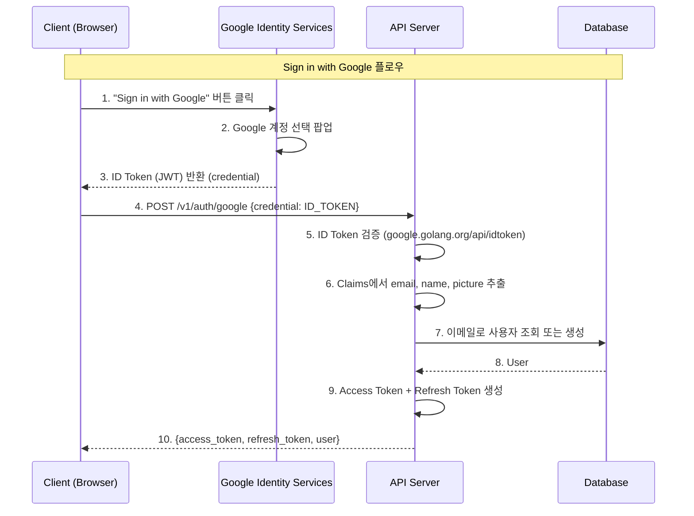
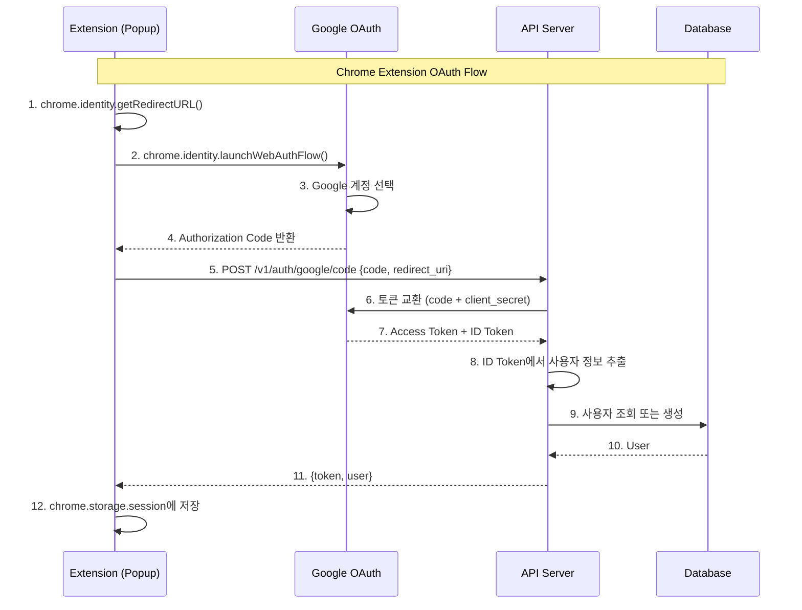

# Phase 2.1: Google OAuth (Sign in with Google)

## 개요

| 항목 | 내용 |
|-----|------|
| **목표** | Google Identity Services (GIS) 기반 소셜 로그인 구현 |
| **선행 조건** | Phase 2, Phase 6 완료 |
| **예상 소요** | 1 Step |
| **결과물** | Google 로그인/회원가입 동작 |

---

## 2025년 권장 방식: Google Identity Services (GIS)

### 왜 GIS를 사용하나요?

기존 OAuth 2.0 Authorization Code Flow 대신 [Google Identity Services](https://developers.google.com/identity/gsi/web/guides/overview)를 사용합니다:

| 항목 | 기존 OAuth 2.0 Flow | GIS (권장) |
|------|---------------------|-----------|
| 프론트엔드 | 서버 리다이렉트 방식 | Google 제공 버튼 + JS SDK |
| 반환 토큰 | Authorization Code → Access Token 교환 | ID Token (JWT) 직접 수신 |
| 백엔드 복잡도 | token 교환 로직 필요 | ID Token 검증만 필요 |
| CSRF 보호 | state 파라미터 직접 구현 | GIS가 자동 처리 |
| UX | 전체 페이지 리다이렉트 | 팝업/원탭 로그인 |
| Go 라이브러리 | `golang.org/x/oauth2` | `google.golang.org/api/idtoken` |

> **참고**: [Sign in with Google 공식 가이드](https://developers.google.com/identity/gsi/web/guides/overview)

---

## 아키텍처



---

## 진행 상황

| Step | 이름 | 상태 |
|------|------|------|
| 2.1.1 | Google OAuth 구현 | ✅ |

---

## Step 2.1.1: Google OAuth 구현

### 목표

- 프론트엔드: "Sign in with Google" 버튼 구현
- 백엔드: `POST /v1/auth/google` - ID Token 검증 및 사용자 생성/로그인

### 체크리스트

#### 1. Google Cloud Console 설정

- [x] [Google Cloud Console](https://console.cloud.google.com/) 접속
- [x] 프로젝트 생성 또는 선택
- [x] APIs & Services > OAuth consent screen 설정
  - [x] User Type: External
  - [x] App name, User support email 입력
  - [x] Scopes: `email`, `profile`, `openid` 추가
- [x] APIs & Services > Credentials > Create Credentials > OAuth client ID
  - [x] Application type: **Web application**
  - [x] Authorized JavaScript origins 추가:
    - 개발: `http://localhost:3000`
    - 프로덕션: `https://mindhit.io`
  - [x] Client ID 복사 (예: `1234567890-abc123.apps.googleusercontent.com`)

#### 2. 환경 변수 설정

```bash
# .env
GOOGLE_CLIENT_ID=your-client-id.apps.googleusercontent.com
```

> **Note**: GIS 방식에서는 Client Secret이 필요 없습니다 (ID Token 검증만 수행).

#### 3. User 스키마 수정 (계정 통합 전략)

**설계 원칙**: 하나의 User 테이블에서 이메일 로그인과 Google 로그인을 모두 지원합니다.

| 시나리오 | email | password_hash | google_id | auth_provider |
|---------|-------|---------------|-----------|---------------|
| 이메일로 가입 | ✅ | ✅ | NULL | `email` |
| Google로 가입 | ✅ (Google 제공) | NULL | ✅ | `google` |
| 이메일 가입 후 Google 연결 | ✅ | ✅ | ✅ | `email` |
| Google 가입 후 비밀번호 설정 | ✅ | ✅ | ✅ | `google` |

**계정 통합 로직**:
1. Google 로그인 시 `google_id`로 기존 사용자 조회
2. 없으면 `email`로 조회 → 기존 이메일 계정에 `google_id` 연결
3. 둘 다 없으면 새 사용자 생성

- [x] `ent/schema/user.go`에 OAuth 필드 추가

```go
func (User) Fields() []ent.Field {
    return []ent.Field{
        // 기존 필드
        field.String("email").
            NotEmpty().
            Unique(),
        field.String("password_hash").
            Optional().  // Google 사용자는 비밀번호 없음
            Nillable(),
        field.Enum("status").
            Values("pending", "active", "suspended").
            Default("pending"),

        // OAuth 필드 추가
        field.String("google_id").
            Optional().
            Unique().
            Nillable(),
        field.String("avatar_url").
            Optional().
            Nillable(),
        field.Enum("auth_provider").
            Values("email", "google").
            Default("email"),

        // 타임스탬프
        field.Time("created_at").
            Default(time.Now).
            Immutable(),
        field.Time("updated_at").
            Default(time.Now).
            UpdateDefault(time.Now),
    }
}
```

> **Note**: `password_hash`가 `Optional().Nillable()`로 변경됩니다. 기존 이메일 사용자는 영향 없습니다.

#### 4. 백엔드 의존성 추가

```bash
cd apps/backend
go get google.golang.org/api/idtoken
```

#### 5. TypeSpec API 정의

- [x] `packages/protocol/src/auth/auth.tsp` 업데이트

```typespec
@doc("Google OAuth 로그인 요청")
model GoogleAuthRequest {
  @doc("Google Identity Services에서 받은 ID Token (credential)")
  credential: string;
}

// Routes 섹션에 추가
@post
@route("/google")
@doc("Google OAuth 로그인")
op googleAuth(@body body: GoogleAuthRequest): {
  @statusCode statusCode: 200;
  @body body: AuthResponse;
} | {
  @statusCode statusCode: 400;
  @body body: Common.ValidationError;
} | {
  @statusCode statusCode: 401;
  @body body: Common.ErrorResponse;
};
```

#### 6. OAuth 서비스 작성

- [ ] `internal/service/oauth_service.go`

```go
package service

import (
    "context"
    "errors"
    "os"

    "google.golang.org/api/idtoken"

    "github.com/mindhit/api/ent"
    "github.com/mindhit/api/ent/user"
)

var (
    ErrInvalidIDToken = errors.New("invalid Google ID token")
    ErrEmailNotVerified = errors.New("email not verified by Google")
)

// GoogleUserInfo contains user information from Google ID Token.
type GoogleUserInfo struct {
    GoogleID string
    Email    string
    Name     string
    Picture  string
}

// OAuthService handles OAuth authentication.
type OAuthService struct {
    client   *ent.Client
    clientID string
}

// NewOAuthService creates a new OAuthService instance.
func NewOAuthService(client *ent.Client) *OAuthService {
    return &OAuthService{
        client:   client,
        clientID: os.Getenv("GOOGLE_CLIENT_ID"),
    }
}

// ValidateGoogleIDToken validates a Google ID token and extracts user info.
func (s *OAuthService) ValidateGoogleIDToken(ctx context.Context, idToken string) (*GoogleUserInfo, error) {
    // Validate ID token with Google's public keys
    payload, err := idtoken.Validate(ctx, idToken, s.clientID)
    if err != nil {
        return nil, ErrInvalidIDToken
    }

    // Extract claims
    email, _ := payload.Claims["email"].(string)
    emailVerified, _ := payload.Claims["email_verified"].(bool)
    name, _ := payload.Claims["name"].(string)
    picture, _ := payload.Claims["picture"].(string)
    sub, _ := payload.Claims["sub"].(string) // Google ID

    if !emailVerified {
        return nil, ErrEmailNotVerified
    }

    return &GoogleUserInfo{
        GoogleID: sub,
        Email:    email,
        Name:     name,
        Picture:  picture,
    }, nil
}

// FindOrCreateGoogleUser finds or creates a user from Google OAuth.
func (s *OAuthService) FindOrCreateGoogleUser(ctx context.Context, info *GoogleUserInfo) (*ent.User, bool, error) {
    // 1. Google ID로 기존 사용자 조회
    u, err := s.client.User.Query().
        Where(user.GoogleIDEQ(info.GoogleID)).
        Only(ctx)
    if err == nil {
        // 기존 사용자 - 프로필 업데이트
        updated, err := s.client.User.
            UpdateOneID(u.ID).
            SetNillableAvatarURL(&info.Picture).
            Save(ctx)
        return updated, false, err
    }
    if !ent.IsNotFound(err) {
        return nil, false, err
    }

    // 2. 이메일로 기존 사용자 조회 (이메일/비밀번호로 가입한 사용자)
    u, err = s.client.User.Query().
        Where(
            user.EmailEQ(info.Email),
            user.StatusEQ("active"),
        ).
        Only(ctx)
    if err == nil {
        // 기존 이메일 계정에 Google ID 연결
        updated, err := s.client.User.
            UpdateOneID(u.ID).
            SetGoogleID(info.GoogleID).
            SetNillableAvatarURL(&info.Picture).
            Save(ctx)
        return updated, false, err
    }
    if !ent.IsNotFound(err) {
        return nil, false, err
    }

    // 3. 새 사용자 생성
    newUser, err := s.client.User.
        Create().
        SetEmail(info.Email).
        SetGoogleID(info.GoogleID).
        SetNillableAvatarURL(&info.Picture).
        SetAuthProvider("google").
        SetStatus("active"). // Google은 이미 이메일 검증 완료
        Save(ctx)
    if err != nil {
        return nil, false, err
    }

    return newUser, true, nil // isNewUser = true
}
```

#### 7. OAuth 컨트롤러 작성

- [ ] `internal/controller/oauth_controller.go`

```go
package controller

import (
    "context"
    "log/slog"

    "github.com/mindhit/api/internal/generated"
    "github.com/mindhit/api/internal/service"
)

// OAuthController implements OAuth-related handlers.
type OAuthController struct {
    oauthService        *service.OAuthService
    jwtService          *service.JWTService
    subscriptionService *service.SubscriptionService
}

// NewOAuthController creates a new OAuthController.
func NewOAuthController(
    oauthService *service.OAuthService,
    jwtService *service.JWTService,
    subscriptionService *service.SubscriptionService,
) *OAuthController {
    return &OAuthController{
        oauthService:        oauthService,
        jwtService:          jwtService,
        subscriptionService: subscriptionService,
    }
}

// RoutesGoogleAuth handles POST /v1/auth/google.
func (c *OAuthController) RoutesGoogleAuth(
    ctx context.Context,
    request generated.RoutesGoogleAuthRequestObject,
) (generated.RoutesGoogleAuthResponseObject, error) {
    // 1. Google ID Token 검증
    userInfo, err := c.oauthService.ValidateGoogleIDToken(ctx, request.Body.Credential)
    if err != nil {
        slog.WarnContext(ctx, "invalid Google ID token", "error", err)
        return generated.RoutesGoogleAuth401JSONResponse{
            Error: struct {
                Code    *string `json:"code,omitempty"`
                Message string  `json:"message"`
            }{
                Message: "Invalid Google credentials",
            },
        }, nil
    }

    // 2. 사용자 찾기/생성
    user, isNewUser, err := c.oauthService.FindOrCreateGoogleUser(ctx, userInfo)
    if err != nil {
        slog.ErrorContext(ctx, "failed to find or create Google user", "error", err)
        return nil, err
    }

    // 3. 새 사용자인 경우 Free 구독 생성
    if isNewUser {
        if err := c.subscriptionService.CreateFreeSubscription(ctx, user.ID); err != nil {
            slog.ErrorContext(ctx, "failed to create free subscription", "error", err, "user_id", user.ID)
            // 구독 생성 실패해도 로그인은 진행
        }
    }

    // 4. JWT 토큰 쌍 생성
    tokenPair, err := c.jwtService.GenerateTokenPair(user.ID)
    if err != nil {
        slog.ErrorContext(ctx, "failed to generate token pair", "error", err)
        return nil, err
    }

    return generated.RoutesGoogleAuth200JSONResponse{
        AccessToken:  tokenPair.AccessToken,
        RefreshToken: tokenPair.RefreshToken,
        ExpiresIn:    int32(tokenPair.ExpiresIn),
        User: generated.AuthUser{
            Id:    user.ID.String(),
            Email: user.Email,
        },
    }, nil
}
```

#### 8. Handler 및 main.go 업데이트

- [x] `internal/controller/handler.go`에 OAuthController 추가
- [x] `cmd/api/main.go`에서 OAuthController 초기화 및 등록

#### 9. 프론트엔드 구현

- [x] `apps/web/src/components/auth/google-sign-in-button.tsx` 생성
- [x] `apps/web/src/components/auth/login-form.tsx` 업데이트
- [x] `apps/web/src/components/auth/signup-form.tsx` 업데이트

```tsx
'use client';

import { useEffect, useCallback } from 'react';
import { useRouter } from 'next/navigation';
import { useAuthStore } from '@/stores/auth-store';
import { googleAuth } from '@/lib/api/auth';

declare global {
  interface Window {
    google?: {
      accounts: {
        id: {
          initialize: (config: GoogleInitConfig) => void;
          renderButton: (element: HTMLElement, options: GoogleButtonOptions) => void;
          prompt: () => void;
        };
      };
    };
  }
}

interface GoogleInitConfig {
  client_id: string;
  callback: (response: { credential: string }) => void;
  auto_select?: boolean;
}

interface GoogleButtonOptions {
  theme?: 'outline' | 'filled_blue' | 'filled_black';
  size?: 'large' | 'medium' | 'small';
  text?: 'signin_with' | 'signup_with' | 'continue_with';
  shape?: 'rectangular' | 'pill' | 'circle' | 'square';
  width?: number;
}

export default function LoginPage() {
  const router = useRouter();
  const { setAuth } = useAuthStore();

  const handleGoogleCallback = useCallback(async (response: { credential: string }) => {
    try {
      const result = await googleAuth(response.credential);
      setAuth(result.accessToken, result.refreshToken, result.user);
      router.push('/sessions');
    } catch (error) {
      console.error('Google login failed:', error);
      // 에러 처리
    }
  }, [router, setAuth]);

  useEffect(() => {
    // Google Identity Services 스크립트 로드
    const script = document.createElement('script');
    script.src = 'https://accounts.google.com/gsi/client';
    script.async = true;
    script.defer = true;
    script.onload = () => {
      if (window.google) {
        window.google.accounts.id.initialize({
          client_id: process.env.NEXT_PUBLIC_GOOGLE_CLIENT_ID!,
          callback: handleGoogleCallback,
          auto_select: false,
        });

        const buttonDiv = document.getElementById('google-signin-button');
        if (buttonDiv) {
          window.google.accounts.id.renderButton(buttonDiv, {
            theme: 'outline',
            size: 'large',
            text: 'signin_with',
            shape: 'rectangular',
            width: 280,
          });
        }
      }
    };
    document.head.appendChild(script);

    return () => {
      document.head.removeChild(script);
    };
  }, [handleGoogleCallback]);

  return (
    <div className="space-y-6">
      {/* 기존 이메일/비밀번호 로그인 폼 */}

      <div className="relative">
        <div className="absolute inset-0 flex items-center">
          <span className="w-full border-t" />
        </div>
        <div className="relative flex justify-center text-xs uppercase">
          <span className="bg-background px-2 text-muted-foreground">또는</span>
        </div>
      </div>

      {/* Google Sign-In 버튼 */}
      <div id="google-signin-button" className="flex justify-center" />
    </div>
  );
}
```

- [x] `apps/web/src/lib/api/auth.ts`에 googleAuth 함수 추가

```typescript
import { routesGoogleAuth } from '@/api/generated';
import { client, handleApiResponse } from './client';

export async function googleAuth(credential: string) {
  const response = await routesGoogleAuth({
    client,
    body: { credential },
  });
  return handleApiResponse(response);
}
```

- [x] `.env.example`에 환경 변수 추가 (GOOGLE_CLIENT_ID, NEXT_PUBLIC_GOOGLE_CLIENT_ID)

```bash
NEXT_PUBLIC_GOOGLE_CLIENT_ID=your-client-id.apps.googleusercontent.com
```

#### 10. 마이그레이션 생성

```bash
cd apps/backend
go generate ./ent
moonx backend:migrate-diff -- add_oauth_fields
moonx backend:migrate
```

#### 11. 코드 생성

```bash
pnpm run generate  # TypeSpec → OpenAPI → Go/TS
```

### 검증

```bash
# 1. 프론트엔드 실행
cd apps/web && pnpm dev

# 2. 백엔드 실행
moonx backend:dev-api

# 3. http://localhost:3000/login 접속
# 4. "Sign in with Google" 버튼 클릭
# 5. Google 계정 선택
# 6. 로그인 성공 후 /sessions로 리다이렉트 확인

# 7. 토큰으로 API 호출 테스트
curl -X GET http://localhost:8080/v1/auth/me \
  -H "Authorization: Bearer <access_token>"
# 200 OK + user (google_id, avatar_url 포함)
```

---

## 보안 고려사항

1. **ID Token 검증**: `google.golang.org/api/idtoken`이 서명 검증, 만료 확인, audience 검증을 자동 처리
2. **CSRF 보호**: GIS가 자동으로 CSRF 토큰 처리 (g_csrf_token 쿠키)
3. **HTTPS**: 프로덕션에서는 반드시 HTTPS 사용
4. **Client ID 노출**: 프론트엔드에 노출되어도 안전 (Client Secret 불필요)
5. **이메일 검증**: Google은 이미 이메일 검증 완료 상태로 제공

---

## Phase 2.1 완료 확인

### 검증 체크리스트

- [x] Google Cloud Console OAuth 설정 완료
- [x] 프론트엔드 "Sign in with Google" 버튼 표시
- [x] 버튼 클릭 시 Google 계정 선택 팝업 표시
- [x] 로그인 성공 후 JWT 토큰 수신
- [x] `/v1/auth/me` API 호출 시 사용자 정보 반환
- [x] 새 사용자 가입 시 Free 구독 자동 생성
- [x] 단위 테스트 작성 및 통과 (`oauth_service_test.go` 7개, `oauth_controller_test.go` 8개)
- [x] Go lint / TypeScript typecheck / ESLint 통과
- [x] Go / Next.js 빌드 성공

### 테스트 요구사항

| 테스트 유형 | 대상 | 파일 |
| ----------- | ---- | ---- |
| 단위 테스트 | ID Token 검증 | `oauth_service_test.go` |
| 단위 테스트 | FindOrCreateGoogleUser | `oauth_service_test.go` |
| 통합 테스트 | OAuth 엔드포인트 | `oauth_controller_test.go` |

```bash
# OAuth 테스트 실행
moonx backend:test -- -run "TestOAuth"
```

### 산출물 요약

| 항목 | 위치 |
| ---- | ---- |
| OAuth 서비스 | `internal/service/oauth_service.go` |
| OAuth 컨트롤러 | `internal/controller/oauth_controller.go` |
| User 스키마 (OAuth 필드) | `ent/schema/user.go` |
| 프론트엔드 로그인 페이지 | `apps/web/src/app/(auth)/login/page.tsx` |
| API 래퍼 함수 | `apps/web/src/lib/api/auth.ts` |

### API 요약

| 메서드 | 엔드포인트 | 설명 |
|-------|-----------|------|
| POST | `/v1/auth/google` | Google ID Token으로 로그인/회원가입 |

---

## 참고 자료

- [Google Identity Services 공식 가이드](https://developers.google.com/identity/gsi/web/guides/overview)
- [Sign in with Google 버튼 표시](https://developers.google.com/identity/gsi/web/guides/display-button)
- [ID Token 검증 - Go](https://pkg.go.dev/google.golang.org/api/idtoken)
- [Sign in with Google in Go (블로그)](https://eli.thegreenplace.net/2024/sign-in-with-google-in-go/)
- [Google OAuth 2.0 Best Practices](https://developers.google.com/identity/protocols/oauth2/resources/best-practices)

---

---

## Chrome Extension Google OAuth (Phase 8 연계)

Chrome Extension에서는 GIS SDK를 사용할 수 없어 **Authorization Code Flow**를 사용합니다.

### 왜 다른 방식을 사용하나요?

| 항목 | Web App (GIS) | Chrome Extension |
|------|--------------|------------------|
| 환경 | 일반 웹 페이지 | Extension popup/sidepanel |
| SDK | Google Identity Services | `chrome.identity` API |
| 플로우 | ID Token 직접 수신 | Authorization Code → Backend에서 토큰 교환 |
| Client Secret | 불필요 | 필요 (Backend에서 토큰 교환 시) |

### 아키텍처



### 구현 체크리스트

#### 1. Google Cloud Console 설정 (추가)

- [x] Credentials > OAuth 2.0 Client ID에서 **Authorized redirect URIs** 추가:
  - 형식: `https://<extension-id>.chromiumapp.org/`
  - Extension ID: `chrome://extensions`에서 확인

#### 2. 환경 변수 추가

```bash
# .env (Backend용)
GOOGLE_CLIENT_SECRET=your-google-client-secret
```

> **Note**: Client Secret은 Authorization Code 교환 시 Backend에서 사용합니다.

#### 3. Backend API 추가

- [x] `POST /v1/auth/google/code` 엔드포인트 추가
- [x] `OAuthService.ExchangeAuthorizationCode()` 메서드 추가

```go
// internal/service/oauth_service.go
func (s *OAuthService) ExchangeAuthorizationCode(ctx context.Context, code, redirectUri string) (*GoogleUserInfo, error) {
    // 1. Google Token endpoint에 요청
    data := url.Values{}
    data.Set("code", code)
    data.Set("client_id", s.clientID)
    data.Set("client_secret", s.clientSecret)
    data.Set("redirect_uri", redirectUri)
    data.Set("grant_type", "authorization_code")

    resp, err := http.PostForm("https://oauth2.googleapis.com/token", data)
    // ... ID Token에서 사용자 정보 추출
}
```

#### 4. Extension 구현

- [x] `manifest.json`에 `identity` 권한 추가
- [x] `GoogleSignInButton.tsx` 컴포넌트 구현
- [x] `api.ts`에 `googleAuthCode()` 메서드 추가

```typescript
// src/popup/components/GoogleSignInButton.tsx
const handleGoogleSignIn = async () => {
  const redirectUri = chrome.identity.getRedirectURL();
  const authUrl = new URL("https://accounts.google.com/o/oauth2/v2/auth");
  authUrl.searchParams.set("client_id", GOOGLE_CLIENT_ID);
  authUrl.searchParams.set("redirect_uri", redirectUri);
  authUrl.searchParams.set("response_type", "code");
  authUrl.searchParams.set("scope", "openid email profile");

  const responseUrl = await chrome.identity.launchWebAuthFlow({
    url: authUrl.toString(),
    interactive: true,
  });

  const code = new URL(responseUrl).searchParams.get("code");
  const result = await api.googleAuthCode(code, redirectUri);
  // ... auth state 저장
};
```

#### 5. Zustand Hydration 처리

Chrome Extension에서 Zustand persist는 async이므로 hydration을 기다려야 합니다:

```typescript
// src/popup/App.tsx
const [isHydrated, setIsHydrated] = useState(false);

useEffect(() => {
  const unsub = useAuthStore.persist.onFinishHydration(() => {
    setIsHydrated(true);
  });
  if (useAuthStore.persist.hasHydrated()) {
    setIsHydrated(true);
  }
  return () => unsub();
}, []);
```

### 검증

```bash
# 1. Extension 빌드
cd apps/extension && pnpm build

# 2. Chrome에서 Extension 로드
# chrome://extensions > Load unpacked > dist 폴더

# 3. Extension 아이콘 클릭
# 4. "Sign in with Google" 버튼 클릭
# 5. Google 계정 선택
# 6. 로그인 성공 후 세션 컨트롤 UI 표시 확인
```

---

## 다음 Phase

Phase 2.1 완료 후 다음 Phase로 진행하세요.

> **Note**: Phase 7 (웹앱)이 이미 완료된 경우, 로그인 페이지에 Google 버튼만 추가하면 됩니다.
