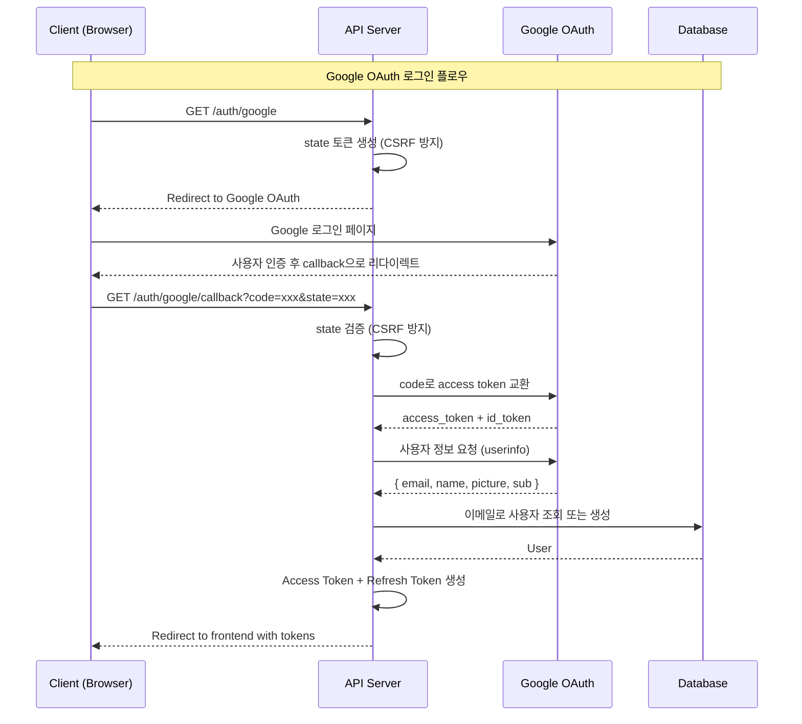

# Phase 2.1: Google OAuth

## 개요

| 항목 | 내용 |
|-----|------|
| **목표** | Google OAuth 2.0 소셜 로그인 구현 |
| **선행 조건** | Phase 2 완료 |
| **추천 시점** | Phase 6 (Worker) 완료 후, Phase 7 (Web App) 전 |
| **예상 소요** | 1 Step |
| **결과물** | Google OAuth 로그인/회원가입 동작 |

---

## 왜 분리했나요?

1. **외부 의존성**: Google Cloud Console 설정, 콜백 URL, 환경변수 등 외부 설정이 필요
2. **핵심 인증 분리**: 이메일/비밀번호 기반 인증은 독립적으로 동작 가능
3. **유연한 구현 시점**: Web App 개발 전에 구현하면 프론트엔드에서 바로 테스트 가능
4. **점진적 복잡도**: 핵심 기능을 먼저 완성하고 OAuth는 추가 로그인 방법으로 붙이기

---

## 권장 구현 순서

```
Phase 2 (완료) → Phase 3 (Session) → ... → Phase 6 (Worker) → Phase 2.1 (OAuth) → Phase 7 (Web App)
```

Phase 7 (Web App) 전에 OAuth를 구현하면:
- 웹에서 Google 로그인 버튼을 바로 테스트 가능
- 프론트엔드 콜백 핸들러와 함께 E2E 테스트 가능

---

## 진행 상황

| Step | 이름 | 상태 |
|------|------|------|
| 2.1.1 | Google OAuth 구현 | ⬜ |

---

## Step 2.1.1: Google OAuth 구현

### 목표

- `GET /v1/auth/google` - Google OAuth 로그인 시작 (리다이렉트)
- `GET /v1/auth/google/callback` - Google OAuth 콜백 처리

### 아키텍처



### 체크리스트

- [ ] **의존성 추가**

  ```bash
  cd apps/backend
  go get golang.org/x/oauth2
  go get golang.org/x/oauth2/google
  ```

- [ ] **User 스키마 수정**
  - [ ] `ent/schema/user.go`에 OAuth 필드 추가

    ```go
    func (User) Fields() []ent.Field {
        return []ent.Field{
            // ... 기존 필드 ...
            field.String("password_hash").
                Optional(), // OAuth 사용자는 비밀번호 없음
            field.String("google_id").
                Optional().
                Unique(),
            field.String("avatar_url").
                Optional(),
            field.Enum("auth_provider").
                Values("email", "google").
                Default("email"),
        }
    }
    ```

- [ ] **OAuth 설정**
  - [ ] `internal/infrastructure/config/oauth.go`

    ```go
    package config

    import (
        "os"

        "golang.org/x/oauth2"
        "golang.org/x/oauth2/google"
    )

    type OAuthConfig struct {
        Google *oauth2.Config
    }

    func NewOAuthConfig() *OAuthConfig {
        return &OAuthConfig{
            Google: &oauth2.Config{
                ClientID:     os.Getenv("GOOGLE_CLIENT_ID"),
                ClientSecret: os.Getenv("GOOGLE_CLIENT_SECRET"),
                RedirectURL:  os.Getenv("GOOGLE_REDIRECT_URL"),
                Scopes: []string{
                    "https://www.googleapis.com/auth/userinfo.email",
                    "https://www.googleapis.com/auth/userinfo.profile",
                },
                Endpoint: google.Endpoint,
            },
        }
    }
    ```

- [ ] **OAuth 서비스 작성**
  - [ ] `internal/service/oauth_service.go`

    ```go
    package service

    import (
        "context"
        "crypto/rand"
        "encoding/base64"
        "encoding/json"
        "errors"
        "fmt"
        "io"
        "net/http"

        "golang.org/x/oauth2"

        "github.com/mindhit/api/ent"
        "github.com/mindhit/api/ent/user"
    )

    var (
        ErrInvalidState = errors.New("invalid oauth state")
    )

    type GoogleUserInfo struct {
        ID            string `json:"id"`
        Email         string `json:"email"`
        VerifiedEmail bool   `json:"verified_email"`
        Name          string `json:"name"`
        Picture       string `json:"picture"`
    }

    type OAuthService struct {
        client       *ent.Client
        googleConfig *oauth2.Config
    }

    func NewOAuthService(client *ent.Client, googleConfig *oauth2.Config) *OAuthService {
        return &OAuthService{
            client:       client,
            googleConfig: googleConfig,
        }
    }

    // GenerateState creates a random state for CSRF protection
    func (s *OAuthService) GenerateState() (string, error) {
        bytes := make([]byte, 32)
        if _, err := rand.Read(bytes); err != nil {
            return "", err
        }
        return base64.URLEncoding.EncodeToString(bytes), nil
    }

    // GetGoogleAuthURL returns the Google OAuth authorization URL
    func (s *OAuthService) GetGoogleAuthURL(state string) string {
        return s.googleConfig.AuthCodeURL(state, oauth2.AccessTypeOffline)
    }

    // ExchangeGoogleCode exchanges the authorization code for tokens
    func (s *OAuthService) ExchangeGoogleCode(ctx context.Context, code string) (*oauth2.Token, error) {
        return s.googleConfig.Exchange(ctx, code)
    }

    // GetGoogleUserInfo fetches user info from Google
    func (s *OAuthService) GetGoogleUserInfo(ctx context.Context, token *oauth2.Token) (*GoogleUserInfo, error) {
        client := s.googleConfig.Client(ctx, token)
        resp, err := client.Get("https://www.googleapis.com/oauth2/v2/userinfo")
        if err != nil {
            return nil, fmt.Errorf("failed to get user info: %w", err)
        }
        defer resp.Body.Close()

        if resp.StatusCode != http.StatusOK {
            body, _ := io.ReadAll(resp.Body)
            return nil, fmt.Errorf("google api error: %s", string(body))
        }

        var userInfo GoogleUserInfo
        if err := json.NewDecoder(resp.Body).Decode(&userInfo); err != nil {
            return nil, fmt.Errorf("failed to decode user info: %w", err)
        }

        return &userInfo, nil
    }

    // FindOrCreateGoogleUser finds or creates a user from Google OAuth
    func (s *OAuthService) FindOrCreateGoogleUser(ctx context.Context, info *GoogleUserInfo) (*ent.User, error) {
        // 먼저 Google ID로 조회
        u, err := s.client.User.Query().
            Where(user.GoogleIDEQ(info.ID)).
            Only(ctx)
        if err == nil {
            return u, nil
        }
        if !ent.IsNotFound(err) {
            return nil, err
        }

        // Google ID가 없으면 이메일로 조회
        u, err = s.client.User.Query().
            Where(
                user.EmailEQ(info.Email),
                user.StatusEQ("active"),
            ).
            Only(ctx)
        if err == nil {
            // 기존 이메일 계정에 Google ID 연결
            return s.client.User.
                UpdateOneID(u.ID).
                SetGoogleID(info.ID).
                SetAvatarURL(info.Picture).
                Save(ctx)
        }
        if !ent.IsNotFound(err) {
            return nil, err
        }

        // 새 사용자 생성
        return s.client.User.
            Create().
            SetEmail(info.Email).
            SetGoogleID(info.ID).
            SetAvatarURL(info.Picture).
            SetAuthProvider("google").
            Save(ctx)
    }
    ```

- [ ] **OAuth 컨트롤러 작성**
  - [ ] `internal/controller/oauth_controller.go`

    ```go
    package controller

    import (
        "fmt"
        "net/http"
        "os"
        "time"

        "github.com/gin-gonic/gin"

        "github.com/mindhit/api/internal/service"
    )

    type OAuthController struct {
        oauthService *service.OAuthService
        jwtService   *service.JWTService
        frontendURL  string
    }

    func NewOAuthController(
        oauthService *service.OAuthService,
        jwtService *service.JWTService,
    ) *OAuthController {
        return &OAuthController{
            oauthService: oauthService,
            jwtService:   jwtService,
            frontendURL:  os.Getenv("FRONTEND_URL"),
        }
    }

    // GoogleLogin initiates Google OAuth flow
    func (c *OAuthController) GoogleLogin(ctx *gin.Context) {
        state, err := c.oauthService.GenerateState()
        if err != nil {
            ctx.JSON(http.StatusInternalServerError, gin.H{
                "error": gin.H{"message": "failed to generate state"},
            })
            return
        }

        // state를 쿠키에 저장 (CSRF 방지)
        ctx.SetCookie(
            "oauth_state",
            state,
            int(10*time.Minute.Seconds()),
            "/",
            "",
            true,  // secure
            true,  // httpOnly
        )

        url := c.oauthService.GetGoogleAuthURL(state)
        ctx.Redirect(http.StatusTemporaryRedirect, url)
    }

    // GoogleCallback handles Google OAuth callback
    func (c *OAuthController) GoogleCallback(ctx *gin.Context) {
        // state 검증
        state := ctx.Query("state")
        storedState, err := ctx.Cookie("oauth_state")
        if err != nil || state != storedState {
            ctx.Redirect(http.StatusTemporaryRedirect, c.frontendURL+"/auth/error?error=invalid_state")
            return
        }

        // 쿠키 삭제
        ctx.SetCookie("oauth_state", "", -1, "/", "", true, true)

        // code로 token 교환
        code := ctx.Query("code")
        if code == "" {
            ctx.Redirect(http.StatusTemporaryRedirect, c.frontendURL+"/auth/error?error=no_code")
            return
        }

        token, err := c.oauthService.ExchangeGoogleCode(ctx.Request.Context(), code)
        if err != nil {
            ctx.Redirect(http.StatusTemporaryRedirect, c.frontendURL+"/auth/error?error=exchange_failed")
            return
        }

        // 사용자 정보 가져오기
        userInfo, err := c.oauthService.GetGoogleUserInfo(ctx.Request.Context(), token)
        if err != nil {
            ctx.Redirect(http.StatusTemporaryRedirect, c.frontendURL+"/auth/error?error=userinfo_failed")
            return
        }

        // 사용자 찾기/생성
        user, err := c.oauthService.FindOrCreateGoogleUser(ctx.Request.Context(), userInfo)
        if err != nil {
            ctx.Redirect(http.StatusTemporaryRedirect, c.frontendURL+"/auth/error?error=user_failed")
            return
        }

        // JWT 토큰 쌍 생성
        tokenPair, err := c.jwtService.GenerateTokenPair(user.ID)
        if err != nil {
            ctx.Redirect(http.StatusTemporaryRedirect, c.frontendURL+"/auth/error?error=token_failed")
            return
        }

        // 프론트엔드로 리다이렉트 (토큰 포함)
        redirectURL := fmt.Sprintf(
            "%s/auth/callback?access_token=%s&refresh_token=%s&expires_in=%d",
            c.frontendURL,
            tokenPair.AccessToken,
            tokenPair.RefreshToken,
            tokenPair.ExpiresIn,
        )
        ctx.Redirect(http.StatusTemporaryRedirect, redirectURL)
    }
    ```

- [ ] **라우트 등록**

  ```go
  // In main.go
  auth := v1.Group("/auth")
  {
      // ... 기존 라우트 ...
      auth.GET("/google", oauthController.GoogleLogin)
      auth.GET("/google/callback", oauthController.GoogleCallback)
  }
  ```

- [ ] **환경 변수 설정**

  ```bash
  # .env.development
  GOOGLE_CLIENT_ID=your-client-id.apps.googleusercontent.com
  GOOGLE_CLIENT_SECRET=your-client-secret
  GOOGLE_REDIRECT_URL=http://localhost:8080/v1/auth/google/callback
  FRONTEND_URL=http://localhost:3000
  ```

- [ ] **마이그레이션 생성**

  ```bash
  cd apps/backend
  go generate ./ent
  moonx backend:migrate-diff -- add_oauth_fields
  moonx backend:migrate
  ```

### 검증

```bash
# 1. Google OAuth 시작 (브라우저에서 접근)
open "http://localhost:8080/v1/auth/google"
# Google 로그인 페이지로 리다이렉트됨

# 2. 로그인 후 프론트엔드로 리다이렉트
# http://localhost:3000/auth/callback?access_token=...&refresh_token=...

# 3. 받은 토큰으로 API 호출
curl -X GET http://localhost:8080/v1/auth/me \
  -H "Authorization: Bearer <access_token>"
# 200 OK + user (Google 프로필 정보 포함)
```

### Google Cloud Console 설정

1. [Google Cloud Console](https://console.cloud.google.com/) 접속
2. 프로젝트 생성 또는 선택
3. APIs & Services > Credentials > Create Credentials > OAuth client ID
4. Application type: Web application
5. Authorized redirect URIs 추가:
   - 개발: `http://localhost:8080/v1/auth/google/callback`
   - 프로덕션: `https://api.mindhit.io/v1/auth/google/callback`
6. Client ID와 Client Secret을 환경 변수에 설정

### 보안 고려사항

1. **state 파라미터**: CSRF 공격 방지를 위해 랜덤 state 사용
2. **HTTPS**: 프로덕션에서는 반드시 HTTPS 사용
3. **HttpOnly 쿠키**: state를 HttpOnly 쿠키에 저장
4. **토큰 저장**: 프론트엔드에서 안전하게 토큰 저장 필요
5. **이메일 검증**: Google은 이미 이메일 검증 완료

---

## Phase 2.1 완료 확인

### 검증 체크리스트

- [ ] **Google OAuth 시작**
  ```bash
  # 브라우저에서 접근
  open "http://localhost:8080/v1/auth/google"
  # Google 로그인 페이지로 리다이렉트
  ```

- [ ] **콜백 처리**
  ```bash
  # 로그인 후 프론트엔드로 리다이렉트
  # http://localhost:3000/auth/callback?access_token=...
  ```

- [ ] **토큰으로 API 호출**
  ```bash
  curl -X GET http://localhost:8080/v1/auth/me \
    -H "Authorization: Bearer <access_token>"
  # 200 OK + user with google_id, avatar_url
  ```

### 테스트 요구사항

| 테스트 유형 | 대상 | 파일 |
| ----------- | ---- | ---- |
| 단위 테스트 | OAuth state 생성/검증 | `oauth_service_test.go` |
| 단위 테스트 | FindOrCreateGoogleUser | `oauth_service_test.go` |
| 통합 테스트 | OAuth 콜백 처리 | `oauth_controller_test.go` |

```bash
# OAuth 테스트 실행
moonx backend:test -- -run "TestOAuth"
```

### 산출물 요약

| 항목 | 위치 |
| ---- | ---- |
| OAuth 설정 | `internal/infrastructure/config/oauth.go` |
| OAuth 서비스 | `internal/service/oauth_service.go` |
| OAuth 컨트롤러 | `internal/controller/oauth_controller.go` |
| User 스키마 (OAuth 필드) | `ent/schema/user.go` |

### API 요약

| 메서드 | 엔드포인트 | 설명 |
|-------|-----------|------|
| GET | `/v1/auth/google` | Google OAuth 로그인 시작 |
| GET | `/v1/auth/google/callback` | Google OAuth 콜백 |

---

## 다음 Phase

Phase 2.1 완료 후 [Phase 7: Next.js 웹앱](./phase-7-webapp.md)에서 OAuth 콜백 페이지를 구현하세요.
