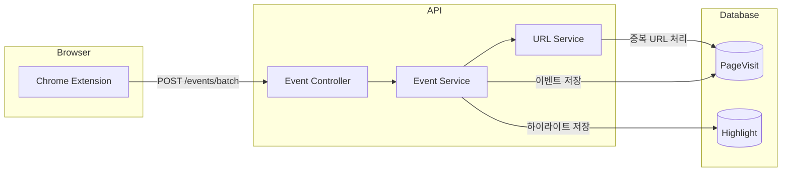

# Phase 4: 이벤트 수집 API

## 개요

| 항목 | 내용 |
|-----|------|
| **목표** | Extension에서 전송하는 브라우징 이벤트 수집 API |
| **선행 조건** | Phase 3 완료 |
| **예상 소요** | 3 Steps |
| **결과물** | 이벤트 배치 수신 및 저장 API 동작 |

---

## 아키텍처



---

## 진행 상황

| Step | 이름 | 상태 |
|------|------|------|
| 4.1 | Event 서비스 구현 | ⬜ |
| 4.2 | URL 서비스 구현 | ⬜ |
| 4.3 | Event 컨트롤러 구현 | ⬜ |
| 4.4 | 이벤트 조회 API 구현 | ⬜ |

---

## Step 4.1: Event 서비스 구현

### 목표

이벤트 배치 처리 및 저장 로직

### 체크리스트

- [ ] **gjson 의존성 추가**

  ```bash
  cd apps/backend
  go get github.com/tidwall/gjson
  ```

- [ ] **Event 서비스 작성**
  - [ ] `pkg/service/event_service.go`

    ```go
    package service

    import (
        "context"
        "fmt"
        "time"

        "github.com/google/uuid"
        "github.com/tidwall/gjson"

        "github.com/mindhit/api/ent"
        "github.com/mindhit/api/ent/session"
    )

    type EventService struct {
        client     *ent.Client
        urlService *URLService
    }

    func NewEventService(client *ent.Client, urlService *URLService) *EventService {
        return &EventService{
            client:     client,
            urlService: urlService,
        }
    }

    // BatchEvent represents a single event from the extension
    type BatchEvent struct {
        Type      string                 `json:"type"`
        Timestamp int64                  `json:"timestamp"`
        URL       string                 `json:"url,omitempty"`
        Title     string                 `json:"title,omitempty"`
        Content   string                 `json:"content,omitempty"`
        Payload   map[string]interface{} `json:"payload,omitempty"`
    }

    // ProcessBatchEvents processes multiple events at once
    func (s *EventService) ProcessBatchEvents(
        ctx context.Context,
        sessionID uuid.UUID,
        events []BatchEvent,
    ) (int, error) {
        // Verify session exists and is in recording/paused state
        sess, err := s.client.Session.
            Query().
            Where(session.IDEQ(sessionID)).
            Only(ctx)
        if err != nil {
            return 0, fmt.Errorf("session not found: %w", err)
        }

        if sess.Status != session.StatusRecording && sess.Status != session.StatusPaused {
            return 0, fmt.Errorf("session is not accepting events")
        }

        processed := 0

        for _, event := range events {
            if err := s.processEvent(ctx, sessionID, event); err != nil {
                // Log error but continue processing
                continue
            }
            processed++
        }

        return processed, nil
    }

    func (s *EventService) processEvent(
        ctx context.Context,
        sessionID uuid.UUID,
        event BatchEvent,
    ) error {
        // Store raw event
        _, err := s.client.RawEvent.
            Create().
            SetSessionID(sessionID).
            SetEventType(event.Type).
            SetTimestamp(time.UnixMilli(event.Timestamp)).
            SetPayload(toJSON(event)).
            Save(ctx)

        if err != nil {
            return err
        }

        // Process specific event types
        switch event.Type {
        case "page_visit":
            return s.processPageVisit(ctx, sessionID, event)
        case "highlight":
            return s.processHighlight(ctx, sessionID, event)
        }

        return nil
    }

    func (s *EventService) processPageVisit(
        ctx context.Context,
        sessionID uuid.UUID,
        event BatchEvent,
    ) error {
        if event.URL == "" {
            return nil
        }

        // Get or create URL
        url, err := s.urlService.GetOrCreate(ctx, event.URL, event.Title, event.Content)
        if err != nil {
            return err
        }

        // Create page visit
        _, err = s.client.PageVisit.
            Create().
            SetSessionID(sessionID).
            SetURLID(url.ID).
            SetEnteredAt(time.UnixMilli(event.Timestamp)).
            Save(ctx)

        return err
    }

    func (s *EventService) processHighlight(
        ctx context.Context,
        sessionID uuid.UUID,
        event BatchEvent,
    ) error {
        text, ok := event.Payload["text"].(string)
        if !ok || text == "" {
            return nil
        }

        selector, _ := event.Payload["selector"].(string)
        color, _ := event.Payload["color"].(string)
        if color == "" {
            color = "#FFFF00"
        }

        _, err := s.client.Highlight.
            Create().
            SetSessionID(sessionID).
            SetText(text).
            SetSelector(selector).
            SetColor(color).
            Save(ctx)

        return err
    }

    // ProcessBatchEventsFromJSON processes events from raw JSON
    func (s *EventService) ProcessBatchEventsFromJSON(
        ctx context.Context,
        sessionID uuid.UUID,
        jsonData string,
    ) (int, error) {
        eventsJSON := gjson.Get(jsonData, "events")
        if !eventsJSON.IsArray() {
            return 0, fmt.Errorf("events must be an array")
        }

        var events []BatchEvent
        eventsJSON.ForEach(func(key, value gjson.Result) bool {
            events = append(events, BatchEvent{
                Type:      value.Get("type").String(),
                Timestamp: value.Get("timestamp").Int(),
                URL:       value.Get("url").String(),
                Title:     value.Get("title").String(),
                Content:   value.Get("content").String(),
            })
            return true
        })

        return s.ProcessBatchEvents(ctx, sessionID, events)
    }

    func toJSON(v interface{}) string {
        // Simple JSON conversion for payload storage
        // In production, use proper JSON marshaling
        return fmt.Sprintf("%+v", v)
    }
    ```

### 검증

```bash
go build ./...
```

---

## Step 4.2: URL 서비스 구현

### 목표

URL 중복 처리 및 콘텐츠 저장

### 체크리스트

- [ ] **crypto 의존성** (해싱용)

  ```bash
  # 표준 라이브러리 사용
  ```

- [ ] **URL 서비스 작성**
  - [ ] `pkg/service/url_service.go`

    ```go
    package service

    import (
        "context"
        "crypto/sha256"
        "encoding/hex"
        "net/url"
        "strings"

        "github.com/mindhit/api/ent"
        enturl "github.com/mindhit/api/ent/url"
    )

    type URLService struct {
        client *ent.Client
    }

    func NewURLService(client *ent.Client) *URLService {
        return &URLService{client: client}
    }

    // GetOrCreate retrieves an existing URL or creates a new one
    func (s *URLService) GetOrCreate(
        ctx context.Context,
        rawURL string,
        title string,
        content string,
    ) (*ent.URL, error) {
        // Normalize URL
        normalizedURL := normalizeURL(rawURL)
        urlHash := hashURL(normalizedURL)

        // Try to find existing URL
        existing, err := s.client.URL.
            Query().
            Where(enturl.URLHashEQ(urlHash)).
            Only(ctx)

        if err == nil {
            // Update content if provided and not already set
            if content != "" && existing.Content == nil {
                return s.client.URL.
                    UpdateOne(existing).
                    SetContent(content).
                    Save(ctx)
            }
            return existing, nil
        }

        if !ent.IsNotFound(err) {
            return nil, err
        }

        // Create new URL
        create := s.client.URL.
            Create().
            SetURL(normalizedURL).
            SetURLHash(urlHash)

        if title != "" {
            create.SetTitle(title)
        }
        if content != "" {
            create.SetContent(content)
        }

        return create.Save(ctx)
    }

    // GetByHash retrieves a URL by its hash
    func (s *URLService) GetByHash(ctx context.Context, urlHash string) (*ent.URL, error) {
        return s.client.URL.
            Query().
            Where(enturl.URLHashEQ(urlHash)).
            Only(ctx)
    }

    // UpdateSummary updates the AI-generated summary for a URL
    func (s *URLService) UpdateSummary(
        ctx context.Context,
        urlID uuid.UUID,
        summary string,
        keywords []string,
    ) (*ent.URL, error) {
        return s.client.URL.
            UpdateOneID(urlID).
            SetSummary(summary).
            SetKeywords(keywords).
            Save(ctx)
    }

    // GetURLsWithoutSummary retrieves URLs that need summarization
    func (s *URLService) GetURLsWithoutSummary(ctx context.Context, limit int) ([]*ent.URL, error) {
        return s.client.URL.
            Query().
            Where(
                enturl.ContentNotNil(),
                enturl.SummaryIsNil(),
            ).
            Limit(limit).
            All(ctx)
    }

    // normalizeURL removes fragments and normalizes the URL
    func normalizeURL(rawURL string) string {
        parsed, err := url.Parse(rawURL)
        if err != nil {
            return rawURL
        }

        // Remove fragment
        parsed.Fragment = ""

        // Normalize path
        if parsed.Path == "" {
            parsed.Path = "/"
        }

        // Remove trailing slash for non-root paths
        if parsed.Path != "/" && strings.HasSuffix(parsed.Path, "/") {
            parsed.Path = strings.TrimSuffix(parsed.Path, "/")
        }

        // Lowercase scheme and host
        parsed.Scheme = strings.ToLower(parsed.Scheme)
        parsed.Host = strings.ToLower(parsed.Host)

        return parsed.String()
    }

    // hashURL creates a SHA256 hash of the URL
    func hashURL(normalizedURL string) string {
        hash := sha256.Sum256([]byte(normalizedURL))
        return hex.EncodeToString(hash[:])
    }
    ```

- [ ] **uuid import 추가**

  ```go
  import "github.com/google/uuid"
  ```

### 검증

```bash
go build ./...
```

---

## Step 4.3: Event 컨트롤러 구현

### 목표

이벤트 배치 수신 API 엔드포인트

### 체크리스트

- [ ] **Event 컨트롤러 작성**
  - [ ] `internal/api/controller/event_controller.go`

    ```go
    package controller

    import (
        "net/http"

        "github.com/gin-gonic/gin"
        "github.com/google/uuid"

        "github.com/mindhit/api/pkg/infra/middleware"
        "github.com/mindhit/api/pkg/service"
    )

    type EventController struct {
        eventService   *service.EventService
        sessionService *service.SessionService
    }

    func NewEventController(
        eventService *service.EventService,
        sessionService *service.SessionService,
    ) *EventController {
        return &EventController{
            eventService:   eventService,
            sessionService: sessionService,
        }
    }

    type BatchEventsRequest struct {
        Events []service.BatchEvent `json:"events" binding:"required"`
    }

    func (c *EventController) BatchEvents(ctx *gin.Context) {
        userID, ok := middleware.GetUserID(ctx)
        if !ok {
            ctx.JSON(http.StatusUnauthorized, gin.H{
                "error": gin.H{"message": "unauthorized"},
            })
            return
        }

        sessionID, err := uuid.Parse(ctx.Param("sessionId"))
        if err != nil {
            ctx.JSON(http.StatusBadRequest, gin.H{
                "error": gin.H{"message": "invalid session id"},
            })
            return
        }

        // Verify session ownership
        _, err = c.sessionService.Get(ctx.Request.Context(), sessionID, userID)
        if err != nil {
            ctx.JSON(http.StatusForbidden, gin.H{
                "error": gin.H{"message": "session not found or access denied"},
            })
            return
        }

        var req BatchEventsRequest
        if err := ctx.ShouldBindJSON(&req); err != nil {
            ctx.JSON(http.StatusBadRequest, gin.H{
                "error": gin.H{"message": err.Error()},
            })
            return
        }

        if len(req.Events) == 0 {
            ctx.JSON(http.StatusBadRequest, gin.H{
                "error": gin.H{"message": "no events provided"},
            })
            return
        }

        // Limit batch size
        if len(req.Events) > 200 {
            ctx.JSON(http.StatusBadRequest, gin.H{
                "error": gin.H{"message": "too many events in batch (max 200)"},
            })
            return
        }

        processed, err := c.eventService.ProcessBatchEvents(
            ctx.Request.Context(),
            sessionID,
            req.Events,
        )
        if err != nil {
            ctx.JSON(http.StatusInternalServerError, gin.H{
                "error": gin.H{"message": "failed to process events"},
            })
            return
        }

        ctx.JSON(http.StatusOK, gin.H{
            "processed": processed,
            "total":     len(req.Events),
        })
    }
    ```

- [ ] **main.go에 라우트 추가**

  ```go
  // Services
  urlService := service.NewURLService(client)
  eventService := service.NewEventService(client, urlService)

  // Controllers
  eventController := controller.NewEventController(eventService, sessionService)

  // Event routes (protected, under sessions)
  sessions.POST("/:sessionId/events", eventController.BatchEvents)
  ```

- [ ] **Sessions TypeSpec 업데이트** (Phase 1.5에서 추가)
  - [ ] `packages/protocol/src/events/events.tsp`

    ```typespec
    import "../common/errors.tsp";

    using TypeSpec.Http;
    using TypeSpec.Rest;

    namespace MindHit.Events;

    model BatchEvent {
      type: string;
      timestamp: int64;
      url?: string;
      title?: string;
      content?: string;
      payload?: Record<unknown>;
    }

    model BatchEventsRequest {
      events: BatchEvent[];
    }

    model BatchEventsResponse {
      processed: int32;
      total: int32;
    }

    @route("/v1/sessions/{sessionId}/events")
    @useAuth(BearerAuth)
    namespace Routes {
      @post
      @doc("배치 이벤트 전송")
      op batch(
        @path sessionId: string,
        @body body: BatchEventsRequest
      ): {
        @statusCode statusCode: 200;
        @body body: BatchEventsResponse;
      } | {
        @statusCode statusCode: 400;
        @body body: Common.ErrorResponse;
      } | {
        @statusCode statusCode: 403;
        @body body: Common.ErrorResponse;
      };
    }
    ```

### 검증

```bash
# 서버 실행
go run ./cmd/server

# 로그인
TOKEN=$(curl -s -X POST http://localhost:8080/v1/auth/login \
  -H "Content-Type: application/json" \
  -d '{"email":"test@example.com","password":"password123"}' | jq -r '.token')

# 세션 시작
SESSION_ID=$(curl -s -X POST http://localhost:8080/v1/sessions/start \
  -H "Authorization: Bearer $TOKEN" | jq -r '.session.id')

# 이벤트 배치 전송
curl -X POST "http://localhost:8080/v1/sessions/$SESSION_ID/events" \
  -H "Authorization: Bearer $TOKEN" \
  -H "Content-Type: application/json" \
  -d '{
    "events": [
      {
        "type": "page_visit",
        "timestamp": 1703123456789,
        "url": "https://example.com/page1",
        "title": "Example Page 1"
      },
      {
        "type": "page_visit",
        "timestamp": 1703123556789,
        "url": "https://example.com/page2",
        "title": "Example Page 2"
      },
      {
        "type": "highlight",
        "timestamp": 1703123656789,
        "payload": {
          "text": "Important text highlighted",
          "selector": "#main-content p:nth-child(2)"
        }
      }
    ]
  }'
# {"processed":3,"total":3}
```

---

## Step 4.4: 이벤트 조회 API 구현

### 목표

세션의 이벤트 목록 조회 및 통계 API

### 체크리스트

- [ ] **Event 서비스에 조회 메서드 추가**
  - [ ] `pkg/service/event_service.go`에 추가

    ```go
    // GetEventsBySession retrieves all events for a session
    func (s *EventService) GetEventsBySession(
        ctx context.Context,
        sessionID uuid.UUID,
        eventType string, // optional filter
        limit int,
        offset int,
    ) ([]*ent.RawEvent, int, error) {
        query := s.client.RawEvent.
            Query().
            Where(rawevent.SessionIDEQ(sessionID))

        // Apply event type filter if provided
        if eventType != "" {
            query = query.Where(rawevent.EventTypeEQ(eventType))
        }

        // Get total count
        total, err := query.Clone().Count(ctx)
        if err != nil {
            return nil, 0, fmt.Errorf("count events: %w", err)
        }

        // Apply pagination
        if limit <= 0 {
            limit = 50 // default limit
        }
        if limit > 200 {
            limit = 200 // max limit
        }

        events, err := query.
            Order(ent.Desc(rawevent.FieldTimestamp)).
            Limit(limit).
            Offset(offset).
            All(ctx)

        if err != nil {
            return nil, 0, fmt.Errorf("get events: %w", err)
        }

        return events, total, nil
    }

    // GetEventStats retrieves statistics for a session's events
    func (s *EventService) GetEventStats(
        ctx context.Context,
        sessionID uuid.UUID,
    ) (map[string]interface{}, error) {
        // Count by event type
        pageVisits, err := s.client.RawEvent.
            Query().
            Where(
                rawevent.SessionIDEQ(sessionID),
                rawevent.EventTypeEQ("page_visit"),
            ).
            Count(ctx)
        if err != nil {
            return nil, err
        }

        highlights, err := s.client.RawEvent.
            Query().
            Where(
                rawevent.SessionIDEQ(sessionID),
                rawevent.EventTypeEQ("highlight"),
            ).
            Count(ctx)
        if err != nil {
            return nil, err
        }

        totalEvents, err := s.client.RawEvent.
            Query().
            Where(rawevent.SessionIDEQ(sessionID)).
            Count(ctx)
        if err != nil {
            return nil, err
        }

        // Get unique URLs count
        uniqueURLs, err := s.client.PageVisit.
            Query().
            Where(pagevisit.SessionIDEQ(sessionID)).
            QueryURL().
            Count(ctx)
        if err != nil {
            return nil, err
        }

        return map[string]interface{}{
            "total_events":    totalEvents,
            "page_visits":     pageVisits,
            "highlights":      highlights,
            "unique_urls":     uniqueURLs,
        }, nil
    }
    ```

- [ ] **Event 컨트롤러에 조회 엔드포인트 추가**
  - [ ] `internal/api/controller/event_controller.go`에 추가

    ```go
    // ListEvents retrieves events for a session with optional filtering
    func (c *EventController) ListEvents(ctx *gin.Context) {
        userID, ok := middleware.GetUserID(ctx)
        if !ok {
            ctx.JSON(http.StatusUnauthorized, gin.H{
                "error": gin.H{"message": "unauthorized"},
            })
            return
        }

        sessionID, err := uuid.Parse(ctx.Param("sessionId"))
        if err != nil {
            ctx.JSON(http.StatusBadRequest, gin.H{
                "error": gin.H{"message": "invalid session id"},
            })
            return
        }

        // Verify session ownership
        _, err = c.sessionService.Get(ctx.Request.Context(), sessionID, userID)
        if err != nil {
            ctx.JSON(http.StatusForbidden, gin.H{
                "error": gin.H{"message": "session not found or access denied"},
            })
            return
        }

        // Parse query params
        eventType := ctx.Query("type")
        limit, _ := strconv.Atoi(ctx.DefaultQuery("limit", "50"))
        offset, _ := strconv.Atoi(ctx.DefaultQuery("offset", "0"))

        events, total, err := c.eventService.GetEventsBySession(
            ctx.Request.Context(),
            sessionID,
            eventType,
            limit,
            offset,
        )
        if err != nil {
            ctx.JSON(http.StatusInternalServerError, gin.H{
                "error": gin.H{"message": "failed to get events"},
            })
            return
        }

        ctx.JSON(http.StatusOK, gin.H{
            "events": events,
            "pagination": gin.H{
                "total":  total,
                "limit":  limit,
                "offset": offset,
            },
        })
    }

    // GetEventStats retrieves event statistics for a session
    func (c *EventController) GetEventStats(ctx *gin.Context) {
        userID, ok := middleware.GetUserID(ctx)
        if !ok {
            ctx.JSON(http.StatusUnauthorized, gin.H{
                "error": gin.H{"message": "unauthorized"},
            })
            return
        }

        sessionID, err := uuid.Parse(ctx.Param("sessionId"))
        if err != nil {
            ctx.JSON(http.StatusBadRequest, gin.H{
                "error": gin.H{"message": "invalid session id"},
            })
            return
        }

        // Verify session ownership
        _, err = c.sessionService.Get(ctx.Request.Context(), sessionID, userID)
        if err != nil {
            ctx.JSON(http.StatusForbidden, gin.H{
                "error": gin.H{"message": "session not found or access denied"},
            })
            return
        }

        stats, err := c.eventService.GetEventStats(ctx.Request.Context(), sessionID)
        if err != nil {
            ctx.JSON(http.StatusInternalServerError, gin.H{
                "error": gin.H{"message": "failed to get event stats"},
            })
            return
        }

        ctx.JSON(http.StatusOK, gin.H{
            "stats": stats,
        })
    }
    ```

- [ ] **main.go에 조회 라우트 추가**

  ```go
  // Event routes (protected, under sessions)
  sessions.POST("/:sessionId/events", eventController.BatchEvents)
  sessions.GET("/:sessionId/events", eventController.ListEvents)
  sessions.GET("/:sessionId/events/stats", eventController.GetEventStats)
  ```

- [ ] **import 추가**

  ```go
  import "strconv"
  ```

### 검증

```bash
# 이벤트 목록 조회
curl -H "Authorization: Bearer $TOKEN" \
  "http://localhost:8080/v1/sessions/$SESSION_ID/events"
# {"events":[...],"pagination":{"total":3,"limit":50,"offset":0}}

# 타입 필터로 조회
curl -H "Authorization: Bearer $TOKEN" \
  "http://localhost:8080/v1/sessions/$SESSION_ID/events?type=page_visit"

# 페이지네이션
curl -H "Authorization: Bearer $TOKEN" \
  "http://localhost:8080/v1/sessions/$SESSION_ID/events?limit=10&offset=0"

# 이벤트 통계 조회
curl -H "Authorization: Bearer $TOKEN" \
  "http://localhost:8080/v1/sessions/$SESSION_ID/events/stats"
# {"stats":{"total_events":3,"page_visits":2,"highlights":1,"unique_urls":2}}
```

---

## API 요약

| Method | Endpoint | 설명 | 인증 |
|--------|----------|------|------|
| POST | `/v1/sessions/:sessionId/events` | 이벤트 배치 전송 | Bearer Token |
| GET | `/v1/sessions/:sessionId/events` | 이벤트 목록 조회 | Bearer Token |
| GET | `/v1/sessions/:sessionId/events/stats` | 이벤트 통계 조회 | Bearer Token |

### 응답 예시

**POST /v1/sessions/:sessionId/events** (성공)

```json
{
  "processed": 3,
  "total": 3
}
```

**GET /v1/sessions/:sessionId/events** (성공)

```json
{
  "events": [
    {
      "id": "uuid",
      "event_type": "page_visit",
      "timestamp": "2024-01-01T00:00:00Z",
      "payload": "{...}",
      "processed": false
    }
  ],
  "pagination": {
    "total": 100,
    "limit": 50,
    "offset": 0
  }
}
```

**GET /v1/sessions/:sessionId/events/stats** (성공)

```json
{
  "stats": {
    "total_events": 100,
    "page_visits": 50,
    "highlights": 10,
    "unique_urls": 25
  }
}
```

---

## Phase 4 완료 확인

### 전체 검증 체크리스트

- [ ] **이벤트 배치 전송**

  ```bash
  curl -X POST "http://localhost:8080/v1/sessions/$SESSION_ID/events" \
    -H "Authorization: Bearer $TOKEN" \
    -H "Content-Type: application/json" \
    -d '{"events":[{"type":"page_visit","timestamp":1703123456789,"url":"https://test.com"}]}'
  # {"processed":1,"total":1}
  ```

- [ ] **빈 배치 거부**

  ```bash
  curl -X POST "http://localhost:8080/v1/sessions/$SESSION_ID/events" \
    -H "Authorization: Bearer $TOKEN" \
    -H "Content-Type: application/json" \
    -d '{"events":[]}'
  # 400 Bad Request
  ```

- [ ] **다른 사용자 세션 접근 거부**

  ```bash
  # 다른 사용자 토큰으로 요청
  # 403 Forbidden
  ```

- [ ] **URL 중복 처리**
  - 같은 URL로 두 번 이벤트 전송
  - urls 테이블에 1개만 존재하는지 확인

### 테스트 요구사항

| 테스트 유형 | 대상 | 파일 |
| ----------- | ---- | ---- |
| 단위 테스트 | 이벤트 배치 처리 | `event_service_test.go` |
| 단위 테스트 | URL 해시 및 중복 처리 | `url_service_test.go` |
| 통합 테스트 | Event API 엔드포인트 | `event_controller_test.go` |

```bash
# Phase 4 테스트 실행
moonx backend:test -- -run "TestEvent|TestURL"
```

> **Note**: 모든 테스트가 통과해야 Phase 4 완료로 인정됩니다.

### 산출물 요약

| 항목 | 위치 |
| ---- | ---- |
| Event 서비스 | `pkg/service/event_service.go` |
| URL 서비스 | `pkg/service/url_service.go` |
| Event 컨트롤러 | `internal/api/controller/event_controller.go` |
| 테스트 | `pkg/service/event_service_test.go` |

---

## 다음 Phase

Phase 4 완료 후 [Phase 5: 모니터링 및 인프라](./phase-5-infra.md)로 진행하세요.
