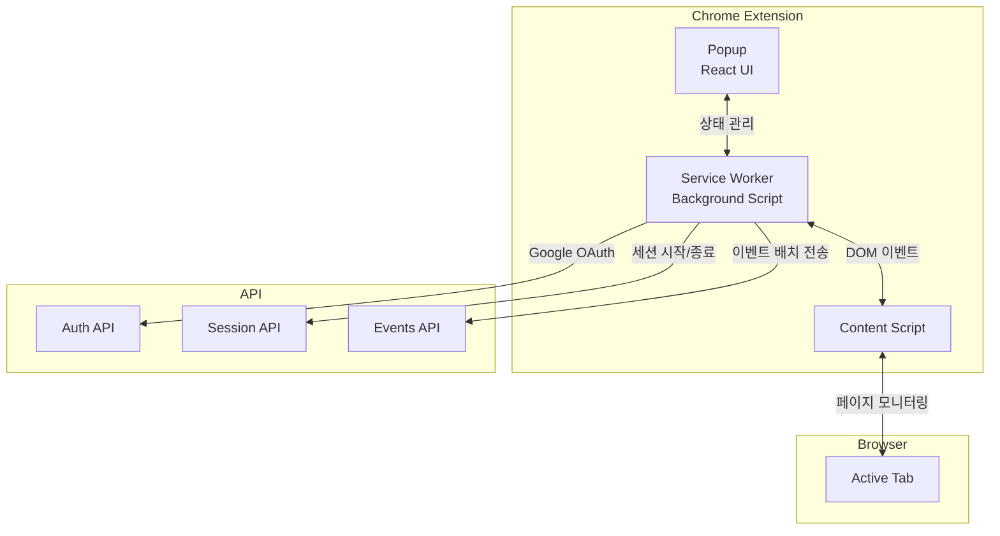

# Phase 8: Chrome Extension

## 개요

| 항목 | 내용 |
|-----|------|
| **목표** | Popup 기반 Chrome Extension으로 브라우징 세션 녹화 |
| **선행 조건** | Phase 2 (인증), Phase 2.1 (OAuth), Phase 4 (이벤트 API) 완료 |
| **예상 소요** | 5 Steps |
| **결과물** | Google 로그인, 세션 시작/일시정지/종료, 이벤트 수집 기능 |

---

## 아키텍처



---

## 진행 상황

| Step | 이름 | 상태 |
|------|------|------|
| 8.1 | Extension 프로젝트 설정 | ✅ |
| 8.2 | Side Panel UI | ✅ |
| 8.3 | 인증 연동 | ✅ |
| 8.4 | 이벤트 수집 | ✅ |
| 8.5 | 배치 전송 | ✅ |

---

## Step 8.1: Extension 프로젝트 설정

### 체크리스트

- [x] **프로젝트 생성**

  ```bash
  cd apps
  mkdir extension
  cd extension
  pnpm init
  ```

- [x] **의존성 설치**

  ```bash
  # 개발 의존성
  pnpm add -D typescript vite @crxjs/vite-plugin@beta
  pnpm add -D @vitejs/plugin-react
  pnpm add -D @types/chrome @types/react @types/react-dom
  pnpm add -D @tailwindcss/vite @tailwindcss/postcss
  pnpm add -D vitest happy-dom @testing-library/react @testing-library/dom

  # 런타임 의존성
  pnpm add react react-dom zustand
  pnpm add tailwindcss postcss autoprefixer
  ```

- [x] **프로젝트 구조**

  ```
  apps/extension/
  ├── src/
  │   ├── background/
  │   │   └── index.ts         # Service Worker
  │   ├── content/
  │   │   └── index.ts         # Content Script
  │   ├── popup/               # Popup UI (toolbar click)
  │   │   ├── index.html
  │   │   ├── index.tsx
  │   │   ├── App.tsx
  │   │   └── components/
  │   │       ├── SessionControl.tsx
  │   │       ├── SessionStats.tsx
  │   │       ├── LoginPrompt.tsx
  │   │       └── GoogleSignInButton.tsx
  │   ├── lib/
  │   │   ├── api.ts
  │   │   ├── chrome-storage.ts  # Chrome storage adapters
  │   │   ├── constants.ts       # Storage keys, client ID
  │   │   ├── storage.ts
  │   │   └── events.ts
  │   ├── stores/
  │   │   ├── auth-store.ts    # Uses session storage
  │   │   └── session-store.ts
  │   └── types/
  │       └── index.ts
  ├── public/
  │   └── icons/
  │       ├── icon16.png
  │       ├── icon48.png
  │       └── icon128.png
  ├── manifest.json
  ├── vite.config.ts
  ├── tsconfig.json
  └── package.json
  ```

- [x] **manifest.json**

  ```json
  {
    "manifest_version": 3,
    "name": "MindHit",
    "version": "1.0.0",
    "description": "Transform your browsing history into knowledge",
    "permissions": [
      "storage",
      "tabs",
      "activeTab",
      "scripting",
      "identity"
    ],
    "host_permissions": [
      "<all_urls>"
    ],
    "background": {
      "service_worker": "src/background/index.ts",
      "type": "module"
    },
    "content_scripts": [
      {
        "matches": ["<all_urls>"],
        "js": ["src/content/index.ts"],
        "run_at": "document_idle"
      }
    ],
    "action": {
      "default_title": "MindHit",
      "default_popup": "src/popup/index.html"
    },
    "icons": {
      "16": "public/icons/icon16.png",
      "48": "public/icons/icon48.png",
      "128": "public/icons/icon128.png"
    }
  }
  ```

  > **Note**: `identity` 권한은 Google OAuth (`chrome.identity.launchWebAuthFlow`) 사용에 필요합니다.

- [x] **vite.config.ts**

  ```typescript
  import { defineConfig } from "vite";
  import { crx } from "@crxjs/vite-plugin";
  import react from "@vitejs/plugin-react";
  import tailwindcss from "@tailwindcss/vite";
  import { resolve } from "path";
  import manifest from "./manifest.json";

  export default defineConfig({
    plugins: [react(), tailwindcss(), crx({ manifest })],
    resolve: {
      alias: {
        "@": resolve(__dirname, "src"),
      },
    },
    build: {
      rollupOptions: {
        input: {
          popup: "src/popup/index.html",
        },
      },
    },
  });
  ```

- [x] **tsconfig.json**

  ```json
  {
    "compilerOptions": {
      "target": "ES2020",
      "useDefineForClassFields": true,
      "lib": ["ES2020", "DOM", "DOM.Iterable"],
      "module": "ESNext",
      "skipLibCheck": true,
      "moduleResolution": "Bundler",
      "allowImportingTsExtensions": true,
      "resolveJsonModule": true,
      "isolatedModules": true,
      "noEmit": true,
      "jsx": "react-jsx",
      "strict": true,
      "noUnusedLocals": true,
      "noUnusedParameters": true,
      "noFallthroughCasesInSwitch": true,
      "types": ["chrome", "vite/client"],
      "paths": {
        "@/*": ["./src/*"]
      }
    },
    "include": ["src"]
  }
  ```

- [x] **vitest.config.ts** (테스트 설정)

  ```typescript
  import { defineConfig } from "vitest/config";
  import { resolve } from "path";

  export default defineConfig({
    test: {
      environment: "happy-dom",
      globals: true,
      setupFiles: ["./src/test/setup.ts"],
    },
    resolve: {
      alias: {
        "@": resolve(__dirname, "src"),
      },
    },
  });
  ```

- [x] **moon.yml**

  ```yaml
  language: typescript
  type: application

  tasks:
    dev:
      command: pnpm dev
      local: true

    build:
      command: pnpm build
      inputs:
        - "src/**/*"
        - "manifest.json"
        - "vite.config.ts"
      outputs:
        - "dist"

    watch:
      command: pnpm watch
      local: true

    test:
      command: pnpm test
      inputs:
        - "src/**/*"

    typecheck:
      command: pnpm typecheck
      inputs:
        - "src/**/*"
        - "tsconfig.json"

    lint:
      command: pnpm lint
      inputs:
        - "src/**/*"
  ```

### 검증

```bash
cd apps/extension
pnpm build
# dist 폴더 생성 확인

# Chrome에서 로드
# 1. chrome://extensions 접속
# 2. 개발자 모드 활성화
# 3. '압축해제된 확장 프로그램을 로드합니다' 클릭
# 4. dist 폴더 선택
```

---

## Step 8.2: Popup UI

### 체크리스트

- [x] **Popup HTML**
  - [x] `src/popup/index.html`

    ```html
    <!DOCTYPE html>
    <html lang="ko">
    <head>
      <meta charset="UTF-8" />
      <meta name="viewport" content="width=device-width, initial-scale=1.0" />
      <title>MindHit</title>
      <style>
        * {
          margin: 0;
          padding: 0;
          box-sizing: border-box;
        }
        body {
          font-family: -apple-system, BlinkMacSystemFont, 'Segoe UI', Roboto, sans-serif;
          background: #f8fafc;
          min-height: 100vh;
        }
      </style>
    </head>
    <body>
      <div id="root"></div>
      <script type="module" src="./index.tsx"></script>
    </body>
    </html>
    ```

- [x] **Popup Entry**
  - [x] `src/popup/index.tsx`

    ```tsx
    import { createRoot } from 'react-dom/client';
    import { App } from './App';
    import './styles.css';

    const root = document.getElementById('root');
    if (root) {
      createRoot(root).render(<App />);
    }
    ```

- [x] **스타일**
  - [x] `src/popup/styles.css`

    ```css
    /* Tailwind v4 문법 */
    @import "tailwindcss";

    * {
      margin: 0;
      padding: 0;
      box-sizing: border-box;
    }

    body {
      font-family: -apple-system, BlinkMacSystemFont, "Segoe UI", Roboto, sans-serif;
      background: #f8fafc;
      min-height: 100vh;
    }

    .btn {
      @apply px-4 py-2 rounded-lg font-medium transition-colors disabled:opacity-50 disabled:cursor-not-allowed;
    }
    .btn-primary {
      @apply bg-blue-600 text-white hover:bg-blue-700;
    }
    .btn-secondary {
      @apply bg-gray-200 text-gray-800 hover:bg-gray-300;
    }
    .btn-danger {
      @apply bg-red-600 text-white hover:bg-red-700;
    }
    .input {
      @apply w-full px-3 py-2 border border-gray-300 rounded-lg focus:ring-2 focus:ring-blue-500 focus:border-blue-500 outline-none;
    }
    ```

- [x] **Session Store**
  - [x] `src/stores/session-store.ts`

    ```typescript
    import { create } from "zustand";
    import { persist, createJSONStorage, StateStorage } from "zustand/middleware";

    // Extension 로컬 상태 (idle: 세션 없음, recording: 기록 중, paused: 일시정지)
    // Backend 상태: recording, paused, processing, completed, failed
    export type SessionStatus =
      | "idle"
      | "recording"
      | "paused"
      | "processing"
      | "completed"
      | "failed";

    interface SessionState {
      sessionId: string | null;
      status: SessionStatus;
      startedAt: number | null;
      pageCount: number;
      highlightCount: number;
      elapsedSeconds: number;

      startSession: (sessionId: string) => void;
      pauseSession: () => void;
      resumeSession: () => void;
      stopSession: () => void;
      incrementPageCount: () => void;
      incrementHighlightCount: () => void;
      updateElapsedTime: () => void;
      reset: () => void;
    }

    // Chrome storage adapter for Zustand persist
    const chromeStorage: StateStorage = {
      getItem: async (name: string): Promise<string | null> => {
        const result = await chrome.storage.local.get(name);
        const value = result[name];
        return typeof value === "string" ? value : null;
      },
      setItem: async (name: string, value: string): Promise<void> => {
        await chrome.storage.local.set({ [name]: value });
      },
      removeItem: async (name: string): Promise<void> => {
        await chrome.storage.local.remove(name);
      },
    };

    export const useSessionStore = create<SessionState>()(
      persist(
        (set, get) => ({
          sessionId: null,
          status: "idle",
          startedAt: null,
          pageCount: 0,
          highlightCount: 0,
          elapsedSeconds: 0,

          startSession: (sessionId) =>
            set({
              sessionId,
              status: "recording",
              startedAt: Date.now(),
              pageCount: 0,
              highlightCount: 0,
              elapsedSeconds: 0,
            }),

          pauseSession: () => set({ status: "paused" }),

          resumeSession: () => set({ status: "recording" }),

          stopSession: () =>
            set({
              sessionId: null,
              status: "idle",
              startedAt: null,
            }),

          incrementPageCount: () =>
            set((state) => ({ pageCount: state.pageCount + 1 })),

          incrementHighlightCount: () =>
            set((state) => ({ highlightCount: state.highlightCount + 1 })),

          updateElapsedTime: () => {
            const { startedAt, status } = get();
            if (startedAt && status === "recording") {
              set({ elapsedSeconds: Math.floor((Date.now() - startedAt) / 1000) });
            }
          },

          reset: () =>
            set({
              sessionId: null,
              status: "idle",
              startedAt: null,
              pageCount: 0,
              highlightCount: 0,
              elapsedSeconds: 0,
            }),
        }),
        {
          name: "mindhit-session",
          storage: createJSONStorage(() => chromeStorage),
        }
      )
    );
    ```

- [x] **Main App Component**
  - [x] `src/popup/App.tsx`

    ```tsx
    import { useEffect } from 'react';
    import { useAuthStore } from '../stores/auth-store';
    import { useSessionStore } from '../stores/session-store';
    import { SessionControl } from './components/SessionControl';
    import { SessionStats } from './components/SessionStats';
    import { LoginPrompt } from './components/LoginPrompt';

    export function App() {
      const { isAuthenticated, user } = useAuthStore();
      const { status, updateElapsedTime } = useSessionStore();

      // 경과 시간 업데이트
      useEffect(() => {
        if (status === 'recording') {
          const interval = setInterval(updateElapsedTime, 1000);
          return () => clearInterval(interval);
        }
      }, [status, updateElapsedTime]);

      if (!isAuthenticated) {
        return <LoginPrompt />;
      }

      return (
        <div className="min-h-screen p-4 space-y-4">
          {/* Header */}
          <header className="flex items-center justify-between">
            <h1 className="text-lg font-bold text-gray-900">MindHit</h1>
            <span className="text-sm text-gray-500">{user?.email}</span>
          </header>

          {/* Session Control */}
          <SessionControl />

          {/* Session Stats */}
          {status !== 'idle' && <SessionStats />}
        </div>
      );
    }
    ```

- [x] **Session Control Component**
  - [x] `src/popup/components/SessionControl.tsx`

    ```tsx
    import { useState } from 'react';
    import { useSessionStore } from '../../stores/session-store';
    import { useAuthStore } from '../../stores/auth-store';
    import { api } from '../../lib/api';

    export function SessionControl() {
      const { status, sessionId, startSession, pauseSession, resumeSession, stopSession, reset } = useSessionStore();
      const { token } = useAuthStore();
      const [isLoading, setIsLoading] = useState(false);

      const handleStart = async () => {
        if (!token) return;
        setIsLoading(true);
        try {
          const response = await api.startSession(token);
          startSession(response.session.id);

          // Background에 세션 시작 알림
          chrome.runtime.sendMessage({ type: 'SESSION_STARTED', sessionId: response.session.id });
        } catch (error) {
          console.error('Failed to start session:', error);
        } finally {
          setIsLoading(false);
        }
      };

      const handlePause = async () => {
        if (!token || !sessionId) return;
        setIsLoading(true);
        try {
          await api.pauseSession(token, sessionId);
          pauseSession();
          chrome.runtime.sendMessage({ type: 'SESSION_PAUSED' });
        } catch (error) {
          console.error('Failed to pause session:', error);
        } finally {
          setIsLoading(false);
        }
      };

      const handleResume = async () => {
        if (!token || !sessionId) return;
        setIsLoading(true);
        try {
          await api.resumeSession(token, sessionId);
          resumeSession();
          chrome.runtime.sendMessage({ type: 'SESSION_RESUMED' });
        } catch (error) {
          console.error('Failed to resume session:', error);
        } finally {
          setIsLoading(false);
        }
      };

      const handleStop = async () => {
        if (!token || !sessionId) return;
        setIsLoading(true);
        try {
          await api.stopSession(token, sessionId);
          stopSession();
          chrome.runtime.sendMessage({ type: 'SESSION_STOPPED' });
        } catch (error) {
          console.error('Failed to stop session:', error);
        } finally {
          setIsLoading(false);
        }
      };

      if (status === 'idle') {
        return (
          <div className="bg-white rounded-xl p-6 shadow-sm">
            <div className="text-center space-y-4">
              <div className="w-16 h-16 mx-auto bg-blue-100 rounded-full flex items-center justify-center">
                <svg className="w-8 h-8 text-blue-600" fill="none" stroke="currentColor" viewBox="0 0 24 24">
                  <path strokeLinecap="round" strokeLinejoin="round" strokeWidth={2} d="M14.752 11.168l-3.197-2.132A1 1 0 0010 9.87v4.263a1 1 0 001.555.832l3.197-2.132a1 1 0 000-1.664z" />
                  <path strokeLinecap="round" strokeLinejoin="round" strokeWidth={2} d="M21 12a9 9 0 11-18 0 9 9 0 0118 0z" />
                </svg>
              </div>
              <div>
                <h2 className="font-semibold text-gray-900">새 세션 시작</h2>
                <p className="text-sm text-gray-500 mt-1">
                  브라우징 활동을 녹화하고 마인드맵을 생성합니다
                </p>
              </div>
              <button
                onClick={handleStart}
                disabled={isLoading}
                className="btn btn-primary w-full"
              >
                {isLoading ? '시작 중...' : '녹화 시작'}
              </button>
            </div>
          </div>
        );
      }

      return (
        <div className="bg-white rounded-xl p-4 shadow-sm">
          <div className="flex items-center justify-between mb-4">
            <div className="flex items-center gap-2">
              <div className={`w-3 h-3 rounded-full ${status === 'recording' ? 'bg-red-500 animate-pulse' : 'bg-yellow-500'}`} />
              <span className="font-medium text-gray-900">
                {status === 'recording' ? '녹화 중' : '일시정지'}
              </span>
            </div>
          </div>

          <div className="flex gap-2">
            {status === 'recording' ? (
              <button
                onClick={handlePause}
                disabled={isLoading}
                className="btn btn-secondary flex-1"
              >
                일시정지
              </button>
            ) : (
              <button
                onClick={handleResume}
                disabled={isLoading}
                className="btn btn-primary flex-1"
              >
                재개
              </button>
            )}
            <button
              onClick={handleStop}
              disabled={isLoading}
              className="btn btn-danger flex-1"
            >
              종료
            </button>
          </div>
        </div>
      );
    }
    ```

- [x] **Session Stats Component**
  - [x] `src/popup/components/SessionStats.tsx`

    ```tsx
    import { useSessionStore } from '../../stores/session-store';

    function formatTime(seconds: number): string {
      const hours = Math.floor(seconds / 3600);
      const minutes = Math.floor((seconds % 3600) / 60);
      const secs = seconds % 60;

      if (hours > 0) {
        return `${hours}:${minutes.toString().padStart(2, '0')}:${secs.toString().padStart(2, '0')}`;
      }
      return `${minutes}:${secs.toString().padStart(2, '0')}`;
    }

    export function SessionStats() {
      const { pageCount, highlightCount, elapsedSeconds } = useSessionStore();

      return (
        <div className="bg-white rounded-xl p-4 shadow-sm">
          <div className="grid grid-cols-3 gap-4 text-center">
            <div>
              <p className="text-2xl font-bold text-gray-900">{formatTime(elapsedSeconds)}</p>
              <p className="text-xs text-gray-500">경과 시간</p>
            </div>
            <div>
              <p className="text-2xl font-bold text-gray-900">{pageCount}</p>
              <p className="text-xs text-gray-500">페이지</p>
            </div>
            <div>
              <p className="text-2xl font-bold text-gray-900">{highlightCount}</p>
              <p className="text-xs text-gray-500">하이라이트</p>
            </div>
          </div>
        </div>
      );
    }
    ```

- [x] **Login Prompt Component**
  - [x] `src/popup/components/LoginPrompt.tsx`

    ```tsx
    import { useState } from 'react';
    import { useAuthStore } from '../../stores/auth-store';
    import { api } from '../../lib/api';

    export function LoginPrompt() {
      const { setAuth } = useAuthStore();
      const [email, setEmail] = useState('');
      const [password, setPassword] = useState('');
      const [isLoading, setIsLoading] = useState(false);
      const [error, setError] = useState('');

      const handleLogin = async (e: React.FormEvent) => {
        e.preventDefault();
        setIsLoading(true);
        setError('');

        try {
          const response = await api.login(email, password);
          setAuth(response.user, response.token);
        } catch (err) {
          setError('로그인에 실패했습니다. 이메일과 비밀번호를 확인해주세요.');
        } finally {
          setIsLoading(false);
        }
      };

      return (
        <div className="min-h-screen p-4 flex items-center justify-center">
          <div className="w-full max-w-sm">
            <div className="text-center mb-6">
              <h1 className="text-xl font-bold text-gray-900">MindHit</h1>
              <p className="text-sm text-gray-500 mt-1">로그인하여 시작하세요</p>
            </div>

            <form onSubmit={handleLogin} className="space-y-4">
              <div>
                <label className="block text-sm font-medium text-gray-700 mb-1">
                  이메일
                </label>
                <input
                  type="email"
                  value={email}
                  onChange={(e) => setEmail(e.target.value)}
                  className="w-full px-3 py-2 border border-gray-300 rounded-lg focus:ring-2 focus:ring-blue-500 focus:border-blue-500"
                  placeholder="email@example.com"
                  required
                />
              </div>

              <div>
                <label className="block text-sm font-medium text-gray-700 mb-1">
                  비밀번호
                </label>
                <input
                  type="password"
                  value={password}
                  onChange={(e) => setPassword(e.target.value)}
                  className="w-full px-3 py-2 border border-gray-300 rounded-lg focus:ring-2 focus:ring-blue-500 focus:border-blue-500"
                  required
                />
              </div>

              {error && (
                <p className="text-sm text-red-600">{error}</p>
              )}

              <button
                type="submit"
                disabled={isLoading}
                className="btn btn-primary w-full"
              >
                {isLoading ? '로그인 중...' : '로그인'}
              </button>
            </form>

            <p className="text-center text-sm text-gray-500 mt-4">
              계정이 없으신가요?{' '}
              <a
                href="http://localhost:3000/signup"
                target="_blank"
                rel="noopener noreferrer"
                className="text-blue-600 hover:underline"
              >
                웹에서 회원가입
              </a>
            </p>
          </div>
        </div>
      );
    }
    ```

### 검증

```bash
pnpm build
# Chrome Extension 리로드
# Extension 아이콘 클릭 시 Popup 열림 확인
```

---

## Step 8.3: 인증 연동 (Google OAuth)

> **에러 처리 가이드**: Extension 에러 처리 패턴은
> [09-error-handling.md#11](../09-error-handling.md#11-extension-에러-처리-chrome-extension)을 참조하세요.
>
> - `chrome.runtime.lastError` 처리
> - Background-Content Script 통신 에러
> - 오프라인 상태 처리 및 요청 큐잉
> - Storage 용량 관리

### 체크리스트

- [x] **Auth Store**
  - [x] `src/stores/auth-store.ts`

    ```typescript
    import { create } from "zustand";
    import { persist, createJSONStorage, StateStorage } from "zustand/middleware";
    import type { User } from "@/types";

    interface AuthState {
      user: User | null;
      token: string | null;
      isAuthenticated: boolean;
      setAuth: (user: User, token: string) => void;
      logout: () => void;
    }

    // Chrome storage adapter for Zustand persist
    const chromeStorage: StateStorage = {
      getItem: async (name: string): Promise<string | null> => {
        const result = await chrome.storage.local.get(name);
        const value = result[name];
        return typeof value === "string" ? value : null;
      },
      setItem: async (name: string, value: string): Promise<void> => {
        await chrome.storage.local.set({ [name]: value });
      },
      removeItem: async (name: string): Promise<void> => {
        await chrome.storage.local.remove(name);
      },
    };

    export const useAuthStore = create<AuthState>()(
      persist(
        (set) => ({
          user: null,
          token: null,
          isAuthenticated: false,
          setAuth: (user, token) => set({ user, token, isAuthenticated: true }),
          logout: () => set({ user: null, token: null, isAuthenticated: false }),
        }),
        {
          name: "mindhit-auth",
          storage: createJSONStorage(() => chromeStorage),
        }
      )
    );
    ```

- [x] **API Client**
  - [x] `src/lib/api.ts`

    ```typescript
    // 환경변수로 API URL 설정 (빌드 시 주입)
    const API_BASE_URL = import.meta.env.VITE_API_URL || 'http://localhost:9000/v1';

    interface AuthResponse {
      user: {
        id: string;
        email: string;
      };
      token: string;
    }

    interface SessionResponse {
      session: {
        id: string;
        status: string;
        started_at: string;
      };
    }

    async function request<T>(
      endpoint: string,
      options: RequestInit = {}
    ): Promise<T> {
      const response = await fetch(`${API_BASE_URL}${endpoint}`, {
        ...options,
        headers: {
          'Content-Type': 'application/json',
          ...options.headers,
        },
      });

      if (!response.ok) {
        const error = await response.json().catch(() => ({}));
        throw new Error(error.error?.message || 'Request failed');
      }

      return response.json();
    }

    export const api = {
      // Auth
      login: async (email: string, password: string): Promise<AuthResponse> => {
        return request<AuthResponse>('/auth/login', {
          method: 'POST',
          body: JSON.stringify({ email, password }),
        });
      },

      // Sessions
      startSession: async (token: string): Promise<SessionResponse> => {
        return request<SessionResponse>('/sessions/start', {
          method: 'POST',
          headers: { Authorization: `Bearer ${token}` },
        });
      },

      pauseSession: async (token: string, sessionId: string): Promise<SessionResponse> => {
        return request<SessionResponse>(`/sessions/${sessionId}/pause`, {
          method: 'PATCH',
          headers: { Authorization: `Bearer ${token}` },
        });
      },

      resumeSession: async (token: string, sessionId: string): Promise<SessionResponse> => {
        return request<SessionResponse>(`/sessions/${sessionId}/resume`, {
          method: 'PATCH',
          headers: { Authorization: `Bearer ${token}` },
        });
      },

      stopSession: async (token: string, sessionId: string): Promise<SessionResponse> => {
        return request<SessionResponse>(`/sessions/${sessionId}/stop`, {
          method: 'POST',
          headers: { Authorization: `Bearer ${token}` },
        });
      },

      // Events
      sendEvents: async (token: string, sessionId: string, events: unknown[]): Promise<void> => {
        await request('/events/batch', {
          method: 'POST',
          headers: { Authorization: `Bearer ${token}` },
          body: JSON.stringify({ session_id: sessionId, events }),
        });
      },
    };
    ```

### 검증

```bash
# Popup에서 Google 로그인 테스트
# 1. Extension 아이콘 클릭
# 2. "Sign in with Google" 버튼 클릭
# 3. Google 계정 선택
# 4. 세션 컨트롤 UI 표시 확인
# 5. Extension 새로고침 후 로그인 상태 유지 확인
```

> **Note**: Google OAuth 구현 상세는 [Phase 2.1 OAuth](./phase-2.1-oauth.md#chrome-extension-google-oauth-phase-8-연계) 참조

---

## Step 8.4: 이벤트 수집

### 체크리스트

- [x] **이벤트 타입 정의**
  - [x] `src/types/index.ts`

    ```typescript
    export type EventType =
      | 'page_visit'
      | 'page_leave'
      | 'scroll'
      | 'highlight'
      | 'click';

    export interface BaseEvent {
      type: EventType;
      timestamp: number;
      url: string;
    }

    export interface PageVisitEvent extends BaseEvent {
      type: 'page_visit';
      title: string;
      referrer: string;
    }

    export interface PageLeaveEvent extends BaseEvent {
      type: 'page_leave';
      duration_ms: number;
      max_scroll_depth: number;
    }

    export interface ScrollEvent extends BaseEvent {
      type: 'scroll';
      scroll_depth: number;
    }

    export interface HighlightEvent extends BaseEvent {
      type: 'highlight';
      text: string;
      selector: string;
    }

    export interface ClickEvent extends BaseEvent {
      type: 'click';
      selector: string;
      text: string;
    }

    export type BrowsingEvent =
      | PageVisitEvent
      | PageLeaveEvent
      | ScrollEvent
      | HighlightEvent
      | ClickEvent;
    ```

- [x] **Background Service Worker**
  - [x] `src/background/index.ts`

    ```typescript
    import { BrowsingEvent } from '../types';

    interface SessionState {
      isRecording: boolean;
      sessionId: string | null;
      events: BrowsingEvent[];
    }

    let state: SessionState = {
      isRecording: false,
      sessionId: null,
      events: [],
    };

    // Side Panel에서 Extension 아이콘 클릭 시 열기
    chrome.sidePanel.setPanelBehavior({ openPanelOnActionClick: true });

    // 메시지 리스너
    chrome.runtime.onMessage.addListener((message, sender, sendResponse) => {
      switch (message.type) {
        case 'SESSION_STARTED':
          state.isRecording = true;
          state.sessionId = message.sessionId;
          state.events = [];
          notifyContentScripts('START_RECORDING');
          break;

        case 'SESSION_PAUSED':
          state.isRecording = false;
          notifyContentScripts('PAUSE_RECORDING');
          break;

        case 'SESSION_RESUMED':
          state.isRecording = true;
          notifyContentScripts('RESUME_RECORDING');
          break;

        case 'SESSION_STOPPED':
          state.isRecording = false;
          state.sessionId = null;
          flushEvents();
          notifyContentScripts('STOP_RECORDING');
          break;

        case 'EVENT':
          if (state.isRecording && state.sessionId) {
            state.events.push(message.event);

            // 이벤트 10개마다 또는 30초마다 전송
            if (state.events.length >= 10) {
              flushEvents();
            }
          }
          break;

        case 'GET_STATE':
          sendResponse({
            isRecording: state.isRecording,
            sessionId: state.sessionId,
          });
          break;
      }

      return true;
    });

    // 탭 변경 감지 (페이지 이동)
    chrome.tabs.onUpdated.addListener((tabId, changeInfo, tab) => {
      if (state.isRecording && changeInfo.status === 'complete' && tab.url) {
        // Content script에 새 페이지 알림
        chrome.tabs.sendMessage(tabId, { type: 'PAGE_LOADED' }).catch(() => {});
      }
    });

    // 주기적 이벤트 플러시 (30초)
    setInterval(() => {
      if (state.isRecording && state.events.length > 0) {
        flushEvents();
      }
    }, 30000);

    async function flushEvents() {
      if (state.events.length === 0 || !state.sessionId) return;

      const eventsToSend = [...state.events];
      state.events = [];

      try {
        const { 'mindhit-auth': authData } = await chrome.storage.local.get('mindhit-auth');
        if (!authData?.state?.token) return;

        const response = await fetch('http://localhost:9000/v1/events/batch', {
          method: 'POST',
          headers: {
            'Content-Type': 'application/json',
            Authorization: `Bearer ${authData.state.token}`,
          },
          body: JSON.stringify({
            session_id: state.sessionId,
            events: eventsToSend,
          }),
        });

        if (!response.ok) {
          // 실패 시 다시 큐에 추가
          state.events = [...eventsToSend, ...state.events];
        }
      } catch (error) {
        console.error('Failed to send events:', error);
        state.events = [...eventsToSend, ...state.events];
      }
    }

    async function notifyContentScripts(action: string) {
      const tabs = await chrome.tabs.query({});
      for (const tab of tabs) {
        if (tab.id) {
          chrome.tabs.sendMessage(tab.id, { type: action }).catch(() => {});
        }
      }
    }
    ```

- [x] **Content Script**
  - [x] `src/content/index.ts`

    ```typescript
    import { BrowsingEvent, PageVisitEvent, ScrollEvent, HighlightEvent } from '../types';

    let isRecording = false;
    let pageEnteredAt: number | null = null;
    let maxScrollDepth = 0;
    let lastScrollTime = 0;

    // 초기 상태 확인
    chrome.runtime.sendMessage({ type: 'GET_STATE' }, (response) => {
      if (response?.isRecording) {
        startRecording();
      }
    });

    // 메시지 리스너
    chrome.runtime.onMessage.addListener((message) => {
      switch (message.type) {
        case 'START_RECORDING':
        case 'RESUME_RECORDING':
        case 'PAGE_LOADED':
          startRecording();
          break;

        case 'PAUSE_RECORDING':
        case 'STOP_RECORDING':
          stopRecording();
          break;
      }
    });

    function startRecording() {
      if (isRecording) return;
      isRecording = true;
      pageEnteredAt = Date.now();
      maxScrollDepth = 0;

      // 페이지 방문 이벤트
      sendEvent({
        type: 'page_visit',
        timestamp: Date.now(),
        url: window.location.href,
        title: document.title,
        referrer: document.referrer,
      });

      // 이벤트 리스너 추가
      window.addEventListener('scroll', handleScroll, { passive: true });
      document.addEventListener('mouseup', handleSelection);
      window.addEventListener('beforeunload', handlePageLeave);

      // Side Panel에 페이지 카운트 업데이트
      chrome.runtime.sendMessage({ type: 'INCREMENT_PAGE_COUNT' });
    }

    function stopRecording() {
      if (!isRecording) return;

      handlePageLeave();

      window.removeEventListener('scroll', handleScroll);
      document.removeEventListener('mouseup', handleSelection);
      window.removeEventListener('beforeunload', handlePageLeave);

      isRecording = false;
      pageEnteredAt = null;
    }

    function handleScroll() {
      const now = Date.now();
      // 스크롤 이벤트 throttle (500ms)
      if (now - lastScrollTime < 500) return;
      lastScrollTime = now;

      const scrollTop = window.scrollY;
      const docHeight = document.documentElement.scrollHeight - window.innerHeight;
      const scrollDepth = docHeight > 0 ? Math.min(scrollTop / docHeight, 1) : 0;

      if (scrollDepth > maxScrollDepth) {
        maxScrollDepth = scrollDepth;

        sendEvent({
          type: 'scroll',
          timestamp: now,
          url: window.location.href,
          scroll_depth: scrollDepth,
        });
      }
    }

    function handleSelection() {
      const selection = window.getSelection();
      if (!selection || selection.isCollapsed) return;

      const text = selection.toString().trim();
      if (text.length < 10 || text.length > 1000) return;

      // 선택된 텍스트의 CSS selector 생성
      const range = selection.getRangeAt(0);
      const container = range.commonAncestorContainer;
      const element = container.nodeType === Node.TEXT_NODE
        ? container.parentElement
        : container as Element;

      if (!element) return;

      const selector = generateSelector(element);

      sendEvent({
        type: 'highlight',
        timestamp: Date.now(),
        url: window.location.href,
        text,
        selector,
      });

      // Side Panel에 하이라이트 카운트 업데이트
      chrome.runtime.sendMessage({ type: 'INCREMENT_HIGHLIGHT_COUNT' });
    }

    function handlePageLeave() {
      if (!pageEnteredAt) return;

      sendEvent({
        type: 'page_leave',
        timestamp: Date.now(),
        url: window.location.href,
        duration_ms: Date.now() - pageEnteredAt,
        max_scroll_depth: maxScrollDepth,
      });
    }

    function sendEvent(event: BrowsingEvent) {
      chrome.runtime.sendMessage({ type: 'EVENT', event });
    }

    function generateSelector(element: Element): string {
      const path: string[] = [];
      let current: Element | null = element;

      while (current && current !== document.body) {
        let selector = current.tagName.toLowerCase();

        if (current.id) {
          selector = `#${current.id}`;
          path.unshift(selector);
          break;
        }

        if (current.className) {
          const classes = current.className.split(' ').filter(Boolean).slice(0, 2);
          if (classes.length) {
            selector += `.${classes.join('.')}`;
          }
        }

        const siblings = current.parentElement?.children;
        if (siblings && siblings.length > 1) {
          const index = Array.from(siblings).indexOf(current);
          selector += `:nth-child(${index + 1})`;
        }

        path.unshift(selector);
        current = current.parentElement;
      }

      return path.join(' > ').slice(0, 500);
    }
    ```

### 검증

```bash
# 1. 세션 시작
# 2. 여러 페이지 방문
# 3. 텍스트 선택 (하이라이트)
# 4. 스크롤
# 5. 세션 종료
# 6. 서버 로그에서 이벤트 수신 확인
```

---

## Step 8.5: 배치 전송

### 체크리스트

- [x] **이벤트 큐 개선**
  - [x] `src/lib/events.ts`

    ```typescript
    import type { BrowsingEvent } from "@/types";

    const API_BASE_URL = import.meta.env.VITE_API_URL || "http://localhost:9000/v1";
    const BATCH_SIZE = 10;
    const FLUSH_INTERVAL = 30000; // 30 seconds
    const MAX_RETRY = 3;

    interface EventQueue {
      events: BrowsingEvent[];
      sessionId: string | null;
      flushTimer: ReturnType<typeof setInterval> | null;
      retryCount: number;
    }

    const queue: EventQueue = {
      events: [],
      sessionId: null,
      flushTimer: null,
      retryCount: 0,
    };

    export function initEventQueue(sessionId: string): void {
      queue.sessionId = sessionId;
      queue.events = [];
      queue.retryCount = 0;
      startFlushTimer();
    }

    export function addEvent(event: BrowsingEvent): void {
      if (!queue.sessionId) return;

      queue.events.push(event);

      if (queue.events.length >= BATCH_SIZE) {
        flush();
      }
    }

    export function stopEventQueue(): void {
      if (queue.flushTimer) {
        clearInterval(queue.flushTimer);
        queue.flushTimer = null;
      }
      flush(); // Send remaining events
      queue.sessionId = null;
    }

    function startFlushTimer(): void {
      if (queue.flushTimer) {
        clearInterval(queue.flushTimer);
      }
      queue.flushTimer = setInterval(flush, FLUSH_INTERVAL);
    }

    async function flush(): Promise<void> {
      if (queue.events.length === 0 || !queue.sessionId) return;

      const eventsToSend = [...queue.events];
      queue.events = [];

      try {
        const success = await sendEvents(queue.sessionId, eventsToSend);

        if (success) {
          queue.retryCount = 0;
        } else {
          handleFailure(eventsToSend);
        }
      } catch (error) {
        console.error("Failed to send events:", error);
        handleFailure(eventsToSend);
      }
    }

    function handleFailure(events: BrowsingEvent[]): void {
      queue.retryCount++;

      if (queue.retryCount < MAX_RETRY) {
        // Add failed events back to queue
        queue.events = [...events, ...queue.events];
      } else {
        // Save to local storage on max retry exceeded
        saveToLocal(events);
        queue.retryCount = 0;
      }
    }

    async function sendEvents(
      sessionId: string,
      events: BrowsingEvent[]
    ): Promise<boolean> {
      const authData = await chrome.storage.local.get("mindhit-auth");
      const rawValue = authData["mindhit-auth"];
      const parsed = typeof rawValue === "string" ? JSON.parse(rawValue) : null;
      const token = parsed?.state?.token;

      if (!token) return false;

      const response = await fetch(`${API_BASE_URL}/events/batch`, {
        method: "POST",
        headers: {
          "Content-Type": "application/json",
          Authorization: `Bearer ${token}`,
        },
        body: JSON.stringify({
          session_id: sessionId,
          events,
        }),
      });

      return response.ok;
    }

    async function saveToLocal(events: BrowsingEvent[]): Promise<void> {
      const key = `mindhit-pending-events-${Date.now()}`;
      await chrome.storage.local.set({ [key]: events });
    }

    // Retry pending events (on app start)
    export async function retryPendingEvents(sessionId: string): Promise<void> {
      const storage = await chrome.storage.local.get(null);
      const pendingKeys = Object.keys(storage).filter((k) =>
        k.startsWith("mindhit-pending-events-")
      );

      for (const key of pendingKeys) {
        const events = storage[key] as BrowsingEvent[];
        if (events.length > 0) {
          const success = await sendEvents(sessionId, events);
          if (success) {
            await chrome.storage.local.remove(key);
          }
        }
      }
    }
    ```

- [x] **오프라인 지원**
  - [x] `src/lib/storage.ts`

    ```typescript
    const STORAGE_KEY_PREFIX = 'mindhit';

    export const storage = {
      async get<T>(key: string): Promise<T | null> {
        const fullKey = `${STORAGE_KEY_PREFIX}-${key}`;
        const result = await chrome.storage.local.get(fullKey);
        return result[fullKey] || null;
      },

      async set<T>(key: string, value: T): Promise<void> {
        const fullKey = `${STORAGE_KEY_PREFIX}-${key}`;
        await chrome.storage.local.set({ [fullKey]: value });
      },

      async remove(key: string): Promise<void> {
        const fullKey = `${STORAGE_KEY_PREFIX}-${key}`;
        await chrome.storage.local.remove(fullKey);
      },

      async getAll(): Promise<Record<string, unknown>> {
        const result = await chrome.storage.local.get(null);
        const filtered: Record<string, unknown> = {};

        for (const [key, value] of Object.entries(result)) {
          if (key.startsWith(STORAGE_KEY_PREFIX)) {
            filtered[key.replace(`${STORAGE_KEY_PREFIX}-`, '')] = value;
          }
        }

        return filtered;
      },
    };

    // 네트워크 상태 감지
    export function onOnline(callback: () => void) {
      window.addEventListener('online', callback);
    }

    export function onOffline(callback: () => void) {
      window.addEventListener('offline', callback);
    }

    export function isOnline(): boolean {
      return navigator.onLine;
    }
    ```

- [x] **Background에서 오프라인 처리**
  - Background Service Worker 업데이트

    ```typescript
    // src/background/index.ts에 추가

    // 네트워크 복구 시 대기 중인 이벤트 전송
    self.addEventListener('online', () => {
      retryPendingEvents();
    });

    async function retryPendingEvents() {
      const storage = await chrome.storage.local.get(null);
      const pendingKeys = Object.keys(storage).filter(k =>
        k.startsWith('mindhit-pending-events-')
      );

      for (const key of pendingKeys) {
        const events = storage[key];
        if (events && state.sessionId) {
          try {
            const { 'mindhit-auth': authData } = await chrome.storage.local.get('mindhit-auth');
            if (!authData?.state?.token) continue;

            const response = await fetch('http://localhost:9000/v1/events/batch', {
              method: 'POST',
              headers: {
                'Content-Type': 'application/json',
                Authorization: `Bearer ${authData.state.token}`,
              },
              body: JSON.stringify({
                session_id: state.sessionId,
                events,
              }),
            });

            if (response.ok) {
              await chrome.storage.local.remove(key);
              console.log(`Retried ${events.length} pending events`);
            }
          } catch (error) {
            console.error('Failed to retry pending events:', error);
          }
        }
      }
    }
    ```

### 검증

```bash
# 오프라인 테스트
# 1. 세션 시작
# 2. 네트워크 끊기 (DevTools > Network > Offline)
# 3. 페이지 방문 및 활동
# 4. 네트워크 복구
# 5. 이벤트 전송 확인
```

---

## Phase 8 완료 확인

### 전체 검증 체크리스트

- [x] Extension 빌드 성공
- [x] Chrome에 로드 성공
- [x] Popup 열기/닫기
- [x] Google OAuth 로그인/로그아웃
- [x] 세션 시작/일시정지/재개/종료
- [x] 페이지 방문 이벤트 수집
- [x] 스크롤 이벤트 수집
- [x] 하이라이트 이벤트 수집
- [x] 이벤트 배치 전송
- [x] 오프라인 이벤트 저장 및 재전송

### 테스트 요구사항

| 테스트 유형 | 대상 | 도구 |
| ----------- | ---- | ---- |
| 단위 테스트 | 이벤트 큐 로직 | Vitest |
| 단위 테스트 | IndexedDB 저장소 | Vitest + fake-indexeddb |
| 통합 테스트 | API 통신 | Vitest + MSW |
| E2E 테스트 | Extension 전체 플로우 | Puppeteer (수동 검증) |

```bash
# Phase 8 테스트 실행
moonx extension:test
```

> **Note**: Chrome Extension은 브라우저 환경 테스트가 제한적이므로 핵심 로직 단위 테스트에 집중합니다.

### 산출물 요약

| 항목 | 위치 |
| ---- | ---- |
| Extension 프로젝트 | `apps/extension/` |
| Manifest | `manifest.json` |
| Background Worker | `src/background/index.ts` |
| Content Script | `src/content/index.ts` |
| Popup UI | `src/popup/` |
| Google Sign-In | `src/popup/components/GoogleSignInButton.tsx` |
| Chrome Storage | `src/lib/chrome-storage.ts` |
| 이벤트 큐 | `src/lib/events.ts` |
| 테스트 | `src/**/*.test.ts` |

---

## 다음 Phase

Phase 8 완료 후 [Phase 9: 플랜 및 사용량 시스템](./phase-9-plan-usage.md)으로 진행하세요.
