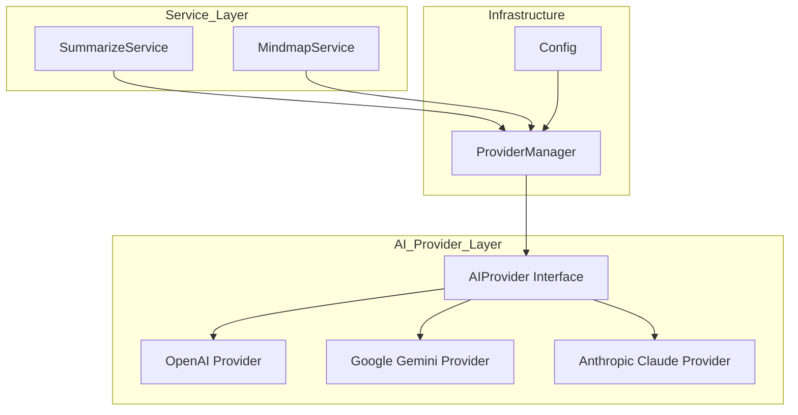

# Phase 9: AI 마인드맵 생성

## 개요

| 항목 | 내용 |
|-----|------|
| **목표** | 다중 AI 프로바이더(OpenAI, Google Gemini, Anthropic Claude)를 지원하는 콘텐츠 요약 및 마인드맵 생성 |
| **선행 조건** | Phase 6 완료 (스케줄러) |
| **예상 소요** | 5 Steps |
| **결과물** | 세션 완료 시 자동 마인드맵 생성 (AI 프로바이더 선택 가능) |

---

## 아키텍처 개요



### 설계 원칙

1. **인터페이스 기반 설계**: 모든 AI 프로바이더는 동일한 인터페이스 구현
2. **런타임 프로바이더 전환**: 환경변수 또는 설정으로 프로바이더 변경 가능
3. **Fallback 지원**: 기본 프로바이더 실패 시 대체 프로바이더 사용
4. **용도별 프로바이더 분리**: 요약과 마인드맵 생성에 다른 모델 사용 가능

---

## 진행 상황

| Step | 이름 | 상태 |
|------|------|------|
| 9.1 | AI Provider 인터페이스 정의 | ⬜ |
| 9.2 | 개별 Provider 구현 (OpenAI, Gemini, Claude) | ⬜ |
| 9.3 | Provider Manager 및 Config | ⬜ |
| 9.4 | URL 요약 서비스 | ⬜ |
| 9.5 | 마인드맵 생성 서비스 및 Job 등록 | ⬜ |

---

## Step 9.1: AI Provider 인터페이스 정의

### 체크리스트

- [ ] **공통 타입 정의**
  - [ ] `internal/infrastructure/ai/types.go`
    ```go
    package ai

    import "context"

    // Message represents a chat message
    type Message struct {
        Role    Role   `json:"role"`
        Content string `json:"content"`
    }

    // Role defines message roles
    type Role string

    const (
        RoleSystem    Role = "system"
        RoleUser      Role = "user"
        RoleAssistant Role = "assistant"
    )

    // ChatOptions contains optional parameters for chat completion
    type ChatOptions struct {
        Temperature   float64  `json:"temperature,omitempty"`
        MaxTokens     int      `json:"max_tokens,omitempty"`
        TopP          float64  `json:"top_p,omitempty"`
        StopSequences []string `json:"stop_sequences,omitempty"`
        JSONMode      bool     `json:"json_mode,omitempty"` // Force JSON output
    }

    // DefaultChatOptions returns sensible defaults
    func DefaultChatOptions() ChatOptions {
        return ChatOptions{
            Temperature: 0.7,
            MaxTokens:   4096,
            TopP:        1.0,
        }
    }

    // ChatResponse contains the AI response
    type ChatResponse struct {
        Content      string `json:"content"`
        Model        string `json:"model"`
        Provider     string `json:"provider"`
        InputTokens  int    `json:"input_tokens,omitempty"`
        OutputTokens int    `json:"output_tokens,omitempty"`
    }

    // ProviderType identifies the AI provider
    type ProviderType string

    const (
        ProviderOpenAI    ProviderType = "openai"
        ProviderGemini    ProviderType = "gemini"
        ProviderClaude    ProviderType = "claude"
    )

    // ProviderConfig holds configuration for a single provider
    type ProviderConfig struct {
        Type     ProviderType `json:"type"`
        APIKey   string       `json:"api_key"`
        Model    string       `json:"model"`
        Enabled  bool         `json:"enabled"`
        Priority int          `json:"priority"` // Lower = higher priority for fallback
    }
    ```

- [ ] **AIProvider 인터페이스 정의**
  - [ ] `internal/infrastructure/ai/provider.go`
    ```go
    package ai

    import (
        "context"
        "errors"
    )

    var (
        ErrProviderNotConfigured = errors.New("ai provider not configured")
        ErrNoResponse            = errors.New("no response from ai provider")
        ErrRateLimited           = errors.New("rate limited by ai provider")
        ErrInvalidAPIKey         = errors.New("invalid api key")
        ErrContextCanceled       = errors.New("context canceled")
    )

    // AIProvider defines the interface that all AI providers must implement
    type AIProvider interface {
        // Chat sends messages and returns a response
        Chat(ctx context.Context, messages []Message, opts ChatOptions) (*ChatResponse, error)

        // ChatWithJSON is a convenience method that forces JSON output
        ChatWithJSON(ctx context.Context, messages []Message, opts ChatOptions) (*ChatResponse, error)

        // Name returns the provider name for logging/metrics
        Name() string

        // Type returns the provider type
        Type() ProviderType

        // Model returns the current model being used
        Model() string

        // IsHealthy checks if the provider is available
        IsHealthy(ctx context.Context) bool
    }

    // BaseProvider contains common functionality for all providers
    type BaseProvider struct {
        providerType ProviderType
        model        string
    }

    func (b *BaseProvider) Type() ProviderType {
        return b.providerType
    }

    func (b *BaseProvider) Model() string {
        return b.model
    }

    func (b *BaseProvider) Name() string {
        return string(b.providerType)
    }
    ```

### 검증
```bash
go build ./...
# 컴파일 성공
```

---

## Step 9.2: 개별 Provider 구현

### 체크리스트

- [ ] **의존성 추가**
  ```bash
  # OpenAI
  go get github.com/sashabaranov/go-openai

  # Google Gemini
  go get github.com/google/generative-ai-go

  # Anthropic Claude
  go get github.com/anthropics/anthropic-sdk-go
  ```

- [ ] **OpenAI Provider 구현**
  - [ ] `internal/infrastructure/ai/openai.go`
    ```go
    package ai

    import (
        "context"
        "fmt"

        "github.com/sashabaranov/go-openai"
    )

    type OpenAIProvider struct {
        BaseProvider
        client *openai.Client
    }

    func NewOpenAIProvider(apiKey, model string) *OpenAIProvider {
        if model == "" {
            model = "gpt-4-turbo-preview"
        }
        return &OpenAIProvider{
            BaseProvider: BaseProvider{
                providerType: ProviderOpenAI,
                model:        model,
            },
            client: openai.NewClient(apiKey),
        }
    }

    func (p *OpenAIProvider) Chat(ctx context.Context, messages []Message, opts ChatOptions) (*ChatResponse, error) {
        chatMessages := make([]openai.ChatCompletionMessage, len(messages))
        for i, msg := range messages {
            chatMessages[i] = openai.ChatCompletionMessage{
                Role:    string(msg.Role),
                Content: msg.Content,
            }
        }

        req := openai.ChatCompletionRequest{
            Model:       p.model,
            Messages:    chatMessages,
            Temperature: float32(opts.Temperature),
            MaxTokens:   opts.MaxTokens,
            TopP:        float32(opts.TopP),
            Stop:        opts.StopSequences,
        }

        resp, err := p.client.CreateChatCompletion(ctx, req)
        if err != nil {
            return nil, fmt.Errorf("openai chat: %w", err)
        }

        if len(resp.Choices) == 0 {
            return nil, ErrNoResponse
        }

        return &ChatResponse{
            Content:      resp.Choices[0].Message.Content,
            Model:        resp.Model,
            Provider:     string(ProviderOpenAI),
            InputTokens:  resp.Usage.PromptTokens,
            OutputTokens: resp.Usage.CompletionTokens,
        }, nil
    }

    func (p *OpenAIProvider) ChatWithJSON(ctx context.Context, messages []Message, opts ChatOptions) (*ChatResponse, error) {
        chatMessages := make([]openai.ChatCompletionMessage, len(messages))
        for i, msg := range messages {
            chatMessages[i] = openai.ChatCompletionMessage{
                Role:    string(msg.Role),
                Content: msg.Content,
            }
        }

        req := openai.ChatCompletionRequest{
            Model:       p.model,
            Messages:    chatMessages,
            Temperature: float32(opts.Temperature),
            MaxTokens:   opts.MaxTokens,
            TopP:        float32(opts.TopP),
            ResponseFormat: &openai.ChatCompletionResponseFormat{
                Type: openai.ChatCompletionResponseFormatTypeJSONObject,
            },
        }

        resp, err := p.client.CreateChatCompletion(ctx, req)
        if err != nil {
            return nil, fmt.Errorf("openai chat json: %w", err)
        }

        if len(resp.Choices) == 0 {
            return nil, ErrNoResponse
        }

        return &ChatResponse{
            Content:      resp.Choices[0].Message.Content,
            Model:        resp.Model,
            Provider:     string(ProviderOpenAI),
            InputTokens:  resp.Usage.PromptTokens,
            OutputTokens: resp.Usage.CompletionTokens,
        }, nil
    }

    func (p *OpenAIProvider) IsHealthy(ctx context.Context) bool {
        // Simple health check with minimal tokens
        _, err := p.Chat(ctx, []Message{
            {Role: RoleUser, Content: "ping"},
        }, ChatOptions{MaxTokens: 5})
        return err == nil
    }
    ```

- [ ] **Google Gemini Provider 구현**
  - [ ] `internal/infrastructure/ai/gemini.go`
    ```go
    package ai

    import (
        "context"
        "encoding/json"
        "fmt"
        "strings"

        "github.com/google/generative-ai-go/genai"
        "google.golang.org/api/option"
    )

    type GeminiProvider struct {
        BaseProvider
        client *genai.Client
    }

    func NewGeminiProvider(ctx context.Context, apiKey, model string) (*GeminiProvider, error) {
        if model == "" {
            model = "gemini-1.5-pro"
        }

        client, err := genai.NewClient(ctx, option.WithAPIKey(apiKey))
        if err != nil {
            return nil, fmt.Errorf("create gemini client: %w", err)
        }

        return &GeminiProvider{
            BaseProvider: BaseProvider{
                providerType: ProviderGemini,
                model:        model,
            },
            client: client,
        }, nil
    }

    func (p *GeminiProvider) Chat(ctx context.Context, messages []Message, opts ChatOptions) (*ChatResponse, error) {
        model := p.client.GenerativeModel(p.model)

        // Set generation config
        model.SetTemperature(float32(opts.Temperature))
        model.SetMaxOutputTokens(int32(opts.MaxTokens))
        model.SetTopP(float32(opts.TopP))

        if len(opts.StopSequences) > 0 {
            model.StopSequences = opts.StopSequences
        }

        // Convert messages to Gemini format
        var parts []genai.Part
        var systemPrompt string

        for _, msg := range messages {
            switch msg.Role {
            case RoleSystem:
                systemPrompt = msg.Content
            case RoleUser, RoleAssistant:
                parts = append(parts, genai.Text(msg.Content))
            }
        }

        if systemPrompt != "" {
            model.SystemInstruction = &genai.Content{
                Parts: []genai.Part{genai.Text(systemPrompt)},
            }
        }

        resp, err := model.GenerateContent(ctx, parts...)
        if err != nil {
            return nil, fmt.Errorf("gemini generate: %w", err)
        }

        if len(resp.Candidates) == 0 || len(resp.Candidates[0].Content.Parts) == 0 {
            return nil, ErrNoResponse
        }

        // Extract text from response
        var content strings.Builder
        for _, part := range resp.Candidates[0].Content.Parts {
            if text, ok := part.(genai.Text); ok {
                content.WriteString(string(text))
            }
        }

        return &ChatResponse{
            Content:      content.String(),
            Model:        p.model,
            Provider:     string(ProviderGemini),
            InputTokens:  int(resp.UsageMetadata.PromptTokenCount),
            OutputTokens: int(resp.UsageMetadata.CandidatesTokenCount),
        }, nil
    }

    func (p *GeminiProvider) ChatWithJSON(ctx context.Context, messages []Message, opts ChatOptions) (*ChatResponse, error) {
        model := p.client.GenerativeModel(p.model)

        // Set generation config
        model.SetTemperature(float32(opts.Temperature))
        model.SetMaxOutputTokens(int32(opts.MaxTokens))
        model.SetTopP(float32(opts.TopP))

        // Force JSON output
        model.ResponseMIMEType = "application/json"

        // Convert messages
        var parts []genai.Part
        var systemPrompt string

        for _, msg := range messages {
            switch msg.Role {
            case RoleSystem:
                systemPrompt = msg.Content
            case RoleUser, RoleAssistant:
                parts = append(parts, genai.Text(msg.Content))
            }
        }

        if systemPrompt != "" {
            model.SystemInstruction = &genai.Content{
                Parts: []genai.Part{genai.Text(systemPrompt)},
            }
        }

        resp, err := model.GenerateContent(ctx, parts...)
        if err != nil {
            return nil, fmt.Errorf("gemini generate json: %w", err)
        }

        if len(resp.Candidates) == 0 || len(resp.Candidates[0].Content.Parts) == 0 {
            return nil, ErrNoResponse
        }

        var content strings.Builder
        for _, part := range resp.Candidates[0].Content.Parts {
            if text, ok := part.(genai.Text); ok {
                content.WriteString(string(text))
            }
        }

        // Validate JSON
        var js json.RawMessage
        if err := json.Unmarshal([]byte(content.String()), &js); err != nil {
            return nil, fmt.Errorf("invalid json response: %w", err)
        }

        return &ChatResponse{
            Content:      content.String(),
            Model:        p.model,
            Provider:     string(ProviderGemini),
            InputTokens:  int(resp.UsageMetadata.PromptTokenCount),
            OutputTokens: int(resp.UsageMetadata.CandidatesTokenCount),
        }, nil
    }

    func (p *GeminiProvider) IsHealthy(ctx context.Context) bool {
        _, err := p.Chat(ctx, []Message{
            {Role: RoleUser, Content: "ping"},
        }, ChatOptions{MaxTokens: 5})
        return err == nil
    }

    func (p *GeminiProvider) Close() error {
        return p.client.Close()
    }
    ```

- [ ] **Anthropic Claude Provider 구현**
  - [ ] `internal/infrastructure/ai/claude.go`
    ```go
    package ai

    import (
        "context"
        "encoding/json"
        "fmt"

        "github.com/anthropics/anthropic-sdk-go"
        "github.com/anthropics/anthropic-sdk-go/option"
    )

    type ClaudeProvider struct {
        BaseProvider
        client *anthropic.Client
    }

    func NewClaudeProvider(apiKey, model string) *ClaudeProvider {
        if model == "" {
            model = "claude-3-5-sonnet-20241022"
        }

        client := anthropic.NewClient(
            option.WithAPIKey(apiKey),
        )

        return &ClaudeProvider{
            BaseProvider: BaseProvider{
                providerType: ProviderClaude,
                model:        model,
            },
            client: client,
        }
    }

    func (p *ClaudeProvider) Chat(ctx context.Context, messages []Message, opts ChatOptions) (*ChatResponse, error) {
        // Separate system message from conversation
        var systemPrompt string
        var anthropicMessages []anthropic.MessageParam

        for _, msg := range messages {
            switch msg.Role {
            case RoleSystem:
                systemPrompt = msg.Content
            case RoleUser:
                anthropicMessages = append(anthropicMessages, anthropic.NewUserMessage(
                    anthropic.NewTextBlock(msg.Content),
                ))
            case RoleAssistant:
                anthropicMessages = append(anthropicMessages, anthropic.NewAssistantMessage(
                    anthropic.NewTextBlock(msg.Content),
                ))
            }
        }

        params := anthropic.MessageNewParams{
            Model:       anthropic.F(p.model),
            MaxTokens:   anthropic.F(int64(opts.MaxTokens)),
            Messages:    anthropic.F(anthropicMessages),
        }

        if systemPrompt != "" {
            params.System = anthropic.F([]anthropic.TextBlockParam{
                anthropic.NewTextBlock(systemPrompt),
            })
        }

        if opts.Temperature > 0 {
            params.Temperature = anthropic.F(opts.Temperature)
        }

        if opts.TopP > 0 && opts.TopP < 1 {
            params.TopP = anthropic.F(opts.TopP)
        }

        if len(opts.StopSequences) > 0 {
            params.StopSequences = anthropic.F(opts.StopSequences)
        }

        resp, err := p.client.Messages.New(ctx, params)
        if err != nil {
            return nil, fmt.Errorf("claude message: %w", err)
        }

        if len(resp.Content) == 0 {
            return nil, ErrNoResponse
        }

        // Extract text content
        var content string
        for _, block := range resp.Content {
            if block.Type == anthropic.ContentBlockTypeText {
                content += block.Text
            }
        }

        return &ChatResponse{
            Content:      content,
            Model:        string(resp.Model),
            Provider:     string(ProviderClaude),
            InputTokens:  int(resp.Usage.InputTokens),
            OutputTokens: int(resp.Usage.OutputTokens),
        }, nil
    }

    func (p *ClaudeProvider) ChatWithJSON(ctx context.Context, messages []Message, opts ChatOptions) (*ChatResponse, error) {
        // Add JSON instruction to the last user message
        modifiedMessages := make([]Message, len(messages))
        copy(modifiedMessages, messages)

        for i := len(modifiedMessages) - 1; i >= 0; i-- {
            if modifiedMessages[i].Role == RoleUser {
                modifiedMessages[i].Content += "\n\nRespond with valid JSON only. No markdown, no explanation."
                break
            }
        }

        resp, err := p.Chat(ctx, modifiedMessages, opts)
        if err != nil {
            return nil, err
        }

        // Validate JSON
        var js json.RawMessage
        if err := json.Unmarshal([]byte(resp.Content), &js); err != nil {
            return nil, fmt.Errorf("invalid json response: %w", err)
        }

        return resp, nil
    }

    func (p *ClaudeProvider) IsHealthy(ctx context.Context) bool {
        _, err := p.Chat(ctx, []Message{
            {Role: RoleUser, Content: "ping"},
        }, ChatOptions{MaxTokens: 5})
        return err == nil
    }
    ```

### 검증
```bash
go build ./...
# 컴파일 성공
```

---

## Step 9.3: Provider Manager 및 Config

### 체크리스트

- [ ] **환경 변수 설정**
  ```env
  # AI Provider 설정
  AI_DEFAULT_PROVIDER=openai
  AI_FALLBACK_PROVIDERS=gemini,claude

  # 용도별 프로바이더 (선택적)
  AI_SUMMARIZE_PROVIDER=gemini
  AI_MINDMAP_PROVIDER=openai

  # OpenAI
  OPENAI_API_KEY=sk-...
  OPENAI_MODEL=gpt-4-turbo-preview

  # Google Gemini
  GEMINI_API_KEY=...
  GEMINI_MODEL=gemini-1.5-pro

  # Anthropic Claude
  CLAUDE_API_KEY=sk-ant-...
  CLAUDE_MODEL=claude-3-5-sonnet-20241022
  ```

- [ ] **Config 업데이트**
  - [ ] `internal/infrastructure/config/config.go`
    ```go
    type Config struct {
        // ... 기존 필드

        // AI Settings
        AI AIConfig
    }

    type AIConfig struct {
        // Default provider for general use
        DefaultProvider   string   `json:"default_provider"`
        FallbackProviders []string `json:"fallback_providers"`

        // Task-specific providers (optional override)
        SummarizeProvider string `json:"summarize_provider"`
        MindmapProvider   string `json:"mindmap_provider"`

        // Provider configurations
        OpenAI  OpenAIConfig  `json:"openai"`
        Gemini  GeminiConfig  `json:"gemini"`
        Claude  ClaudeConfig  `json:"claude"`
    }

    type OpenAIConfig struct {
        APIKey  string `json:"api_key"`
        Model   string `json:"model"`
        Enabled bool   `json:"enabled"`
    }

    type GeminiConfig struct {
        APIKey  string `json:"api_key"`
        Model   string `json:"model"`
        Enabled bool   `json:"enabled"`
    }

    type ClaudeConfig struct {
        APIKey  string `json:"api_key"`
        Model   string `json:"model"`
        Enabled bool   `json:"enabled"`
    }

    func Load() *Config {
        return &Config{
            // ... 기존 필드

            AI: AIConfig{
                DefaultProvider:   getEnv("AI_DEFAULT_PROVIDER", "openai"),
                FallbackProviders: getEnvSlice("AI_FALLBACK_PROVIDERS", []string{}),
                SummarizeProvider: getEnv("AI_SUMMARIZE_PROVIDER", ""),
                MindmapProvider:   getEnv("AI_MINDMAP_PROVIDER", ""),

                OpenAI: OpenAIConfig{
                    APIKey:  getEnv("OPENAI_API_KEY", ""),
                    Model:   getEnv("OPENAI_MODEL", "gpt-4-turbo-preview"),
                    Enabled: getEnv("OPENAI_API_KEY", "") != "",
                },
                Gemini: GeminiConfig{
                    APIKey:  getEnv("GEMINI_API_KEY", ""),
                    Model:   getEnv("GEMINI_MODEL", "gemini-1.5-pro"),
                    Enabled: getEnv("GEMINI_API_KEY", "") != "",
                },
                Claude: ClaudeConfig{
                    APIKey:  getEnv("CLAUDE_API_KEY", ""),
                    Model:   getEnv("CLAUDE_MODEL", "claude-3-5-sonnet-20241022"),
                    Enabled: getEnv("CLAUDE_API_KEY", "") != "",
                },
            },
        }
    }

    func getEnvSlice(key string, defaultVal []string) []string {
        val := os.Getenv(key)
        if val == "" {
            return defaultVal
        }
        return strings.Split(val, ",")
    }
    ```

- [ ] **Provider Manager 구현**
  - [ ] `internal/infrastructure/ai/manager.go`
    ```go
    package ai

    import (
        "context"
        "fmt"
        "log/slog"
        "sync"

        "github.com/mindhit/api/internal/infrastructure/config"
    )

    // TaskType identifies the AI task for provider selection
    type TaskType string

    const (
        TaskSummarize TaskType = "summarize"
        TaskMindmap   TaskType = "mindmap"
        TaskGeneral   TaskType = "general"
    )

    // ProviderManager manages multiple AI providers with fallback support
    type ProviderManager struct {
        providers         map[ProviderType]AIProvider
        defaultProvider   ProviderType
        fallbackOrder     []ProviderType
        taskProviders     map[TaskType]ProviderType
        mu                sync.RWMutex
    }

    // NewProviderManager creates a new provider manager from config
    func NewProviderManager(ctx context.Context, cfg config.AIConfig) (*ProviderManager, error) {
        pm := &ProviderManager{
            providers:     make(map[ProviderType]AIProvider),
            taskProviders: make(map[TaskType]ProviderType),
        }

        // Initialize enabled providers
        if cfg.OpenAI.Enabled {
            pm.providers[ProviderOpenAI] = NewOpenAIProvider(cfg.OpenAI.APIKey, cfg.OpenAI.Model)
            slog.Info("initialized ai provider", "provider", "openai", "model", cfg.OpenAI.Model)
        }

        if cfg.Gemini.Enabled {
            gemini, err := NewGeminiProvider(ctx, cfg.Gemini.APIKey, cfg.Gemini.Model)
            if err != nil {
                slog.Warn("failed to initialize gemini provider", "error", err)
            } else {
                pm.providers[ProviderGemini] = gemini
                slog.Info("initialized ai provider", "provider", "gemini", "model", cfg.Gemini.Model)
            }
        }

        if cfg.Claude.Enabled {
            pm.providers[ProviderClaude] = NewClaudeProvider(cfg.Claude.APIKey, cfg.Claude.Model)
            slog.Info("initialized ai provider", "provider", "claude", "model", cfg.Claude.Model)
        }

        if len(pm.providers) == 0 {
            return nil, fmt.Errorf("no ai providers configured")
        }

        // Set default provider
        pm.defaultProvider = ProviderType(cfg.DefaultProvider)
        if _, ok := pm.providers[pm.defaultProvider]; !ok {
            // Fall back to first available provider
            for pt := range pm.providers {
                pm.defaultProvider = pt
                break
            }
        }

        // Set fallback order
        for _, name := range cfg.FallbackProviders {
            pt := ProviderType(name)
            if _, ok := pm.providers[pt]; ok {
                pm.fallbackOrder = append(pm.fallbackOrder, pt)
            }
        }

        // Set task-specific providers
        if cfg.SummarizeProvider != "" {
            pt := ProviderType(cfg.SummarizeProvider)
            if _, ok := pm.providers[pt]; ok {
                pm.taskProviders[TaskSummarize] = pt
            }
        }

        if cfg.MindmapProvider != "" {
            pt := ProviderType(cfg.MindmapProvider)
            if _, ok := pm.providers[pt]; ok {
                pm.taskProviders[TaskMindmap] = pt
            }
        }

        slog.Info("provider manager initialized",
            "default", pm.defaultProvider,
            "fallbacks", pm.fallbackOrder,
            "task_providers", pm.taskProviders,
        )

        return pm, nil
    }

    // GetProvider returns the provider for a specific task
    func (pm *ProviderManager) GetProvider(task TaskType) AIProvider {
        pm.mu.RLock()
        defer pm.mu.RUnlock()

        // Check task-specific provider first
        if pt, ok := pm.taskProviders[task]; ok {
            if provider, ok := pm.providers[pt]; ok {
                return provider
            }
        }

        // Return default provider
        return pm.providers[pm.defaultProvider]
    }

    // GetProviderByType returns a specific provider by type
    func (pm *ProviderManager) GetProviderByType(pt ProviderType) (AIProvider, bool) {
        pm.mu.RLock()
        defer pm.mu.RUnlock()

        provider, ok := pm.providers[pt]
        return provider, ok
    }

    // Chat executes chat with automatic fallback
    func (pm *ProviderManager) Chat(ctx context.Context, task TaskType, messages []Message, opts ChatOptions) (*ChatResponse, error) {
        return pm.chatWithFallback(ctx, task, messages, opts, false)
    }

    // ChatWithJSON executes chat with JSON mode and automatic fallback
    func (pm *ProviderManager) ChatWithJSON(ctx context.Context, task TaskType, messages []Message, opts ChatOptions) (*ChatResponse, error) {
        return pm.chatWithFallback(ctx, task, messages, opts, true)
    }

    func (pm *ProviderManager) chatWithFallback(ctx context.Context, task TaskType, messages []Message, opts ChatOptions, jsonMode bool) (*ChatResponse, error) {
        pm.mu.RLock()
        providers := pm.getProvidersInOrder(task)
        pm.mu.RUnlock()

        var lastErr error
        for _, provider := range providers {
            slog.Debug("attempting ai request",
                "provider", provider.Name(),
                "model", provider.Model(),
                "task", task,
            )

            var resp *ChatResponse
            var err error

            if jsonMode {
                resp, err = provider.ChatWithJSON(ctx, messages, opts)
            } else {
                resp, err = provider.Chat(ctx, messages, opts)
            }

            if err == nil {
                slog.Info("ai request successful",
                    "provider", provider.Name(),
                    "model", resp.Model,
                    "input_tokens", resp.InputTokens,
                    "output_tokens", resp.OutputTokens,
                )
                return resp, nil
            }

            lastErr = err
            slog.Warn("ai provider failed, trying fallback",
                "provider", provider.Name(),
                "error", err,
            )
        }

        return nil, fmt.Errorf("all ai providers failed, last error: %w", lastErr)
    }

    func (pm *ProviderManager) getProvidersInOrder(task TaskType) []AIProvider {
        var result []AIProvider
        seen := make(map[ProviderType]bool)

        // Task-specific provider first
        if pt, ok := pm.taskProviders[task]; ok {
            if p, ok := pm.providers[pt]; ok {
                result = append(result, p)
                seen[pt] = true
            }
        }

        // Default provider
        if !seen[pm.defaultProvider] {
            if p, ok := pm.providers[pm.defaultProvider]; ok {
                result = append(result, p)
                seen[pm.defaultProvider] = true
            }
        }

        // Fallback providers
        for _, pt := range pm.fallbackOrder {
            if !seen[pt] {
                if p, ok := pm.providers[pt]; ok {
                    result = append(result, p)
                    seen[pt] = true
                }
            }
        }

        return result
    }

    // HealthCheck checks all providers
    func (pm *ProviderManager) HealthCheck(ctx context.Context) map[ProviderType]bool {
        pm.mu.RLock()
        defer pm.mu.RUnlock()

        results := make(map[ProviderType]bool)
        for pt, provider := range pm.providers {
            results[pt] = provider.IsHealthy(ctx)
        }
        return results
    }

    // Close closes all providers that implement io.Closer
    func (pm *ProviderManager) Close() error {
        pm.mu.Lock()
        defer pm.mu.Unlock()

        for _, provider := range pm.providers {
            if closer, ok := provider.(interface{ Close() error }); ok {
                if err := closer.Close(); err != nil {
                    slog.Warn("failed to close provider", "provider", provider.Name(), "error", err)
                }
            }
        }
        return nil
    }
    ```

- [ ] **main.go에 Provider Manager 초기화**
  ```go
  import "github.com/mindhit/api/internal/infrastructure/ai"

  // Initialize AI Provider Manager
  aiManager, err := ai.NewProviderManager(ctx, cfg.AI)
  if err != nil {
      slog.Error("failed to initialize ai manager", "error", err)
      os.Exit(1)
  }
  defer aiManager.Close()
  ```

### 검증
```bash
go build ./...
# 컴파일 성공
```

---

## Step 9.4: URL 요약 서비스

### 체크리스트

- [ ] **URL 콘텐츠 가져오기**
  - [ ] `internal/infrastructure/crawler/crawler.go`
    ```go
    package crawler

    import (
        "context"
        "fmt"
        "io"
        "net/http"
        "strings"
        "time"

        "github.com/PuerkitoBio/goquery"
    )

    type Crawler struct {
        client *http.Client
    }

    func New() *Crawler {
        return &Crawler{
            client: &http.Client{
                Timeout: 30 * time.Second,
            },
        }
    }

    type PageContent struct {
        Title   string
        Content string
        URL     string
    }

    func (c *Crawler) FetchContent(ctx context.Context, url string) (*PageContent, error) {
        req, err := http.NewRequestWithContext(ctx, "GET", url, nil)
        if err != nil {
            return nil, err
        }

        req.Header.Set("User-Agent", "MindHit/1.0 (Content Summarizer)")

        resp, err := c.client.Do(req)
        if err != nil {
            return nil, fmt.Errorf("fetch url: %w", err)
        }
        defer resp.Body.Close()

        if resp.StatusCode != http.StatusOK {
            return nil, fmt.Errorf("unexpected status code: %d", resp.StatusCode)
        }

        body, err := io.ReadAll(io.LimitReader(resp.Body, 1<<20)) // 1MB limit
        if err != nil {
            return nil, fmt.Errorf("read body: %w", err)
        }

        doc, err := goquery.NewDocumentFromReader(strings.NewReader(string(body)))
        if err != nil {
            return nil, fmt.Errorf("parse html: %w", err)
        }

        // Remove script, style, nav, footer elements
        doc.Find("script, style, nav, footer, header, aside").Remove()

        title := doc.Find("title").First().Text()
        if title == "" {
            title = doc.Find("h1").First().Text()
        }

        // Extract main content
        var content string
        mainSelectors := []string{
            "article",
            "main",
            "[role='main']",
            ".content",
            ".post-content",
            ".article-content",
        }

        for _, selector := range mainSelectors {
            if sel := doc.Find(selector).First(); sel.Length() > 0 {
                content = sel.Text()
                break
            }
        }

        if content == "" {
            content = doc.Find("body").Text()
        }

        // Clean up content
        content = strings.TrimSpace(content)
        content = strings.Join(strings.Fields(content), " ")

        // Limit content length
        if len(content) > 10000 {
            content = content[:10000] + "..."
        }

        return &PageContent{
            Title:   strings.TrimSpace(title),
            Content: content,
            URL:     url,
        }, nil
    }
    ```

- [ ] **의존성 추가**
  ```bash
  go get github.com/PuerkitoBio/goquery
  ```

- [ ] **URL 요약 서비스** (Provider Manager 사용)
  - [ ] `internal/service/summarize_service.go`
    ```go
    package service

    import (
        "context"
        "encoding/json"
        "fmt"
        "log/slog"
        "time"

        "github.com/google/uuid"
        "github.com/mindhit/api/ent"
        "github.com/mindhit/api/ent/pagevisit"
        "github.com/mindhit/api/internal/infrastructure/ai"
        "github.com/mindhit/api/internal/infrastructure/crawler"
    )

    type SummarizeService struct {
        client    *ent.Client
        aiManager *ai.ProviderManager
        crawler   *crawler.Crawler
    }

    func NewSummarizeService(client *ent.Client, aiManager *ai.ProviderManager, crawler *crawler.Crawler) *SummarizeService {
        return &SummarizeService{
            client:    client,
            aiManager: aiManager,
            crawler:   crawler,
        }
    }

    type URLSummary struct {
        Summary  string   `json:"summary"`
        Keywords []string `json:"keywords"`
    }

    const summarizePrompt = `You are a content summarizer. Analyze the following web page content and provide:
1. A concise summary (2-3 sentences) in Korean
2. 3-5 relevant keywords in Korean

Respond in JSON format:
{
  "summary": "요약 내용",
  "keywords": ["키워드1", "키워드2", "키워드3"]
}

Web page title: %s
Web page content:
%s`

    func (s *SummarizeService) SummarizeURL(ctx context.Context, urlID uuid.UUID) error {
        // Get URL from database
        u, err := s.client.URL.Get(ctx, urlID)
        if err != nil {
            return fmt.Errorf("get url: %w", err)
        }

        // Skip if already summarized
        if u.Summary != "" {
            return nil
        }

        // Check if content needs to be re-crawled (older than 24 hours)
        needsCrawl := u.Content == "" || u.CrawledAt == nil ||
            time.Since(*u.CrawledAt) > 24*time.Hour

        var content *crawler.PageContent
        if needsCrawl {
            // Fetch content
            var err error
            content, err = s.crawler.FetchContent(ctx, u.URL)
            if err != nil {
                slog.Warn("failed to fetch url content", "url", u.URL, "error", err)
                return nil // Don't fail the whole process
            }
        } else {
            // Use existing content
            content = &crawler.PageContent{
                Title:   u.Title,
                Content: u.Content,
                URL:     u.URL,
            }
        }

        // Generate summary using AI (with automatic fallback)
        messages := []ai.Message{
            {
                Role:    ai.RoleUser,
                Content: fmt.Sprintf(summarizePrompt, content.Title, content.Content),
            },
        }

        response, err := s.aiManager.ChatWithJSON(ctx, ai.TaskSummarize, messages, ai.DefaultChatOptions())
        if err != nil {
            return fmt.Errorf("ai summarize: %w", err)
        }

        var summary URLSummary
        if err := json.Unmarshal([]byte(response.Content), &summary); err != nil {
            return fmt.Errorf("parse ai response: %w", err)
        }

        // Update URL in database
        now := time.Now()
        update := s.client.URL.UpdateOneID(urlID).
            SetSummary(summary.Summary).
            SetKeywords(summary.Keywords)

        // Only update content and crawled_at if we actually crawled
        if needsCrawl {
            update = update.
                SetTitle(content.Title).
                SetContent(content.Content).
                SetCrawledAt(now)
        }

        _, err = update.Save(ctx)
        if err != nil {
            return fmt.Errorf("update url: %w", err)
        }

        slog.Info("summarized url",
            "url", u.URL,
            "keywords", summary.Keywords,
            "provider", response.Provider,
            "model", response.Model,
        )
        return nil
    }

    func (s *SummarizeService) SummarizeSessionURLs(ctx context.Context, sessionID uuid.UUID) error {
        // Get all page visits for session
        pageVisits, err := s.client.PageVisit.
            Query().
            Where(pagevisit.HasSessionWith(/* session.IDEQ(sessionID) */)).
            WithURL().
            All(ctx)

        if err != nil {
            return fmt.Errorf("get page visits: %w", err)
        }

        for _, pv := range pageVisits {
            if pv.Edges.URL == nil {
                continue
            }

            if err := s.SummarizeURL(ctx, pv.Edges.URL.ID); err != nil {
                slog.Error("failed to summarize url",
                    "url_id", pv.Edges.URL.ID,
                    "error", err,
                )
                // Continue with other URLs
            }
        }

        return nil
    }
    ```

### 검증
```bash
go build ./...
# 컴파일 성공

# 테스트 (유닛 테스트)
go test ./internal/service/...
```

---

## Step 9.5: 마인드맵 생성 서비스 및 Job 등록

### 체크리스트

- [ ] **마인드맵 타입 정의**
  - [ ] `internal/service/mindmap_types.go`
    ```go
    package service

    type MindmapNode struct {
        ID       string                 `json:"id"`
        Label    string                 `json:"label"`
        Type     string                 `json:"type"` // core, topic, subtopic, page
        Size     float64                `json:"size"`
        Color    string                 `json:"color"`
        Position *Position              `json:"position,omitempty"`
        Data     map[string]interface{} `json:"data"`
    }

    type Position struct {
        X float64 `json:"x"`
        Y float64 `json:"y"`
        Z float64 `json:"z"`
    }

    type MindmapEdge struct {
        Source string  `json:"source"`
        Target string  `json:"target"`
        Weight float64 `json:"weight"`
    }

    type MindmapLayout struct {
        Type   string                 `json:"type"` // galaxy, tree, radial
        Params map[string]interface{} `json:"params"`
    }

    type MindmapData struct {
        Nodes  []MindmapNode `json:"nodes"`
        Edges  []MindmapEdge `json:"edges"`
        Layout MindmapLayout `json:"layout"`
    }
    ```

- [ ] **마인드맵 생성 서비스** (Provider Manager 사용)
  - [ ] `internal/service/mindmap_service.go`
    ```go
    package service

    import (
        "context"
        "encoding/json"
        "fmt"
        "log/slog"
        "math"
        "strings"

        "github.com/google/uuid"
        "github.com/mindhit/api/ent"
        "github.com/mindhit/api/ent/session"
        "github.com/mindhit/api/internal/infrastructure/ai"
    )

    type MindmapService struct {
        client    *ent.Client
        aiManager *ai.ProviderManager
    }

    func NewMindmapService(client *ent.Client, aiManager *ai.ProviderManager) *MindmapService {
        return &MindmapService{
            client:    client,
            aiManager: aiManager,
        }
    }

    const mindmapPrompt = `Analyze the following browsing session data and generate a mindmap structure.

Session contains the following URLs with their summaries:
%s

Highlights from the session:
%s

Generate a hierarchical mindmap structure with:
1. One core topic (central theme of the browsing session)
2. 3-5 main topics (major themes)
3. Sub-topics under each main topic (related pages/concepts)

Respond in JSON format:
{
  "core": {
    "label": "핵심 주제",
    "description": "설명"
  },
  "topics": [
    {
      "label": "주요 토픽",
      "description": "설명",
      "subtopics": [
        {"label": "하위 토픽", "url_ids": ["uuid1", "uuid2"]}
      ]
    }
  ],
  "connections": [
    {"from": "토픽1", "to": "토픽2", "reason": "연결 이유"}
  ]
}`

    type AIResponse struct {
        Core struct {
            Label       string `json:"label"`
            Description string `json:"description"`
        } `json:"core"`
        Topics []struct {
            Label       string `json:"label"`
            Description string `json:"description"`
            Subtopics   []struct {
                Label  string   `json:"label"`
                URLIDs []string `json:"url_ids"`
            } `json:"subtopics"`
        } `json:"topics"`
        Connections []struct {
            From   string `json:"from"`
            To     string `json:"to"`
            Reason string `json:"reason"`
        } `json:"connections"`
    }

    func (s *MindmapService) GenerateMindmap(ctx context.Context, sessionID uuid.UUID) error {
        // Get session with all related data
        sess, err := s.client.Session.
            Query().
            Where(session.IDEQ(sessionID)).
            WithPageVisits(func(q *ent.PageVisitQuery) {
                q.WithURL()
            }).
            WithHighlights().
            Only(ctx)

        if err != nil {
            return fmt.Errorf("get session: %w", err)
        }

        // Build URL summaries text
        var urlSummaries strings.Builder
        urlMap := make(map[string]*ent.URL)
        dwellTimeMap := make(map[string]int)

        for _, pv := range sess.Edges.PageVisits {
            if pv.Edges.URL == nil {
                continue
            }
            u := pv.Edges.URL
            urlMap[u.ID.String()] = u

            dwellTime := 0
            if pv.DwellTimeSeconds != nil {
                dwellTime = *pv.DwellTimeSeconds
            }
            dwellTimeMap[u.ID.String()] = dwellTime

            urlSummaries.WriteString(fmt.Sprintf("- [%s] %s\n  URL: %s\n  Summary: %s\n  Keywords: %s\n  Dwell time: %d seconds\n\n",
                u.ID.String(),
                u.Title,
                u.URL,
                u.Summary,
                strings.Join(u.Keywords, ", "),
                dwellTime,
            ))
        }

        // Build highlights text
        var highlights strings.Builder
        for _, h := range sess.Edges.Highlights {
            highlights.WriteString(fmt.Sprintf("- \"%s\"\n", h.Text))
        }

        // Generate mindmap structure using AI (with automatic fallback)
        messages := []ai.Message{
            {
                Role:    ai.RoleUser,
                Content: fmt.Sprintf(mindmapPrompt, urlSummaries.String(), highlights.String()),
            },
        }

        opts := ai.DefaultChatOptions()
        opts.MaxTokens = 8192 // Mindmap generation needs more tokens

        response, err := s.aiManager.ChatWithJSON(ctx, ai.TaskMindmap, messages, opts)
        if err != nil {
            return fmt.Errorf("ai generate mindmap: %w", err)
        }

        var aiResp AIResponse
        if err := json.Unmarshal([]byte(response.Content), &aiResp); err != nil {
            return fmt.Errorf("parse ai response: %w", err)
        }

        // Convert AI response to mindmap data
        mindmapData := s.buildMindmapData(aiResp, urlMap, dwellTimeMap)

        // Save mindmap to database
        _, err = s.client.MindmapGraph.
            Create().
            SetSessionID(sessionID).
            SetNodes(mindmapData.Nodes).
            SetEdges(mindmapData.Edges).
            SetLayout(mindmapData.Layout).
            Save(ctx)

        if err != nil {
            return fmt.Errorf("save mindmap: %w", err)
        }

        // Update session status
        _, err = s.client.Session.
            UpdateOneID(sessionID).
            SetSessionStatus(session.SessionStatusCompleted).
            Save(ctx)

        if err != nil {
            return fmt.Errorf("update session status: %w", err)
        }

        slog.Info("generated mindmap",
            "session_id", sessionID,
            "provider", response.Provider,
            "model", response.Model,
        )
        return nil
    }

    func (s *MindmapService) buildMindmapData(resp AIResponse, urlMap map[string]*ent.URL, dwellTimeMap map[string]int) MindmapData {
        var nodes []MindmapNode
        var edges []MindmapEdge
        nodeIDMap := make(map[string]string)

        // Create core node (center of galaxy)
        coreID := uuid.New().String()
        nodes = append(nodes, MindmapNode{
            ID:    coreID,
            Label: resp.Core.Label,
            Type:  "core",
            Size:  100,
            Color: "#FFD700", // Gold for core
            Position: &Position{X: 0, Y: 0, Z: 0},
            Data: map[string]interface{}{
                "description": resp.Core.Description,
            },
        })
        nodeIDMap[resp.Core.Label] = coreID

        // Create topic nodes (planets orbiting the sun)
        topicCount := len(resp.Topics)
        for i, topic := range resp.Topics {
            topicID := uuid.New().String()
            nodeIDMap[topic.Label] = topicID

            // Position in orbit around core
            angle := (float64(i) / float64(topicCount)) * 2 * math.Pi
            radius := 200.0

            nodes = append(nodes, MindmapNode{
                ID:    topicID,
                Label: topic.Label,
                Type:  "topic",
                Size:  60,
                Color: getTopicColor(i),
                Position: &Position{
                    X: radius * math.Cos(angle),
                    Y: radius * math.Sin(angle),
                    Z: 0,
                },
                Data: map[string]interface{}{
                    "description": topic.Description,
                },
            })

            // Edge from core to topic
            edges = append(edges, MindmapEdge{
                Source: coreID,
                Target: topicID,
                Weight: 1.0,
            })

            // Create subtopic nodes (moons)
            for j, subtopic := range topic.Subtopics {
                subtopicID := uuid.New().String()

                // Position around parent topic
                subAngle := angle + (float64(j)-float64(len(topic.Subtopics))/2)*0.3
                subRadius := 80.0

                // Calculate size based on dwell time
                size := 20.0
                for _, urlID := range subtopic.URLIDs {
                    if dwell, ok := dwellTimeMap[urlID]; ok {
                        size = math.Min(50, 20+float64(dwell)/10)
                    }
                }

                nodes = append(nodes, MindmapNode{
                    ID:    subtopicID,
                    Label: subtopic.Label,
                    Type:  "subtopic",
                    Size:  size,
                    Color: getTopicColor(i),
                    Position: &Position{
                        X: radius*math.Cos(angle) + subRadius*math.Cos(subAngle),
                        Y: radius*math.Sin(angle) + subRadius*math.Sin(subAngle),
                        Z: 0,
                    },
                    Data: map[string]interface{}{
                        "url_ids": subtopic.URLIDs,
                    },
                })

                edges = append(edges, MindmapEdge{
                    Source: topicID,
                    Target: subtopicID,
                    Weight: 0.5,
                })
            }
        }

        // Add cross-topic connections
        for _, conn := range resp.Connections {
            fromID, fromOK := nodeIDMap[conn.From]
            toID, toOK := nodeIDMap[conn.To]
            if fromOK && toOK {
                edges = append(edges, MindmapEdge{
                    Source: fromID,
                    Target: toID,
                    Weight: 0.3,
                })
            }
        }

        return MindmapData{
            Nodes: nodes,
            Edges: edges,
            Layout: MindmapLayout{
                Type: "galaxy",
                Params: map[string]interface{}{
                    "center": []float64{0, 0, 0},
                    "scale":  1.0,
                },
            },
        }
    }

    func getTopicColor(index int) string {
        colors := []string{
            "#3B82F6", // Blue
            "#10B981", // Green
            "#F59E0B", // Amber
            "#EF4444", // Red
            "#8B5CF6", // Purple
            "#EC4899", // Pink
            "#14B8A6", // Teal
            "#F97316", // Orange
        }
        return colors[index%len(colors)]
    }
    ```

- [ ] **AI 처리 Job**
  - [ ] `internal/jobs/ai_processing.go`
    ```go
    package jobs

    import (
        "context"
        "log/slog"
        "time"

        "github.com/google/uuid"
        "github.com/mindhit/api/ent"
        "github.com/mindhit/api/ent/session"
        "github.com/mindhit/api/internal/service"
    )

    type AIProcessingJob struct {
        client            *ent.Client
        summarizeService  *service.SummarizeService
        mindmapService    *service.MindmapService
    }

    func NewAIProcessingJob(
        client *ent.Client,
        summarizeService *service.SummarizeService,
        mindmapService *service.MindmapService,
    ) *AIProcessingJob {
        return &AIProcessingJob{
            client:           client,
            summarizeService: summarizeService,
            mindmapService:   mindmapService,
        }
    }

    func (j *AIProcessingJob) Run() {
        ctx, cancel := context.WithTimeout(context.Background(), 30*time.Minute)
        defer cancel()

        // Find sessions in "processing" status
        sessions, err := j.client.Session.
            Query().
            Where(session.SessionStatusEQ(session.SessionStatusProcessing)).
            Limit(5). // Process 5 at a time
            All(ctx)

        if err != nil {
            slog.Error("failed to get processing sessions", "error", err)
            return
        }

        for _, sess := range sessions {
            slog.Info("processing session", "session_id", sess.ID)

            // Step 1: Summarize all URLs
            if err := j.summarizeService.SummarizeSessionURLs(ctx, sess.ID); err != nil {
                slog.Error("failed to summarize session urls",
                    "session_id", sess.ID,
                    "error", err,
                )
                j.markSessionFailed(ctx, sess.ID)
                continue
            }

            // Step 2: Generate mindmap
            if err := j.mindmapService.GenerateMindmap(ctx, sess.ID); err != nil {
                slog.Error("failed to generate mindmap",
                    "session_id", sess.ID,
                    "error", err,
                )
                j.markSessionFailed(ctx, sess.ID)
                continue
            }

            slog.Info("session processing completed", "session_id", sess.ID)
        }
    }

    func (j *AIProcessingJob) markSessionFailed(ctx context.Context, sessionID uuid.UUID) {
        _, err := j.client.Session.
            UpdateOneID(sessionID).
            SetSessionStatus(session.SessionStatusFailed).
            Save(ctx)

        if err != nil {
            slog.Error("failed to mark session as failed",
                "session_id", sessionID,
                "error", err,
            )
        }
    }
    ```

- [ ] **main.go에 AI 서비스 및 Job 등록**
  ```go
  import (
      "github.com/mindhit/api/internal/infrastructure/ai"
      "github.com/mindhit/api/internal/infrastructure/crawler"
      "github.com/mindhit/api/internal/jobs"
      "github.com/mindhit/api/internal/service"
  )

  // Initialize AI Provider Manager
  aiManager, err := ai.NewProviderManager(ctx, cfg.AI)
  if err != nil {
      slog.Error("failed to initialize ai manager", "error", err)
      os.Exit(1)
  }
  defer aiManager.Close()

  // Initialize crawler
  crawlerClient := crawler.New()

  // Initialize AI services
  summarizeService := service.NewSummarizeService(client, aiManager, crawlerClient)
  mindmapService := service.NewMindmapService(client, aiManager)

  // Register AI processing job (every 5 minutes)
  aiProcessingJob := jobs.NewAIProcessingJob(client, summarizeService, mindmapService)
  if err := sched.RegisterIntervalJob("ai-processing", 5*time.Minute, aiProcessingJob.Run); err != nil {
      slog.Error("failed to register ai processing job", "error", err)
  }
  ```

- [ ] **마인드맵 API 엔드포인트**
  - [ ] `internal/controller/mindmap_controller.go`
    ```go
    package controller

    import (
        "context"
        "log/slog"
        "net/http"

        "github.com/gin-gonic/gin"
        "github.com/google/uuid"
        "github.com/mindhit/api/ent"
        "github.com/mindhit/api/ent/mindmapgraph"
        "github.com/mindhit/api/ent/session"
        "github.com/mindhit/api/ent/user"
        "github.com/mindhit/api/internal/infrastructure/middleware"
        "github.com/mindhit/api/internal/service"
    )

    type MindmapController struct {
        client           *ent.Client
        summarizeService *service.SummarizeService
        mindmapService   *service.MindmapService
    }

    func NewMindmapController(
        client *ent.Client,
        summarizeService *service.SummarizeService,
        mindmapService *service.MindmapService,
    ) *MindmapController {
        return &MindmapController{
            client:           client,
            summarizeService: summarizeService,
            mindmapService:   mindmapService,
        }
    }

    // GetBySession retrieves the mindmap for a session
    func (c *MindmapController) GetBySession(ctx *gin.Context) {
        sessionID, err := uuid.Parse(ctx.Param("id"))
        if err != nil {
            ctx.JSON(http.StatusBadRequest, gin.H{"error": gin.H{"message": "invalid session id"}})
            return
        }

        mindmap, err := c.client.MindmapGraph.
            Query().
            Where(mindmapgraph.HasSessionWith(session.IDEQ(sessionID))).
            Only(ctx.Request.Context())

        if err != nil {
            if ent.IsNotFound(err) {
                ctx.JSON(http.StatusNotFound, gin.H{"error": gin.H{"message": "mindmap not found"}})
                return
            }
            ctx.JSON(http.StatusInternalServerError, gin.H{"error": gin.H{"message": err.Error()}})
            return
        }

        ctx.JSON(http.StatusOK, gin.H{"mindmap": mindmap})
    }

    // Generate triggers mindmap generation for a session
    func (c *MindmapController) Generate(ctx *gin.Context) {
        userID, ok := middleware.GetUserID(ctx)
        if !ok {
            ctx.JSON(http.StatusUnauthorized, gin.H{"error": gin.H{"message": "unauthorized"}})
            return
        }

        sessionID, err := uuid.Parse(ctx.Param("id"))
        if err != nil {
            ctx.JSON(http.StatusBadRequest, gin.H{"error": gin.H{"message": "invalid session id"}})
            return
        }

        // Verify session ownership and status
        sess, err := c.client.Session.
            Query().
            Where(
                session.IDEQ(sessionID),
                session.HasUserWith(user.IDEQ(userID)),
            ).
            Only(ctx.Request.Context())

        if err != nil {
            if ent.IsNotFound(err) {
                ctx.JSON(http.StatusNotFound, gin.H{"error": gin.H{"message": "session not found"}})
                return
            }
            ctx.JSON(http.StatusInternalServerError, gin.H{"error": gin.H{"message": err.Error()}})
            return
        }

        // Check if session is in valid state for mindmap generation
        if sess.SessionStatus != session.SessionStatusProcessing && sess.SessionStatus != session.SessionStatusCompleted {
            ctx.JSON(http.StatusBadRequest, gin.H{
                "error": gin.H{"message": "session must be stopped before generating mindmap"},
            })
            return
        }

        // Check if mindmap already exists
        exists, err := c.client.MindmapGraph.
            Query().
            Where(mindmapgraph.HasSessionWith(session.IDEQ(sessionID))).
            Exist(ctx.Request.Context())

        if err != nil {
            ctx.JSON(http.StatusInternalServerError, gin.H{"error": gin.H{"message": err.Error()}})
            return
        }

        if exists {
            ctx.JSON(http.StatusConflict, gin.H{
                "error": gin.H{"message": "mindmap already exists for this session"},
            })
            return
        }

        // Start async processing (or queue it)
        go func() {
            bgCtx := context.Background()

            // Summarize URLs first
            if err := c.summarizeService.SummarizeSessionURLs(bgCtx, sessionID); err != nil {
                slog.Error("failed to summarize session urls", "session_id", sessionID, "error", err)
                return
            }

            // Generate mindmap
            if err := c.mindmapService.GenerateMindmap(bgCtx, sessionID); err != nil {
                slog.Error("failed to generate mindmap", "session_id", sessionID, "error", err)
                return
            }
        }()

        ctx.JSON(http.StatusAccepted, gin.H{
            "message":    "mindmap generation started",
            "session_id": sessionID.String(),
        })
    }

    // Regenerate regenerates the mindmap for a session (replaces existing)
    func (c *MindmapController) Regenerate(ctx *gin.Context) {
        userID, ok := middleware.GetUserID(ctx)
        if !ok {
            ctx.JSON(http.StatusUnauthorized, gin.H{"error": gin.H{"message": "unauthorized"}})
            return
        }

        sessionID, err := uuid.Parse(ctx.Param("id"))
        if err != nil {
            ctx.JSON(http.StatusBadRequest, gin.H{"error": gin.H{"message": "invalid session id"}})
            return
        }

        // Verify session ownership
        _, err = c.client.Session.
            Query().
            Where(
                session.IDEQ(sessionID),
                session.HasUserWith(user.IDEQ(userID)),
            ).
            Only(ctx.Request.Context())

        if err != nil {
            if ent.IsNotFound(err) {
                ctx.JSON(http.StatusNotFound, gin.H{"error": gin.H{"message": "session not found"}})
                return
            }
            ctx.JSON(http.StatusInternalServerError, gin.H{"error": gin.H{"message": err.Error()}})
            return
        }

        // Delete existing mindmap if exists
        _, err = c.client.MindmapGraph.
            Delete().
            Where(mindmapgraph.HasSessionWith(session.IDEQ(sessionID))).
            Exec(ctx.Request.Context())

        if err != nil && !ent.IsNotFound(err) {
            ctx.JSON(http.StatusInternalServerError, gin.H{"error": gin.H{"message": err.Error()}})
            return
        }

        // Start async processing
        go func() {
            bgCtx := context.Background()

            if err := c.mindmapService.GenerateMindmap(bgCtx, sessionID); err != nil {
                slog.Error("failed to regenerate mindmap", "session_id", sessionID, "error", err)
                return
            }
        }()

        ctx.JSON(http.StatusAccepted, gin.H{
            "message":    "mindmap regeneration started",
            "session_id": sessionID.String(),
        })
    }
    ```

- [ ] **라우터에 마인드맵 엔드포인트 추가**
  ```go
  // In main.go or router setup
  mindmapController := controller.NewMindmapController(client, summarizeService, mindmapService)

  sessions := v1.Group("/sessions")
  sessions.Use(middleware.Auth(jwtService))
  {
      // ... 기존 세션 라우트

      // Mindmap
      sessions.GET("/:id/mindmap", mindmapController.GetBySession)
      sessions.POST("/:id/mindmap/generate", mindmapController.Generate)
      sessions.POST("/:id/mindmap/regenerate", mindmapController.Regenerate)
  }
  ```

- [ ] **AI 헬스체크 엔드포인트** (선택)
  ```go
  // Health check for AI providers
  r.GET("/health/ai", func(ctx *gin.Context) {
      health := aiManager.HealthCheck(ctx.Request.Context())
      allHealthy := true
      for _, ok := range health {
          if !ok {
              allHealthy = false
              break
          }
      }

      status := http.StatusOK
      if !allHealthy {
          status = http.StatusServiceUnavailable
      }

      ctx.JSON(status, gin.H{"providers": health})
  })
  ```

### 검증
```bash
# 서버 실행
go run ./cmd/server

# 세션 종료 후 5분 이내 마인드맵 생성 확인
# 로그에서 provider와 model 정보 확인
# "generated mindmap" session_id=... provider=openai model=gpt-4-turbo

# AI 헬스체크
curl http://localhost:8080/health/ai
# {"providers":{"claude":true,"gemini":true,"openai":true}}

# API로 마인드맵 조회
curl -H "Authorization: Bearer $TOKEN" \
  http://localhost:8080/v1/sessions/{session_id}/mindmap
```

---

## 프로바이더 비교

| 프로바이더 | 모델 | 장점 | 단점 | 권장 용도 |
|-----------|------|------|------|----------|
| **OpenAI** | gpt-4-turbo | JSON mode 네이티브 지원, 안정적 | 비용 높음 | 마인드맵 생성 |
| **Gemini** | gemini-1.5-pro | 긴 컨텍스트, 비용 효율적 | JSON 출력 불안정할 수 있음 | URL 요약 |
| **Claude** | claude-3-5-sonnet | 뛰어난 분석력, 한국어 우수 | JSON mode 없음 | 복잡한 분석 |

### 권장 설정

```env
# 비용 최적화 설정
AI_DEFAULT_PROVIDER=gemini
AI_FALLBACK_PROVIDERS=openai,claude
AI_SUMMARIZE_PROVIDER=gemini      # 저비용
AI_MINDMAP_PROVIDER=openai        # JSON 안정성

# 품질 최적화 설정
AI_DEFAULT_PROVIDER=openai
AI_FALLBACK_PROVIDERS=claude,gemini
AI_SUMMARIZE_PROVIDER=claude      # 분석력
AI_MINDMAP_PROVIDER=openai        # JSON mode
```

---

## API 요약

| Method | Endpoint | 설명 | 인증 |
|--------|----------|------|------|
| GET | `/v1/sessions/:id/mindmap` | 세션의 마인드맵 조회 | Bearer Token |
| POST | `/v1/sessions/:id/mindmap/generate` | 마인드맵 생성 시작 (비동기) | Bearer Token |
| POST | `/v1/sessions/:id/mindmap/regenerate` | 마인드맵 재생성 (기존 삭제 후 새로 생성) | Bearer Token |
| GET | `/health/ai` | AI 프로바이더 헬스체크 | - |

### 응답 예시

**GET /v1/sessions/:id/mindmap** (성공)
```json
{
  "mindmap": {
    "id": "uuid",
    "session_id": "uuid",
    "nodes": [
      {
        "id": "node-1",
        "label": "핵심 주제",
        "type": "core",
        "size": 100,
        "color": "#FFD700",
        "position": {"x": 0, "y": 0, "z": 0}
      }
    ],
    "edges": [
      {"source": "node-1", "target": "node-2", "weight": 1.0}
    ],
    "layout": {
      "type": "galaxy",
      "params": {"center": [0, 0, 0], "scale": 1.0}
    },
    "generated_at": "2024-01-01T00:00:00Z"
  }
}
```

**GET /health/ai** (성공)
```json
{
  "providers": {
    "openai": true,
    "gemini": true,
    "claude": false
  }
}
```

---

## Phase 9 완료 확인

### 전체 검증 체크리스트

- [ ] AI Provider 인터페이스 정의
- [ ] OpenAI Provider 구현
- [ ] Google Gemini Provider 구현
- [ ] Anthropic Claude Provider 구현
- [ ] Provider Manager 구현 (Fallback 지원)
- [ ] URL 콘텐츠 크롤링
- [ ] URL 요약 생성 (다중 프로바이더)
- [ ] 마인드맵 구조 생성 (다중 프로바이더)
- [ ] 마인드맵 저장
- [ ] 마인드맵 API 조회
- [ ] 5분마다 자동 처리
- [ ] AI 헬스체크 엔드포인트

### 산출물 요약

| 항목 | 위치 |
|-----|------|
| AI 타입 정의 | `internal/infrastructure/ai/types.go` |
| Provider 인터페이스 | `internal/infrastructure/ai/provider.go` |
| OpenAI Provider | `internal/infrastructure/ai/openai.go` |
| Gemini Provider | `internal/infrastructure/ai/gemini.go` |
| Claude Provider | `internal/infrastructure/ai/claude.go` |
| Provider Manager | `internal/infrastructure/ai/manager.go` |
| 크롤러 | `internal/infrastructure/crawler/crawler.go` |
| 요약 서비스 | `internal/service/summarize_service.go` |
| 마인드맵 서비스 | `internal/service/mindmap_service.go` |
| AI 처리 Job | `internal/jobs/ai_processing.go` |
| 마인드맵 API | `internal/controller/mindmap_controller.go` |

---

## 다음 Phase

Phase 9 완료 후 [Phase 10: 웹앱 대시보드](./phase-10-dashboard.md)으로 진행하세요.
