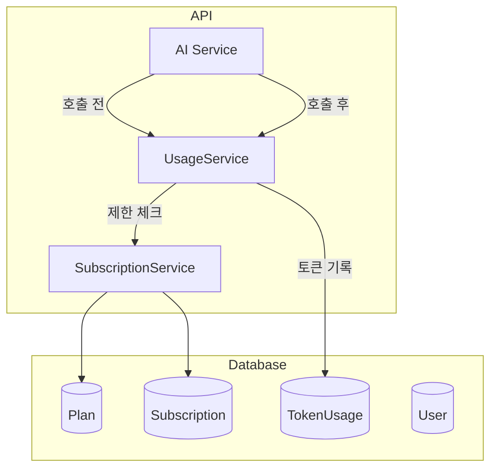

# Phase 9: 플랜 및 사용량 시스템

## 개요

| 항목 | 내용 |
|-----|------|
| **목표** | 사용량 추적 및 플랜 제한 시스템 구축 (Stripe 연동 전 기초) |
| **선행 조건** | Phase 8 (Chrome Extension) 완료 |
| **예상 소요** | 5 Steps |
| **결과물** | Plan/Subscription 스키마, 토큰 사용량 추적, 플랜별 제한 체크 |

> **Note**: 이 Phase는 AI 호출 전에 필요한 플랜/사용량 기초 구조를 구축합니다.
> Stripe 결제 연동은 Phase 14에서 진행합니다.

---

## 아키텍처



---

## 진행 상황

| Step | 이름 | 상태 |
|------|------|------|
| 9.1 | Ent 스키마 추가 | ⬜ |
| 9.2 | Migration 생성 및 적용 | ⬜ |
| 9.3 | UsageService 구현 | ⬜ |
| 9.4 | SubscriptionService 구현 | ⬜ |
| 9.5 | API 엔드포인트 구현 | ⬜ |

---

## Step 9.1: Ent 스키마 추가

### 목표

플랜, 구독, 토큰 사용량 관련 데이터베이스 스키마를 추가합니다.

### 체크리스트

- [ ] Plan 스키마 생성 (`ent/schema/plan.go`)
- [ ] Subscription 스키마 생성 (`ent/schema/subscription.go`)
- [ ] TokenUsage 스키마 생성 (`ent/schema/tokenusage.go`)
- [ ] User 스키마에 edge 추가 (subscriptions, token_usage)
- [ ] Session 스키마에 edge 추가 (token_usage)
- [ ] `go generate ./ent` 실행

### 코드 예시

**ent/schema/plan.go:**

```go
package schema

import (
    "time"

    "entgo.io/ent"
    "entgo.io/ent/schema/edge"
    "entgo.io/ent/schema/field"
)

type Plan struct {
    ent.Schema
}

func (Plan) Fields() []ent.Field {
    return []ent.Field{
        field.String("id").Unique().Immutable(), // 'free', 'pro', 'enterprise'
        field.String("name").NotEmpty(),
        field.Int("price_cents").Default(0),
        field.String("billing_period").Default("monthly"),
        field.Int("token_limit").Optional().Nillable(),
        field.Int("session_retention_days").Optional().Nillable(),
        field.Int("max_concurrent_sessions").Optional().Nillable(),
        field.JSON("features", map[string]bool{}).Default(map[string]bool{}),
        field.Time("created_at").Default(time.Now).Immutable(),
    }
}

func (Plan) Edges() []ent.Edge {
    return []ent.Edge{
        edge.To("subscriptions", Subscription.Type),
    }
}
```

**ent/schema/subscription.go:**

```go
package schema

import (
    "time"

    "entgo.io/ent"
    "entgo.io/ent/schema/edge"
    "entgo.io/ent/schema/field"
    "entgo.io/ent/schema/index"
    "github.com/google/uuid"
)

type Subscription struct {
    ent.Schema
}

func (Subscription) Fields() []ent.Field {
    return []ent.Field{
        field.UUID("id", uuid.UUID{}).Default(uuid.New).Immutable(),
        field.Enum("status").
            Values("active", "canceled", "past_due", "trialing").
            Default("active"),
        field.Time("current_period_start"),
        field.Time("current_period_end"),
        field.Bool("cancel_at_period_end").Default(false),
        // Stripe 필드는 Phase 14에서 사용
        field.String("stripe_subscription_id").Optional().Nillable(),
        field.String("stripe_customer_id").Optional().Nillable(),
        field.Time("created_at").Default(time.Now).Immutable(),
        field.Time("updated_at").Default(time.Now).UpdateDefault(time.Now),
    }
}

func (Subscription) Edges() []ent.Edge {
    return []ent.Edge{
        edge.From("user", User.Type).Ref("subscriptions").Unique().Required(),
        edge.From("plan", Plan.Type).Ref("subscriptions").Unique().Required(),
    }
}

func (Subscription) Indexes() []ent.Index {
    return []ent.Index{
        index.Fields("status").Edges("user"),
    }
}
```

**ent/schema/tokenusage.go:**

```go
package schema

import (
    "time"

    "entgo.io/ent"
    "entgo.io/ent/schema/edge"
    "entgo.io/ent/schema/field"
    "entgo.io/ent/schema/index"
)

type TokenUsage struct {
    ent.Schema
}

func (TokenUsage) Fields() []ent.Field {
    return []ent.Field{
        field.String("operation").NotEmpty(), // 'summarize', 'mindmap', 'keywords'
        field.Int("tokens_used").Positive(),
        field.String("ai_model").Optional(),
        field.Time("period_start"),
        field.Time("created_at").Default(time.Now).Immutable(),
    }
}

func (TokenUsage) Edges() []ent.Edge {
    return []ent.Edge{
        edge.From("user", User.Type).Ref("token_usage").Unique().Required(),
        edge.From("session", Session.Type).Ref("token_usage").Unique(),
    }
}

func (TokenUsage) Indexes() []ent.Index {
    return []ent.Index{
        index.Fields("period_start").Edges("user"),
    }
}
```

---

## Step 9.2: Migration 생성 및 적용

### 목표

새 스키마에 대한 데이터베이스 마이그레이션을 생성하고 적용합니다.

### 체크리스트

- [ ] `atlas migrate diff add_plan_usage_tables` 실행
- [ ] 생성된 SQL 파일 검토
- [ ] 개발 DB에 `atlas migrate apply` 실행
- [ ] 기본 플랜 데이터 seed 스크립트 작성

### Seed 데이터

```sql
INSERT INTO plans (id, name, price_cents, billing_period, token_limit, session_retention_days, max_concurrent_sessions, features) VALUES
('free', 'Free', 0, 'monthly', 50000, 30, 1, '{"export_png": true}'),
('pro', 'Pro', 1200, 'monthly', 500000, NULL, 5, '{"export_png": true, "export_svg": true, "export_md": true, "export_json": true, "priority_support": true}'),
('enterprise', 'Enterprise', NULL, 'monthly', NULL, NULL, NULL, '{"export_png": true, "export_svg": true, "export_md": true, "export_json": true, "api_access": true, "team_sharing": true, "sso": true, "custom_ai": true}');
```

---

## Step 9.3: UsageService 구현

### 목표

토큰 사용량 기록 및 조회 서비스를 구현합니다.

### 체크리스트

- [ ] `internal/service/usage_service.go` 생성
  - [ ] RecordUsage: 토큰 사용량 기록
  - [ ] GetCurrentUsage: 현재 기간 사용량 조회
  - [ ] GetUsageHistory: 월별 히스토리 조회
  - [ ] CheckLimit: 제한 체크

### 빌링 주기 (Billing Period) 핵심 로직

**모든 플랜은 가입일/구독일 기준 30일 주기**로 토큰이 리셋됩니다:

| 플랜 | 빌링 주기 기준 |
|-----|--------------|
| Free | 가입일 기준 30일 주기 (예: 12/10 가입 → 12/10~1/8, 1/9~2/7...) |
| Pro | 구독 시작일 기준 (예: 15일 구독 → 매월 15일~다음달 14일) |
| Enterprise | 계약일 기준 |

**핵심 필드:**

- `users.created_at`: Free 플랜 빌링 주기 계산에 사용
- `subscriptions.current_period_start`: Pro/Enterprise 현재 빌링 주기 시작일
- `subscriptions.current_period_end`: Pro/Enterprise 현재 빌링 주기 종료일
- `token_usage.period_start`: 토큰이 어느 빌링 주기에 속하는지

### 코드 예시

**internal/service/usage_service.go:**

```go
package service

import (
    "context"
    "time"

    "github.com/google/uuid"
    "github.com/mindhit/api/ent"
    "github.com/mindhit/api/ent/subscription"
    "github.com/mindhit/api/ent/tokenusage"
    "github.com/mindhit/api/ent/user"
)

type UsageService struct {
    client *ent.Client
}

type UsageRecord struct {
    UserID    uuid.UUID
    SessionID uuid.UUID
    Operation string
    Tokens    int
    AIModel   string
}

type LimitStatus struct {
    TokensUsed  int
    TokenLimit  int
    IsUnlimited bool
    PercentUsed float64
    CanUseAI    bool
}

func NewUsageService(client *ent.Client) *UsageService {
    return &UsageService{client: client}
}

func (s *UsageService) RecordUsage(ctx context.Context, record UsageRecord) error {
    periodStart := s.getCurrentPeriodStart(ctx, record.UserID)

    builder := s.client.TokenUsage.Create().
        SetUserID(record.UserID).
        SetOperation(record.Operation).
        SetTokensUsed(record.Tokens).
        SetPeriodStart(periodStart)

    if record.SessionID != uuid.Nil {
        builder.SetSessionID(record.SessionID)
    }
    if record.AIModel != "" {
        builder.SetAiModel(record.AIModel)
    }

    _, err := builder.Save(ctx)
    return err
}

func (s *UsageService) CheckLimit(ctx context.Context, userID uuid.UUID) (*LimitStatus, error) {
    sub, _ := s.client.Subscription.
        Query().
        Where(
            subscription.StatusEQ(subscription.StatusActive),
            subscription.HasUserWith(user.IDEQ(userID)),
        ).
        WithPlan().
        Only(ctx)

    periodStart := s.getCurrentPeriodStart(ctx, userID)

    var usage int
    err := s.client.TokenUsage.
        Query().
        Where(
            tokenusage.HasUserWith(user.IDEQ(userID)),
            tokenusage.PeriodStartGTE(periodStart),
        ).
        Aggregate(ent.Sum(tokenusage.FieldTokensUsed)).
        Scan(ctx, &usage)
    if err != nil {
        usage = 0
    }

    limit := 50000 // Free 기본값
    isUnlimited := false

    if sub != nil && sub.Edges.Plan != nil {
        if sub.Edges.Plan.TokenLimit != nil {
            limit = *sub.Edges.Plan.TokenLimit
        } else {
            isUnlimited = true
        }
    }

    percentUsed := 0.0
    if !isUnlimited && limit > 0 {
        percentUsed = float64(usage) / float64(limit) * 100
    }

    return &LimitStatus{
        TokensUsed:  usage,
        TokenLimit:  limit,
        IsUnlimited: isUnlimited,
        PercentUsed: percentUsed,
        CanUseAI:    isUnlimited || usage < limit,
    }, nil
}

func (s *UsageService) getCurrentPeriodStart(ctx context.Context, userID uuid.UUID) time.Time {
    sub, err := s.client.Subscription.
        Query().
        Where(
            subscription.StatusEQ(subscription.StatusActive),
            subscription.HasUserWith(user.IDEQ(userID)),
        ).
        Only(ctx)

    if err != nil || sub == nil {
        // Free 플랜: 가입일 기준 30일 주기
        return s.calculateFreePlanPeriodStart(ctx, userID)
    }

    return sub.CurrentPeriodStart
}

// calculateFreePlanPeriodStart: Free 플랜 빌링 주기 계산 (가입일 기준 30일)
func (s *UsageService) calculateFreePlanPeriodStart(ctx context.Context, userID uuid.UUID) time.Time {
    u, err := s.client.User.Get(ctx, userID)
    if err != nil {
        return time.Now().UTC()
    }

    signupDate := u.CreatedAt.UTC()
    now := time.Now().UTC()

    daysSinceSignup := int(now.Sub(signupDate).Hours() / 24)
    periodNumber := daysSinceSignup / 30

    periodStart := signupDate.AddDate(0, 0, periodNumber*30)
    return periodStart
}
```

---

## Step 9.4: SubscriptionService 구현

### 목표

구독 관리 서비스를 구현합니다 (Stripe 연동 전 기초).

### 체크리스트

- [ ] `internal/service/subscription_service.go` 생성
  - [ ] GetSubscription: 현재 구독 조회
  - [ ] GetAvailablePlans: 플랜 목록 조회
  - [ ] CreateFreeSubscription: 회원가입 시 Free 구독 자동 생성
  - [ ] GetUserPlan: 사용자 현재 플랜 조회

### 코드 예시

**internal/service/subscription_service.go:**

```go
package service

import (
    "context"
    "time"

    "github.com/google/uuid"
    "github.com/mindhit/api/ent"
    "github.com/mindhit/api/ent/plan"
    "github.com/mindhit/api/ent/subscription"
    "github.com/mindhit/api/ent/user"
)

type SubscriptionService struct {
    client *ent.Client
}

func NewSubscriptionService(client *ent.Client) *SubscriptionService {
    return &SubscriptionService{client: client}
}

// GetSubscription returns the active subscription for a user
func (s *SubscriptionService) GetSubscription(ctx context.Context, userID uuid.UUID) (*ent.Subscription, error) {
    return s.client.Subscription.
        Query().
        Where(
            subscription.StatusEQ(subscription.StatusActive),
            subscription.HasUserWith(user.IDEQ(userID)),
        ).
        WithPlan().
        Only(ctx)
}

// GetAvailablePlans returns all available plans
func (s *SubscriptionService) GetAvailablePlans(ctx context.Context) ([]*ent.Plan, error) {
    return s.client.Plan.Query().All(ctx)
}

// CreateFreeSubscription creates a free subscription for a new user
func (s *SubscriptionService) CreateFreeSubscription(ctx context.Context, userID uuid.UUID) (*ent.Subscription, error) {
    freePlan, err := s.client.Plan.Get(ctx, "free")
    if err != nil {
        return nil, err
    }

    now := time.Now()
    periodEnd := now.AddDate(0, 0, 30) // 30일 후

    return s.client.Subscription.
        Create().
        SetUserID(userID).
        SetPlanID(freePlan.ID).
        SetStatus(subscription.StatusActive).
        SetCurrentPeriodStart(now).
        SetCurrentPeriodEnd(periodEnd).
        Save(ctx)
}

// GetUserPlan returns the current plan for a user
func (s *SubscriptionService) GetUserPlan(ctx context.Context, userID uuid.UUID) (*ent.Plan, error) {
    sub, err := s.GetSubscription(ctx, userID)
    if err != nil {
        // No subscription, return free plan
        return s.client.Plan.Get(ctx, "free")
    }
    return sub.Edges.Plan, nil
}

// HasFeature checks if user has access to a specific feature
func (s *SubscriptionService) HasFeature(ctx context.Context, userID uuid.UUID, feature string) (bool, error) {
    p, err := s.GetUserPlan(ctx, userID)
    if err != nil {
        return false, err
    }

    if p.Features == nil {
        return false, nil
    }

    return p.Features[feature], nil
}
```

---

## Step 9.5: API 엔드포인트 구현

### 목표

플랜 및 사용량 관련 API 엔드포인트를 구현합니다.

### 체크리스트

- [ ] `internal/api/controller/subscription_controller.go` 생성
  - [ ] GET `/v1/subscription` - 현재 구독 조회
  - [ ] GET `/v1/subscription/plans` - 플랜 목록
- [ ] `internal/api/controller/usage_controller.go` 생성
  - [ ] GET `/v1/usage` - 현재 사용량
  - [ ] GET `/v1/usage/history` - 월별 히스토리
- [ ] 라우터에 엔드포인트 등록

### API 응답 예시

**GET /v1/subscription:**

```json
{
  "subscription": {
    "id": "uuid",
    "status": "active",
    "plan": {
      "id": "free",
      "name": "Free",
      "token_limit": 50000,
      "features": {
        "export_png": true
      }
    },
    "current_period_start": "2024-12-01T00:00:00Z",
    "current_period_end": "2024-12-31T23:59:59Z"
  }
}
```

**GET /v1/usage:**

```json
{
  "usage": {
    "period_start": "2024-12-01T00:00:00Z",
    "period_end": "2024-12-31T23:59:59Z",
    "tokens_used": 23450,
    "token_limit": 50000,
    "percent_used": 46.9,
    "is_unlimited": false,
    "can_use_ai": true,
    "by_operation": {
      "summarize": 14520,
      "mindmap": 7830,
      "keywords": 1100
    }
  }
}
```

---

## Phase 9 완료 확인

### 전체 검증 체크리스트

- [ ] Plan 스키마 정의
- [ ] Subscription 스키마 정의
- [ ] TokenUsage 스키마 정의
- [ ] Migration 적용
- [ ] 기본 플랜 seed 데이터 삽입
- [ ] UsageService 구현
- [ ] SubscriptionService 구현
- [ ] API 엔드포인트 동작

### 테스트 요구사항

| 테스트 유형 | 대상 | 파일 |
| ----------- | ---- | ---- |
| 단위 테스트 | UsageService | `service/usage_service_test.go` |
| 단위 테스트 | SubscriptionService | `service/subscription_service_test.go` |
| 통합 테스트 | API 엔드포인트 | `controller/usage_controller_test.go` |

```bash
# Phase 9 테스트 실행
moonx backend:test -- -run "TestUsage|TestSubscription"
```

### 산출물 요약

| 항목 | 위치 |
| ---- | ---- |
| Plan 스키마 | `ent/schema/plan.go` |
| Subscription 스키마 | `ent/schema/subscription.go` |
| TokenUsage 스키마 | `ent/schema/tokenusage.go` |
| UsageService | `internal/service/usage_service.go` |
| SubscriptionService | `internal/service/subscription_service.go` |
| 사용량 API | `internal/api/controller/usage_controller.go` |
| 구독 API | `internal/api/controller/subscription_controller.go` |

---

## 다음 Phase

Phase 9 완료 후 [Phase 10: AI 마인드맵](./phase-10-ai.md)으로 진행하세요.

> **Note**: Phase 10 (AI 마인드맵)에서 UsageService를 연동하여 토큰 사용량을 추적합니다.
