# 사용자 플로우 (User Flow)

## 전체 여정 개요

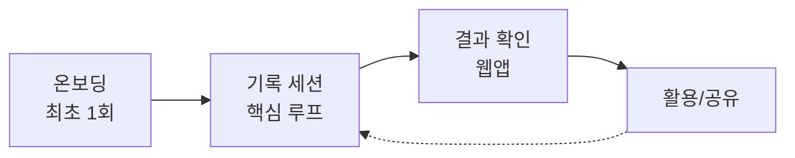

---

## 1. 온보딩 플로우 (최초 1회)

### 1.1 확장 프로그램 설치

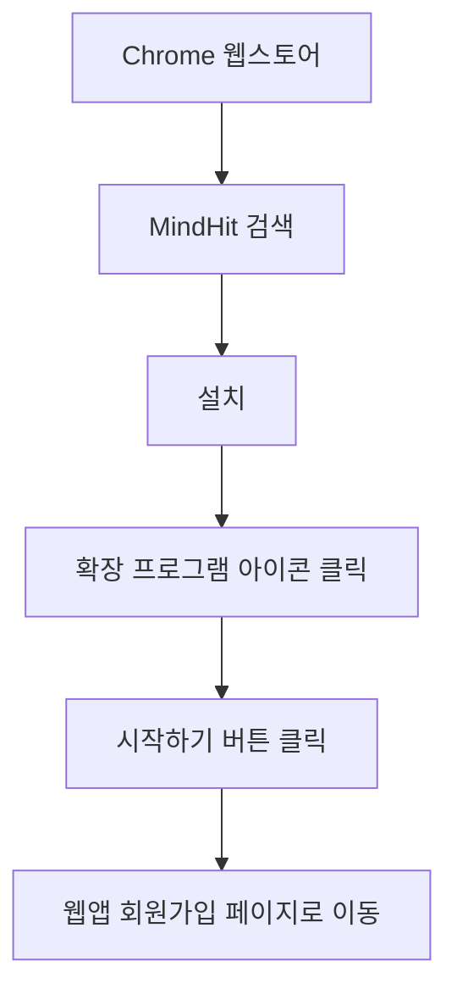

### 1.2 회원가입/로그인

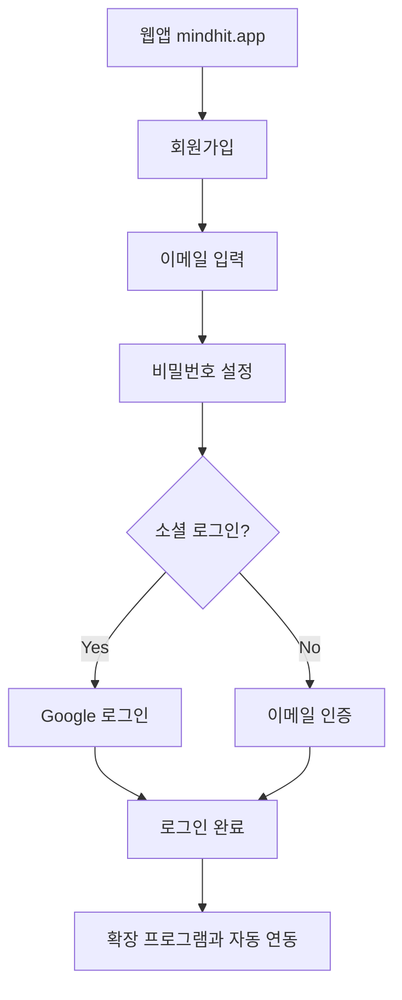

### 1.3 확장 프로그램 연동 확인

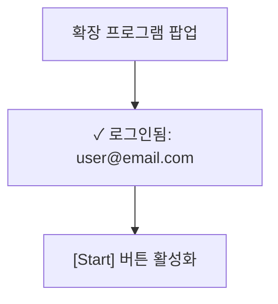

---

## 2. 핵심 루프: 기록 세션

### 2.1 세션 시작

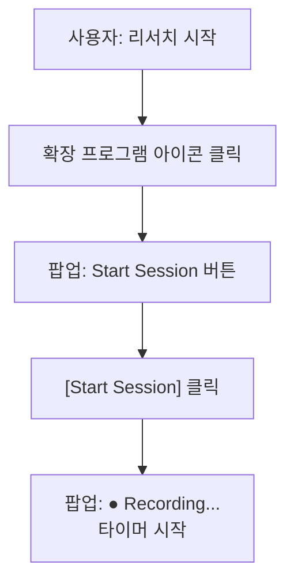

### 2.2 브라우징 중 (백그라운드 기록)

자동으로 수집되는 데이터:
- 방문한 URL
- 페이지 제목
- 각 페이지 체류 시간
- 사용자가 하이라이팅한 텍스트 (선택적)
- 탭 전환 패턴

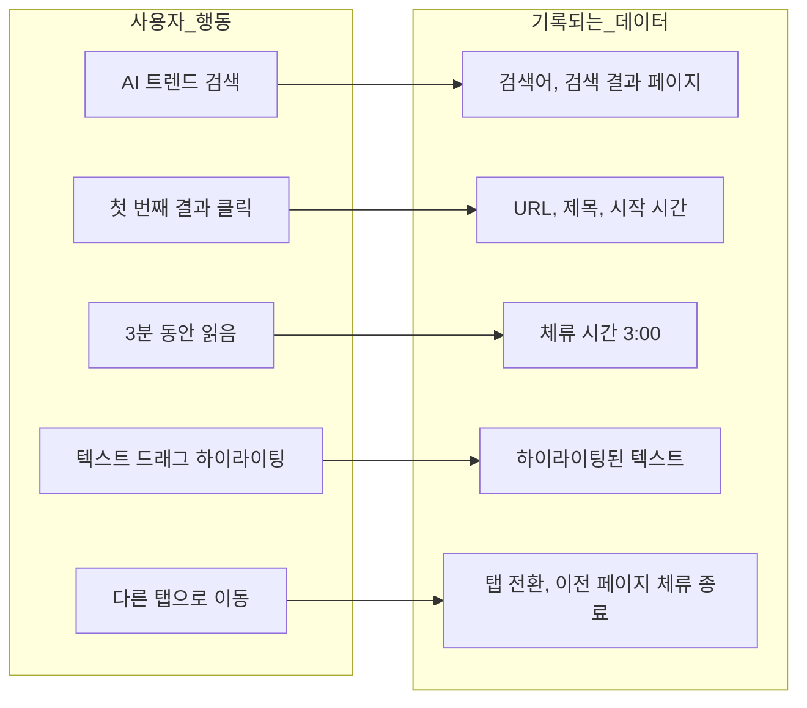

### 2.3 세션 종료

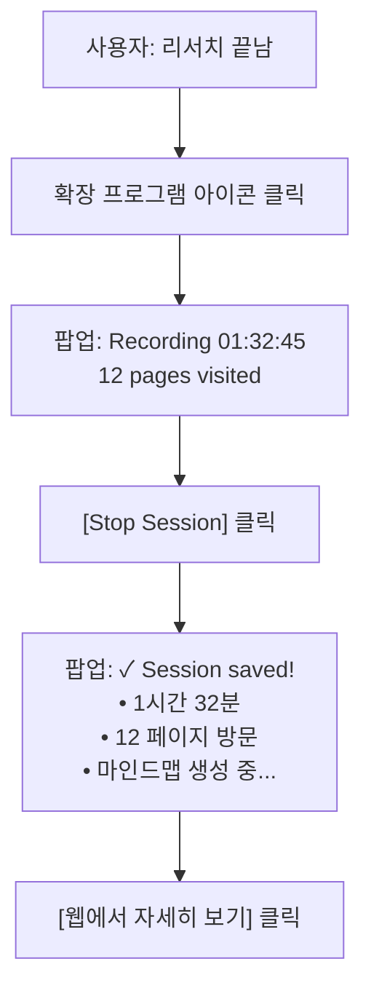

---

## 3. 결과 확인 (웹앱)

### 3.1 대시보드 진입

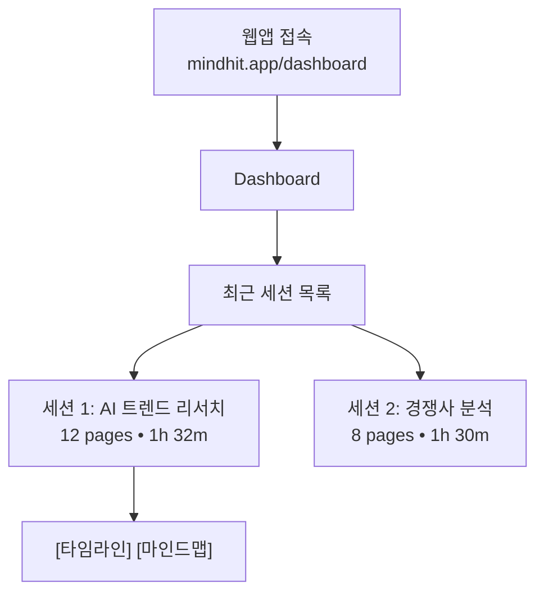

### 3.2 타임라인 뷰

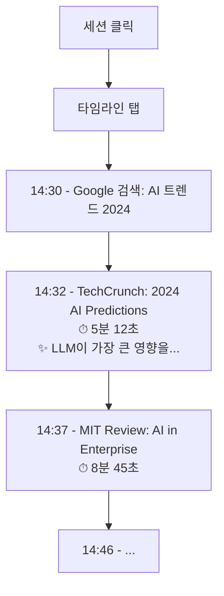

> ✨ = 하이라이팅한 텍스트 | ⏱ = 체류 시간

### 3.3 마인드맵 뷰

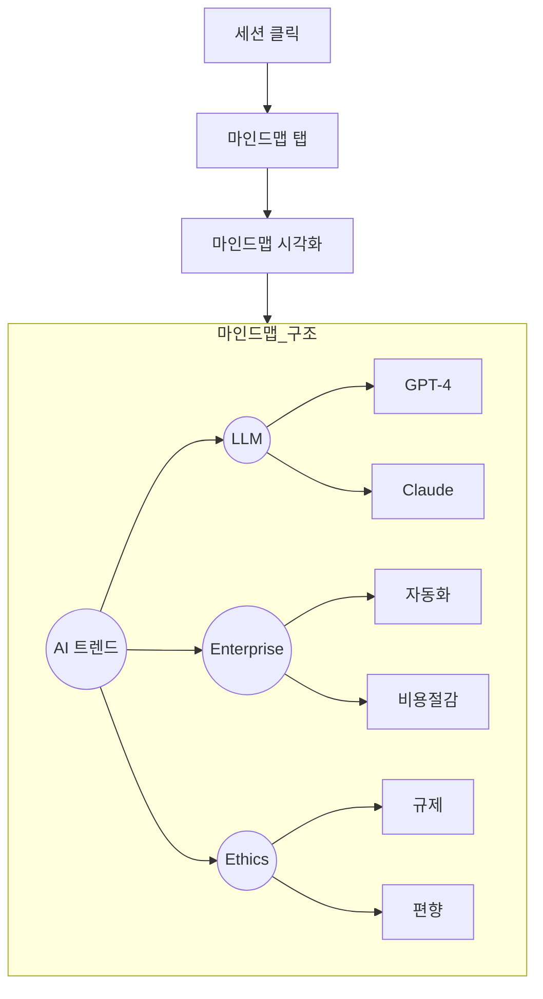

> 노드 클릭 → 관련 페이지 목록 표시

---

## 4. 이메일 리포트

### 4.1 세션 종료 후 자동 발송

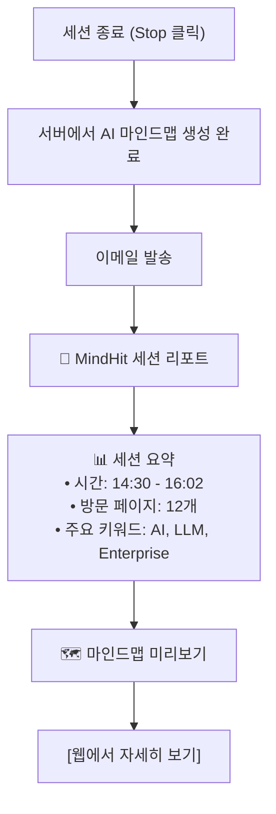

---

## 5. 예외 플로우

### 5.1 로그인 안 된 상태에서 시작 시도

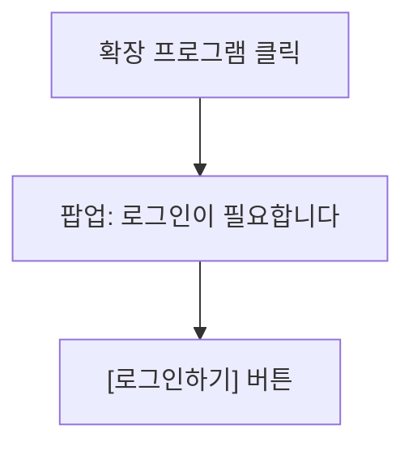

### 5.2 세션 중 브라우저 종료

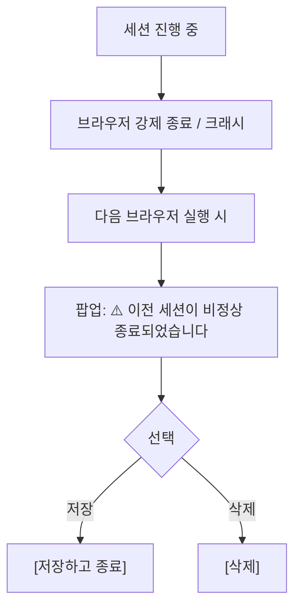

### 5.3 네트워크 오프라인

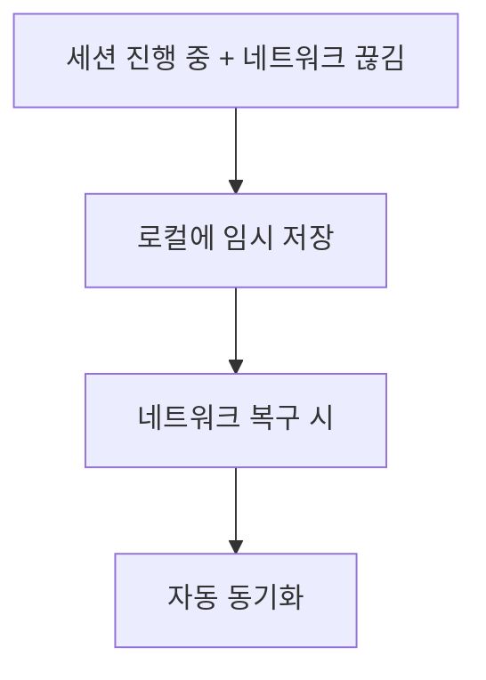
