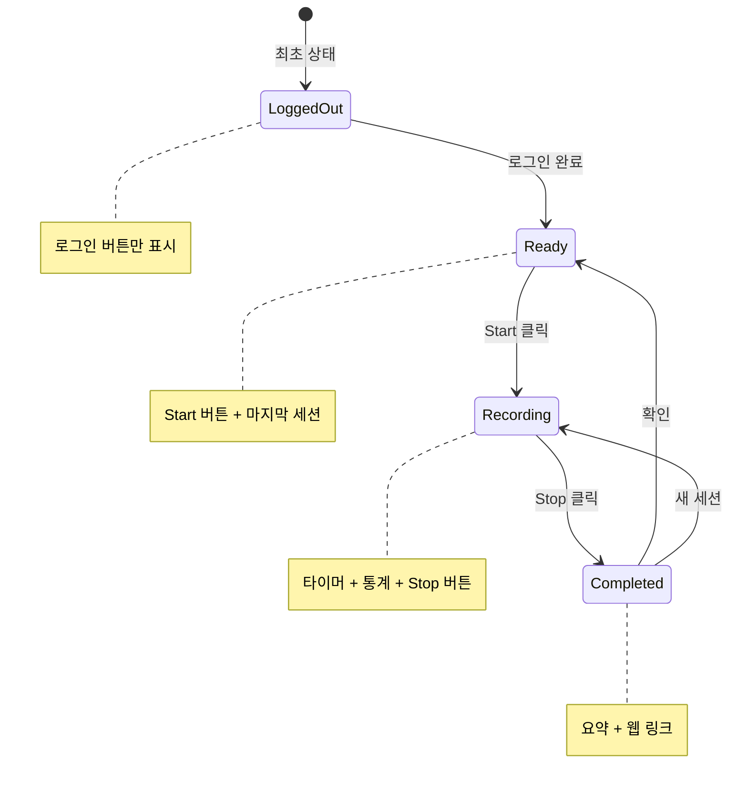
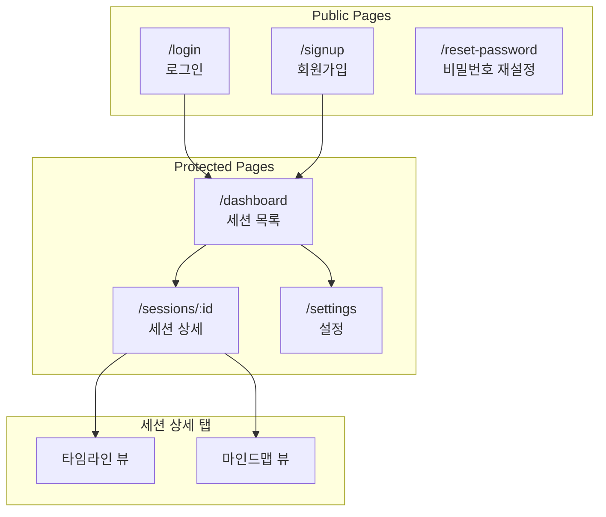
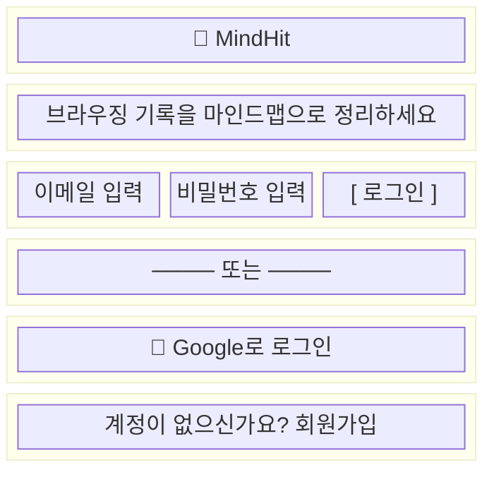
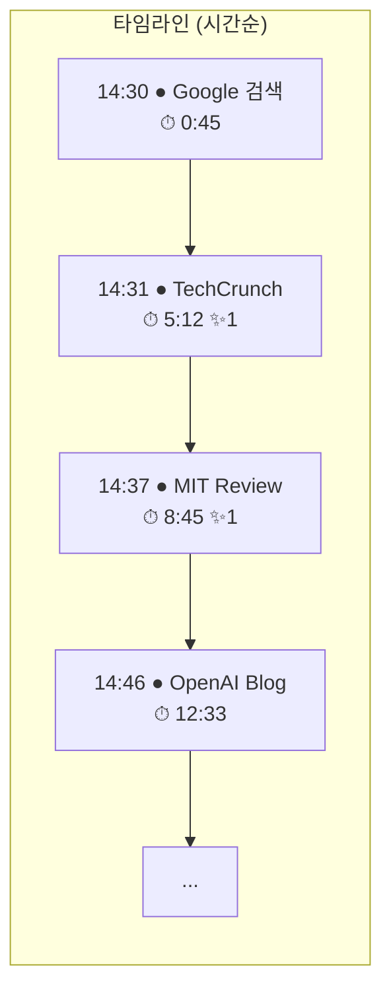
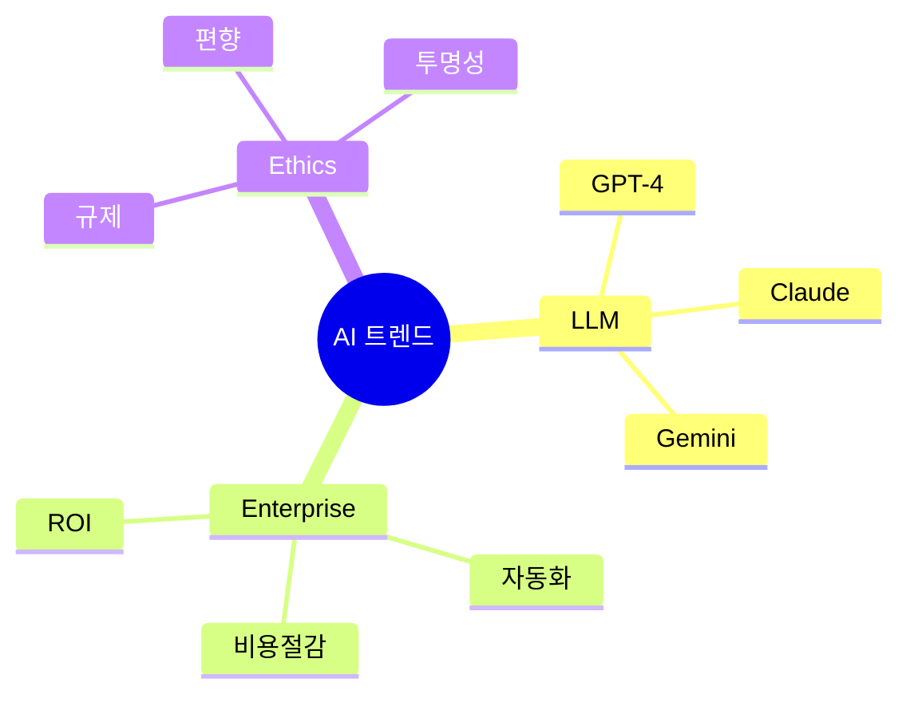
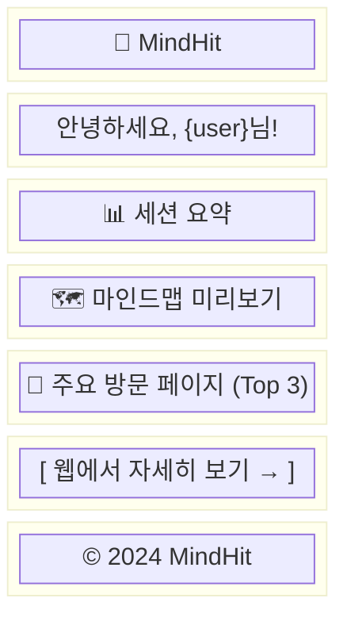

# UI 와이어프레임 (Wireframe)

## 개요

MindHit의 UI는 크게 3가지 영역으로 구성됩니다:

| 영역 | 플랫폼 | 주요 역할 |
| ---- | ------ | --------- |
| Chrome Extension | 브라우저 팝업 | 세션 시작/종료, 상태 표시 |
| Web App | 웹 브라우저 | 대시보드, 타임라인, 마인드맵 |
| Email | 이메일 클라이언트 | 세션 리포트 |

---

## 1. Chrome Extension UI

> **크기**: 320px x 400px (크롬 팝업 권장 크기)

### 1.1 Extension 상태 흐름



### 1.2 화면별 구성 요소

#### 로그인 전 상태 (LoggedOut)

| 영역 | 요소 | 설명 |
| ---- | ---- | ---- |
| 헤더 | 로고 | MindHit 브랜드 |
| 본문 | 슬로건 | "브라우징 기록을 마인드맵으로" |
| 액션 | 로그인 버튼 | Primary CTA |
| 푸터 | 회원가입 링크 | 텍스트 링크 |

#### 대기 상태 (Ready)

| 영역 | 요소 | 설명 |
| ---- | ---- | ---- |
| 헤더 | 로고 + 설정 아이콘 | 우측에 설정 버튼 |
| 유저 정보 | 이메일 | 로그인된 계정 표시 |
| 액션 | **Start Session** 버튼 | Primary CTA (빨간 원 아이콘) |
| 마지막 세션 | 세션 카드 | 제목, 시간, 페이지 수 |
| 링크 | "웹에서 보기" | 웹앱으로 이동 |

#### Recording 상태

| 영역 | 요소 | 설명 |
| ---- | ---- | ---- |
| 헤더 | 로고 + 설정 아이콘 | - |
| 상태 표시 | "Recording" 배지 | 빨간색 점멸 효과 |
| 타이머 | **01:32:45** | 큰 폰트, 중앙 정렬 |
| 통계 | 페이지 수 / 하이라이트 수 | 아이콘 + 숫자 |
| 액션 | **Stop Session** 버튼 | 정지 아이콘 |

#### 세션 완료 상태 (Completed)

| 영역 | 요소 | 설명 |
| ---- | ---- | ---- |
| 상태 | "세션 저장됨!" | 체크 아이콘 + 성공 메시지 |
| 요약 카드 | 시간/페이지/하이라이트 | 세션 통계 |
| 진행 상태 | "마인드맵 생성 중..." | 로딩 표시 |
| 액션 1 | "웹에서 자세히 보기" | Primary |
| 액션 2 | "새 세션 시작" | Secondary |

---

## 2. Web App UI

### 2.1 페이지 구조



### 2.2 로그인 페이지 (/login)

#### 레이아웃



#### 구성 요소

| 요소 | 타입 | 설명 |
| ---- | ---- | ---- |
| 로고 | 이미지 | 중앙 정렬 |
| 태그라인 | 텍스트 | 서비스 설명 |
| 이메일 | Input | type="email", required |
| 비밀번호 | Input | type="password", required |
| 로그인 버튼 | Button | Primary, 전체 너비 |
| 구분선 | Divider | "또는" 텍스트 |
| Google 로그인 | Button | OAuth 버튼 |
| 회원가입 링크 | Link | /signup으로 이동 |

### 2.3 대시보드 (/dashboard)

#### 레이아웃 구조

```mermaid
block-beta
    columns 3
    block:header:3
        A["🧠 MindHit"] B[""] C["user@email.com ▼"]
    end
    block:title:2
        D["내 세션"]
    end
    block:search:1
        E["🔍 검색"]
    end
    block:content:3
        F["세션 카드 목록 (날짜별 그룹)"]
    end
```

#### 세션 카드 구성

| 요소 | 설명 | 예시 |
| ---- | ---- | ---- |
| 썸네일 | 마인드맵 미리보기 | 60x60px |
| 제목 | 세션 제목 (AI 생성) | "AI 트렌드 리서치" |
| 시간 | 시작~종료 시간 | 14:30 - 16:02 |
| 통계 | 소요 시간, 페이지 수 | 1h 32m, 12 pages |
| 키워드 | 추출된 태그 | #AI #LLM #Enterprise |
| 액션 버튼 | 타임라인/마인드맵/삭제 | 3개 버튼 |

#### 날짜별 그룹핑

| 그룹 | 조건 |
| ---- | ---- |
| 오늘 | today |
| 어제 | yesterday |
| 이번 주 | this week |
| 이번 달 | this month |
| 이전 | older |

### 2.4 세션 상세 (/sessions/:id)

#### 공통 헤더

| 요소 | 설명 |
| ---- | ---- |
| 뒤로가기 | ← 대시보드 |
| 제목 | 세션 제목 (편집 가능) |
| 날짜 | 세션 일시 |
| 탭 | 타임라인 / 마인드맵 |
| 통계 | 페이지 수, 소요 시간, 하이라이트 수 |

#### 타임라인 뷰



| 항목 | 표시 정보 |
| ---- | --------- |
| 시간 | 방문 시각 (HH:MM) |
| 페이지 | 사이트명 + 제목 |
| 체류 시간 | ⏱ MM:SS |
| 하이라이트 | ✨ 드래그한 텍스트 (있는 경우) |
| 링크 | 🔗 원본 페이지 열기 |

#### 마인드맵 뷰



| 기능 | 설명 |
| ---- | ---- |
| 줌 인/아웃 | 마우스 휠 또는 버튼 |
| 드래그 | 캔버스 이동 |
| 노드 클릭 | 우측 패널에 관련 페이지 표시 |
| 다운로드 | PNG/SVG 내보내기 |

#### 노드 선택 시 사이드 패널

| 요소 | 설명 |
| ---- | ---- |
| 노드명 | 선택한 토픽 (예: "LLM") |
| 관련 페이지 수 | (5) |
| 페이지 목록 | 사이트명, 체류시간, 링크 버튼 |

---

## 3. 이메일 템플릿

### 3.1 세션 리포트 이메일

#### 구조



#### 이메일 구성 요소

| 섹션 | 내용 |
| ---- | ---- |
| 헤더 | 로고 |
| 인사말 | 사용자명 + 안내 문구 |
| 세션 요약 | 제목, 시간, 소요, 방문 페이지 수, 키워드 |
| 마인드맵 | 생성된 마인드맵 이미지 (PNG) |
| 주요 페이지 | 체류 시간 기준 Top 3 페이지 |
| CTA | 웹앱 딥링크 버튼 |
| 푸터 | 알림 설정 안내 + 저작권 |

---

## 4. 반응형 디자인

### 4.1 브레이크포인트

| 브레이크포인트 | 범위 | 레이아웃 |
| -------------- | ---- | -------- |
| Desktop | ≥1024px | 사이드바 + 메인 콘텐츠 |
| Tablet | 768-1023px | 축소된 사이드바 (아이콘만) |
| Mobile | ≤767px | 하단 네비게이션 + 단일 컬럼 |

### 4.2 컴포넌트별 반응형

| 컴포넌트 | Desktop | Tablet | Mobile |
| -------- | ------- | ------ | ------ |
| 네비게이션 | 좌측 사이드바 | 아이콘 사이드바 | 하단 탭바 |
| 세션 카드 | 가로형 | 가로형 | 세로형 (스택) |
| 마인드맵 | 전체 너비 | 전체 너비 | 전체 너비 + 확대 필수 |
| 타임라인 | 2컬럼 가능 | 1컬럼 | 1컬럼 |

### 4.3 터치 인터랙션

| 제스처 | 동작 |
| ------ | ---- |
| 탭 | 선택 |
| 더블탭 | 줌 인 |
| 핀치 | 줌 인/아웃 |
| 드래그 | 캔버스 이동 |
| 스와이프 | 페이지 전환 (모바일) |

### 4.4 접근성

| 항목 | 기준 |
| ---- | ---- |
| 최소 터치 타겟 | 44px x 44px |
| 색상 대비 | WCAG AA (4.5:1) |
| 키보드 네비게이션 | Tab/Enter 지원 |
| 스크린리더 | aria-label 제공 |

---

## 5. 디자인 토큰 (참고)

### 5.1 컬러

| 용도 | 색상 |
| ---- | ---- |
| Primary | #3B82F6 (Blue) |
| Secondary | #6B7280 (Gray) |
| Success | #10B981 (Green) |
| Warning | #F59E0B (Amber) |
| Error | #EF4444 (Red) |
| Recording | #EF4444 (Red) |
| Background | #FFFFFF / #F9FAFB |

### 5.2 타이포그래피

| 용도 | 크기 | 굵기 |
| ---- | ---- | ---- |
| H1 | 24px | Bold |
| H2 | 20px | Semibold |
| H3 | 16px | Semibold |
| Body | 14px | Regular |
| Caption | 12px | Regular |
| Timer (Extension) | 32px | Bold |

### 5.3 간격

| 토큰 | 값 |
| ---- | --- |
| xs | 4px |
| sm | 8px |
| md | 16px |
| lg | 24px |
| xl | 32px |
